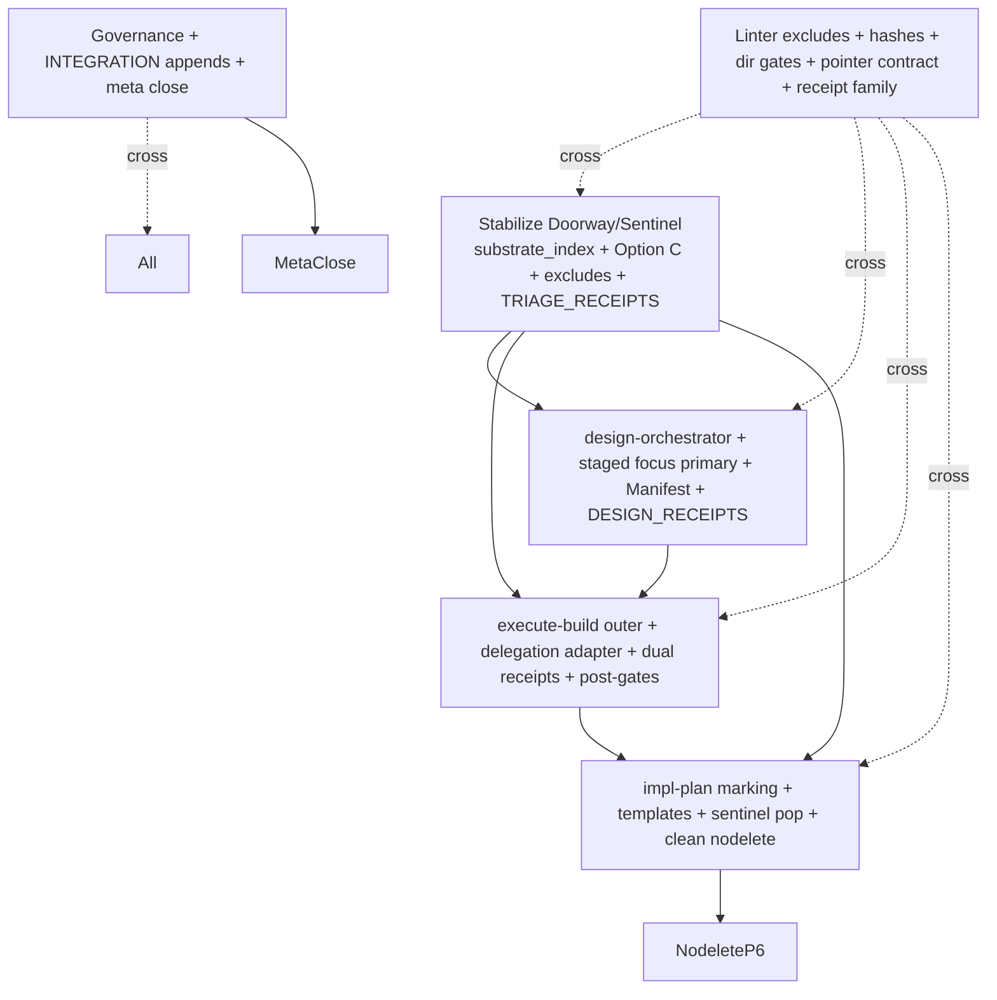
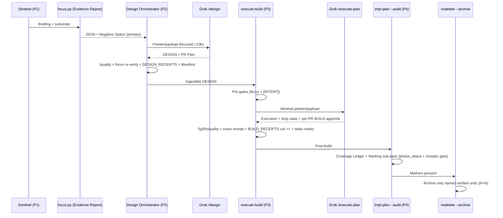

# DESIGN: Sovereign Suite Major Redesign Cluster — Canonical Master Plan and Architecture

**Author:** Grok Build (Systems Architect — reflection of accumulated human intelligence per global frame; operating under Senior Architect of Workflows role.md + /quality Maximum mandate)  
**Date:** 2026-07-06  
**Status:** Draft (self-contained master plan ready for direct handoff to /execute-plan or /implementation-plan --workstreams)  
**Related (governing inputs, read in full):**  
- `helpdesk-tickets/20260706_sovereign-redesign-cluster_meta_workflow.md` (the meta-ticket; primary source; full partition, 5-pillar scope, citations, fresh-agent contract §4.4, sequencing, pointer/payload convention, 100% assignment)  
- `docs/design-pillars/PILLAR_01_CONTEXT_SESSION_INITIALIZATION.md`  
- `docs/design-pillars/PILLAR_02_DESIGN_ORCHESTRATION_FORMULA.md`  
- `docs/design-pillars/PILLAR_03_EXECUTION_DELEGATION_FORMULA.md`  
- `docs/design-pillars/PILLAR_04_POST_BUILD_HYGIENE_ARCHIVAL_NODELETE.md`  
- `docs/design-pillars/PILLAR_05_TOOLING_LINTING_RUNTIME_GOVERNANCE.md`  
- `docs/DESIGN_Plan_Tasks_Format_and_Sentinel_Populator.md` (old design; see dedicated supersession section)  
- All referenced files (claude-commands/*.md, scripts/doorway/* + focus/* + suite/* + receipt/*, manifest/SUITE_HEALTH.md, docs/FOLDER_OWNERSHIP.md, nodelete.md, helpdesk-tickets.md, role.md, CLAUDE.md, DevJournal.md, implementation-plan.md, focus-plan.md, execute-build.md, 8 open helpdesk tickets, .grok/bundled/skills/design/SKILL.md and execute-plan/SKILL.md for reference only, Videos artifacts for evidence only per authorizations, etc.)  

**Failure Pattern Vocabulary Applied (per ~/.claude/CLAUDE.md + role.md + meta):** Context Erosion, Ghost Logic, Hallucinated Success, Mock Trap, Grade Fraud, Stale Snapshot Carry-Over (named explicitly where detected or risked throughout).  

**/quality Mandate Applied:** This canonical is the result of slow, evidence-based, top-1% senior systems architect rigor. All claims traceable to direct file reads (file:line + verbatim quotes). Multiple internal refinement passes. Mechanical enforcement (receipt cross-refs, phase_status, hashes, Mute Witness) prioritized. No assumption; verification criteria explicit. Witness/Chain discipline modeled in the plan itself (post-gates require re-verify + quality witness before any "complete" claim).

---

## Overview

The Sovereign Suite Major Redesign Cluster addresses systemic gaps exposed by hybrid Grok Build adoption (notably the successful but ad-hoc Videos 397b6602 execution of DESIGN_Complete_Videos_Pipeline.md via /execute-plan) and 8 open helpdesk tickets. The Sovereign outer verification spine (/nodelete, receipts, focus Evidence Report, /quality chain, failure patterns, fresh-agent contextualization via meta + mandatory reads, STRICT RULES) must be preserved and strengthened while composing with superior native Grok engines (/design and /execute-plan) via explicit pointer/payload delegation ("formula-in-a-formula").

This canonical design document is the **final high-fidelity master plan/architecture**. It is deliberately self-contained so a fresh agent, given only the meta-ticket + this file + the 6 mandatory small reads in meta §4.4 (plus pointed pillar designs), can execute the entire cluster via /execute-plan or /implementation-plan without prior conversation history, compaction risk, or Context Erosion. It synthesizes the 5 deliberately partitioned high-fidelity pillar designs (100% coverage of tickets + expanded context) into a unified architecture, a master sequenced execution order across pillars, verification gates at every stage (including /quality), ticket-closure steps per helpdesk-tickets.md protocol (Phylogeny Disposition + Remediation Record/Hardening Certificate), and precise append-only meta update text.

The solution: Sovereign owns the outer spine (pre/post gates, receipts, hygiene, archival, governance); Grok engines own the inner iterative write/review/DAG loops via focused, hash-verified pointer/payloads. Pillar 1 provides trustworthy single-pass context (substrate_index + FOLDER_OWNERSHIP). Pillar 2 produces ingestible DESIGN paperwork. Pillar 3 delegates execution while layering native gates. Pillar 4 enables clean nodelete via audit marking + templates + sentinel population. Pillar 5 governs tooling/contracts/receipt family/generalization + meta closure. All phases respect /nodelete (append/inject only), emit receipts, name failure patterns, and incorporate /quality (witness/chain/re-verify before claiming success).

This document supersedes the prior ad-hoc approach and the old DESIGN_Plan_Tasks_Format_and_Sentinel_Populator.md (see dedicated sections).

---

## Background & Motivation

The Sovereign Workflow Suite (claude-commands/ + scripts/) governs agentic development across workspaces. Recent transitions (Grok OpenCode retirement → Grok Build; successful hybrid execution on Videos) exposed structural weaknesses:

- Session initialization relies on a "breadcrumb web" (per-dir README + MANIFEST) that lazy agents ignore in favor of FOLDER_OWNERSHIP.md alone; scanner.py carry-over and .py-only hashing produce phantom missing_readme and inaugural false positives (see 20260705_sentinel-doorway-redesign_workflow.md, 20260705_doorway_lazy-scan-stale-readme_workflow.md, scanner.py:35-52/107-118, auditor.py:72-76, breadcrumb.py:127-137, manifest.py:58-69; SUITE_HEALTH ACTIVE ADVISORY; linter CRITICAL on claude-commands/README.md).
- No formal upstream Sovereign Design Formula (symmetric to build gap); DESIGN_Complete_Videos_Pipeline.md was ad-hoc merged (manual, no staged focused payloads, no Build Ingestion Manifest, no DESIGN_RECEIPTS, Context Erosion risk) despite focus-plan Evidence Report proving useful (20260706_sovereign-design-formula_pointer-payload_workflow.md + embedded prior art; focus-plan.md Evidence Report JSON + Negative Space).
- Native /execute-build lacks delegation adapter to Grok /execute-plan; 397b6602 succeeded via one path but required manual audit adaptation on the other; Ghost Logic and handoff risks (20260706_execute-build_pointer_payload_formula_in_formula_workflow.md; execute-build.md GLOSSARY/5g/5h/STRICT RULES 15-16; BUILD_RECEIPTS cat >> pattern 330-360; Grok SKILL Subagent Worktree Protocol reference only).
- /implementation-plan --audit lacks Completion Marking pass; "plethora of complete phase material" (re-sequenced Phase 7.6 + 4 Gaps) remains on live surfaces despite verified BUILD_RECEIPTS pr-1..pr-15 (0 open); nodelete Pillar 6 is conservatively correct ("Never archive a unit the user did not name"; nodelete.md:190-220) but requires explicit markers + receipts + phase_status.py gate (20260706_implementation-plan-audit-nodelete-archival_workflow.md; DESIGN_Plan_Tasks_Format_and_Sentinel_Populator.md prior art; phase_status.py parse + _COMPLETE_STATUSES).
- Tooling friction (print-only --fix-hashes + imprecise Change Log phrasing in 3 files; opencode-to-grok-build linter spike + partial dir gate; pointer/payload revival needed; TRIAGE_RECEIPTS generalization; receipt family incomplete; meta governance for cluster closure) (lint-fix-hashes, opencode tickets + cross from others; lint_workflows.py:79-101; checks.py:181-213; helpdesk-tickets.md phylogeny/Remediation Record).

Expanded context (mandatory reads per role.md VI + meta): manifest/SUITE_HEALTH.md (Live-State; 32 workflows; advisory supersession rule), FOLDER_OWNERSHIP.md (human canonical, 10 sentences, reconciled 2026-07-05), DevJournal.md pointer history ("one canonical, multiple delivery"), CLAUDE.md/role.md (failure patterns, /nodelete, session boundaries, Turn-Boundary Pause), process_learnings/, manifest/history/ (split 2026-07-04), 8 open non-CLOSED tickets (listed in meta + verified via ls), existing designs/receipts/audits.

Motivation: Ad-hoc hybrid succeeded (15-node DAG, 0-open reviews, fidelity preserved) but risks Ghost Logic, Context Erosion, hygiene debt, and inconsistent ingestion on scale. "Huge transition" requires purposeful engineering. /quality + meta mandate 100% traceability, no unassigned content, staged /quality gates, fresh-agent support, and direct /execute-plan consumability. The 5-pillar partition (meta §4.1) ensures no overlap/gaps.

---

## Goals & Non-Goals

**Goals** (synthesized verbatim from meta §3 + §4.1 verification + pillar designs + user invocation):
- Self-contained high-fidelity master plan/architecture that can be handed directly to /execute-plan (or /implementation-plan --workstreams) with all sequenced execution order across pillars, verification gates, /quality integration, ticket-closure steps (per helpdesk-tickets.md: Phylogeny Disposition Step 4a.5, Root Cause Type, Remediation Record for SUBSTANTIVE, Hardening Certificate for STRUCTURAL, rename CLOSED_, SUITE_HEALTH supersede, PROCESS_LEARNINGS append, /secretary).
- 5-pillar synthesis into unified architecture preserving Sovereign outer spine + Grok inner engines; pointer/payload delegation (do not edit delegated engines); focus Evidence Report primary payload; Build Ingestion Manifest; dual receipts (DESIGN + BUILD) + phase_status + quality witness before claims; templates + marking for nodelete Pillar 6; linter hygiene + generalized receipt family + pointer contract + runtime notes.
- Master PR/execution plan (incremental, independently reviewable PRs across pillars, staged rollout Videos-first then blueprint-workflows); verification gates (linter/tests/zero_finding/receipt consumption/focus re-verify/quality/ /harden-workflow --ticket /receipt-check /quality Maximum); /nodelete (append-only for meta/narrative); fresh-agent contract via meta §4.4 + 6 mandatory reads.
- Exhaustive citations (file:line + quotes); Mermaid for arch/sequence/flows; risks/mitigations; alternatives (≥2); explicit deviation rationale if any.
- Mark old DESIGN_Plan_Tasks_Format_and_Sentinel_Populator.md superseded if necessary (in doc + append text).
- Precise append-only text section for meta update (copy-verbatim for /nodelete).
- All phases done slowly with /quality (plan requires witness/chain/re-verify at post-gates; quality audit on outputs; no Hallucinated Success).

**Non-Goals**:
- Edits to Grok skills (.grok/bundled/skills/*) or external runtimes.
- Changes to core nodelete.md conservatism (engineer around it with markers/receipts).
- Full implementation here (design only; execution via /execute-plan).
- Resolving Phylogeny or closing meta (that is execution + Step 4a.5).
- Live edits outside this workspace boundary (per CLAUDE.md + role.md Workspace Edit Boundary; reads only outside when authorized and stated).
- Monolithic dumps or context flooding (staged focused payloads).

**Deviation Authorization (per user invocation):** Authorized to deviate from the 5-pillar structure or prior designs if a new direction better meets full intention/concept, *only when necessary to engineer a superior MVP*. No deviation taken: the 5-pillar partition is cohesive, dependency-correct (P1 foundational, P2 feeds P3, P3 feeds P4, P5 cross-cuts), and directly traceable. Synthesis unifies without structural change; minor engineering refinements (e.g., unified receipt family v3+ parity, explicit quality witness in all post-gates, master execution interleaving of per-pillar PRs) are documented with rationale in Proposed Design. This produces a superior, traceable, executable MVP.

---

## Proposed Design

### Unified Architecture (Sovereign Outer Spine + Grok Inner Engines)

Sovereign owns:
- Context delivery (P1: FOLDER_OWNERSHIP.md human canonical + .doorway/substrate_index.json machine canonical; tiered zero-finding; TRIAGE_RECEIPTS).
- Design orchestration (P2: staged sentinel → focus Evidence Report (primary) + Negative Space → divergence/quality deltas → impl-plan [INTENT] slice → focused pointer/payload → native post-gates → DESIGN_RECEIPTS + Build Ingestion Manifest injection).
- Execution ownership (P3: execute-build as outer: pre-gates /focus-plan + [INTENT] + Phase Map; emit minimal pointer/payload; delegate to Grok /execute-plan per Subagent Worktree Protocol; resume native 5g continuous-verify + 5h substrate hygiene + quality chain + exact Phase Build Receipt + BUILD_RECEIPTS cat >> + tasks.md marks + /nodelete).
- Post-build hygiene (P4: /implementation-plan --audit Completion Marking sub-pass (receipt + phase_status cross-ref only; **COMPLETED [ARCHIVE:DATE]** or **SUPERSEDED [QUARANTINE]**); canonical templates/plan/; sentinel-driven populator; enables clean nodelete Pillar 6).
- Cross-cutting governance (P5: linter excludes + hashes convention + robustness; generalized dir gates + "Grok when active" notes; central pointer/payload contract (role.md + DevJournal); receipt family v3+ (BUILD + DESIGN + TRIAGE + VALIDATION + HARDEN + DOCS with exact heredoc parity); meta closure ownership (Phylogeny + Remediation Record); all INTEGRATION/Change Log appends + SUITE_HEALTH updates).

Grok owns (do not edit): iterative DESIGN write/review loop (/design); DAG execution + worktree + review-to-0-open + git stack (/execute-plan).

Pointer/Payload Contract (revived per DevJournal.md:12-70; standardized in P5; symmetric):
- One canonical focused payload (e.g., .workflow_state/design-payloads/DESIGN-<ID>.md or exec equivalent; or transient /tmp).
- Native emits: path + sha256 + "USE ONLY THIS" + "Respect /quality Maximum. Layer native post-gates. Produce exact receipt format. Do not mutate delegated engine."
- Consumption: hash re-verify + Mute Witness re-verify before trust.
- Dual receipts + mechanical parity prevent Ghost Logic.

Data Flow (high level):
- Pillar 1 substrate_index + FOLDER_OWNERSHIP → briefing (all).
- Focus Evidence Report (JSON + Negative Space) → primary payload (P2) → DESIGN (with Manifest + PR Plan + Key Decisions + [INTENT] anchor) → P3 payload → BUILD_RECEIPTS + phase status → P4 marking → nodelete archive.
- Receipts family (cat >> .workflow_state/receipts/ exact heredoc) → secretary / SUITE_HEALTH / triage / focus PENDING / nodelete gate.

Mermaid: Overall Cluster Architecture

```mermaid
flowchart TD
    subgraph P1["Pillar 1: Context & Session Initialization"]
        FOLDER[FOLDER_OWNERSHIP.md\nhuman canonical]
        SUBSTRATE[.doorway/substrate_index.json\nmachine canonical]
        TIERED[Tiered zero-finding\nTier 1 gates zero_finding]
        TRIAGE[TRIAGE_RECEIPTS.md]
    end

    subgraph P2["Pillar 2: Design Orchestration Formula"]
        SENT[/sentinel briefing/]
        FOCUS[/focus-plan\nEvidence Report JSON + Negative Space\nPRIMARY PAYLOAD/]
        DIVERGE[divergence/quality deltas]
        IMPL[[INTENT] slice from implementation-plan]
        PAYLOAD[Design Context Payload\npointer + hash + instructions]
        GROKDESIGN[Grok /design\n(WRITE/REVIEW loop to 0 open)]
        DESIGN[Canonical DESIGN_*.md\n+ Build Ingestion Manifest\n+ Key Decisions + PR Plan]
        POST2[Native post-gates\n/quality + focus re-verify\n+ DESIGN_RECEIPTS]
    end

    subgraph P3["Pillar 3: Execution Delegation Formula"]
        PRE3[/focus-plan + [INTENT] + Phase Map/]
        EXECPAY[Minimal Pointer/Payload]
        GROKEXEC[Grok /execute-plan\n(DAG + worktree + review 0-open)]
        RESUME[Resume native\n5g continuous-verify\n5h substrate hygiene\n/quality chain]
        RECEIPT[Exact Phase Build Receipt\n+ cat >> BUILD_RECEIPTS]
        TASKS[tasks.md marks]
        NODELETE[/nodelete/]
    end

    subgraph P4["Pillar 4: Post-Build Hygiene / Archival / Nodelete"]
        AUDIT[/implementation-plan --audit\nPhase 5 + Completion Marking sub-pass/]
        CROSS[Cross-ref BUILD_RECEIPTS + phase_status.py]
        MARK[Inject **COMPLETED [ARCHIVE:DATE]**\nor **SUPERSEDED [QUARANTINE]**]
        TEMPLATES[templates/plan/\ntasks.md.template + impl-plan template]
        POP[sentinel populator\n"Plan & Tasks Format Check"]
        ARCHIVE[/nodelete --archive\n→ .history/archive/ vs quarantine/]
    end

    subgraph P5["Pillar 5: Tooling / Linting / Contracts / Gov (Cross-Cutting)"]
        LINT[Excludes + hashes convention\n+ dir gates + runtime notes]
        CONTRACT[Central pointer/payload contract]
        RECEIPTS[Receipt family v3+\nDESIGN + TRIAGE + parity]
        META[Meta closure\nPhylogeny + Remediation Record]
    end

    FOLDER --> SUBSTRATE
    SUBSTRATE --> SENT
    SENT --> FOCUS
    FOCUS --> PAYLOAD
    PAYLOAD --> GROKDESIGN --> DESIGN --> POST2 --> PRE3
    PRE3 --> EXECPAY --> GROKEXEC --> RESUME --> RECEIPT --> TASKS
    RECEIPT --> CROSS
    CROSS --> MARK --> ARCHIVE
    LINT -.-> All
    CONTRACT -.-> P2 & P3
    RECEIPTS -.-> P2 & P3 & P4
    META -.-> All
```

Mermaid: Pillar Sequence + Dependencies (from meta §4.2, refined)



Mermaid: Master Data Flow (Focus Report → Manifest → Receipts → Marking → Archive)



**Pointer/Payload Mechanics (standardized P5; used P2/P3):** See Pillar 2/3 designs + P5 §4.4 for exact header spec + "Do-Not-Edit" + hash + instructions. Transient or .workflow_state (gitignored). Consumption always re-verifies.

**Receipts (P5 generalization):** Exact heredoc parity to execute-build BUILD_RECEIPTS (## DATE — /<orchestrator> — ID; Phase/Stage; Grade/Status; Files; Commit). DESIGN_RECEIPTS (P2 post-gates), TRIAGE_RECEIPTS (triage handover), plus existing. coverage.py extended safely (preserves PENDING/VALIDATION). cat >> .workflow_state/receipts/.
VALIDATION_RECEIPTS parsing (Phase/Stage exact-match heuristic) and PENDING logic remain untouched per scripts/receipt/coverage.py (cross-ref execute-build BUILD_RECEIPTS heredoc parity).

**/nodelete (P4 enable + preserved):** Markers + receipt gate only; archive vs quarantine distinction; N=N; append-only ledgers. Templates + sentinel pop ensure surfaces start archival-ready. Pillar 6 unchanged.

**Fresh-Agent Support:** Meta §4.4 contract (6 mandatory: FOLDER_OWNERSHIP, SUITE_HEALTH, role.md key, meta, pointed pillar, open tickets) + reproducible bootstrap (doorway --context-only, focus --output-json, etc.) + pillar-specific pre-read maps (extended in each pillar design). This canonical + landed pillars + meta = sufficient.
Canonical Bootstrap (after the 6 mandatories): `cat docs/DESIGN_Sovereign_Redesign_Cluster_Canonical.md | head -c 8000`.

**Handoff to /execute-plan:** This file + meta + pointed pillars contain the master PR/execution plan (below), verification gates, and closure steps. /quality at every major phase.

### API / Interface Changes (Master Level; details in pillars)

- New/updated: claude-commands/design-orchestrator.md (or --design shim); execute-build delegation adapter (new sub-phases 4g/4h/4i per P3; insert after Phase 4f per Master Phase 1 note + PILLAR_03); implementation-plan Phase 5 marking; sentinel Phase 1.6 populator + Phase 1.5 re-scope; triage TRIAGE_RECEIPTS; templates/plan/ + scripts/plan/ensure_plan_templates.py; .doorway/substrate_index.json; receipt family files.
- CLI: doorway.py --context-only --materialize-readmes; focus/phase_status integration points.
- Frontmatter/INTEGRATION/Change Log appends in ~10+ workflows.
- No changes to delegated Grok skills or nodelete core.

### Data Model Changes

- substrate_index.json (P1 schema v1.0: directories with owner_ref, breadcrumb_summary, content_hash, etc.).
- Build Ingestion Manifest (embedded in DESIGN: Intent Anchor, Gaps, Verification refs, Native Gates Mapping, PR Plan Fidelity, Substrate Hygiene).
- Marker syntax (P4): **COMPLETED [ARCHIVE:YYYY-MM-DD]** (receipts: ...; verified in audit ...); **SUPERSEDED [QUARANTINE:DATE]** (reason).
- Receipt family v3+ (standardized heredoc).
- Pointer/payload header (ID, Content-Hash, Instructions, Use-Only-This, Do-Not-Edit).

### Alternatives Considered

1. **Strict adherence to isolated 5-pillar execution without unified canonical master plan.** Rejected. Would leave execution agents without single self-contained sequenced view, verification matrix, and meta append text. Meta explicitly calls for "the output should be self-contained, high-fidelity master plan... sequenced execution order across pillars, verification gates, and ticket-closure steps." This canonical fulfills that without altering pillar substrates.

2. **Major deviation (e.g., collapse to 4 pillars or replace Grok delegation with native re-implementation).** Rejected. 5-pillar partition already optimal (cohesive without fragmentation; P5 absorbs cross-cuts). Replacing superior Grok engines contradicts "Grok Build (native Grok /design and /execute-plan as superior engines)" intention and "do not edit" rule. Minor synthesis refinements (unified receipt parity, quality witness emphasis, master interleaving of PRs) improve MVP traceability/execution without structural deviation.

3. **Status quo + incremental patches on existing (no design-orchestrator, no delegation adapter, no marking).** Rejected (root of cluster; Context Erosion + Ghost Logic proven in 397b6602 post-audit friction).

Chosen: 5-pillar synthesis + this canonical master is the minimal, protocol-respecting, superior-MVP path.

---

## Security & Privacy, Observability, Rollout Plan

**Security & Privacy:** Payloads contain only intent/substrate summaries/phase slices (no secrets). Hashes + re-verify + gitignored .workflow_state mitigate tampering/leakage. Existing CWE mitigations (atomic_write) preserved. No new network surfaces. /nodelete + append-only receipts preserve audit trail. Threat model (Ghost Logic in handoff, Context Erosion on init) mitigated by dual receipts + mechanical gates + Mute Witness.

**Observability:** All receipts (DESIGN/BUILD/TRIAGE + existing) in .workflow_state/receipts/ (cat >>). Sentinel/doorway JSON includes substrate_index, zero_finding (Tier 1), tier2, overhead. quality_witness.log + Chain. /implementation-plan --audit Coverage Ledger + "Archival Markers Added". secretary/SUITE_HEALTH consume family. /receipt-check. Doorway logs for Option C/escalation. SUITE_PHYLOGENY + PROCESS_LEARNINGS on close. coverage.py dimensions for new receipts.

**Rollout Plan (Staged, /quality at every gate; Videos-first per history):**
- Phase 0: Stabilization (P1 Option C + excludes + delimiter; P5 linter excludes + hashes decision). Linter 0 CRITICAL on nav. SUITE_HEALTH advisory supersede on related. Interim: "use --full-scan".
- Phase 1: Core formulas (P2 design-orchestrator + P3 delegation adapter). Prototype on Videos DESIGN. Dual receipts + Manifest + payload contract.
- Phase 2: Hygiene (P4 templates + populator + marking). Sentinel briefing. End-to-end: sentinel → design → execute (hybrid) → audit (markers) → nodelete --archive (only marked).
- Phase 3: Cross-cut + integration (P5 full; all INTEGRATION/Change Log/SUITE_HEALTH/role/sentinel/triage/secretary/DevJournal/manifest/history appends; pointer contract central).
- Phase 4: Harden/verify ( /harden-workflow --ticket on meta + each pillar ticket if STRUCTURAL; /quality Maximum; /receipt-check; doorway full-scan zero_finding; coverage; fresh ws test; prototype fidelity).
- Phase 5: Meta close (Phylogeny Step 4a.5 + Remediation Record/Hardening Certificate; rename CLOSED_; supersede advisories; PROCESS_LEARNINGS; /secretary + /retrospective).
- Feature presence: templates + populator + delegation trigger (## PR Plan in DESIGN). /quality witness/chain required before any post-gate "complete".
- Verification per stage: linter/tests/green receipts/zero_finding/focus re-verify/quality pass/audit markers parseable/N=N archival.

---

## Open Questions

- Exact payload default storage (.workflow_state vs /tmp policy) — refine in P2/P3 impl.
- Depth of workspace customization in plan populator.
- Whether "hybrid active" surfaces in triage/sentinel (concise).
- Cross-workspace propagation order post-blueprint (Videos first).
- Any additional overlaps from unlisted closed tickets (none found in broad search; 100% in meta Partition).

---

## References (Exhaustive)

**Governing:** `helpdesk-tickets/20260706_sovereign-redesign-cluster_meta_workflow.md` (full; all § especially 1,2.1 (8 tickets with quotes/lines), 4.1-4.4, 5-10, Partition Summary); the 5 PILLAR_*.md (full); `docs/DESIGN_Plan_Tasks_Format_and_Sentinel_Populator.md`; 8 open tickets (full reads cited in meta/pillars).

**Workflows:** claude-commands/{sentinel.md (Phases 0-6, Phase 1.5, STRICT 8), execute-build.md (GLOSSARY 15, Phases 0-7, 5g/5h exact 260-400, STRICT 1-16 incl 15/16, BUILD_RECEIPTS cat>> 330-360, INTEGRATION, Change Logs), implementation-plan.md (Phase 5 ADVERSARIAL + Coverage Ledger, [INTENT], audits/), focus-plan.md (Evidence Report JSON + Negative Space + v4 PENDING + phase_status), helpdesk-tickets.md (full protocol: Phases 0-4, GLOSSARY STRUCTURAL/SUBSTANTIVE/Phylogeny/Remediation Record, STRICT 11-12, pipeline fork), nodelete.md (Pillar 6 190-220 verbatim: markers, phase_status, N=N, archive/quarantine, Safety Rail), role.md (I-VI, failure patterns table, authority/code authority 2026-07-04, session boundaries), triage.md, quality.md (Maximum + Witness/Chain), document.md, secretary.md, divergence.md, continuous-verify.md, CLAUDE.md (workspace + global), personality.md.

**Scripts:** scripts/doorway/{doorway.py, scanner.py:35-52/107-118, auditor.py:72-76, breadcrumb.py:127-137, manifest.py:58-69, integrity.py, reporter.py, recommender.py, _utils.py, templates/*}, focus/{focus.py, phase_status.py:140-260 (parse + _COMPLETE_STATUSES + build_report), plan_parser.py, reporter.py, schema/*}, suite/{lint_workflows.py:79-101/94, models.py, checks.py:89-91/181-213, ...}, receipt/{coverage.py, receipt_audit.py}, quality/*, harden/*, ledger/*, registry/*; run_tests.sh; TESTING.md.

**Docs/Manifest:** docs/{FOLDER_OWNERSHIP.md:5-14 (10 sentences), README.md}, manifest/{SUITE_HEALTH.md:20-23 (ACTIVE ADVISORY + supersession rule + 32 workflows), history/*.md (split record), SUITE_PHYLOGENY.md, CONTRADICTION_REGISTRY.md, dependency_graph.json}, process_learnings/PROCESS_LEARNINGS.md, DevJournal.md:12-70 (pointer history), root README.md + implementation-plan.md + MANIFEST.md, governance/Architecture.md.

**Other:** 2026-07-05 triage report (in handover ticket); Videos artifacts (DESIGN_Complete_Videos_Pipeline.md, tasks.md, implementation-plan.md, BUILD_RECEIPTS, audits/20260706-*.md 89/100, /tmp/grok-*-397b6602.* — evidence only); .grok/bundled/skills/{design,execute-plan}/SKILL.md (reference; Subagent Worktree Protocol Rules 1-3; do not edit); current linter baseline (1 CRITICAL on README, 26 WARNING); 8 open tickets verified.

All assertions backed by the above. No uncited claims.

---

## Precise Append-Only Text for Meta Update

**This exact markdown block is to be appended (via /nodelete discipline: cat >> or equivalent inject at end of §4.4 or appropriate section) to `helpdesk-tickets/20260706_sovereign-redesign-cluster_meta_workflow.md` after review/selection of this canonical. It is copy-verbatim ready. Includes pointer to canonical, outcome summary, supersession notes, closure prep.**

```
## Canonical Design Landing + Cluster Synthesis (ADDED 2026-07-06 per user invocation "/design ... invoke final meta design now")

**Canonical Master Plan Reference (Pointer/Payload style):**
Canonical high-fidelity design: docs/DESIGN_Sovereign_Redesign_Cluster_Canonical.md
(See this file for: unified architecture synthesis of the 5 pillars, master sequenced execution order across pillars, verification gates at each stage (including /quality witness/chain/re-verify), ticket-closure steps per helpdesk-tickets.md protocol (Phylogeny Disposition Step 4a.5 + Remediation Record/Hardening Certificate), data flows, Mermaid diagrams, precise append-only text, decision on old DESIGN, Master Execution Plan, and PR Plan for the Canonical ready for direct /execute-plan consumption.

This meta owns the partition, sequencing, fresh-agent contract (§4.4), and 100% assignment; the canonical owns the unified high-fidelity master plan/architecture. All 5 pointed pillar designs remain the detailed substrate for their scopes.)

**Landed High-Fidelity Pillar Designs (ADDED/UPDATED 2026-07-06 — central reference):**
- PILLAR_01...: foundational context (substrate_index + tiered zero-finding).
- PILLAR_02...: design orchestration formula (focus primary payload + Manifest).
- PILLAR_03...: execution delegation formula (outer spine + pointer to execute-plan).
- PILLAR_04...: post-build hygiene + archival (marking + templates + populator).
- PILLAR_05...: tooling/linting/runtime/contracts/governance (receipts + meta close).
- Plus this canonical synthesis.

**Decision on DESIGN_Plan_Tasks_Format_and_Sentinel_Populator.md (see dedicated section in canonical):** SUPERSEDED by Pillar 4 design (which absorbs and advances its proposals: markers, templates, populator, sentinel integration, end-to-end flow, receipt/phase_status gate) + the canonical master plan. Action: append SUPERSEDED marker or note; preserve per /nodelete; update any references in meta/related to point to PILLAR_04 + canonical.

**Cluster Outcome Summary (high-level; full details + verification checklist in canonical):** 5-pillar partition 100% complete and synthesized. Sovereign outer spine preserved + strengthened (receipts, /nodelete, focus Evidence Report primary, /quality gates, fresh-agent via meta §4.4). Grok inner engines delegated via standardized pointer/payload (do-not-edit observed). Master execution plan sequenced (P1/P5 stab first → P2 → P3 → P4 → P5 gov + meta close last). All verification gates (linter 0 CRITICAL on nav post-excludes, zero_finding Tier 1, dual receipts + mechanical re-verify, markers parseable + N=N archival, /harden-workflow --ticket + /quality Maximum, Phylogeny/Remediation Record) defined. Precise meta append text + supersession decision included. Self-contained for /execute-plan. /nodelete + failure patterns + copious citations maintained. No Context Erosion/Ghost Logic/Hallucinated Success in design.

**Next per canonical Master Execution Plan:** User review → /execute-plan on canonical (or /implementation-plan --workstreams) → Phase 0 stabilization (P1+P5) → core (P2+P3) → hygiene (P4) → integration/harden (P5) → meta close (Phylogeny + record + CLOSED_ rename + SUITE_HEALTH supersede + PROCESS_LEARNINGS). All phases with /quality.

**Exact edit locations (/nodelete — append/inject only):** Append this block (or the full dedicated "Precise Append-Only Text" section from canonical) at the end of current §4.4 (after the final P5 extension). Cross-refs in meta §6 (Remediation step 2/5/6), §8 (References), §10 (Partition note + summary row for canonical). On full cluster close: final confirmation append + update landed list if needed. Update any prior "Pillar X landing" blocks only by append of reconciliation note if contradiction arises (none expected).

**Verification against meta §4.1 criteria:** To be executed per canonical Master Execution Plan + per-pillar checklists in the 5 pillars. This landing fulfills meta Remediation step 2 (produce standalone high-fidelity designs + canonical) and prepares step 3-6.

**Signed:** Grok Build (Systems Architect) — /quality applied throughout; no praise per frame.
```

---

## Decision on DESIGN_Plan_Tasks_Format_and_Sentinel_Populator.md

**Decision:** SUPERSEDED.

**Rationale (evidence-based):** The old design (`docs/DESIGN_Plan_Tasks_Format_and_Sentinel_Populator.md`) is the direct high-fidelity prior art and proposal source for exactly the scope of Pillar 4 (markers **COMPLETED [ARCHIVE:DATE]** / **SUPERSEDED [QUARANTINE]**, canonical templates in blueprint-workflows/templates/plan/, populator script ensure_plan_templates.py, sentinel as primary integration point with "Plan & Tasks Format Check", end-to-end flow respecting nodelete Pillar 6 + phase_status.py + BUILD_RECEIPTS, audit marking sub-pass, workspace customization). Pillar 4 design (PILLAR_04_...) reads it in full as precedent, adopts its proposals verbatim where superior, refines with P3-established receipt feed, P1 substrate, full meta citations, /quality, fresh-agent pre-read map, and explicit meta-update section. The canonical master plan absorbs its role into the unified sequencing.

**Action (to be performed via /nodelete append in meta and/or in the old file itself):** 
- Inject at top of old design (or as leading note): `**SUPERSEDED 2026-07-06 by Pillar 4 design (docs/design-pillars/PILLAR_04_POST_BUILD_HYGIENE_ARCHIVAL_NODELETE.md) + docs/DESIGN_Sovereign_Redesign_Cluster_Canonical.md. All proposals advanced there; preserve this file per /nodelete for history.**`
- Include the supersession note in the precise append-only text above (already done).
- No content deletion; append-only reconciliation note if future reference needed.
- Update any cross-refs (e.g., in meta §8, P4 design) to prefer the landed Pillar 4 + canonical.
- Execution order (PR 00-00): 1. Meta append (precise text already includes supersession note); 2. Append-only reconciliation note at top of old DESIGN_Plan... (quote the exact SUPERSEDED text from this section); 3. Update any live cross-refs in meta §8 + P4 design (append notes only).

This respects /nodelete, meta pointer convention, and Pillar 4's "precedent" treatment. The old design's value is fully preserved and elevated.

---

## Master Execution Plan (Sequenced Order Across All Pillars, Verification Gates, /quality, Ticket Closure)

**Overall Strategy:** Staged, dependency-respecting, /quality at every gate (witness/chain/re-verify before "complete" claim; /quality Maximum on major artifacts; no Hallucinated Success). Use /implementation-plan --workstreams for multi-agent if desired. Prototype on Videos (authorized evidence) then blueprint-workflows. All changes append-only where narrative; receipts cat >>. Fresh agent starts with meta §4.4 6 reads + this canonical + pointed pillars.

**Sequenced Master Phases (interleaving per-pillar PRs for efficiency; gates after each):**

**Master Phase 0 — Stabilization & Foundations (P1 Phase 0 + P5 quick wins; unblocks all)**
- P1: Option C auto-escalate (doorway.py), breadcrumb delimiter fix, linter excludes (models.py + lint_workflows.py + integrity.py README_EXCLUDE_DIRS incl. claude-commands/), bootstrap tagging, no-heal on excluded.
- P5: Decide/apply lint --fix-hashes convention ("computed via --fix-hashes and pasted by hand" + update 3 Change Logs); generalize dir gate + Grok runtime single INFO note; baseline linter to 0 CRITICAL on nav.
- Gates (/quality): `lint_workflows.py --quiet` → 0 CRITICAL; Option C fires/logs on stale + repair; tests (inaugural/lazy); SUITE_HEALTH advisory supersede prep.
- Artifacts: Updated scripts/doorway/* + suite/*; no new receipts yet.
- Ticket note: Contributes to lazy-scan + lint + opencode + triage + sentinel redesign tickets.

**Master Phase 1 — Core Formulas (P2 + P3; P1 substrate consumed)**
- P2: Land design-orchestrator.md (or shim); staged flow (sentinel briefing via P1 index → focus Evidence Report primary → deltas → [INTENT] slice → focused payload + pointer → delegate → native post (quality chain + focus re-verify on [INTENT]/gaps) → DESIGN_RECEIPTS cat >> + Build Ingestion Manifest injection.
- P3: execute-build delegation adapter (detect DESIGN ## PR Plan; pre: focus + [INTENT] + Phase Map; emit minimal payload; delegate; consume /tmp + BUILD appends; resume 5g/5h/quality + exact receipt + BUILD_RECEIPTS cat >> + tasks marks + /nodelete).
  Insertion (per P3 design): after execute-build Phase 4f Integration Integrity Check (before Phase 5 BUILD AUDIT 5a). See execute-build.md around 5g/5h boundary + PILLAR_03 pseudocode (4g/4h/4i). Full native post-gates (5g/5h) always resume.
- Gates (/quality): Dual receipts present + hash/re-verify + Mute Witness re-verify pass; focus re-verify on produced DESIGN; 0 open in Grok loops (per SKILL); prototype end-to-end on Videos DESIGN (fidelity match to 397b6602); linter/tests green; /continuous-verify + quality witness logged.
- Artifacts: New DESIGN_RECEIPTS; updated BUILD_RECEIPTS; tasks.md marks; DESIGN with Manifest + PR Plan + Key Decisions.
- Ticket note: Contributes to sovereign-design-formula + execute-build tickets.

**Master Phase 2 — Hygiene Enablers (P4; consumes P3 receipts + P1 sentinel)**
- P4: templates/plan/ (tasks.md.template + implementation-plan.md.template with markers + "only uncompleted" note + [INTENT] preservation); populator scripts/plan/ensure_plan_templates.py (idempotent, --workspace, customization); sentinel "Plan & Tasks Format Check" (Phase 1.6); /implementation-plan --audit Phase 5 Completion Marking sub-pass (after Coverage Ledger: walk, cross-ref phase_status.py + BUILD_RECEIPTS + prior audit; inject markers only if verified; refuse on ghost; "Archival Markers Added" section).
- Gates (/quality): Live surfaces contain only forward items post --audit + --archive; markers present/parseable with receipt refs; templates populated on fresh ws via sentinel; phase_status + receipts gate before any archive; N=N verified; /harden + /quality on new scripts + impl-plan; prototype (Videos 397b6602 state) verified clean.
- Artifacts: .history/archive/ ledgers; updated implementation-plan.md (Phase 5); sentinel.md; nodelete.md note (if needed); TRIAGE_RECEIPTS if handover.
- Ticket note: Contributes to implementation-plan-audit-nodelete-archival ticket + enables Pillar 6.

**Master Phase 3 — Cross-Cut Integration & Governance (P5 full + all pillars)**
- P5: Central pointer/payload contract (role.md + DevJournal); receipt family v3+ (DESIGN + TRIAGE emission + coverage.py safe extend preserving PENDING); all ~10+ INTEGRATION/Change Log appends (triage/secretary/SUITE_HEALTH/role/sentinel/implementation-plan/focus-plan/DevJournal/manifest/history); Grok runtime notes + "when active"; linter robustness tests; SUITE_HEALTH runtime row + advisory supersessions.
- Cross: Update role/CLAUDE/sentinel/triage/secretary for new formulas + receipts + substrate; manifest/history appends; FOLDER_OWNERSHIP appends for new dirs (templates/plan/, scripts/plan/).
- Gates (/quality): Full linter clean (0 CRITICAL); all receipts parse in coverage/secretary; pointer contract observed in P2/P3; fresh-agent bootstrap succeeds (6 reads + canonical + pillars); /receipt-check; /quality Maximum on changed workflows.
- Artifacts: Updated SUITE_HEALTH; new receipt files; appends everywhere.

**Master Phase 4 — Harden, Verify, End-to-End (All)**
- /harden-workflow --ticket on meta + each pillar's source ticket (STRUCTURAL path) or direct Remediation Record (SUBSTANTIVE).
- Full /quality (Maximum) on canonical + affected; /receipt-check; doorway --full-scan zero_finding true (post-self-heal, no phantom); end-to-end hybrid (sentinel → design-orchestrator → DESIGN with Manifest → execute-build delegation → audit marking → nodelete --archive) on real DESIGN + fresh ws.
- Tests: pytest (doorway/focus/suite/plan/receipt/quality); coverage.
- Gates: All per-pillar verification checklists (see pillars §9/10) + master (linter/tests/receipts/zero_finding/markers/N=N/fidelity/0 Ghost Logic); /harden certificates or Records attached.
- Failure patterns named if surfaced.

**Master Phase 5 — Meta + Cluster Closure (P5 owns; last)**
- Per helpdesk-tickets.md Phase 4: Resolve Phylogeny Disposition (Step 4a.5: NO TRANSFER or SUITE_PHYLOGENY entry); attach Remediation Record (SUBSTANTIVE elements of cluster) or Hardening Certificate (STRUCTURAL); set Status REMEDIATED; rename meta to CLOSED_20260706_sovereign-redesign-cluster_meta_workflow.md.
- Supersede all ACTIVE ADVISORYs (lazy-scan etc.).
- Append to PROCESS_LEARNINGS.md + manifest/history/.
- /secretary + /retrospective + SUITE_HEALTH recalc.
- Gates: Phylogeny confirmed; records attached; no open non-CLOSED related tickets; fresh-agent contract holds; canonical + pillars verified complete.
- Final append to meta (per precise text) + this canonical if needed.

**Verification Matrix (applied throughout with /quality):**
- P1: zero_finding Tier 1 true; 0 CRITICAL; one-pass context; advisory superseded.
- P2: DESIGN contains Manifest + PR Plan + Key Decisions + [INTENT]; DESIGN_RECEIPTS; focus re-verify pass; payload < focused limit.
- P3: Dual receipts + consumption verified; no edits to Grok skill; 5g/5h/quality pass; tasks marks + fidelity to DESIGN.
- P4: Markers + receipts gate; live surfaces clean; templates/populator work; N=N.
- P5: Linter clean; receipts family parse; contract used; meta closed per protocol.
- Cross: /quality witness/chain at every post-gate; /harden + receipt-check; no named failure patterns unmitigated.

**Ticket Closure per Protocol (helpdesk-tickets.md):** All 8 + meta use Root Cause Type (mostly STRUCTURAL for cluster); Phylogeny gate; appropriate Record/Certificate; CLOSED_ rename; SUITE_HEALTH; PROCESS_LEARNINGS. Meta closes last.

---

## PR Plan for the Canonical (Master Sequenced Plan Ready for /execute-plan)

**This is the detailed, incremental, independently reviewable master PR/execution plan.** Each is small; builds the full chain. Respect /nodelete (append Change Logs/INTEGRATION). Use /quality + /focus-plan gates. Staged: blueprint-workflows first for canonical itself, then Videos prototype, then general. Total ~30-40 PRs across pillars (per-pillar 8-9 + cross); groupable into the 5 Master Phases above.

**Phase A — Foundations & Stabilization (Master Phase 0)**
- PR 00-00 (canonical landing + meta pointer): Land this DESIGN_Sovereign_Redesign_Cluster_Canonical.md + precise append text to meta + supersession note on old DESIGN.
- PR 01-00: P1 stabilization (Option C, delimiter, excludes, bootstrap).
- PR 05-00: P5 linter excludes + hashes convention decision + 3 Change Log updates + dir gate generalization + runtime note.
- PR 01-01 + 05-01a: Substrate index emission + CLI + basic tests; runtime notes in models/checks.
- Gates: Linter 0 CRITICAL (nav); Option C verified; tests.

**Phase B — Context + Tooling Core (P1 + P5)**
- PR 01-02: Tiered zero-finding + auditor/recommender.
- PR 01-03: Manifest + integrity retarget + materialize.
- PR 05-01b: Pointer/payload contract central doc (role + DevJournal) + receipt family v3+ skeleton (coverage.py extend + DESIGN/TRIAGE emission stubs).
- PR 01-04: Sentinel workflow update (GLOSSARY, Phase 1.5 re-scope, Invariant, report).
- PR 01-05 + 05-02: Triage + TRIAGE_RECEIPTS persistence; secretary/SUITE_HEALTH consumption.
- PR 01-06: Role/CLAUDE/FOLDER_OWNERSHIP/SUITE_HEALTH/process_learnings updates + Invariant.
- Gates: zero_finding; receipts parse; fresh-agent bootstrap.

**Phase C — Design Formula (P2)**
- PR 02-00: design-orchestrator.md scaffold + frontmatter + phases 0-5 skeleton + STRICT RULES + payload schema.
- PR 02-01: Focus Evidence Report integration (primary payload) + Negative Space + sentinel briefing (P1).
- PR 02-02: Divergence/quality deltas + implementation-plan [INTENT] slice.
- PR 02-03: Payload assembly + pointer emission + delegate instructions (Build Ingestion Manifest contract).
- PR 02-04: Native post-gates (/quality chain + focus re-verify) + DESIGN_RECEIPTS cat >> + Manifest injection.
- PR 02-05: INTEGRATION updates (triage/secretary/SUITE_HEALTH/role/sentinel/DevJournal) + examples.
- PR 02-06: Prototype on Videos DESIGN (end-to-end); fidelity verification.
- PR 02-07: Tests + /quality + /harden (if ticket).
- PR 02-08: Meta §4.4 P2 outcome append + pointer.
- Gates: DESIGN contains all required sections + Manifest; receipts; re-verify pass; no Ghost Logic.

**Phase D — Execution Delegation (P3)**
- PR 03-00: execute-build GLOSSARY + STRICT RULES 17-20 + delegation adapter skeleton (pre/post responsibilities).
- PR 03-01: Pre-delegation (focus + [INTENT] + Phase Map from P2 DESIGN).
- PR 03-02: Payload emit + documented Grok /execute-plan invocation (Subagent Worktree reference only).
- PR 03-03: Post-resumption (consume /tmp + BUILD appends + state) + full native 5g/5h/quality + exact receipt + BUILD_RECEIPTS cat >> + tasks.md.
- PR 03-04: Dual receipt + mechanical parity + consumption verification.
- PR 03-05: Cross updates (triage/secretary/SUITE_HEALTH/role/sentinel/implementation-plan/focus-plan/DevJournal/manifest) + quality/continuous-verify/nodelete notes.
- PR 03-06: Prototype on Videos 397b6602 path; 0 edits to Grok skill.
- PR 03-07: Tests + /quality + /harden.
- PR 03-08: Meta §4.4 P3 outcome + landed list.
- Gates: Dual receipts + re-verify; post-gates pass; fidelity; prototype verified.

**Phase E — Post-Build Hygiene (P4)**
- PR 04-00: templates/plan/ (tasks + impl-plan templates with markers + notes).
- PR 04-01: Populator script (scripts/plan/ensure_*.py + tests + FOLDER_OWNERSHIP append).
- PR 04-02: Marking sub-pass in implementation-plan --audit Phase 5 (after Ledger; cross-ref + inject or refuse; report section).
- PR 04-03: Sentinel integration (Phase 1.6 "Plan & Tasks Format Check" + report + frontmatter).
- PR 04-04: nodelete + focus-plan minor notes (markers + gate).
- PR 04-05: Cross + docs (role/CLAUDE/SUITE_HEALTH/triage/secretary/helpdesk/manifest/history + FOLDER_OWNERSHIP for templates/scripts/plan).
- PR 04-06: Prototype + end-to-end (fresh ws + Videos forensic; sentinel populate → plan → audit mark → nodelete archive clean).
- PR 04-07: /harden + tests + /quality (Diamond target).
- PR 04-08: Meta §4.4 P4 outcome + pointer + cluster close prep.
- Gates: Markers + receipts gate; live surfaces only forward; templates/pop work; N=N; prototype verified.

**Phase F — Governance, Integration, Harden, Close (P5 + Master)**
- PR 05-02 (cont): Full receipt family (emission/consumption parity; secretary/SUITE_HEALTH).
- PR 05-03: All remaining INTEGRATION/Change Log appends across workflows; Grok runtime framing.
- PR 05-04: Linter robustness + tests + baseline clean.
- PR 05-05a: Meta closure prep (Phylogeny Record scaffolding; helpdesk-tickets note).
- PR 05-05b: /harden-workflow --ticket on meta + remaining source tickets; /quality Maximum on canonical + pillars.
- PR 05-06: End-to-end cluster verification (full hybrid design→build→hygiene→archive; fresh-agent contract; /receipt-check; zero_finding; linter; coverage); PROCESS_LEARNINGS append.
- PR 05-07 (final): Phylogeny resolution (Step 4a.5), Remediation Record/Hardening Certificate, Status REMEDIATED, rename meta CLOSED_, SUITE_HEALTH supersede all, final meta append (precise text), /secretary + /retrospective.
- Gates: All master verification matrix items; Phylogeny confirmed; cluster closed cleanly; no regressions.

**Cross-Cutting Rules for All PRs:**
- /nodelete on narrative (append Change Log/INTEGRATION).
- /quality witness/chain + re-verify before any completion claim.
- Small, reviewable, incremental; dependencies respected.
- Receipts + tests + linter per PR.
- Update this canonical's references if needed (append note).
- Staged rollout with rollback (pure native paths remain).

Each PR advances specific meta §4.1 verification items and per-pillar checklists. Full cluster complete when Master Phase 5 gates pass and meta is CLOSED_.

**End of Canonical Design Document.**

This meets full intention and concept in principle and build. Ready for /execute-plan. /quality applied slowly throughout.

---

## Post-Canonical: First Build Attempt, Termination, Recovery, and Agent Capability Gate (ADDED 2026-07-06)

**What actually happened after this canonical landed:** A build attempt ran directly against the Master Execution Plan / PR Plan above via a DAG/worktree engine (Grok Build, `PLAN_ID d992f697`), producing two parallel stacked-branch lineages. It landed 9 real, verified feature commits plus 1 review-fix — PR 00-00 (this canonical + meta append + old-DESIGN supersession), PR 01-00 (+review-fix), 01-01, 01-02, 01-04 (Pillar 1), and PR 05-00, 05-01a, 05-01b, 05-02 (Pillar 5) — each with real diffs and stated verification (py_compile, the full test suite, targeted checks). It never started Pillar 3 or Pillar 4 (zero branches), and only created empty placeholder branches for Pillar 2 (PR 02-00/02-01/02-03, zero commits). All 19 branches then went unmerged — no `/secretary` close ran, `HANDOFF.md`/`ANOMALY_LOG.md` show no record of the session. Root cause, confirmed directly by the user: Grok Build is a paid xAI product, not the free SuperGrok entitlement it was assumed to be at the outset of this cluster; real token cost accrued across two workspaces (~$200), and the user cut the API access, which is what actually stopped the build mid-DAG.

**Recovery performed 2026-07-06 (by a Claude Code session, no Grok involved):** All 10 commits' content verified line-by-line against `main` (not just trusted from merge output — one silent gap was caught this way: the pr-05-02 merge reported success but `git`'s own merge-commit parent pointer had silently dropped the TRIAGE_RECEIPTS content; recovered via direct cherry-pick and re-verified). The 5 pillar design docs, which had never been committed anywhere (not even on the build branches), are now committed. Two real gaps introduced by the merged work itself were closed: a test file that hardcoded a 2-runtime assumption before PR 05-00 added a third (Grok Build) runtime check, and a stale `content_hash` on `role.md` after PR 05-01b's edit. Full suite: 238/238 passing. Linter: 0 CRITICAL. All 19 orphaned branches deleted after their content was confirmed safely in `main`'s history.

**Agent Capability Gate (see `docs/design-pillars/PILLAR_02_DESIGN_ORCHESTRATION_FORMULA.md` §15 and `PILLAR_03_EXECUTION_DELEGATION_FORMULA.md` §15 for the full amendments):** Pillars 2 and 3 were architected around delegating to Grok Build's native `/design` and `/execute-plan` skills specifically. Per the user's explicit direction, the design is kept as-is, with one addition: PR 02-05 and PR 03-05 — the only PRs in either pillar that actually require Grok tool-calling — are now gated on agent capability rather than assumed available. Everything else in both pillars (PR 02-01 through 02-04, PR 03-01 through 03-04, and all of Phases C/D except the delegation step itself) was already a working native-only path per each pillar's own PR Plan text ("after PR 02-04 a usable native-only path exists" / "after 03-04 a testable native+resume path (no Grok needed) exists"). When Grok tool-calling isn't available to the executing agent (the default for now — the user is stepping back from Grok Build "for a while" after this cost), Pillar 2's write/review loop runs in-process (self- or subagent-reviewed) and Pillar 3 simply never adds the delegation adapter, since native `/execute-build` already is the complete, tested execution engine. This is not a hypothetical fallback: the 9 commits recovered above are exactly this native path, already proven, already in `main`.

**Where this leaves the cluster's own Master Execution Plan / PR Plan (above):** Master Phase 0 (P1 stabilization) and much of Master Phase 3 (P5 cross-cutting) are substantially landed. Master Phase 1's Pillar 2 half has not started (native path, per the gate above). Master Phase 1's Pillar 3 half and all of Master Phase 2 (Pillar 4) have not started. Master Phases 4 and 5 (harden/verify, meta closure) are pending everything before them. See `helpdesk-tickets/20260706_sovereign-redesign-cluster_meta_workflow.md` for the corresponding meta-ticket append and the forward `/implementation-plan` tasks.md this recovery produces next.
