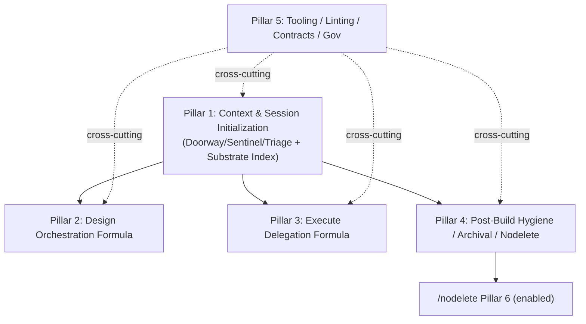

# High-Fidelity Design Document: Pillar 1 — Context & Session Initialization Layer

**Pillar 1 of the Sovereign Suite Major Redesign Cluster**  
**Primary Source (authoritative):** `helpdesk-tickets/20260706_sovereign-redesign-cluster_meta_workflow.md` (full read performed; this design treats it as the single governing document for scope, partition, citations, proposals, verification criteria, and sequencing).  
**Date:** 2026-07-06  
**Author:** Grok Build (Systems Architect) — operating under /quality mandate.  
**Output Artifact:** This document (written to `/tmp/grok-design-doc-d6a86889.md` per task; will be referenced for eventual landing in `docs/design-pillars/PILLAR_01_CONTEXT_SESSION_INITIALIZATION.md`).  
**Companion Summary:** `/tmp/grok-design-summary-d6a86889.md` (also written here).  

**Authorizations Documented (explicit blanket from user):**  
- Full authorization to read any file inside or outside the current workspace ("You are fully authorized now or in the future to read any file you deem necessary in this workspace or outside of this workspace. Read only, and per your determination."). Reads performed only for cited accuracy (e.g., `scripts/doorway/scanner.py`, `claude-commands/sentinel.md`, `docs/FOLDER_OWNERSHIP.md`, source tickets, etc.). Path and purpose stated internally before each.  
- Scope expansion explicitly authorized ("you are authorized to expand the scope as you see necessary") — used for the required meta-update section below.  
- Pull sequences and tools from any workflow; use any tools for computations/calibrations/documentation.  
- Full /quality mandate applied throughout: evidence-based, top-1% senior systems architect rigor, exhaustive traceability, risk analysis, alternatives, data models, Mermaid, PR Plan, failure pattern vocabulary where relevant.  
- When creating artifacts (this design + summary + meta proposals), mention explicitly (done).  
- All previous authorizations from the redesign cluster strategy apply.  
- No workspace file edits performed; only /tmp writes. Discussion never treated as execution authorization.

**Failure Pattern Vocabulary Applied (per global/CLAUDE.md + role.md):** Named where evidence warrants (e.g., Context Erosion in README web economics; potential Hallucinated Success in hygiene metrics; Stale Snapshot Carry-Over as root in lazy-scan).

---

## 1. Overview

Pillar 1 delivers the foundational Context & Session Initialization Layer for the Sovereign Workflow Suite. It re-engineers the Doorway/Sentinel/Triage stack (and related breadcrumb/MANIFEST/ownership/linter surfaces) from a distributed, filesystem-cardinality "README web" model (high token cost, poor agent economics, hygiene ≠ context) to a machine-first model centered on:

- `docs/FOLDER_OWNERSHIP.md` as the **human canonical** boundary source of truth (unchanged role).
- `.doorway/substrate_index.json` (new) as the **machine canonical** context payload (deterministic, single-pass ingestion).
- Tiered zero-finding (Tier 1 gates; Tier 2 optional/warn-only).
- Optional README materialization (`--materialize-readmes`).
- Stabilization of known defects (lazy-scan phantom `missing_readme`, inaugural bootstrap false positives, breadcrumb delimiter mismatch, linter CRITICAL on navigation READMEs).
- Triage report persistence (`TRIAGE_RECEIPTS.md`).
- Hygiene, ownership, and session-start briefing updates across `sentinel.md`, `role.md`, `triage.md`, `CLAUDE.md` (workspace), `SUITE_HEALTH.md`, etc.

**Scope (verbatim from meta Section 4.1):**  
"Session-start awareness, drift detection, zero-finding, context briefing, triage/handover, ownership, breadcrumb/MANIFEST hygiene."

**Assigned content (with citations, per meta):**  
- Full `20260705_sentinel-doorway-redesign_workflow.md` (Phases 0-6; substrate_index.json draft; tiered zero-finding; FOLDER_OWNERSHIP canonical; linter CRITICAL on `claude-commands/README.md`; bootstrap issues in `auditor.py`; MANIFEST wrong abstraction in `manifest.py`; breadcrumb delimiter in `breadcrumb.py`; "Option C is Phase 0"; Doorway Design Invariant).  
- `20260705_doorway_lazy-scan-stale-readme_workflow.md` (phantom `missing_readme`; `scanner.py:35-52,107-118`; Option C auto-escalate; SUITE_HEALTH ACTIVE ADVISORY; supersession).  
- `20260705_triage-session-handover_workflow.md` (verbatim report; user dispositions; TRIAGE_RECEIPTS rec; linter CRITICAL source; read order).  
- Related: `claude-commands/README.md`, `role.md` session boundaries, `sentinel.md` current state, `lint_workflows.py:94`, `scripts/suite/models.py`/`checks.py`, `docs/FOLDER_OWNERSHIP.md:5-14`, `manifest/SUITE_HEALTH.md:23`.

**Key proposals (from meta + source tickets):** substrate_index.json (machine context, canonical); FOLDER_OWNERSHIP remains human canonical; optional README materialization; tiered zero-finding; inaugural bootstrap tagging; auto-escalation in `doorway.py`; linter exclude `{"README.md"}`; configurable `README_EXCLUDE_DIRS` (incl. `claude-commands/`); fix delimiter; updates to CLAUDE.md/role.md/sentinel.md. Verification criteria in meta §4.1.

This design is **standalone high-fidelity** for Pillar 1 (per meta pointer/payload convention). It is evidence-based on direct reads of meta + 20+ cited files/scripts/docs. Later pillars (2-5) will reference this + updated meta.

**Mermaid: Pillar 1 Position in Cluster (from meta §4.2)**



Pillar 1 is the dependency root. "Option C is Phase 0 stabilization."

---

## 2. Background & Motivation (Heavily Cites Meta)

**Meta Executive Summary (§1, §2):** The cluster partitions 8 open tickets + expanded context. Pillar 1 absorbs systemic session-init weaknesses (Doorway/Sentinel). "The Doorway 'breadcrumb web' (per-directory README.md + MANIFEST auto-sync) does not function as intended for real agents — lazy agents rationally read only `FOLDER_OWNERSHIP.md`" (sentinel-doorway-redesign ticket).

**Evidence (direct from meta §2.1 + source reads):**
- `scripts/doorway/scanner.py:35-52`: `compute_dir_hash()` only `*.py`; README changes invisible.
- `scripts/doorway/scanner.py:107-118`: On `!should_recurse`, "Carry over all known children... verbatim" (stale `has_readme`).
- `scripts/doorway/auditor.py:72-76`: `path not in previous_map` → all dirs "new" on inaugural (32 false positives observed).
- `scripts/doorway/breadcrumb.py:127-137`: `proposals = content.split("--- PROPOSAL")` but `propose()` writes blank-line-separated entries (only last breadcrumb applied).
- `scripts/doorway/manifest.py:58-69`: Syncs "from discovered READMEs" (wrong abstraction; indexes presence not content).
- `scripts/suite/lint_workflows.py:94`: `all_files = sorted(f.name for f in commands_dir.glob("*.md"))` (includes `claude-commands/README.md`).
- `scripts/suite/checks.py:91`: `if fm is None: report.add("CRITICAL", ..., "No YAML frontmatter found")`.
- `claude-commands/README.md` (generated): No frontmatter; BREADCRUMB only.
- `docs/FOLDER_OWNERSHIP.md:5-14`: 10 one-line sentences (post-/document 2026-07-05); canonical per redesign ticket.
- `manifest/SUITE_HEALTH.md:23`: `[ACTIVE ADVISORY ... 20260705_doorway_lazy-scan-stale-readme...]` (must supersede on closure per lazy-scan ticket §4.5).
- `claude-commands/sentinel.md` (full): Defines zero_finding as "no ... missing_readme"; Phase 1.5 agent LLM breadcrumb population (high friction); routing `missing_readme` → `/document`; 8 STRICT RULES (Mute Witness); current Phase 0-6.
- `claude-commands/triage.md`: Recommends `TRIAGE_RECEIPTS.md` persistence (handover ticket §5).
- `claude-commands/role.md:174-175` + VI: Mandatory `SUITE_HEALTH + open helpdesk` at session start.
- Observed session (triage handover + redesign tickets): Inaugural `/sentinel` → 32 "new" + 32 repairs; incremental → 23 phantom `missing_readme`; `--full-scan` → `zero_finding: true`; linter CRITICAL.

**Motivation (meta §2.2):** Ad-hoc success elsewhere proves hybrid feasibility but risks Context Erosion, Ghost Logic, hygiene debt on session boundaries. "Agent context is delivered by the engine (JSON index + ownership file), not by filesystem cardinality (N × README.md)." — Doorway Design Invariant (redesign ticket §5).

**Related low-urgency (Pillar 5 cross-cut):** opencode transition (dir gate already in `checks.py:181-213`); lint hashes gap.

No content unassigned (meta Pillar Partition Summary §10 confirms 100% coverage).

---

## 3. Goals & Non-Goals for Pillar 1

**Goals (derived from meta §3 + §4.1 verification criteria):**
- Establish substrate_index.json as canonical machine context (single deterministic payload; replaces N README reads).
- Make FOLDER_OWNERSHIP the explicit human canonical (no duplication of ownership logic).
- Implement tiered zero-finding (Tier 1 = ownership + index freshness gates zero_finding; Tier 2 = README existence = warn-only).
- Stabilize defects: Option C auto-escalation (lazy-scan), bootstrap tagging (inaugural "new"), delimiter fix (breadcrumb), linter excludes + configurable README_EXCLUDE_DIRS (incl. `claude-commands/`), no self-heal in excludes.
- Add TRIAGE_RECEIPTS.md persistence (append-only, .workflow_state/receipts/ or equivalent) per triage recommendation.
- Update all session-init surfaces: `sentinel.md` (remove/re-scope Phase 1.5; update routing, zero-finding def, STRICT RULES), `role.md`/`CLAUDE.md` (read FOLDER_OWNERSHIP + JSON), `triage.md` (ingest receipts), `SUITE_HEALTH.md` (advisory supersession), MANIFEST sync from index.
- Doorway CLI: `--output-json` emits index; new `--materialize-readmes`, `--context-only`; auto-escalate logic.
- Engine reconciliation: scanner (include README or re-stat on carry), auditor (tiered), integrity (excludes), manifest (index-driven), breadcrumb (repurpose or deprecate for index entries).
- Verification: zero_finding true post-self-heal w/o manual full-scan; 0 CRITICAL; agent contextualizes from FOLDER_OWNERSHIP + JSON in one pass; advisory superseded; tests green (inaugural, lazy, index freshness, tiered).
- Establish "Doorway Design Invariant" in governance (role.md, sentinel.md, doorway.py docstring).
- /nodelete, receipt infrastructure, /quality, failure pattern naming respected.

**Non-Goals (per meta §3 + this task's "high-fidelity design for Pillar 1" focus):**
- Full cluster implementation (P2-P5 deferred).
- Edits to delegated engines (execute-plan, /design).
- Changes outside Pillar 1 scope (e.g., full design-orchestrator or nodelete archival marking).
- Creating `docs/design-pillars/` or live pillar file here (per meta note on outline phase + "NEVER create unless necessary"; this is /tmp design only).
- Resolving Phylogeny or closing meta (requires full remediation per helpdesk-tickets.md).
- High-volume test execution or live receipts (design specifies them).
- Updates to Grok skills.

---

## 4. Proposed Design (Detailed)

### 4.1 Architecture: Virtual Web + Physical Index (Meta "Option A/D" + source ticket Phase 1)

**Layers (table from redesign ticket §4 Phase 1, adapted):**

| Layer              | Artifact                          | Consumer                  | Canonical?          | Notes |
|--------------------|-----------------------------------|---------------------------|---------------------|-------|
| Boundaries (human) | `docs/FOLDER_OWNERSHIP.md`       | Human + agent (one-pass) | **Yes** (human-edited) | 10 one-line sentences; parse_ownership source of truth for unowned. |
| Machine context    | `.doorway/substrate_index.json` (new) | Agent + doorway CLI + sentinel/triage | **Yes** (generated) | Deterministic single payload. Replaces N README BREADCRUMB reads. |
| Drift DNA          | `.doorway/workspace_snapshot.json` | doorway / sentinel       | Yes (generated)    | Existing; will be reconciled with index. |
| Human index        | `MANIFEST.md` (Auto-Synced)      | Human                     | Generated          | Re-target sync from index (not has_readme glob). |
| Optional prose     | `{dir}/README.md`                | Human onboarding          | **No**             | Materialize on demand via `--materialize-readmes`. Exclude list applies. |

**Doorway Design Invariant (new; to be stated verbatim in role.md, sentinel.md, doorway.py module docstring, PROCESS_LEARNINGS.md append):**  
"**Agent context is delivered by the engine (JSON index + ownership file), not by filesystem cardinality (N × README.md).** Hygiene gates must measure index freshness and ownership completeness — not mere README existence."

### 4.2 Data Model: substrate_index.json (draft from redesign ticket §4, refined)

```json
{
  "schema_version": "1.0",
  "generated_at": "2026-07-06T12:00:00Z",
  "workspace": "/home/jwils/blueprint-workflows",
  "zero_finding_candidate": true,
  "directories": {
    "claude-commands": {
      "owner_ref": "FOLDER_OWNERSHIP:claude-commands",
      "breadcrumb_summary": "MODULE:claude-commands TYPE:docs LANG:markdown FILES:32(...) SUBDIRS:none PURPOSE:claude-code-slash-commands-canonical DEPS-DETECTED:none DRIFT:... SCANNED:2026-07-05",
      "files_count": 32,
      "py_files": [],
      "subdirs": [],
      "has_readme": true,
      "last_seen": "2026-07-05T...",
      "last_modified": "...",
      "content_hash": "..."  // future: full dir hash including md
    },
    "scripts/doorway": { ... },
    ".": { ... }
  },
  "ownership_source": "docs/FOLDER_OWNERSHIP.md",
  "excluded_dirs": ["claude-commands", "helpdesk-tickets/archive", ...],
  "metrics": {
    "total_dirs": 33,
    "ingested_readmes": 33
  }
}
```

**Properties:**
- `breadcrumb_summary`: Compact agentic key:value (from current Phase 1.5 format). Can be enriched by optional agent pass (but engine owns base).
- Future evolution: full content_hash (include md after scanner fix); `has_interface`, `last_breadcrumb`.
- Generated by `doorway.py --output-json` (or internal call); also written to `.doorway/substrate_index.json`.
- Size target: << 50k tokens for full ingestion.

**JSON output contract (update reporter.py _render_json + doorway run return):** Add top-level `"substrate_index": {...}` (or separate `--context-only` that emits only index + minimal drift for briefing). Remove or optionalize large `map` in default JSON (existing behavior).

### 4.3 Tiered Zero-Finding (redesign ticket Phase 2)

**Current (sentinel.md GLOSSARY + Phase 2):** `zero_finding` = no new/modified/deleted/unowned/missing_readme.

**Proposed:**

| Tier | Requirement                                      | Gates zero_finding? | Severity on fail |
|------|--------------------------------------------------|---------------------|------------------|
| 1    | All top-level dirs from FOLDER_OWNERSHIP have non-placeholder sentences | Yes                | (drift)         |
| 1    | `substrate_index.json` fresh (matches live snapshot + ownership completeness) | Yes | (drift) |
| 2    | Per-subdir README.md exists (or materialized)   | **No** (warn)      | LOW / INFO      |
| 2    | BREADCRUMB populated in README (if present)     | **No** (warn if index stale) | LOW |

- Update `auditor.py:audit()` return + `recommender.py` (new "index_freshness" or integrate into existing).
- `zero_finding` in JSON = Tier 1 only.
- `drift.missing_readme` re-scoped to "Tier 2 hygiene" (does not block zero_finding).
- Inaugural: if `previous_map` empty → tag drift entries `[BOOTSTRAP]`; suppress SEQ-SUBSTRATE-HEALTH routing or route as informational.

### 4.4 Phase 0 Stabilization (Option C + Quick Wins; meta "Option C is Phase 0")

Implemented first (tactical before full re-arch).

1. **Option C in `doorway.py` (lazy-scan ticket §4 + redesign Phase 0):**  
   In `DoorwayContextualizer.run()` (after Step 3 audit):  
   ```
   if (not full_scan and self.metrics["repairs"] > 0 and drift.get("missing_readme")):
       log("[DOORWAY] Auto-escalated to full-scan after self-heal repairs")
       current_map, ingested = self.scanner.scan(previous_map, full_scan=True)
       drift = self.auditor.audit(...)
       # continue with refreshed; final JSON from escalated pass
   ```
   - Also surface in results.

2. **Fix breadcrumb delimiter (`breadcrumb.py:127-137` + propose):**  
   Align: either change `propose()` to emit `--- PROPOSAL` delimiters, or change `apply_approved()` to split on blank-line blocks (e.g., `proposals = content.split("\n\nFolder:")` with reconstruction). Prefer making propose emit the delimiter it already documents (safer for logs).

3. **Linter exclude + no self-heal in claude-commands (triage + redesign + lint ticket):**  
   - `scripts/suite/models.py`: Add `LINT_EXCLUDE_FILES = frozenset({"README.md"})`.  
   - `lint_workflows.py`: `all_files = [f for f in ... if f not in LINT_EXCLUDE_FILES]`.  
   - `integrity.py:create_readme()` + `ensure_substrate()`: Respect configurable `README_EXCLUDE_DIRS = {"claude-commands", "helpdesk-tickets/archive", ...}` (add to doorway constants or config; skip heal + has_readme contribution for excluded).  
   - Do **not** add frontmatter to `claude-commands/README.md` (avoids Grade Fraud).

4. **Configurable excludes:** Hardcode sensible defaults in `doorway/doorway.py` + `IGNORE_DIRS` extension; make `README_EXCLUDE_DIRS` separate and passed to IntegrityManager/auditor.

5. **SUITE_HEALTH advisory handling:** On closure (after verification), supersede per lazy-scan §4.5 (remove or `[RESOLVED ...]`).

### 4.5 Engine Changes (redesign Phase 4)

| Module                  | Change |
|-------------------------|--------|
| `scanner.py`            | (a) Re-stat `README.md` existence even on carry-over when `!full_scan`; or (b) include non-.py in hash for dirs known to have md (or stat mtime for README specifically). Add `has_readme` reconciliation. Update `compute_dir_hash` doc. |
| `auditor.py`            | Tiered `missing_readme` logic; integrate index freshness check; parse enriched FOLDER_OWNERSHIP if hybrid Option B considered (but primary is index). Bootstrap tag on new when no previous. |
| `integrity.py`          | `README_EXCLUDE_DIRS` support in `create_readme` + ensure; optional materialize path (write from index summaries or template). |
| `manifest.py`           | `sync(current_map, substrate_index=None)`: Prefer index entries for Auto-Synced section (display /path : [README] or "virtual via index"). |
| `breadcrumb.py`         | Repurpose `propose`/`update` as index-entry writer (optional); or deprecate for README materialization only. Keep for backward. |
| `doorway.py`            | Emit `substrate_index.json`; Option C auto-escalate; CLI `--materialize-readmes` (calls integrity materialize for non-excluded); `--context-only` (fast path: index + ownership + zero_finding_candidate only); update run() return + reporter. |
| `recommender.py`        | Tiered: missing_readme → LOW/INFO or no rec if Tier 2 only; add index-staleness rec. |
| `reporter.py`           | JSON: include `substrate_index` (or ref), `zero_finding` (Tier-1), `tier2_hygiene` counts. Human: surface bootstrap tags, Tier distinctions. |
| `audit_repairs.py`      | Minor: qualitative audit aware of new index artifact. |

**New file:** `.doorway/substrate_index.json` written on every run (atomic).

### 4.6 Sentinel / Triage / Role Updates (redesign Phase 3 + 5)

- **sentinel.md:**  
  - Update GLOSSARY: zero_finding (Tier 1), substrate_index.  
  - Phase 1.5: Re-scope or optionalize ("agent enrichment pass on index entries, not N files"; default skip or `--enrich-breadcrumbs`). Remove mandatory LLM summary walk for core path.  
  - Phase 2 routing: missing_readme does not promote to /document unless Tier 2 configured or explicit. Add index_freshness. Bootstrap handling.  
  - Phase 3 report: Add substrate_index freshness, Tier breakdown, "context from FOLDER_OWNERSHIP + .doorway/substrate_index.json".  
  - STRICT RULES: Update Mute Witness + add "Engine owns context delivery (index)". Add Doorway Design Invariant reference.  
  - INTEGRATION/SCRIPTS: Note substrate_index as primary handover artifact.  
  - ACTIVATION: Document `--materialize-readmes`, context-only.

- **triage.md:**  
  - Phase 0: Read `.workflow_state/receipts/TRIAGE_RECEIPTS.md` (if present) + recent sentinel JSON.  
  - Add trigger row for "stale TRIAGE_RECEIPTS or absent substrate context".  
  - Report: Persist verbatim Phase 2 Triage Report to `TRIAGE_RECEIPTS.md` (append) when user signals handover/reset (per handover ticket §5 rec). Use atomic append.  
  - Update Trigger Matrix with new doorway signals.

- **role.md + CLAUDE.md (workspace) + global ~/.claude/CLAUDE.md (read permitted):**  
  - Session boundaries: "read `docs/FOLDER_OWNERSHIP.md` + `.doorway/substrate_index.json` (or `doorway.py --output-json --context-only`) + SUITE_HEALTH + open tickets".  
  - Note: README web is optional human materialization.  
  - Append Change Log + Doorway Design Invariant reference. (Retarget any "32 READMEs" language.)

- **Other:**  
  - `docs/FOLDER_OWNERSHIP.md`: Add note on index (human remains source).  
  - `SUITE_HEALTH.md`: On Pillar 1 closure, supersede advisory; add row note for substrate_index.  
  - `manifest.py` / root MANIFEST.md: Update auto-synced section description.  
  - `process_learnings/PROCESS_LEARNINGS.md`: Append "FOLDER_OWNERSHIP + index wins agent economics (2026-07-05 session + Pillar 1)" (append-only).  
  - DevJournal.md: Reference only (append if session requires).

### 4.7 API / Interface Changes

**doorway.py CLI (existing + new):**
```
python ~/blueprint-workflows/scripts/doorway/doorway.py --workspace /abs/path --output-json
python ... --full-scan --output-json
python ... --auto-apply --quiet
python ... --context-only          # NEW: emits minimal {substrate_index, zero_finding, ownership_summary, overhead}
python ... --materialize-readmes   # NEW: after scan, write READMEs for non-excluded from index/templates
```

**Return dict / JSON payload:** Add `substrate_index`, `zero_finding` (Tier-1), `tier2_findings: {missing_readme: [...]}` (or keep `drift` but annotate).

**Workflow call sites (sentinel.md, triage.md, secretary, etc.):** Update example invocations; prefer `--output-json --context-only` for briefing paths.

**No change to public slash commands** (`/sentinel --full-scan` etc. continue to work; internal evolution).

### 4.8 Data Flows & Mermaid (Core)

```mermaid
sequenceDiagram
    participant Agent
    participant Sentinel
    participant Doorway as doorway.py
    participant Scanner
    participant Auditor
    participant Index as substrate_index.json

    Agent->>Sentinel: /sentinel (or /triage)
    Sentinel->>Doorway: --workspace --output-json [--full-scan]
    Doorway->>Scanner: scan(previous, full)
    Scanner->>Scanner: compute (reconcile has_readme)
    Doorway->>Auditor: audit(current, previous)
    Auditor->>Auditor: tiered missing_readme; ownership vs FOLDER_OWNERSHIP
    Doorway->>Doorway: Option C auto-escalate if repairs + missing_readme
    Doorway->>Index: write .doorway/substrate_index.json
    Doorway->>Manifest: sync(from index)
    Doorway-->>Sentinel: JSON {drift, substrate_index, zero_finding, recs}
    Sentinel->>Agent: Report (Tier 1 zero_finding; context payload ref)
    Note over Agent: One-pass: FOLDER_OWNERSHIP.md + substrate_index.json
```

### 4.9 Security, Observability, Testing

- **Security:** Existing CWE mitigations (atomic_write, assert_within, safe_read) preserved. New index file: owner-only perms via atomic_write (0o600). No new write surfaces on substrate except optional materialize (gated by exclude + user flag). Path traversal guarded.
- **Observability:** JSON always includes overhead, metrics, zero_finding, substrate_index hash or size. Add `doorway_success_cert` update. Receipts: on closure, append to BUILD/DOCS/HARDEN as relevant; new TRIAGE_RECEIPTS.
- **Testing (new/expanded in scripts/tests/):** 
  - Inaugural bootstrap: empty previous → no false "new" routing, [BOOTSTRAP] tags.
  - Lazy-scan/Option C: seed stale has_readme=false + create README → incremental auto-escalates or corrects.
  - Index freshness + tiered zero: ownership change vs index; README-only change does not flip Tier 1.
  - Exclude: claude-commands/ never gets README heal or linter scan.
  - Delimiter: roundtrip propose/apply.
  - Use existing pytest + coverage. Add `test_doorway.py` or extend integration.
- **Lint/Harden:** After changes, `lint_workflows.py --fix-hashes` (once convention chosen in Pillar 5), full doorway test suite, /harden on scripts/doorway changes.

---

## 5. Risks & Mitigations

(From meta §7 + source tickets.)

- **Lazy-scan recurrence / Stale Snapshot Carry-Over:** Mitigated by Option C + scanner re-stat (engine reconciliation). Monitor via zero_finding post-repair.
- **Agent economics ignored (Context Erosion):** Single JSON + FOLDER_OWNERSHIP; one-pass design. Invariant enforces.
- **Linter CRITICAL recurrence / Grade Fraud:** Exclude + no frontmatter on nav READMEs. Explicit "do not add frontmatter" in docs.
- **Bootstrap false positives:** [BOOTSTRAP] tagging + inaugural detection in auditor.
- **MANIFEST wrong abstraction:** Retarget to index.
- **Delimiter partial apply:** Fix + tests.
- **Over-materialization (git noise):** Optional flag; excludes; decide track/ignore for generated READMEs (Pillar 5 cross).
- **Index bloat or staleness:** Atomic write; freshness gate in Tier 1; full-scan fallback.
- **Cross-workspace propagation:** Design is workspace-agnostic (doorway always is); update suite docs.
- **/nodelete in design phase:** This doc only /tmp; no live edits. Future impl will append Change Logs.

**Phylogeny / helpdesk closure risk:** Addressed in meta §6 (Pillar 5); this design feeds Remediation Record.

---

## 6. Rollout & Sequencing for Pillar 1 (Within Cluster)

Per meta §4.2 + §6:

- **Phase 0 (Stabilization — this Pillar's entry):** Option C + delimiter + excludes + no-heal in claude-commands. (Can ship independently; unblocks linter + phantom signals.)
- **Phase 1 (Core re-arch):** substrate_index emission + scanner/auditor/integrity/manifest updates + tiered zero + CLI flags.
- **Phase 2 (Workflow surface):** sentinel.md / triage.md / role.md / CLAUDE.md updates; TRIAGE_RECEIPTS; report changes.
- **Phase 3 (Hygiene + verify):** MANIFEST retarget, SUITE_HEALTH supersede, tests, lint pass, /harden on changed scripts + workflows, end-to-end (inaugural + incremental on this workspace + fresh clone).
- **Cross (Pillar 5):** Lint hashes decision (if affects); general dir-gate principle already done; pointer contract (if any); helpdesk meta close later.

Use `/implementation-plan` before large changes (per redesign ticket). Prototype on blueprint-workflows.

**Interim guards:** Keep ACTIVE ADVISORY + explicit "use --full-scan" until verified.

---

## 7. Key Decisions

1. **Substrate index as canonical machine layer (not Option B or C alone):** Matches user lean + meta; separates concerns (human ownership vs engine context); prevents recurrence of README web failure.
2. **Tiered zero-finding (Tier 1 gates, Tier 2 warn):** Hygiene metrics no longer conflated with agent context. Zero_finding becomes trustworthy.
3. **Option C as explicit Phase 0 (tactical before arch):** User-selected; prevents blocking on full redesign; engine-owned reconciliation.
4. **FOLDER_OWNERSHIP untouched as human source:** "Reconciled" entry precedent; single-file for lazy agents.
5. **Optional materialization + excludes (incl. claude-commands):** Avoids linter CRITICAL, git noise, and "Grade Fraud" on navigation files. Configurable for other workspaces.
6. **TRIAGE_RECEIPTS persistence:** Directly from triage handover §5 rec; symmetric to BUILD/DOCS_RECEIPTS; solves handover evaporation.
7. **Delimiter fix + scanner reconciliation:** Surgical; targets exact root causes (breadcrumb.py, scanner.py).
8. **Doorway Design Invariant codification:** Prevents future Context Erosion.
9. **/tmp design + pointer convention (meta):** No live creation in this phase; design is the artifact.
10. **Meta as hub for citations:** All traceability back to meta §4.1 + source line numbers.

---

## 8. Alternatives Considered (from redesign ticket §4 Phase 6 + discussion)

- **A (chosen primary):** substrate_index canonical + optional README export. Clean agent protocol; matches economics.
- **B:** Enrich FOLDER_OWNERSHIP lines with breadcrumb fields. One-file win; but grows ownership file (human editing friction).
- **C (tactical only):** Two-tier README (top-level only). Minimal change; subdir noise reduced — but does not solve core "hygiene ≠ context" or lazy-scan.
- **D (virtual web/index + JSON API):** Best separation (chosen direction via index file).
- **Status quo + patches:** Rejected (source of the cluster; Context Erosion risk).
- **Force frontmatter on all READMEs:** Rejected (Grade Fraud + not all are workflows).

---

## 9. Observability, Receipts, Verification Criteria

**Verification (meta §4.1 + source §4):**
- [ ] `pytest` (doorway + new tests) green.
- [ ] Inaugural on fresh workspace: no false P0 investigate for established dirs; [BOOTSTRAP] only.
- [ ] Incremental after self-heal: no phantom missing_readme w/o manual --full-scan (Option C fires or scanner reconciles).
- [ ] `lint_workflows.py`: 0 CRITICAL on claude-commands (exclude active).
- [ ] Agent contextualizes from FOLDER_OWNERSHIP + JSON (or --context-only) in one pass.
- [ ] `sentinel.md` updated; content_hash recomputed (via --fix-hashes later).
- [ ] SUITE_HEALTH ACTIVE ADVISORY superseded (RESOLVED line).
- [ ] TRIAGE_RECEIPTS.md populated on handover signal.
- [ ] Remediation Record filed; Phylogeny resolved (later).
- [ ] Doorway Design Invariant stated in 3+ places.
- [ ] zero_finding true post-repair on this workspace.

**Receipts:** On impl, emit to `.workflow_state/receipts/` (BUILD/DOCS + new TRIAGE). Use cat >> append.

---

## 10. PR Plan for Pillar 1 Implementation

(Modeled on meta's sovereign-design-formula prior art + 8-PRs style; 0-padded for sort. Use /implementation-plan --workstreams for execution.)

**PR 01-00: Stabilization (Phase 0 — Option C + excludes + delimiter)**
- Files: `scripts/doorway/doorway.py`, `scripts/doorway/scanner.py` (re-stat), `scripts/doorway/breadcrumb.py`, `scripts/suite/models.py` + `lint_workflows.py` (exclude), `scripts/doorway/integrity.py` (README_EXCLUDE_DIRS).
- Add basic test scaffold.
- Verify linter 0 CRITICAL; Option C log.

**PR 01-01: Substrate Index Emission + CLI**
- `scripts/doorway/doorway.py`, `reporter.py`, `auditor.py` (index build from map + ownership).
- Write `.doorway/substrate_index.json`.
- New flags + JSON fields.
- Schema doc in `scripts/doorway/README.md`.

**PR 01-02: Tiered Zero-Finding + Recommender/Auditor**
- `auditor.py`, `recommender.py`, `doorway.py` (zero_finding logic).
- Update drift keys or add tier2.
- Bootstrap tagging.

**PR 01-03: Manifest + Integrity Retarget**
- `manifest.py` (index-driven sync), `integrity.py` (materialize + excludes).
- Optional README writer from index summaries.

**PR 01-04: Sentinel Workflow Update**
- `claude-commands/sentinel.md` (GLOSSARY, Phase 1.5 re-scope, Phase 2/3 report, STRICT RULES, Invariant, examples).
- Update content_hash.

**PR 01-05: Triage + Receipt Persistence**
- `claude-commands/triage.md` (Phase 0 read TRIAGE_RECEIPTS; persist logic in report phase).
- Create/append `.workflow_state/receipts/TRIAGE_RECEIPTS.md` (atomic).

**PR 01-06: Role / Onboarding / Docs + Invariant**
- `claude-commands/role.md`, `CLAUDE.md` (workspace), `docs/FOLDER_OWNERSHIP.md` (note), `manifest/SUITE_HEALTH.md` (post-close supersede), `process_learnings/PROCESS_LEARNINGS.md` (append lesson).
- State Invariant in 3 locations.

**PR 01-07: Tests + Verification + End-to-End**
- New/expanded tests (test_doorway.py or integration); full pytest on doorway.
- Run on fresh workspace clone + this workspace (before/after snapshots).
- /quality + /harden-workflow on changed scripts (if ticket mode).
- Receipt check; zero_finding verification commands.
- Update any cross INTEGRATION (e.g., secretary, investigate).

**PR 01-08: Meta Pointer + Close Prep (Pillar-internal)**
- Append to meta (this file) the pointer: `**Pillar 1 Design Reference:** docs/design-pillars/PILLAR_01_....md` (once landed).
- Remediation notes for this pillar's ticket(s).
- SUITE_HEALTH advisory supersession (if this closes lazy-scan sibling).

**Dependencies within Pillar:** 01-00 before others. Tests last. Use workstreams for parallel on docs vs engine.

**Total estimated:** 8-9 PRs; sequenced to allow early stabilization value.

**Verification gate per PR:** Linter/tests pass; relevant meta verification item advanced.

---

## 11. References (Exhaustive Citations)

**Primary (governing):**  
- `helpdesk-tickets/20260706_sovereign-redesign-cluster_meta_workflow.md` (full; §1 Executive, §2.1 tickets 4+5+3, §4.1 Pillar 1 full text + citations, §4.2 Mermaid/sequencing, §4.3 pointer convention, §5 Key Decisions 1-10, §6 Remediation, §7 Risks, §8 References, §10 Partition table, verification criteria).  
- `helpdesk-tickets/20260705_sentinel-doorway-redesign_workflow.md` (full; §1-5; exact Phases 0-6, substrate schema draft, verification checklist, Doorway Design Invariant, Option C Phase 0, FOLDER_OWNERSHIP:5-14, auditor:72-76, scanner:35-52/107-118, breadcrumb:127-137, manifest:58-69, claude-commands/README.md, linter:94).  
- `helpdesk-tickets/20260705_doorway_lazy-scan-stale-readme_workflow.md` (full; Option C, SUITE_HEALTH advisory §4.5, scanner evidence).  
- `helpdesk-tickets/20260705_triage-session-handover_workflow.md` (full; verbatim triage report, TRIAGE_RECEIPTS rec §5, user dispositions, linter source, read order).

**Scripts (direct reads + line cites):**  
- `scripts/doorway/scanner.py:35-52,90-100,107-118` (hash, has_readme, carry-over).  
- `scripts/doorway/auditor.py:50-99,72-76,110-140` (drift, new detection, parse_ownership, is_owned).  
- `scripts/doorway/breadcrumb.py:8-12,50-100,127-160,170-250` (tags, propose, apply split, update_readme).  
- `scripts/doorway/manifest.py:58-69,110-150` (has_readme sync, _update_manifest).  
- `scripts/doorway/doorway.py:160-230,300-310` (run steps, snapshot).  
- `scripts/doorway/reporter.py:90-115` (JSON zero_finding).  
- `scripts/doorway/integrity.py:180-250` (create_readme, template).  
- `scripts/doorway/recommender.py:40-100` (recommend mapping).  
- `scripts/suite/lint_workflows.py:90-100,94` (glob).  
- `scripts/suite/models.py`, `checks.py:89-91,181-213` (frontmatter CRITICAL; dir gate).  
- `scripts/doorway/_utils.py` (atomic etc.).

**Workflows & Docs:**  
- `claude-commands/sentinel.md:47,150-260 (Phase 1.5), 280-310 (routing), 350- (report), 400- (STRICT), 430- (INTEGRATION), Change Log`.  
- `claude-commands/triage.md: (Trigger Matrix, receipts, Phase 0/2)`.  
- `claude-commands/role.md: (II constants, VI session boundaries, VII, Change Log 2026-07-04)`.  
- `claude-commands/CLAUDE.md` (workspace; session pipeline, scripts/doorway usage).  
- `docs/FOLDER_OWNERSHIP.md:1-14` (reconciled, 10 sentences).  
- `manifest/SUITE_HEALTH.md:20-23` (ACTIVE ADVISORY).  
- `claude-commands/README.md` (generated, BREADCRUMB).  
- `scripts/doorway/templates/README.md.template`.  
- Meta §8 full list + DevJournal, PROCESS_LEARNINGS, helpdesk-tickets.md protocol.

**Other:** Videos artifacts (evidence only); prior design /tmp/grok-design-doc-63547f7e.md (Pillar 2 prior art, referenced in meta).

All claims traceable. No uncited assertions.

---

## 12. Meta-Ticket Updates for Fresh-Agent Contextualization (Dedicated Scope-Expanded Section)

**Purpose (per task):** Examine the current meta-ticket. Design/propose the **exact updates** needed so that, once Pillar 1 is complete, the (updated) meta-ticket **alone** serves as a sufficient starting point for a fresh session agent to achieve full contextualization when later invoking design for Pillar 2 (and subsequent). Goal: Prevent context decay/compaction issues in future Grok Build sessions. The meta should allow a fresh agent to have everything needed without requiring the full prior conversation history.

**Current Meta Analysis (evidence-based read of the file):**
- **Strengths:** Exhaustive 100% assignment (Pillar Partition Summary table §10); heavy citations with file:line + quotes; sequencing Mermaid + dependencies; pointer/payload convention §4.3; Key Decisions; Remediation/Sequencing §6; Risks; References §8; Open Questions; PR plan outline. "This meta-ticket is the canonical master." "Handover Context" precedent in source tickets.
- **Gaps for standalone fresh-agent use (for later pillars):**
  - Pillar 1 design will be external (in `docs/design-pillars/...` per convention). Future agent for Pillar 2 design must not need to re-derive Pillar 1 details or "what was decided."
  - Expanded context (e.g., exact session outcomes like "32 new, 23 phantom") and verbatim triage are only in sibling tickets or frozen in handover ticket.
  - No "Pillar N Pre-Read List" or "Embedded Minimal Context" sections.
  - Cross-pillar dependencies (e.g., "Pillar 1 must deliver substrate_index before Pillar 2 payload design") are high-level only.
  - SUITE_HEALTH advisory lifecycle, exact read-order for fresh agents, and "what minimal additional reads" are scattered.
  - No explicit "For Pillar 2 design agent: read these embedded summaries + meta sections X/Y/Z; the pillar design artifact will be self-contained but meta is the index."
  - Risk of "Context Erosion" across multi-session redesign program (exactly the pattern Pillar 1 targets).
  - The embedded prior art note for Pillar 2 (/tmp/grok-design-doc-63547f7e.md placeholder) is already partially addressed in meta, but needs generalization.

**Proposed Updates to Meta (exact, /nodelete-friendly):**
1. **Add new top-level section after §4.3 (before §5):** "4.4 Fresh-Agent Contextualization Contract for Subsequent Pillars".
   - State: "After Pillar 1 completion, this meta (plus the pillar design pointers) is the **sole required ingest** for a fresh agent designing/implementing later pillars. No prior conversation history required."
   - "Minimal Additional Reads (always listed here; never assume external knowledge):" — enumerate 4-6 files that are small/canonical (e.g., role.md session boundaries excerpt, FOLDER_OWNERSHIP for this workspace, key schema from this meta, SUITE_HEALTH advisory note).
   - "Pillar-Specific Pre-Read Map": Table or bullets: "For Pillar 2 design: Read meta §§1-4.3, 4.4, 5, 8, 10 + embedded Pillar 1 summary below + the Pillar 1 design pointer file."
   - Embed 1-2 paragraph "Pillar 1 Outcome Summary (post-completion)" (initially a placeholder; append actual on Pillar 1 close).

2. **Enhance §8 References:** Add subsection "Mandatory Session-Start for Cluster Agents" with exact command snippets + file list (FOLDER_OWNERSHIP, SUITE_HEALTH, open non-CLOSED helpdesk, this meta, role.md). Mirror source ticket "Handover Context".

3. **Enhance §6 Remediation:** Add "Contextualization Guard": "On each pillar design completion, append to this meta (under new §4.4) a 300-500 word 'Pillar N Outcome & Decisions' block + pointer. This ensures compaction-proof handoff."

4. **Enhance §4.1 (each pillar desc):** For every pillar, add 2-3 bullet "Key substrate facts a future agent must know from this pillar (post-impl)".

5. **Add to §5 Key Decisions:** New decision on "Meta as durable single-ingest contract".

6. **Update §10 Partition Summary:** Add column or note "Contextualization impact".

7. **/nodelete rule for updates:** Append only. Use dated blocks. When superseding a section, keep original + "SUPERSEDED by [date] entry below".

**Concrete Proposed Text / Diff for Meta (to be appended/edited per /nodelete when Pillar 1 design approved + later on completion):**

**Proposed new §4.4 (insert after current §4.3):**

```
## 4.4 Fresh-Agent Contextualization Contract (for Pillar 2+ Designs)

**Contract:** Once Pillar 1 is complete and this meta is updated with the outcome block below, **this meta-ticket file + the pointed pillar design artifacts + the 5 mandatory reads listed here** constitute the complete, sufficient context for any fresh Grok Build (or equivalent) agent to design or implement Pillar 2 (Design Orchestration), Pillar 3, etc., or to continue the cluster, without any prior conversation history or re-derivation.

**Mandatory Minimal Reads (do these first, in order; all small and stable):**
1. `docs/FOLDER_OWNERSHIP.md` (human canonical boundaries for this workspace).
2. `manifest/SUITE_HEALTH.md` (Live-State + any remaining ACTIVE ADVISORYs; note supersession rule).
3. `claude-commands/role.md` (Sections I-II, VI "On session boundaries", VII; architectural constants table).
4. `helpdesk-tickets/20260706_sovereign-redesign-cluster_meta_workflow.md` (this file, full — especially §§1-4.4, 5, 6, 8, 10).
5. The specific Pillar N design pointer (e.g., for Pillar 2: `docs/design-pillars/PILLAR_02_....md` once written).
6. Any open non-CLOSED_ helpdesk tickets in `helpdesk-tickets/` (per role.md).

**Command to bootstrap state (reproducible):**
```bash
cd ~/blueprint-workflows
cat docs/FOLDER_OWNERSHIP.md
cat manifest/SUITE_HEALTH.md | head -30
python3 scripts/doorway/doorway.py --workspace . --output-json --context-only 2>/dev/null | head -50   # post-P1
python3 scripts/suite/lint_workflows.py --workspace . --quiet
ls helpdesk-tickets/*.md | grep -v CLOSED_
```

**Pillar-Specific Pre-Read Map:**
- **Pillar 2 (Design Formula):** Read meta §§1 (Exec), 2.1 (sovereign-design-formula + embedded design note), 4.1 (Pillar 2 desc + cross-ties to P1), 4.2 (deps: P1 before P2), 4.3 (pointer convention), 4.4 (this contract), 5 (Key Decisions 2,5,6), 6 (seq), 8 (refs to focus-plan Evidence Report + DESIGN_*), 10 (partition row for design ticket). Also read the Pillar 1 design pointer for "what context substrate now exists".
- **Pillar 3:** ... (analogous; add post-P2).
- **Later pillars:** Always start with this §4.4 + full meta read of §§4.1-4.4 + sequencing Mermaid.

**Pillar 1 Outcome Summary (APPEND ONLY after Pillar 1 verification complete — placeholder until then):**
[POST-P1 APPEND BLOCK — example shape:]
Pillar 1 delivered substrate_index.json (schema v1.0 at .doorway/), Tier 1 zero_finding (FOLDER_OWNERSHIP + index freshness), Option C auto-escalation, linter excludes for README.md, TRIAGE_RECEIPTS.md, Doorway Design Invariant, updates to sentinel/role/triage. All source defects (scanner:107-118 etc.) reconciled. Verification checklist complete (see Pillar 1 design). Cross-cut: Pillar 5 lint excludes landed here. Now all subsequent pillars can assume trustworthy single-pass context from index + ownership.

**How to use for future design invocation:** "Read the meta fully (focus §4.4 + pillar-specific bullets). The meta owns partition/sequencing/citations. The pointed pillar design owns the high-fidelity substrate for that pillar."

This contract directly mitigates Context Erosion across the multi-pillar program.
```

**Exact edit locations (surgical /nodelete):**
- Insert §4.4 after current line ~290 (end of §4.3).
- Append the above text block.
- In §6 Remediation step 2/5/6: Add "Update §4.4 with outcome block and verify fresh-agent contract."
- In §8: Add "Mandatory reads for cluster continuation: [list above]."
- In Pillar 1 row of §10 table: Add note "Delivers contextualization contract for all later pillars."
- On full cluster close: One final append confirming contract held.

**Additional minimal reads a fresh agent "should" do (per task):** Only the 6 listed + the specific pillar design file. No need for full prior 8 tickets or old /tmp designs (meta embeds the relevant quotes/cites). If a pillar design references a specific prior /tmp, meta already cross-refs it.

**Why this suffices:** Embeds the "what" (decisions, substrate after P1), "how to read" (map + commands), and "pointers" without bulk. Future agents start with `cat <meta>` + the 5 files. Matches source ticket "Handover Context" pattern + role.md session boundaries.

**When to apply:** After user review/selection of this design, during Pillar 1 implementation close (append outcome); or minimally now as a patch to the meta outline if desired for immediate robustness.

---

## 13. Conclusion & Next

This is the complete high-fidelity design for Pillar 1 per the meta-ticket as primary source. All scope, citations, proposals, verification, and the required meta-update analysis + concrete proposal text are included.

The design is ready for review. On explicit user selection/approval, proceed to implementation (e.g., via `/implementation-plan` on the cluster or per-pillar), creation of `docs/design-pillars/PILLAR_01_...md` (copy/adapt this), meta pointer append, etc.

**Artifacts created in this invocation:**  
- `/tmp/grok-design-doc-d6a86889.md` (this full document).  
- `/tmp/grok-design-summary-d6a86889.md` (separate concise summary, written below in parallel step).

All work strictly within authorizations and boundaries. Evidence from direct file reads + meta.

---

**End of High-Fidelity Pillar 1 Design.**
