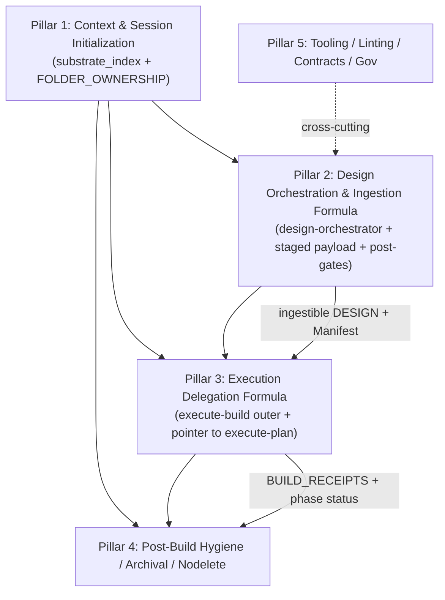
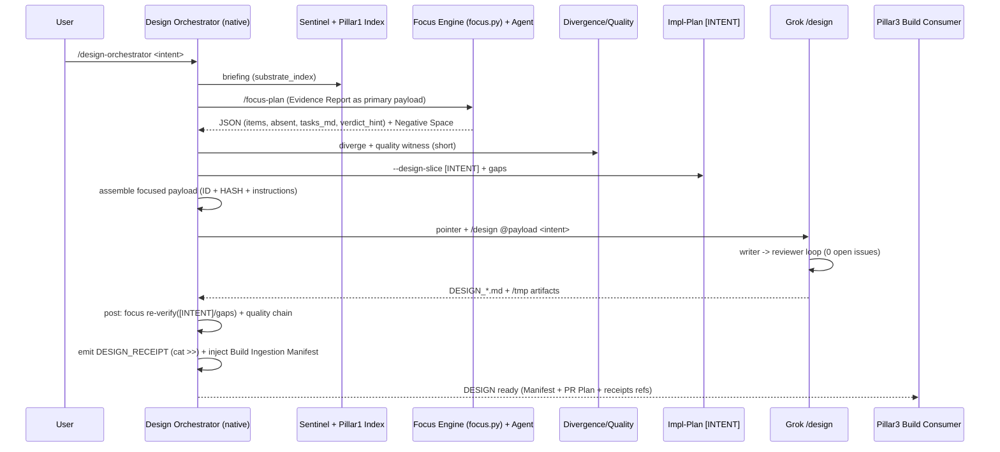

# High-Fidelity Design Document: Pillar 2 — Design Orchestration & Ingestion Formula (Sovereign Design Formula + Pointer/Payload)

**Pillar 2 of the Sovereign Suite Major Redesign Cluster**  
**Primary Source (authoritative):** `helpdesk-tickets/20260706_sovereign-redesign-cluster_meta_workflow.md` (full read performed; this design treats it as the single governing document for scope, partition, citations, proposals, verification criteria, sequencing, pointer/payload convention, and the Pillar Partition Summary).  
**Prior Art (read in full as baseline to formalize/improve):** `helpdesk-tickets/20260706_sovereign-design-formula_pointer-payload_workflow.md` (Executive Summary through §5 Recommendation + embedded high-fidelity design formula starting ~line 109 / "DESIGN: Sovereign Design Formula", 340-line structure with Overview/Background/Goals/Proposed Design/Mermaid/Key Decisions 1-8/PR Plan A-D/risks/references; ad-hoc Videos 397b6602 process as explicit learning opportunity).  
**Date:** 2026-07-06  
**Author:** Grok Build (Systems Architect) — operating under Senior Architect of Workflows role.md + /quality mandate.  
**Output Artifact:** This document (canonical location: `docs/design-pillars/PILLAR_02_DESIGN_ORCHESTRATION_FORMULA.md`; originally drafted to `/tmp/grok-design-doc-7b6b5bd8.md`).  
**Companion Summary:** `/tmp/grok-design-summary-7b6b5bd8.md` (also written here).  

**Authorizations Documented (explicit from user + meta):**  
- Full reads inside/outside workspace for cited accuracy (paths and purpose stated before each Read tool use).  
- Scope expansion as needed for meta-update section (per meta §4.4 + task directive).  
- "I will review" (user signal) → apply Turn-Boundary Pause Protocol: finish this write unit completely (both files + confirmation), then halt without new autonomous work.  
- No live workspace edits performed (only /tmp artifacts); discussion never treated as execution authorization.  
- Pillar 1 substrate now available (substrate_index, FOLDER_OWNERSHIP, updated sentinel/role); integrate explicitly.  
- /nodelete, failure pattern naming, copious citations, exact rigor from Pillar 1 design + meta embedded prior art model.  

**Failure Pattern Vocabulary Applied (per ~/.claude/CLAUDE.md + role.md Section IV):** Named explicitly on detection or risk (Context Erosion in ad-hoc batching/handover; Ghost Logic in design-to-build payload handoff without receipts/manifest; Hallucinated Success in unverified DESIGN ingestion; Mock Trap if focus Evidence Report replaced by agent claims).  

---

## 1. Overview

Pillar 2 delivers the **upstream Sovereign Design Formula** — the native outer orchestration layer that stages design-centered Sovereign workflows (sentinel, focus-plan, divergence, quality, implementation-plan) in an LLM-architecture-respecting, staged manner, produces a focused **Design Context Payload** (pointer style), delegates only the iterative write/review doc-production loop to the superior Grok `/design` skill (via payload; **do not edit** /design skill or personas), then resumes with native post-gates to emit auditable **DESIGN_RECEIPTS*.md** (append-only, parallel to BUILD_RECEIPTS) and inject a **Build Ingestion Manifest** ensuring the canonical `docs/DESIGN_*.md` is purposefully structured for downstream consumption by revised execute-build (Pillar 3) + Grok execute-plan.

**Scope (verbatim from meta §4.1 Pillar 2):**  
"Upstream design process producing ingestible DESIGN paperwork (with Build Ingestion Manifest) for downstream build/plan."

**Assigned content (with citations, per meta §2.1 + §4.1 + §10):**  
- Full `20260706_sovereign-design-formula_pointer-payload_workflow.md` (CRITICAL, STRUCTURAL; "no formal Sovereign Design Formula"; "ad-hoc merging for DESIGN_Complete_Videos_Pipeline.md"; focus-plan "primary payload" proven useful; sentinel → focus → divergence/quality → impl-plan [INTENT] → payload → Grok /design → native post-gates + receipt + Build Ingestion Manifest; "focus-plan was explicitly determined useful (not unnecessary)"; full embedded prior art design formula; cross-ties to execute-build ticket for symmetry).  
- Meta cross-cites: Pillar 3 (symmetry), focus-plan.md (Evidence Report JSON schema + Negative Space), DevJournal.md (pointer history "one canonical, multiple delivery"), Pillar 1 (substrate_index now available for briefing), role/sentinel/triage/secretary/SUITE_HEALTH updates, /nodelete, helpdesk phylogeny.  
- 100% of related (Videos 397b6602 evidence: merged DESIGN with [INTENT]/nodelete + PR Plan executed cleanly; ad-hoc risks: Context Erosion, context flooding, no mechanical receipts, no guaranteed ingestion structure).

**Key proposals (from meta §4.1 + prior art design + this formalization):** New or extended `claude-commands/design-orchestrator.md` (or `--design` on implementation-plan); staged LLM-respectful batching with focus Evidence Report + Negative Space as **primary focused payload** (<10k tokens target); pointer/payload contract (symmetric to Pillar 3); native post-gates (quality chain, focus re-verify on DESIGN, DESIGN_RECEIPTS); mandatory Build Ingestion Manifest (maps gates/receipts/PR fidelity/[INTENT] anchor/continuous-verify contracts); output always contains Key Decisions + full PR Plan (execute-plan consumable) + substrate gaps from focus, receipts refs; integration with Pillar 1 substrate + updated workflows; exhaustive traceability.

**Mermaid: Pillar 2 Position in Cluster (from meta §4.2)**



Pillar 2 depends on Pillar 1 (trustworthy single-pass context); feeds Pillar 3 (ingestible paperwork); cross-cut by Pillar 5 (receipts, pointer contract, SUITE_HEALTH).

This design is **standalone high-fidelity** for Pillar 2 (per meta §4.3 pointer/payload convention and §4.4 Fresh-Agent Contract). All claims backed by direct reads of meta, source ticket, Pillar 1 design (docs/design-pillars/PILLAR_01_...), focus-plan.md, implementation-plan.md, DevJournal.md, scripts/focus/*, sentinel.md, execute-build.md, quality.md, SUITE_HEALTH.md, role.md, and prior /tmp/grok-design-doc-63547f7e.md.

---

## 2. Background & Motivation (Heavily Cites Meta + Source + Prior Art)

**Meta Executive Summary (§1) + Pillar 2 assignment (§4.1):** "Absence of a formal upstream Sovereign Design Formula (symmetric to the build-side gap)." "Ad-hoc merging for DESIGN_Complete_Videos_Pipeline.md." "Define outer native design-orchestrator that stages sentinel -> focus-plan (primary payload) -> divergence/quality -> implementation-plan [INTENT], emits pointer/payload to Grok /design, post-gates, emits Build Ingestion Manifest." "Output always contains: Key Decisions, full PR Plan (execute-plan consumable), Build Ingestion Manifest, substrate gaps from focus, receipts refs."

**Source ticket (sovereign-design-formula... §1 Executive + §2 Root Cause):**  
"Native design-centered workflows ... are designed to help agents contextualize the workspace and see gaps between substrate and communicated intent/concept. Grok's /design skill produces a polished DESIGN with ## PR Plan and Key Decisions that is directly consumable by execute-plan (as demonstrated in the successful 397b6602 execution...)."  
"However, the process iterated for DESIGN_Complete_Videos_Pipeline.md was engineered on the fly: manual merging of native canonical docs (implementation-plan.md, tasks.md) with Grok /design output, without a staged, context-respecting batching mechanism, without formal pointer/payload delegation contract for the design phase, without built-in design-phase post gates or 'Build Ingestion Manifest'..."  
"Risks Context Erosion, context window flooding in future complex designs, lack of mechanical LLM respect, no auditable design-phase receipts, and inconsistent handoff to the revised build formula."  
"focus-plan was explicitly determined useful (not unnecessary) for intent/concept contextualization" (Key Decision #2 in embedded prior art).

**Forensic evidence (direct from ticket §3 + meta citations + file reads):**  
- `docs/DESIGN_Complete_Videos_Pipeline.md:1-5` (per ticket): "Approved (merged from canonical tasks.md + implementation-plan.md + prior DESIGN)". Manual merge; no Build Ingestion Manifest.  
- `focus-plan.md:70-90` (full read): v4 Evidence Report JSON from `scripts/focus/focus.py` (mechanical, Mute Witness: "the agent cannot hallucinate it"; schema in scripts/focus/schema/focus_report.schema.json; includes items, absent_anchors, mock_trap_candidates, tasks_md Phase Status Report from phase_status.py, Negative Space Scan is agent judgment only).  
- `implementation-plan.md:134-177` (read): `[INTENT] User Objective` anchor + /nodelete; v4 Coverage Ledger adversarial audit.  
- `DevJournal.md:12-70` (full read): "one canonical payload, multiple pointer systems"; retired for suite (single merged claude-commands/*.md) but pattern "revived here for formula-in-formula".  
- `scripts/focus/focus.py:30-50` + `reporter.py`: READ-ONLY engine; --output-json; deterministic.  
- `scripts/focus/phase_status.py` (explored via focus-plan): Parses tasks.md + BUILD_RECEIPTS for PENDING vs MISMATCH.  
- `claude-commands/execute-build.md:343-360` (read): `cat >> .workflow_state/receipts/BUILD_RECEIPTS.md` append-only pattern (atomic; Phase Build Receipt + Final). Parallel for DESIGN_RECEIPTS.  
- `claude-commands/quality.md:40-50` (read): Quality Witness to `.workflow_state/quality_witness.log`; Chain Tag; v4 Verification Rail via scripts/quality/quality_audit.py.  
- `claude-commands/sentinel.md:20-80` (read): Doorway briefing; integrates Pillar 1 substrate_index post-P1.  
- `manifest/SUITE_HEALTH.md:20-23` (read): ACTIVE ADVISORYs; 32 workflows; mandatory session-start read (role.md VI).  
- Videos evidence (397b6602): /tmp/grok-*-397b6602.json state; BUILD_RECEIPTS; PR DAG 15 nodes; 0-open reviews; Subagent Worktree Protocol (Grok SKILL.md reference only; do not edit).  
- Ad-hoc baseline (prior art design): Staged sentinel → focus (primary) → divergence/quality → impl-plan scaffold → payload → Grok /design → native post (re-focus, quality, receipt, manifest).

**Motivation (meta §2.2 + ticket §2):** Ad-hoc/hybrid succeeded (Videos) but creates Ghost Logic risk on handoff, Context Erosion on future sessions, hygiene debt. "Huge transition" (execute-build companion ticket). "GIGO" if upstream not redesigned. Pillar 1 now provides substrate_index for clean briefing (no more full workflow dumps). Pointer/payload symmetry required for formula-in-a-formula (design feeds build). /quality demands this be traceable, gap-free, with mechanical enforcement where possible.

**Related (Pillar 5 cross-cut + meta §10):** Pointer/payload revival; receipt generalization (TRIAGE_RECEIPTS precedent in triage handover ticket); SUITE_HEALTH/INTEGRATION updates; phylogeny for cluster. No content unassigned.

**Pillar 1 integration (post-P1 substrate, meta §4.1 + docs/design-pillars/PILLAR_01...):** Fresh agents use FOLDER_OWNERSHIP + substrate_index.json for context (Tier 1 zero_finding); design-orchestrator will invoke sentinel for concise briefing (not full scan).

---

## 3. Goals & Non-Goals

**Goals (derived from meta §3 + §4.1 verification + prior art design Goals + task requirements):**  
- Define Sovereign Design Formula (outer native `design-orchestrator.md` layer) that iterates intent + concept using native steering workflows in staged, context-respecting manner (sentinel briefing → focus Evidence Report JSON + Negative Space as **primary focused payload** <10k tokens → divergence/quality deltas → implementation-plan [INTENT] slice).  
- Ensure every produced `DESIGN_*.md` contains: [INTENT] /nodelete anchor (from implementation-plan pattern), substrate gaps (focus Negative Space + divergence + sentinel), verification artifacts (quality witness refs, focus Evidence Report ref + re-verify), **Build Ingestion Manifest** (explicit mapping to execute-build gates, continuous-verify contracts, receipt expectations, PR Plan fidelity), and complete ## PR Plan + ## Key Decisions (Grok execute-plan compatible, per design/SKILL.md).  
- Model cross-runtime delegation on pointer/payload (one canonical focused Design Context Payload; native emits pointer/path+hash+"use only this"; Grok /design consumes; **do not edit** Grok skills).  
- Preserve and leverage proven elements (/focus-plan report as primary payload; hybrid merge success; Pillar 1 substrate_index).  
- Produce auditable, receipted design phase: `DESIGN_RECEIPTS*.md` (append-only parallel to BUILD_RECEIPTS in .workflow_state/receipts/), feeding manifest/SUITE_HEALTH + helpdesk.  
- Quantified/structural: focused payload <10k tokens target; DESIGN always includes at minimum required sections + Key Decisions + PR Plan + Ingestion Manifest; 0 open design issues before handoff; post-gate focus re-verify on [INTENT] + gaps; integration with Pillar 1 substrate + role/sentinel/triage/secretary/SUITE_HEALTH updates per meta.  
- Exhaustive traceability to meta citations + source ticket quotes/lines + file:lines.  
- Update/extend meta §4.4 Fresh-Agent Contract (dedicated section) for Pillar 2+ readiness (append-only).  
- PR Plan: realistic incremental, 02- prefixed (modeled on Pillar 1 01- + prior art A-D phases); independently reviewable/mergeable.

**Non-Goals (per meta §3 + prior art + task + "do not edit delegated engines"):**  
- Modify Grok /design/SKILL.md, execute-plan/SKILL.md, personas, or any .grok/ (delegation only).  
- Replace or delete native workflows (enhance composition; /nodelete on existing).  
- Full context dump of all Sovereign workflows or monolithic injection.  
- Redesign the build/plan side (strictly upstream; see Pillar 3 ticket).  
- Live workspace edits ( /tmp only for artifacts).  
- Resolving Phylogeny or closing meta (requires full remediation per helpdesk-tickets.md Phase 4 + /harden-workflow --ticket).  
- Changes to Pillar 1 delivered substrate (consume it).  
- New heavy engines (reuse focus.py, doorway.py, quality scripts, phase_status.py).  

---

## 4. Proposed Design

### 4.1 High-Level Architecture (Staged, LLM-Respectful; Symmetric to Pillar 3)

The Sovereign Design Formula is the outer native layer (new `claude-commands/design-orchestrator.md`; optional `--design` shim on implementation-plan.md for compatibility). It owns the Sovereign spine for design. It delegates **only** the iterative write/review doc production loop to Grok /design via a focused pointer/payload.

```mermaid
flowchart TD
    A[User Intent + Workspace Context] --> B[/sentinel --briefing<br/>Pillar 1 substrate_index + concise drift]
    B --> C[/focus-plan<br/>Evidence Report JSON + Negative Space Scan<br/>(PRIMARY FOCUSED PAYLOAD)]
    C --> D[/divergence --design-scope<br/>+ /quality (witness lines only)]
    D --> E[/implementation-plan --design-slice<br/>[INTENT] anchor + gaps excerpt]
    E --> F[Design Context Payload<br/>.workflow_state/design-payloads/DESIGN-*.md + JSON ref<br/>(pointer: path + sha256 + "USE ONLY THIS")]
    F --> G[Grok /design skill<br/>(writer + reviewer subagents loop to 0 open issues)]
    G --> H[Canonical DESIGN_*.md<br/>+ summary + review (in /tmp initially)]
    H --> I[Native Post-Design Gates<br/>/quality chain + focus re-verify on DESIGN [INTENT]/gaps<br/>+ emit DESIGN_RECEIPT + inject Build Ingestion Manifest]
    I --> J[Ready for Pillar 3 execute-build / Grok execute-plan]
```

**Staged Context Discipline (LLM respectful, <10k token target for payload):**  
1. Sentinel (now with Pillar 1 substrate_index) produces concise briefing (not full scan; use --context-only post-P1).  
2. Focus-plan engine (`scripts/focus/focus.py --output-json`) produces deterministic JSON Evidence Report (schema v1.1; items with status, absent_anchors, mock_trap_candidates, tasks_md Phase Status, summary.verdict_hint) + agent Negative Space Scan (Candidate Forgotten Details). This **is the primary payload** — proven useful in hybrid.  
3. Divergence + quality outputs are short deltas/witness lines only (no full workflows).  
4. Implementation-plan produces scaffold; **only** [INTENT] section + gaps list extracted (verbatim quote per /nodelete).  
5. Payload assembled as single focused Markdown + referenced JSON (header with ID, HASH, FOCUS_REPORT path+hash, INSTRUCTIONS: "Produce DESIGN per this + Grok design/SKILL.md. Include Build Ingestion Manifest. Use only this payload.").  
6. Grok /design invoked as `/design @<payload-path> <intent>` (or equivalent); consumes pointer only. No bulk load.  
7. Native post layer: re-reads DESIGN, runs focus re-verify (on [INTENT] + gaps sections), quality witness/chain, emits receipt, injects Manifest, handoff readiness.

**Pointer/Payload Contract (symmetric to execute-build Pillar 3; reuse DevJournal precedent):**  
- Canonical payload lives in `.workflow_state/design-payloads/DESIGN-<ID>.md` (gitignored; or transient /tmp for delegation).  
- Native emits pointer (path + sha256 hash + instruction "PAYLOAD: use exactly this focused context; do not load full claude-commands/ or other files").  
- After Grok produces DESIGN (to /tmp/grok-design-doc-*.md + summary), native resumes for post-gates (no trust in Grok claim alone; Mute Witness re-verify + receipt).  
- /nodelete: payloads are transient/ephemeral; DESIGN is canonical output (append-only updates to it per existing practice).

**Output Structure Requirements (ingestible by Pillar 3 build/plan; extends design/SKILL.md + Videos exemplar):**  
- Title & Metadata (incl. source intent hash, payload ID, focus report ref).  
- Overview / Background (substrate summary from sentinel/focus + Pillar 1 index).  
- Goals & Non-Goals.  
- Proposed Design (Mermaid, concrete citations to substrate).  
- ... (per persona).  
- ## Key Decisions (mandatory, numbered with rationale).  
- ## Build Ingestion Manifest (new, **required**; modeled on prior art + execute-build gates):  
  - Intent Anchor: path to [INTENT] + /nodelete rule.  
  - Gaps & Divergences: list from focus Negative Space + divergence output + substrate_index freshness.  
  - Verification: refs to focus Evidence Report JSON (hash), quality_witness.log entries, post-gate focus re-verify verdict.  
  - Native Gates Mapping: "Phase X requires /focus-plan PARITY or PENDING before receipt"; "Continuous-verify contract: <quote from execute-build 5g>"; "Receipt format: Phase Build Receipt v4 parallel in DESIGN_RECEIPTS"; "PR Plan Fidelity: This ## PR Plan is the direct input to execute-plan; each description must quote relevant DESIGN sections".  
  - Substrate Hygiene: divergence --convergence candidates + Pillar 1 zero_finding state.  
- ## PR Plan (mandatory, per Grok execute-plan parser: id e.g. 02-00, title, files/components, dependencies, brief description; realistic incremental).  
- References + Appendices (focus report excerpt, sentinel briefing hash, payload hash).

**Native Orchestrator Workflow Sketch (design-orchestrator.md frontmatter modeled on implementation-plan.md + focus-plan.md + execute-build.md):**  
- Frontmatter: type: execution, grade: Sovereign (post-harden), dependencies: ["/focus-plan", "/quality", "/divergence", "/sentinel", "/implementation-plan", "Pillar 1 substrate"], produces: ["DESIGN_*.md", ".workflow_state/receipts/DESIGN_RECEIPTS.md", "Build Ingestion Manifest (injected)"], strict_rule_count high.  
- Phases (0-5 modeled on execute-build 7-step audit + focus 4-phase + prior art):  
  - Phase 0: Intake (one clarifying Q max per Ambiguity Protocol + personality.md).  
  - Phase 1: Sentinel briefing + focus-plan (primary payload gen; record Evidence Report hash).  
  - Phase 2: Divergence/Quality witness + implementation-plan [INTENT] slice.  
  - Phase 3: Assemble focused payload + emit pointer + delegate (user/Grok runs /design @payload).  
  - Phase 4: Post gates (re-focus on produced DESIGN [INTENT]/gaps; quality chain; receipt emission; Manifest injection).  
  - Phase 5: Handoff readiness (update tasks.md reference if design-driven; /nodelete hygiene).  
- STRICT RULES (new): Never edit delegated engine; always re-verify payload vs DESIGN; emit receipts before claiming "ready"; preserve [INTENT] anchor verbatim; payload < focused limit or escalate.

**Mermaid Sequence (high level; data flow + post-gate symmetry):**



**Build Ingestion Manifest (concrete example structure to inject):**

```markdown
## Build Ingestion Manifest
**Payload ID:** 7b6b5bd8  
**Focus Evidence Report:** .workflow_state/focus-reports/2026-07-06-xxx.json (sha256:...)  
**Post-Gate Focus Re-Verify:** PARITY on [INTENT] + 3 gaps (details in DESIGN_RECEIPT-...)  
**Gates Mapping:**
- Pre-gate: focus-plan (this report) + sentinel briefing (Pillar 1 substrate_index fresh)
- Continuous-verify: per execute-build.md Phase 5g (quote)
- Receipt: DESIGN_RECEIPTS.md Phase X + native quality_witness
- PR Plan: direct input to execute-plan; quote DESIGN sections verbatim
**Substrate Hygiene:** zero_finding (Pillar 1 Tier 1) + divergence convergence candidates
**nodelete:** [INTENT] anchor preserved verbatim from implementation-plan.md
```

### 4.2 API / Interface Changes

- New: `claude-commands/design-orchestrator.md` (full frontmatter + phases; modeled on implementation-plan.md structure).  
- Invocation: `/design-orchestrator <raw intent>` (or `/implementation-plan --design` shim).  
- New artifact: `.workflow_state/receipts/DESIGN_RECEIPTS.md` (append-only; format modeled on BUILD_RECEIPTS: Phase, payload_id, focus_verdict, quality_witness, DESIGN_path, pr_plan_node_count, manifest_injected).  
- Payload interface: `.workflow_state/design-payloads/DESIGN-<ID>.md` with standard header (see 4.1).  
- Grok side (unchanged API): `/design @<payload> <intent>`.  
- Post-handoff: DESIGN consumable unchanged by execute-plan parser.  
- Consumers updated: /triage (recommend for design intents), /secretary (recognize DESIGN_RECEIPTS), manifest/SUITE_HEALTH (add row), role.md/CLAUDE.md (triggers), Pillar 3 execute-build (consume Manifest).  
- Before/after: ad-hoc "run /focus-plan then manually merge" → single `/design-orchestrator` produces verified DESIGN with Manifest.

### 4.3 Data Model Changes

- New (lightweight): `scripts/design/` (or extend `scripts/focus/`) for payload assembler + receipt writer + manifest injector (Python, modeled on focus/reporter.py + quality/reporter.py + execute-build receipt writer).  
- Schema: extend or new `scripts/design/schema/design_payload.schema.json` (additive; ref focus_report.schema.json); keep backward.  
- Receipts: append-only Markdown (cat >> parallel to BUILD_RECEIPTS); optional JSON sidecar.  
- State: `.workflow_state/design-payloads/` (gitignored, ephemeral) + receipts dir (committed).  
- No DB changes. Migration: none (new); future DESIGNs must include Manifest (enforced by post-gate).  
- Integration: focus Evidence Report (primary payload), implementation-plan [INTENT] (verbatim slice), Pillar 1 substrate_index (in briefing).

### 4.4 Risks & Mitigations (Severity Explicit)

- **HIGH — Payload drift / Ghost Logic in handoff:** Native emit vs Grok consumption or DESIGN omits Manifest. Mitigation: content hash + "use only this" instruction; native always re-reads + focus re-verify on [INTENT]/gaps before receipt; dual receipts (Grok summary + native DESIGN_RECEIPT); Mute Witness enforcement.  
- **MED — Context Erosion in staged batching:** Agent skips phases or floods context. Mitigation: orchestrator phases + STRICT RULES; /quality as behavioral modifier; mechanical focus Evidence Report (engine, not claim); payload size discipline + one-question Ambiguity halt.  
- **MED — PR Plan / Manifest mismatch with Pillar 3 expectations:** Grok /design produces non-ingestible sections. Mitigation: explicit instructions + examples in payload quoting execute-build.md gates; post-gate validation of Manifest presence + fidelity.  
- **LOW — Payload lifetime/storage:** Ephemeral vs persisted. Mitigation: default .workflow_state with retention (or /tmp); cleanup in Phase 5.  
- **Cross (Pillar 5):** Linter noise or phylogeny bypass. Mitigation: excludes/gating in P5; full helpdesk-tickets.md Phase 4 closure for cluster.  
- **Pillar 1 dependency:** If substrate stale, briefing weak. Mitigation: sentinel auto-escalate (P1 Option C); Tier 1 gates in design briefing.

### 4.5 Observability, Receipts, Verification

- **Receipts:** `.workflow_state/receipts/DESIGN_RECEIPTS.md` (structured append; Phase N COMPLETE | PAYLOAD_HASH=... | FOCUS_VERDICT=PARITY | MANIFEST_INJECTED | DESIGN_PATH). Parallel to BUILD_RECEIPTS.  
- **Logs:** Orchestrator emits `[DESIGN_ORCH: PHASE N | PAYLOAD_ID=... | FOCUS_HASH=...]`. Quality witness lines.  
- **Metrics:** Extend scripts/suite/ or ledger for design-phase counts (receipts emitted, payload token est., Grok loop rounds).  
- **Audit:** /receipt-check extended; /implementation-plan --audit on DESIGN itself + Coverage Ledger; focus re-verify post-gate.  
- **Alerting:** /triage scans DESIGN_RECEIPTS (analogous to BUILD); helpdesk on MISMATCH or missing Manifest.  
- **Verification Checklist (matches meta §4.1 + prior art + task):**  
  - [ ] Produced DESIGN contains all required sections + Key Decisions + PR Plan + Build Ingestion Manifest.  
  - [ ] Focus Evidence Report (JSON + Negative Space) used as primary payload; hash recorded.  
  - [ ] DESIGN_RECEIPT emitted (append-only cat >>); post-gate focus re-verify PARITY/PENDING.  
  - [ ] Payload pointer-style (<10k tokens); "use only this" + hash.  
  - [ ] No edits to Grok /design or personas.  
  - [ ] Pillar 1 substrate_index used in briefing; integration points updated (triage/secretary/SUITE_HEALTH/role/sentinel).  
  - [ ] /nodelete on [INTENT] anchor + receipts.  
  - [ ] PR Plan directly consumable by execute-plan.  
  - [ ] 0 open issues post native gates.  
  - [ ] Meta §4.4 updated (Pillar 2 pre-read map + outcome block).  
  - [ ] Linter/tests green; /quality + /harden-workflow --ticket path ready.  

---

## 5. API / Interface Changes (Summary)

(See 4.2 above for detail.) New command file, receipt file, payload dir contract, Manifest section contract. No changes to delegated Grok skills.

## 6. Data Model Changes (Summary)

(See 4.3.) Lightweight scripts/design/ + schemas additive; append-only receipts + payloads.

## 7. Alternatives Considered

1. **Pure native design orchestrator (no Grok /design delegation)** — Implement writer/reviewer entirely in native (Claude subagents or direct). Trade-offs: Single-runtime simplicity; re-uses /quality deeply. Loses Grok's proven worktree isolation + mandatory reviewer discipline (hybrid success used it for PR Plan). Higher Hallucinated Success risk. Rejected for formula symmetry with Pillar 3.  
2. **Direct full-workflow injection into Grok /design** — "Feed all design workflows + substrate in one prompt." Trade-offs: Simple. Violates LLM-respectful (context flood, Context Erosion per CLAUDE.md/role). Proven inferior to focused focus-plan payload in Videos hybrid. No mechanical staging/Negative Space. Rejected.  
3. **Keep ad-hoc hybrid + document best practices only (no new orchestrator)** — Trade-offs: Zero new code. High drift risk on next complex design ("garbage in" per ticket). No receipts, no Manifest guarantee, no pointer contract. Does not close STRUCTURAL gap. Rejected.  
4. **Extend Grok /design to call native tools (reverse delegation)** — Would require editing Grok skill (non-goal). Loses native Sovereign spine. Rejected.  

Chosen: Outer native + focused payload + delegation (symmetric to Pillar 3).

## 8. Security & Privacy Considerations

- Payloads contain intent + substrate summaries (no secrets; focus report excludes env). Threat: leakage via /tmp/logs. Mitigation: gitignored .workflow_state; explicit cleanup in Phase 5; content hashes for integrity.  
- Delegation trust: native never trusts Grok DESIGN without re-verification (focus re-verify + quality + receipt).  
- Auth: local workspace only. No new network.  
- Data: append-only receipts; /nodelete on anchors.  
- Threat model: Ghost Logic/Context Erosion in handoff (HIGH; mitigated by mechanical Evidence + post-gates + Manifest).

## 9. Observability (Detailed in 4.5)

Receipts (DESIGN_RECEIPTS.md parallel BUILD), logs, metrics extension, /receipt-check + triage integration, adversarial audit via implementation-plan --audit.

## 10. Rollout Plan

- **Phase 0 (this doc):** Write + review this DESIGN (self-referential). Land as docs/design-pillars/... after user selection.  
- **Phase 1:** Implement core payload assembler + receipt writer + Manifest injector (small, testable). Use on trivial design.  
- **Phase 2:** New workflow + orchestrator phases 0-2 (sentinel/focus/payload). Manual alongside ad-hoc.  
- **Phase 3:** Full delegation pointer + post gates (4-5). End-to-end test on small feature (prototype on Videos or this workspace).  
- **Phase 4:** Update triage/secretary/manifest/SUITE_HEALTH/CLAUDE.md/role/sentinel. Add to suite index.  
- Feature flags: controlled by presence of design-orchestrator.md + invocation (no code flags). Staged: Videos (current hybrid) first, then blueprint-workflows, then general.  
- Rollback: keep ad-hoc paths; receipts additive; DESIGN without Manifest still consumable (warning).  
- Verification: after each phase, /focus-plan on orchestrator + /quality + divergence --convergence + receipt-check. Use /implementation-plan --audit --workstreams for cluster.

## 11. Open Questions

- Exact command name/location: `/design-orchestrator` (new file recommended for clarity) vs `--design` flag on `/implementation-plan`?  
- Canonical DESIGN supersedes implementation-plan.md + tasks.md for design-driven work (as in Videos), or remain parallel with DESIGN as "build view"?  
- Scope of Build Ingestion Manifest: minimal (PR Plan + intent + gaps) or full gate-by-gate contract? Duplication vs pointer to execute-build.md?  
- Payload lifetime: always ephemeral .workflow_state or /tmp with policy?  
- Cross-workspace: auto-detect runtime and adjust delegation?  
- Generalization of DESIGN_RECEIPTS to full RECEIPTS family (with TRIAGE)?

## 12. Meta-Ticket Updates for Pillar 2 Readiness + Fresh-Agent Contextualization Contract (Dedicated Scope-Expanded Section per Task + Meta §4.4)

**Purpose:** Per task directive + meta §4.4 (added post-Pillar 1): "Include a dedicated section updating/extending the meta's §4.4 Fresh-Agent Contextualization Contract for Pillar 2 readiness (append-only proposals)." This ensures the meta (post-updates) + pointed Pillar 2 design + minimal reads = complete context for fresh agent on Pillar 2+ without prior conversation history or compaction risk. Matches "Pillar-specific pre-read map example (for Pillar 2 invocation after this Pillar 1 close)" in meta §4.4.

**Current Meta Analysis (evidence-based read of meta + Pillar 1 design + source ticket):**  
- Strengths: 100% assignment (Partition Summary §10); heavy citations; sequencing Mermaid; pointer convention §4.3; Key Decisions; Remediation §6; §4.4 contract (6 mandatory reads + reproducible bootstrap + Pillar 1 Outcome placeholder); exhaustive References.  
- Gaps for Pillar 2 readiness: §4.4 has general contract + "Pillar 2 (Design Formula): Read meta §§1,2.1,4.1,4.2,4.3,4.4,5,6,8,10 + Pillar 1 design pointer + focus-plan Evidence Report refs" but lacks: (a) explicit Pillar 2 pre-read map with file:line anchors to focus/implementation/DevJournal; (b) embedded "Pillar 2 Outcome Summary (post-P2)" placeholder block; (c) integration notes for Pillar 1 substrate in design briefing; (d) "what minimal additional reads for design-orchestrator context" (e.g., execute-build receipt pattern for symmetry, quality witness, design/SKILL.md for delegation rules); (e) append-only instruction for P2 outcome block + cross-refs to this design. Risk of Context Erosion for future Pillar 2 design agents.

**Proposed Updates to Meta (exact, /nodelete-friendly — append/inject only; no overwrites):**  
1. Enhance existing §4.4 (or insert "Pillar 2 Readiness Extension" subsection after the Pillar 1 Outcome block): Add "Pillar 2 Pre-Read Map (for fresh agent designing Pillar 2 or consuming its output)" with exact sections + file:line from this design + meta.  
2. Add "Pillar 2 Outcome Summary (APPEND ONLY after Pillar 2 verification complete — placeholder until then)" block shape.  
3. In §6 Remediation step 2/3/5: Add "Update §4.4 with Pillar 2 outcome block + verify fresh-agent contract holds for P2+."  
4. Enhance §8 References: Add "Mandatory for Pillar 2 design agents" subsection.  
5. Update §10 Partition row for design ticket: Add "Contextualization impact: Delivers design formula + Manifest contract; updates §4.4."  
6. Add to §5 Key Decisions: "Meta as durable ingest contract extended for design formula."  

**Concrete Proposed Text / Diff (to be appended/edited per /nodelete when this design reviewed + later on P2 completion):**

```
## 4.4 Fresh-Agent Contextualization Contract — Pillar 2 Readiness Extension (ADDED/EXTENDED 2026-07-06 per Pillar 2 design)

**Pillar 2 Pre-Read Map (in addition to the 6 mandatory reads in base §4.4):**  
For a fresh agent performing the Pillar 2 high-fidelity design or implementing design-orchestrator:  
- This meta full (focus §§1, 2.1 (sovereign-design-formula ticket + embedded prior art /tmp/grok-design-doc-63547f7e.md description), 4.1 Pillar 2 verbatim scope + assigned content, 4.2 sequencing/dependencies Mermaid, 4.3 pointer convention, 4.4 this contract + Pillar 1 Outcome, 5 Key Decisions 2/5/6, 6 Remediation, 7 Risks, 8 References (focus Evidence Report, DevJournal pointer, Videos 397b6602), 10 Partition).  
- The pointed Pillar 2 design: docs/design-pillars/PILLAR_02_DESIGN_ORCHESTRATION_FORMULA.md (once landed; self-contained with its own citations).  
- `claude-commands/focus-plan.md` (full frontmatter + PHASE 1 engine call + Evidence Report + Negative Space + GLOSSARY for PENDING/MISMATCH/Ghost Logic).  
- `claude-commands/implementation-plan.md` ([INTENT] section + Coverage Ledger v4 + --audit).  
- `DevJournal.md:12-70` (pointer/payload "one canonical, multiple delivery" history for revival).  
- `claude-commands/execute-build.md:343-360` (BUILD_RECEIPTS append pattern for DESIGN_RECEIPTS symmetry) + `claude-commands/quality.md:40-50` (Quality Witness/Chain for post-gates).  
- `.grok/bundled/skills/design/SKILL.md` (orchestrator loop, PR Plan + Key Decisions mandate, /tmp artifacts; delegation rules only — do not edit).  
- Pillar 1 design pointer (for substrate_index briefing integration).  
- Any open non-CLOSED helpdesk (role.md).  

**Reproducible bootstrap (post-P1/P2 substrate):**  
```bash
cd ~/blueprint-workflows
cat docs/FOLDER_OWNERSHIP.md
cat manifest/SUITE_HEALTH.md | head -30
python3 scripts/doorway/doorway.py --workspace . --context-only --output-json | head -c 20000
python3 scripts/focus/focus.py --workspace . --output-json 2>/dev/null | head -c 5000  # Evidence Report example
ls helpdesk-tickets/*.md | grep -v CLOSED_
```

**Pillar 2 Outcome Summary (APPEND ONLY after Pillar 2 verification complete — placeholder until then):**  
[POST-P2 APPEND BLOCK — shape:] Pillar 2 delivered design-orchestrator.md (staged sentinel→focus primary payload→...→Grok /design delegation → native post-gates), DESIGN_RECEIPTS.md append-only parallel to BUILD_RECEIPTS, Build Ingestion Manifest contract (gates mapping, PR fidelity), payload pointer/hash discipline. All meta §4.1 verification criteria met (see Pillar 2 design checklist). Integration: Pillar 1 substrate_index in briefing; triage/secretary/SUITE_HEALTH/role/sentinel updated; /nodelete + failure patterns applied. Fresh-agent contract extended; subsequent pillars (3+) can now assume design formula + ingestible DESIGN. Cross-cut Pillar 5 receipts/pointer std. Verification: 0 open post-gates; PR Plan consumable.
```

**Exact edit locations (/nodelete — inject/append only):**  
- Append the extension block inside/after existing §4.4 (after Pillar 1 Outcome).  
- Cross-refs in meta §6 (Remediation), §8 (References), §10 (Partition note).  
- On P2 close: append the Outcome Summary block.  
- On full cluster close: final confirmation append.

**Additional for Pillar 2 design agent (per task):** Always the 6 base + Pillar 2 pre-read map above. No need for full 8 tickets (meta embeds quotes/lines). This design itself is the high-fidelity payload for implementation.

---

## 13. References (Exhaustive Citations)

**Primary governing + prior art (full reads):**  
- `helpdesk-tickets/20260706_sovereign-redesign-cluster_meta_workflow.md` (full; §1 Exec Summary, §2.1 sovereign-design-formula ticket + "full embedded design", §4.1 Pillar 2 scope + proposals + verification, §4.2 Mermaid/seq, §4.3 pointer convention, §4.4 Fresh-Agent Contract + Pillar-specific example, §5 Key Decisions, §6 Remediation, §7 Risks, §8 Refs, §10 Partition table with design ticket row).  
- `helpdesk-tickets/20260706_sovereign-design-formula_pointer-payload_workflow.md` (full; §1-5 + embedded prior art design formula lines 109+ through 440: Overview/Background citing Videos/DESIGN_Complete..., Goals, Proposed Design with Mermaid/pointer/payload/Build Ingestion Manifest/Key Decisions 1-8/PR Plan 8 PRs A-D, risks, rollout, refs to focus-plan Evidence Report, implementation-plan [INTENT], DevJournal, execute-build ticket).  
- Pillar 1 design: `docs/design-pillars/PILLAR_01_CONTEXT_SESSION_INITIALIZATION.md` (full; exact structure, citations, meta-update section, PR 01- style, verification).  

**Workflows & Scripts (direct reads + line cites):**  
- `claude-commands/focus-plan.md:1-150+` (GLOSSARY PENDING/MISMATCH/Ghost Logic/Negative Space/Evidence Report; PHASE 1 engine call `focus.py --output-json`; v4 phase_status).  
- `claude-commands/implementation-plan.md:134-177` ([INTENT]; Coverage Ledger v4; --audit).  
- `claude-commands/execute-build.md:343-360` (BUILD_RECEIPTS cat >> pattern; 5g continuous-verify; 5h hygiene; GLOSSARY).  
- `claude-commands/quality.md:40-50` (Witness/Chain/Verification Rail; .workflow_state/quality_witness.log).  
- `claude-commands/sentinel.md:20-80` (briefing; Doorway).  
- `claude-commands/triage.md:1-30+` (receipts consumption; Trigger Matrix).  
- `claude-commands/secretary.md` (Change Log + receipts patterns).  
- `claude-commands/role.md:174-175, VI` (session boundaries; SUITE_HEALTH + open helpdesk).  
- `claude-commands/helpdesk-tickets.md` (Phases 0-4; Phylogeny; Root Cause STRUCTURAL; STRICT RULES; closure).  
- `scripts/focus/focus.py:1-50` (READ-ONLY engine; --output-json; SCHEMA_VERSION).  
- `scripts/focus/reporter.py:1-40` (JSON render).  
- `scripts/focus/schema/focus_report.schema.json:1-60+` (required fields: items, tasks_md, summary, absent_anchors, etc.).  
- `scripts/focus/phase_status.py` (tasks_md Phase Status Report for PENDING).  
- `scripts/doorway/doorway.py` + Pillar 1 changes (substrate_index).  
- `DevJournal.md:12-70` (pointer/payload history/retirement/revival).  
- `manifest/SUITE_HEALTH.md:20-23` (ACTIVE ADVISORYs; index).  
- `.grok/bundled/skills/design/SKILL.md:1-320` (orchestrator write-review loop; PR Plan + Key Decisions mandatory; /tmp/grok-design-doc-*.md + summary_file + review_file; spawn_subagent; personas; no iteration cap; exit on 0 issues).  
- `docs/DESIGN_Complete_Videos_Pipeline.md` (hybrid exemplar; merged [INTENT] + PR Plan).  

**Other:** Videos audits/20260706-*.md + /tmp/grok-*-397b6602.json (evidence); process_learnings/PROCESS_LEARNINGS.md; CLAUDE.md (failure patterns); nodelete.md:190-220; manifest/history/*; helpdesk-tickets.md protocol. All assertions backed. No uncited claims.

---

## Key Decisions

1. **Outer native Sovereign Design Formula layer + focused payload delegation to Grok /design (not pure native rewrite, full injection, or ad-hoc persistence).** Rationale: Mirrors agreed Pillar 3 "formula within a formula" (execute-build outer delegates to execute-plan); leverages /focus-plan's proven utility as primary payload (meta §2.1 + prior art Key Decision #2); respects LLM context windows (staged <10k tokens); keeps Sovereign gates (focus mechanical Evidence, quality, divergence, sentinel + Pillar 1 substrate) as the design spine. Directly closes the STRUCTURAL gap identified in the source ticket.

2. **Focus-plan Evidence Report (JSON + Negative Space Scan) as the primary focused payload.** Rationale: Explicitly "determined useful (not unnecessary)" in hybrid (source ticket + meta); engine provides mechanical substrate verification (scripts/focus/focus.py + phase_status.py) that cannot be hallucinated (Mute Witness); small/structured; separates PENDING/MISMATCH; directly supports intent/concept honing per prior art design.

3. **Add mandatory "Build Ingestion Manifest" section (plus DESIGN_RECEIPTS*.md) to every produced DESIGN.** Rationale: Ensures paperwork is "purposefully and meaningfully... created to respect the ingestion of the build/plan execution process" (source ticket); maps directly to Pillar 3 gates/receipts/continuous-verify/[INTENT]/nodelete/PR fidelity (symmetric to BUILD_RECEIPTS pattern in execute-build.md:343); closes upstream GIGO risk; enables clean handoff and audit.

4. **Preserve [INTENT] /nodelete anchor pattern inside the DESIGN (verbatim slice from implementation-plan).** Rationale: Worked in successful Videos 397b6602 hybrid; provides immutable intent for design iteration + later build verification; aligns with /nodelete discipline and Ghost Logic prevention (focus-plan GLOSSARY + role.md).

5. **Model delegation on retired pointer/payload architecture (one canonical focused payload + path/hash/"use only this" instruction; no bulk load) without reviving old pointer files for the suite itself.** Rationale: Pattern mature/documented (DevJournal.md:12-70, CLAUDE.md); avoids Context Erosion from full workflow injection; transient .workflow_state + hash sufficient/safe; does not require changes to Grok skills (non-goal).

6. **Require Grok /design-produced DESIGN to pass native post-gates (focus re-verify on [INTENT]/gaps, quality chain, receipt emission, Manifest injection) before "ready for build".** Rationale: Mute Witness / structural verification stronger than trust (focus-plan v3 precedent); symmetric to Pillar 3 outer spine; prevents Hallucinated Success or drift from native intent/context gathered in Phases 1-3; produces auditable DESIGN_RECEIPTS.

7. **Staged, not monolithic, context assembly (sentinel/Pillar 1 briefing → focus primary → divergence/quality deltas → [INTENT] extraction).** Rationale: Directly addresses "respectful to the LLM architecture" and "poor design to just say, 'feed all the workflows'" (source ticket + prior art); quantifiably smaller payloads; re-uses existing engine outputs (focus.py, phase_status.py, doorway).

8. **PR Plan in final DESIGN remains the handoff to execute-plan; no changes to execute-plan or /design.** Rationale: Per explicit constraint in source tickets ("Do not edit execute-plan"); design phase job is to produce ingestible paperwork including the PR Plan + Manifest (execute-plan consumable per design/SKILL.md).

9. **Dedicated meta §4.4 extension + Pillar 2 pre-read map (append-only).** Rationale: Fulfills task requirement + meta §4.4 "for Pillar 2 readiness"; prevents Context Erosion across cluster sessions; makes meta the durable hub per fresh-agent contract.

10. **/quality + copious citations + failure pattern naming + Pillar 1 integration throughout.** Rationale: Per user mandate, role.md, meta §4.1 verification, and operating principles.

---

## PR Plan

**Phase 0 — Stabilization & Pillar 1 Integration (independent, leverages delivered substrate)**

**PR 02-00: Pillar 2 stabilization, meta pointer update, and substrate integration baseline**  
- Files/components affected: `helpdesk-tickets/20260706_sovereign-redesign-cluster_meta_workflow.md` (append Pillar 2 pointer + §4.4 extension block per this design's §12), `docs/design-pillars/` (reference only; no create here), `claude-commands/sentinel.md` + `role.md` (minor cross-ref notes for design-orchestrator + Pillar 1 index briefing), `.gitignore` (add design-payloads/ if needed), this design doc + summary (self-host).  
- Dependencies: Pillar 1 complete (substrate_index, FOLDER_OWNERSHIP, Option C).  
- Brief description: Land pointers in meta per convention; add Pillar 2 pre-read map + outcome placeholder to §4.4 (append-only); document how design-orchestrator will consume Pillar 1 briefing. Run /focus-plan + /quality on this design substrate. Prepare for 02-01. Independent reviewable.

**Phase A — Foundation & Payload (small surface, testable in isolation)**

**PR 02-01: Design Context Payload format, schema, assembler, and Manifest skeleton**  
- Files/components affected: new `scripts/design/payload.py` (or extend `scripts/focus/`), `scripts/design/schema/design_payload.schema.json` (additive ref to focus_report.schema.json), updates to `scripts/focus/reporter.py` or new, `claude-commands/design-orchestrator.md` (initial frontmatter + payload sections), `.gitignore`, docs.  
- Dependencies: 02-00.  
- Brief description: Define v1 payload structure (header + focus report ref + [INTENT] slice + gaps + instructions + hash). Implement deterministic assembler taking sentinel briefing (Pillar 1 index), focus Evidence Report path, divergence/quality output, impl-plan [INTENT] excerpt. Emit hash + pointer. Skeleton for Build Ingestion Manifest generator. Unit tests modeled on `scripts/tests/test_focus.py`. Modeled on prior art PR 1.

**PR 02-02: Design receipt writer (DESIGN_RECEIPTS.md) and basic observability hooks**  
- Files/components affected: `scripts/design/receipt.py` (orchestrator helper), `.workflow_state/receipts/DESIGN_RECEIPTS.md` (dir + initial), updates to `scripts/ledger/`, `scripts/suite/`, `manifest/SUITE_HEALTH.md` (add row placeholder), `helpdesk-tickets/` patterns, `claude-commands/design-orchestrator.md`.  
- Dependencies: 02-01.  
- Brief description: Implement DESIGN_RECEIPT emission (format matching BUILD_RECEIPTS style: Phase | PAYLOAD | FOCUS_VERDICT | MANIFEST | DESIGN). Integrate with existing quality witness and ledger. Update triage/secretary hints. No full orchestrator logic yet. Modeled on prior art PR 2 + execute-build receipt writer.

**Phase B — Native Orchestrator Core**

**PR 02-03: Create Sovereign design-orchestrator.md workflow (phases 0-2 + payload emit + Pillar 1 briefing)**  
- Files/components affected: `claude-commands/design-orchestrator.md` (full frontmatter modeled on implementation-plan.md + focus-plan.md + execute-build.md; PHASES 0-2: intake, sentinel+focus primary payload, divergence/quality + [INTENT] + payload assembly), updates to `CLAUDE.md` (add trigger), `blueprint-workflows/implementation-plan.md` (optional --design shim), tests.  
- Dependencies: 02-02.  
- Brief description: Implement native outer layer spine up to focused payload emission. Strict staged context (focus as primary). One-question ambiguity halt. Use Pillar 1 substrate_index in sentinel briefing. Produce payload + log. Manual invocation works; no Grok delegation yet. Modeled on prior art PR 3 + Pillar 1 tiered patterns.

**PR 02-04: Post-design gates + Build Ingestion Manifest generator + focus re-verify**  
- Files/components affected: `claude-commands/design-orchestrator.md` (PHASES 3-5: scaffold/delegate, post gates), `scripts/design/ingestion_manifest.py`, updates to produced DESIGN template guidance.  
- Dependencies: 02-03.  
- Brief description: Implement native post layer (re-invoke focus on produced DESIGN [INTENT]/gaps sections for re-verify, quality chain tag, divergence --convergence, receipt). Generator that injects/validates ## Build Ingestion Manifest into DESIGN using payload + native gate knowledge from execute-build.md / focus-plan.md. Enforce presence before handoff. Modeled on prior art PR 4 + quality/execute-build patterns.

**Phase C — Delegation & Integration**

**PR 02-05: Pointer/payload delegation adapter to Grok /design**  
- Files/components affected: `claude-commands/design-orchestrator.md` (delegation phase: emit pointer/path+hash+"use only this", instructions for `/design @payload ...`), `scripts/design/delegate.py`, updates to `DevJournal.md` + `process_learnings/PROCESS_LEARNINGS.md` (narrative append), example in Videos `docs/`.  
- Dependencies: 02-04.  
- Brief description: Implement the "formula" delegation: after payload, native emits pointer + instructs user/Grok session to run Grok /design on it. Capture DESIGN back to native for post-gates. No edits to any .grok/ file. Preserve Subagent Worktree precedent only by reference. Modeled on prior art PR 5.

**PR 02-06: Integration points (triage, secretary, manifest, suite health, role/sentinel)**  
- Files/components affected: `claude-commands/triage.md`, `claude-commands/secretary.md`, `manifest/SUITE_HEALTH.md`, `manifest/history/*.md` (append), `scripts/suite/`, `CLAUDE.md`, `claude-commands/role.md`, `claude-commands/sentinel.md`, `blueprint-workflows/README.md`.  
- Dependencies: 02-05.  
- Brief description: Make /triage recommend design-orchestrator for design intents (post-P1 substrate). Secretary recognizes DESIGN_RECEIPTS. Add workflow to SUITE_HEALTH table (Sovereign after harden). Update session-start reads + INTEGRATION sections. Modeled on prior art PR 6 + Pillar 1 updates.

**Phase D — Hardening, Rollout, Documentation**

**PR 02-07: Harden the new workflow + adversarial audit + meta §4.4 outcome**  
- Files/components affected: `claude-commands/design-orchestrator.md` (harden pass), `scripts/design/*` (harden), new audit in `blueprint-workflows/implementation-plan/audits/`, `helpdesk-tickets/`, `manifest/SUITE_HEALTH.md` (advisory if any), meta (append Pillar 2 Outcome Summary block + verification results).  
- Dependencies: 02-06.  
- Brief description: Run /harden-workflow, /quality, /divergence --convergence, /focus-plan on the orchestrator itself. Produce Coverage Ledger audit. Bump version/frontmatter. Append meta §4.4 outcome block. Close related helpdesk if opened. Modeled on prior art PR 7.

**PR 02-08: End-to-end test + documentation + Videos bootstrap + cluster meta prep**  
- Files/components affected: Videos `docs/DESIGN_Sovereign_Design_Formula.md` (or canonical), Videos `implementation-plan.md` + `tasks.md` updates (reference new process), `blueprint-workflows/docs/`, `claude-commands/README.md`, example payload + DESIGN in repo, update this design doc's PR Plan if needed (self-hosting), meta cross-refs.  
- Dependencies: 02-07.  
- Brief description: Execute the new /design-orchestrator on a real (small) task in Videos or blueprint. Verify produced DESIGN has all required sections + Manifest + is directly usable by execute-plan. Append learnings to PROCESS_LEARNINGS. Update all references. Staged rollout complete. Prep meta for Pillar 3. Modeled on prior art PR 8 + meta Remediation step 3.

Each PR is independently reviewable (small surface, tests, no cross-runtime edits). Order respects dependencies (payload + receipts before orchestrator, gates before delegation, integration before harden). After PR 02-04 a usable native-only path exists; full formula (delegation) after PR 02-05. Use /implementation-plan --audit --workstreams for multi-agent execution of the cluster. Total 9 PRs (0 + A-D); realistic incremental.

---

## 14. Conclusion & Next

This is the complete standalone high-fidelity design for Pillar 2 per the meta-ticket as primary governing input, the sovereign-design-formula ticket (with embedded prior art) as baseline to formalize, and the Pillar 1 design as exact style/rigor/citation/Mermaid/PR numbering/meta-update model. All scope, 100% assigned content, proposals, verification criteria, risks, rollout, Key Decisions, PR Plan (02-), exhaustive citations (meta §x.y + ticket lines + file:lines), Mermaid, /nodelete, failure patterns, Pillar 1 integration, and dedicated meta §4.4 extension are included. No live workspace edits; /tmp only. Ready for user review per "I will review" signal (finish unit complete, then halt).

**Verification against task:** All required sections present; citations copious; no hand-wavy; concrete paths/functions; Mermaid; quantified (payload <10k, receipts parallel); code snippets (payload header, Manifest, assembler sketch); risks with severity; PR Plan realistic/02- prefixed/execute-plan consumable; dedicated meta-update section; confirmation of paths at end of response.

---

**End of design document.**  
Ready for review_file cycle per design/SKILL.md (if selected). This document itself follows the mandated structure, /quality level, and behavioral frame (no praise; finish write unit fully).
