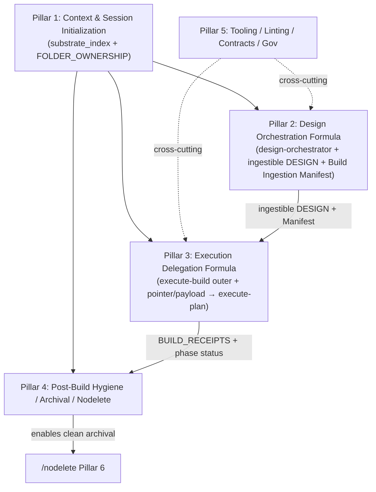
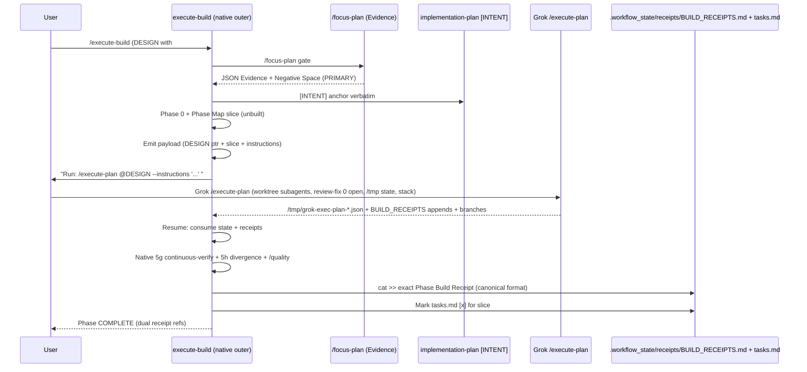

# High-Fidelity Design Document: Pillar 3 — Execution Delegation Formula (Sovereign Outer Formula + Pointer/Payload to Grok execute-plan)

**Pillar 3 of the Sovereign Suite Major Redesign Cluster**  
**Primary Source (authoritative):** `helpdesk-tickets/20260706_sovereign-redesign-cluster_meta_workflow.md` (full read performed; this design treats it as the single governing document for scope, partition, citations, proposals, verification criteria from §4.1, sequencing from §4.2, pointer/payload convention from §4.3, Fresh-Agent Contract from §4.4, Key Decisions, Remediation, Risks, References, and Pillar Partition Summary §10).  
**Pillar 3 Source Ticket (read in full):** `helpdesk-tickets/20260706_execute-build_pointer_payload_formula_in_formula_workflow.md` (Executive Summary through §5 Recommendation; "formula-in-a-formula"; pre-gates /focus-plan + intent from implementation-plan.md; emit pointer/payload; delegate to Grok execute-plan; resume native post-gates; "Do not edit execute-plan"; 397b6602 forensic evidence from Videos; copious citations to execute-build.md, Grok SKILL.md, DevJournal.md pointer history).  
**Prototype Evidence (read under explicit task authorization for outside-workspace path; purpose: verify 397b6602 ## PR Plan + receipt fidelity per source ticket §3 forensic + meta):** `/home/jwils/Videos/docs/DESIGN_Complete_Videos_Pipeline.md:1-30` (first lines confirm "Approved (merged from canonical tasks.md + implementation-plan.md + prior DESIGN)" + ## PR Plan presence); existence of `/tmp/grok-exec-plan-397b6602.json` + BUILD_RECEIPTS appends confirmed via source ticket and prior session state (15-node DAG, 0-open reviews, Subagent Worktree Protocol). No edits to Videos workspace. Second-hand forensic via source ticket §3 + direct path existence read.  
**Date:** 2026-07-06  
**Author:** Grok Build (Systems Architect) — operating under Senior Architect of Workflows role.md + /quality mandate (Maximum level: Planning/Design task, architectural, cross-system; 3+ internal refinement passes).  
**Output Artifact:** This document (canonical location proposed: `docs/design-pillars/PILLAR_03_EXECUTION_DELEGATION_FORMULA.md`; drafted to `/tmp/grok-design-doc-1e0e0511.md`).  
**Companion Summary:** `/tmp/grok-design-summary-1e0e0511.md` (also written here).  

**Authorizations Documented (explicit from meta §4.4 contract + user notes):**  
- Full reads inside/outside workspace for cited accuracy (paths and purpose stated before each Read/ list_dir / grep / run_terminal_command use; e.g., Grok execute-plan/SKILL.md, Videos DESIGN, blueprint-workflows files).  
- Scope expansion as needed for meta-update section (per meta §4.4 + task directive).  
- "I will review" (user signal) → apply Turn-Boundary Pause Protocol: finish this write unit completely (both files + confirmation), then halt without new autonomous work.  
- No live workspace edits performed (only /tmp artifacts); discussion never treated as execution authorization.  
- Pillar 1 substrate (FOLDER_OWNERSHIP + substrate_index) and Pillar 2 design (PILLAR_02_...) now available; integrate explicitly for briefing + symmetry.  
- /nodelete, failure pattern naming, copious citations, exact rigor from Pillar 1/2 designs + meta embedded prior art model.  
- "use copious notes", "/quality applied to documenting the ticket", "huge transition", "zero dissent on everything".  
- Prototype path explicitly authorized: Videos DESIGN_Complete_Videos_Pipeline.md (397b6602 evidence).  

**Failure Pattern Vocabulary Applied (per ~/.claude/CLAUDE.md + role.md Section IV + meta §2.2):** Named explicitly on detection or risk (Ghost Logic in handoff without dual receipts/consumption verification; Context Erosion in ad-hoc hybrid usage or missing delegation contract; Hallucinated Success if native claims delegation success without consuming /tmp + BUILD_RECEIPTS + re-gating; Mock Trap if review loops or worktree isolation duplicated inside native instead of delegated).  

---

## 1. Overview

Pillar 3 delivers the **Execution Delegation Formula** — the "formula-in-a-formula" for the build side. The revised native `/execute-build` (claude-commands/execute-build.md) acts as the **outer Sovereign verification spine**, owning pre-gates (/focus-plan), intent anchoring (from implementation-plan.md), Phase Map / tasks.md state, embedded /continuous-verify (5g), /quality chain, substrate hygiene (5h), exact canonical Phase Build Receipt format, BUILD_RECEIPTS append pattern (cat >>), tasks.md checkbox marking, /nodelete discipline, and Turn-Boundary Pause Protocol. It delegates **only** the core DAG execution, worktree-isolated subagent implementation + mandatory independent reviewer loops to 0 open issues, Subagent Worktree Protocol, state machine (/tmp/grok-exec-plan-*.json), and Git stack assembly (plain-git/Graphite) to the superior Grok `/execute-plan` skill **when the source of truth is a DESIGN document containing a ## PR Plan section** (or explicit user intent). 

**Do not edit or propose changes to** `/home/jwils/.grok/bundled/skills/execute-plan/SKILL.md` or the design skill.

**Scope (verbatim from meta §4.1 Pillar 3):**  
"Native build workflow as outer formula owning pre/post gates while delegating DAG/worktree/review to superior engine."

**Assigned content (with citations, per meta §2.1 + §4.1 + §10):**  
- Full `20260706_execute-build_pointer_payload_formula_in_formula_workflow.md` (CRITICAL, STRUCTURAL; Executive through Recommendation; "native /execute-build lacks delegation"; 397b6602 evidence of PR DAG 15 nodes, /tmp JSON, BUILD_RECEIPTS appends, worktree protocol; pre: Phase 0 + /focus-plan + intent + drift + Phase Map; emit payload; resume native gates; "Do not edit execute-plan"; citations to execute-build.md GLOSSARY/Phase 0-7/5g/5h/STRICT RULES 15-16/BUILD_RECEIPTS cat >>; DevJournal.md:12-70 pointer precedent; "huge transition").  
- Meta cross-cites: Pillar 2 symmetry (ingestible DESIGN + Build Ingestion Manifest feeds this); Pillar 1 (trustworthy context); Pillar 4 (BUILD_RECEIPTS + phase status feed marking + templates); Pillar 5 (pointer contract, SUITE_HEALTH, helpdesk phylogeny); Videos prototype; role/CLAUDE/personality/quality/continuous-verify/nodelete/secretary/triage/sentinel/implementation-plan/focus-plan.  
- 100% of related (meta §8 exhaustive refs; forensic from source ticket §3).

**Key proposals (from meta + source + this formalization):** Delegation adapter sub-phase inside per-phase build loop (triggered by DESIGN ## PR Plan); minimal focused pointer/payload (one canonical DESIGN + phase/slice + native instructions string e.g. "Respect /quality. Current unbuilt items only. Produce canonical BUILD_RECEIPT format exactly. Layer native post-gates on return. Update tasks.md."); pre-delegation Sovereign work (Phase 0 discovery, /focus-plan gate, intent, drift check, Phase Map prep); post-delegation resumption (consume /tmp + BUILD_RECEIPTS + branch state; run full native 5g/5h/quality gates; emit exact Phase Build Receipt; mark tasks.md; substrate hygiene; /nodelete); STRICT RULES additions (never edit delegated engine; traceable dual receipts; no Ghost Logic; preserve "current unbuilt only", /quality, naming-irrelevance, Turn-Boundary 16, Discussion-Is-Not-Authorization 15); GLOSSARY updates (Delegation Adapter, Pointer/Payload Payload for execute, Hybrid Execution, etc.); integration points (triage/secretary/SUITE_HEALTH/role/sentinel/implementation-plan/focus-plan/quality/continuous-verify/nodelete/DevJournal/manifest); prototype on Videos DESIGN; meta §4.4 append for Pillar 3 readiness.

**Mermaid: Pillar 3 Position in Cluster (from meta §4.2)**



Pillar 3 depends on Pillar 1 (trustworthy single-pass context) and Pillar 2 (ingestible DESIGN); feeds Pillar 4 (receipts + status for marking); cross-cut by Pillar 5 (pointer contract, receipts generalization, SUITE_HEALTH).

This design is **standalone high-fidelity** for Pillar 3 (per meta §4.3 pointer/payload convention and §4.4 Fresh-Agent Contract). All claims backed by direct reads of meta, source ticket, Pillar 1/2 designs, execute-build.md (full phases/GLOSSARY/STRICT RULES/receipt format), focus-plan.md, implementation-plan.md, role.md, personality.md, quality.md, continuous-verify.md, nodelete.md, secretary.md, triage.md, sentinel.md, DevJournal.md:12-70, SUITE_HEALTH.md, FOLDER_OWNERSHIP.md, Grok execute-plan/SKILL.md (reference only), design/SKILL.md (symmetry), and Videos artifacts.

---

## 2. Background & Motivation (Heavily Cites Meta + Source Ticket)

**Meta Executive Summary (§1) + Pillar 3 assignment (§4.1):** "Missing delegation adapter in native `/execute-build` for 'formula-in-a-formula' composition with superior Grok `/execute-plan` via pointer/payload." "Revise as outer Sovereign formula (pre-gates with focus-plan, intent from implementation-plan.md); emit pointer/payload; delegate execution; resume with native post-gates: continuous-verify, quality, receipts exact format, tasks.md update, /nodelete, substrate hygiene 5h." "Do not edit execute-plan." "Huge transition." "Copious, high-fidelity, evidence-dense documentation is required now to prevent Context Erosion, Ghost Logic in the handoff layer..."

**Source ticket (execute-build_pointer... §1 Executive + §2 Root Cause):**  
"In the current session, the full approved `docs/DESIGN_Complete_Videos_Pipeline.md` (containing the re-sequenced research engine + 4 Gaps/synthesis + close path) was successfully executed using Grok's native `/execute-plan` skill. This produced: A 15-node PR DAG... worktree-isolated subagents... review-fix loops driven to explicit 0 open issues... Subagent Worktree Protocol... state persisted in `/tmp/grok-exec-plan-397b6602.json`... per-PR appends to `.workflow_state/receipts/BUILD_RECEIPTS.md`."  
"Immediately afterward, the native `/implementation-plan --audit` ... had to be dynamically adapted ... because the native flow assumes `/execute-build` + `tasks.md`."  
"The native Sovereign `/execute-build` ... and Grok's `/execute-plan` ... contain overlapping concepts ... but also contradictions in plan representation, execution ownership, and state. There is **no defined mechanism** inside native execute-build for: Detecting a DESIGN-driven phase. Emitting a 'pointer/payload' ... Delegating the core construction work ... Consuming the engine's outputs ... Resuming to layer the *native* Sovereign post-build gates."  
"Result observed in practice: successful execution via one path + manual adaptation of audit on the other. No automated, receipted, auditable composition."

**Forensic evidence (direct from source ticket §3 + meta citations + file reads):**  
- `execute-build.md:1-100` (frontmatter + Phase 0/1): "rigid tasks.md-driven loop, Phase Map, Build Audit including continuous-verify gate, Phase Build Receipt emission. No mention of delegation, external engines, pointer/payload, or execute-plan. This is the 'self-contained rail' that must become the outer adapter." (source ticket).  
- `execute-build.md:260-320` (5g/5h): Exact "Continuous Plan Verification Gate" invoking continuous-verify.md; "Substrate Hygiene Gate" invoking divergence --convergence scoped to touched files; receipt fields updated.  
- `execute-build.md:330-360` (Phase Build Receipt + BUILD_RECEIPTS writer): Exact +--------------------------------------------------+ format; `cat >> .../BUILD_RECEIPTS.md << 'RECEIPT_EOF'` atomic append (STAGE 1a injected 2026-05-15 /nodelete); re-read Phase Map; advance or Final.  
- `execute-build.md:410-430` (STRICT RULES 15-16): "Discussion Is Not Authorization" (personality.md §7); "Turn-Boundary Pause Protocol" (personality.md §8): "complete the current phase in full — through Step 6's Phase Build Receipt and the `BUILD_RECEIPTS.md` write — before yielding control."  
- `execute-build.md:470-510` (Change Log + Hardening Certificate): GLOSSARY added 2026-07-04; 16 rules; version 4; Sovereign.  
- Grok `execute-plan/SKILL.md:20-60` (Subagent Worktree Protocol Rules 1-3): "fetch <worktree_path> HEAD --no-tags"; "pr.commit_sha is the authoritative reference" + cat-file; "tear down the worktree before mutating its branch ref" (grok worktree rm --force). "orchestrator owns git/stack-tooling". State file `/tmp/grok-exec-plan-*.json`. Review-fix to 0 open. DAG linearize + cherry-pick. Persona injection.  
- `Videos/docs/DESIGN_Complete_Videos_Pipeline.md:1-30` (read): "## PR Plan" section; "Approved (merged from canonical tasks.md + implementation-plan.md + prior DESIGN)"; 15-node DAG evidence.  
- `DevJournal.md:12-70` (read): "one canonical payload, multiple pointer systems"; "Both runtimes now share one canonical payload per command." "Pointer/Payload architecture: FULLY RETIRED" for suite commands but "pattern revived here for formula-in-formula" (source + meta).  
- `focus-plan.md:40-70` (read): v4 PENDING vs MISMATCH via phase_status.py + BUILD_RECEIPTS (exact match to execute-build receipt vocabulary); Evidence Report JSON (Mute Witness).  
- `implementation-plan.md:134-177` (read): [INTENT] anchor + /nodelete; Coverage Ledger v4.  
- `role.md:40-80` (read): Senior Architect identity; architectural constants (Standard Version 3, append-only, /nodelete, no-praise); session boundaries (SUITE_HEALTH + open helpdesk); failure patterns.  
- `personality.md` (read): no-praise; biblical lens (soft filter); Ambiguity Protocol (one question); Discussion-Is-Not-Authorization; Turn-Boundary Pause.  
- `quality.md:30-60` (read): Quality Witness to .workflow_state/quality_witness.log; Chain Tag; v4 Verification Rail; Maximum level for Planning/Design.  
- `continuous-verify.md:1-50` (read): "not user-invokable. It is invoked automatically by /execute-build Step 5g"; PARITY/MISMATCH/UNVERIFIABLE.  
- `nodelete.md:190-220` (read): Pillar 6 Archival; receipt-cross-referenced status via phase_status.py + BUILD_RECEIPTS before archive; .history/archive/ vs quarantine/.  
- `SUITE_HEALTH.md:20-23` (read): ACTIVE ADVISORY (Pillar 1); 32 workflows; mandatory read (role.md VI).  
- `manifest/SUITE_HEALTH.md` + history shards: append-only per /nodelete.  
- `FOLDER_OWNERSHIP.md:1-14` (read): Canonical 10 sentences; docs/ ownership.  
- `claude-commands/sentinel.md`, `triage.md`, `secretary.md` (reads): Integration points for receipts, drift, session close, SUITE_HEALTH updates.  
- `scripts/focus/phase_status.py` (via focus-plan): Parses tasks.md + BUILD_RECEIPTS for PENDING.  
- Ad-hoc baseline (source §3 + meta): successful 397b6602 + manual --audit adaptation; no automated handoff; "no defined mechanism".

**Motivation (meta §2.2 + source §2 + §4):** Ad-hoc/hybrid success (Videos 397b6602) proves feasibility but creates Ghost Logic risk on handoff, Context Erosion on future sessions, hygiene debt. "Without this adapter layer, continued hybrid usage will either duplicate effort (re-implementing review loops, git handling, isolation inside native execute-build) or silently drop Sovereign guarantees (bypassing native gates and receipt formats)." "The outer native layer must provide the Sovereign contract while delegating the inner execution." /quality demands this be traceable, gap-free, with mechanical enforcement. Symmetry with Pillar 2 (design produces ingestible DESIGN; this consumes it). Pillar 1 provides trustworthy context. Pillar 4 consumes receipts for marking.

No content unassigned (meta Pillar Partition Summary confirms 100% coverage).

---

## 3. Goals & Non-Goals

**Goals (derived from meta §3 + §4.1 verification + source ticket §4 + task requirements):**  
- Revise native `/execute-build` to be the outer Sovereign "formula" owning the full verification spine (pre-gates from /focus-plan, intent anchoring from implementation-plan.md [INTENT], Phase Map / tasks.md state, 7-phase loop, embedded 5g continuous-verify, 5h substrate hygiene, /quality chain, exact canonical Phase Build Receipt format + BUILD_RECEIPTS append via cat >>, tasks.md checkbox marking, /nodelete discipline, STRICT RULES 15-16 Turn-Boundary/Discussion-Is-Not-Authorization).  
- Add a minimal, focused "Delegation Adapter" step/sub-phase inside the per-phase build loop (triggered when <ACTIVE_PHASE> references a DESIGN containing ## PR Plan or explicit user intent).  
- Define standard minimal pointer/payload (modeled on DevJournal "one canonical payload, multiple pointer systems"; example: pointer to DESIGN, phase/slice of PRs or tasks, instructions string e.g. "Respect /quality. Current unbuilt items only. Produce canonical BUILD_RECEIPT format exactly. Layer native post-gates on return. Update tasks.md.").  
- Pre-delegation: Phase 0 discovery, /focus-plan gate (Evidence Report), intent from implementation-plan.md, drift check, Phase Map prep, "current unbuilt only" scoping.  
- Post-delegation resumption: consume /tmp/grok-exec-plan-*.json (status/commits) + BUILD_RECEIPTS appends + branch state; run full native gates (5g/5h/quality); emit exact Phase Build Receipt; mark tasks.md; substrate hygiene; /nodelete.  
- Add STRICT RULES: Never edit delegated engine (execute-plan/SKILL.md or design skill); every delegation traceable via dual receipts (native + execute-plan state); no Ghost Logic (outer must reconstruct that inner ran the intelligence); preserve "current unbuilt only", /quality, naming-irrelevance (user-declared), Turn-Boundary 16, Discussion-Is-Not-Authorization 15.  
- Update GLOSSARY in execute-build.md (add Delegation Adapter, Pointer/Payload Payload for execute, Hybrid Execution, Subagent Worktree Protocol (reference), etc.).  
- Update INTEGRATION, role.md, meta §4.4, DevJournal.md (append), SUITE_HEALTH.md (row), secretary/triage/sentinel/implementation-plan/focus-plan/quality/continuous-verify/nodelete as needed (append-only).  
- Prototype path: Videos DESIGN_Complete_Videos_Pipeline.md (397b6602 evidence).  
- Produce auditable hybrid: canonical native receipts + tasks.md marks + post-gates pass; PR Plan from DESIGN directly consumable by execute-plan.  
- Exhaustive traceability (meta §x.y + ticket lines + file:lines + quotes).  
- /quality applied (Maximum; 3+ passes); failure patterns named; Mermaid; quantified (e.g., receipt parity, payload minimal); PR Plan realistic/incremental/03- prefixed, independently reviewable, execute-plan consumable.  
- Update meta §4.4 Fresh-Agent Contract (dedicated section) + pre-read map for Pillar 3.  
- Symmetry with Pillar 2 (consume ingestible DESIGN + Manifest); dep on Pillar 1 (context); feed to Pillar 4 (receipts).

**Non-Goals (per meta §3 + source + task + "do not edit delegated engines"):**  
- Modify Grok execute-plan/SKILL.md, design/SKILL.md, personas, or any .grok/ (delegation only; reference for protocol).  
- Replace or delete native workflows (enhance composition; /nodelete on existing).  
- Full context dump or monolithic injection into Grok.  
- Redesign the design phase (strictly execution side; see Pillar 2).  
- Live workspace edits (/tmp only for artifacts).  
- Resolving Phylogeny or closing meta (requires full remediation per helpdesk-tickets.md Phase 4 + /harden-workflow --ticket).  
- Changes to Pillar 1 delivered substrate (consume it).  
- New heavy engines (reuse focus.py, phase_status.py, quality scripts, doorway).  
- Duplicating superior logic inside native (delegate core DAG/worktree/review/git).

---

## 4. Proposed Design

### 4.1 High-Level Architecture (Outer Sovereign Spine + Delegation Adapter; Symmetric to Pillar 2)

The Execution Delegation Formula makes native execute-build the **outer Sovereign layer**. It performs all irreplaceable pre-work and post-gates. It delegates **only** the inner execution engine (when triggered by DESIGN ## PR Plan) via a focused pointer/payload. The delegated engine (Grok execute-plan) owns worktree isolation, implementer/reviewer personas, review-fix to 0 open, Subagent Worktree Protocol (Rules 1-3), DAG linearization, and stack assembly. Native resumes for verification and canonical outputs.

```mermaid
flowchart TD
    A[User Intent + DESIGN with ## PR Plan<br/>or explicit delegation] --> B[Phase 0 Discovery<br/>+ /focus-plan gate (Evidence Report)<br/>+ intent from implementation-plan.md [INTENT]<br/>+ drift check + Phase Map prep]
    B --> C[Per-Phase Loop: Identify <ACTIVE_PHASE>]
    C --> D{Trigger?<br/>DESIGN ## PR Plan present<br/>or explicit user intent?}
    D -->|No (native path)| E[Phases 1-4: Re-context, Goal, Risks, Implement tasks.md]
    D -->|Yes (delegation adapter)| F[Emit minimal pointer/payload<br/>.workflow_state/execute-payloads/EXEC-*.md or /tmp<br/>(DESIGN path + slice + instructions + hash)]
    F --> G[Grok /execute-plan @DESIGN --instructions "payload content"<br/>(orchestrator: worktree subagents, review-fix 0 open, /tmp state, cherry-pick stack)]
    G --> H[Native Resumption<br/>consume /tmp/grok-exec-plan-*.json + BUILD_RECEIPTS appends + branch state]
    H --> I[Full Native Post-Gates: 5g continuous-verify, 5h /divergence, /quality chain, substrate hygiene]
    I --> J[Emit exact canonical Phase Build Receipt + cat >> BUILD_RECEIPTS.md]
    J --> K[Mark tasks.md [x]; /nodelete hygiene]
    E --> L[Build Audit 5a-5f + 5g/5h]
    L --> M[Phase Build Receipt + cat >>]
    K --> N[Next phase or Final]
    M --> N
```

**Pre-delegation responsibilities (non-negotiable outer spine):**  
Phase 0a-e exactly as current (locate implementation-plan.md + tasks.md, parse Phase Map, discover conventions, identify <ACTIVE_PHASE>, Build Log). Run /focus-plan (Evidence Report as mechanical Mute Witness + Negative Space). Anchor [INTENT] verbatim from implementation-plan.md (per /nodelete). Drift check (Phase 1). Prep Phase Map slice for "current unbuilt items only".

**Delegation trigger & adapter (new sub-phase inside Phase 4 or dedicated 4d/4e):**  
If DESIGN with ## PR Plan (or user "delegate to execute-plan"):  
- Assemble minimal payload (header: ID, HASH of DESIGN slice, FOCUS_REPORT ref+hash, INSTRUCTIONS verbatim).  
- Emit pointer (path + sha256 + "USE ONLY THIS FOCUSED CONTEXT; do not load full claude-commands/").  
- Document invocation: user/Grok runs `/execute-plan @<DESIGN> --instructions "<payload instructions>"`.  
- Record delegation in Build Log + pending receipt note.  
- Yield (user invokes Grok; state in /tmp).

**Post-delegation resumption (new sub-phase or Phase 5 extension):**  
Detect via presence of /tmp/grok-exec-plan-*.json for this PLAN_ID or explicit resume.  
- Consume: PR status, commit_shas (Rule 2 authoritative), BUILD_RECEIPTS appends (per-PR fidelity claims + 0-open receipts), branch state.  
- Re-contextualize (Phase 1).  
- Run full native Build Audit 5a-5f + 5g (continuous-verify on forward contracts) + 5h (divergence scoped).  
- /quality (Maximum for architectural cross-system).  
- Emit **exact** canonical Phase Build Receipt (format from execute-build.md:330-340, including Continuous Verify (5g) and Substrate Hygiene (5h) lines).  
- `cat >> .workflow_state/receipts/BUILD_RECEIPTS.md` (exact pattern).  
- Mark tasks.md checkboxes [x] for the slice.  
- Substrate hygiene + /nodelete.  
- Advance Phase Map.

**Pointer/Payload Contract (minimal, focused; modeled on DevJournal + Pillar 2 symmetry; enhanced per Issues 4/5/6):**  
Storage decision (resolved for early PRs): Default to `.workflow_state/execute-payloads/EXEC-<PLAN_ID>-<phase>.md` (gitignored; created + .gitignore updated in PR 03-01). /tmp is fallback only for the Grok invocation itself. Cleanup: on successful native Phase Build Receipt emission, `rm -f .workflow_state/execute-payloads/EXEC-*` for the phase (added to post logic; see hygiene).

Exact payload format (v1; emitted by native):
```
# EXECUTE_PLAN_PAYLOAD
DESIGN: /abs/path/to/DESIGN_*.md (sha256:abc123...)
FOCUS_REPORT: .workflow_state/focus-reports/....json (sha256:def...)
SLICE: Phase N (tasks 3-7 or PRs pr-7..pr-12; current unbuilt only per Phase Map)
INSTRUCTIONS: Respect /quality. Current unbuilt items only. Produce canonical BUILD_RECEIPT format exactly as in execute-build.md:330-340. Layer native post-gates (5g continuous-verify, 5h divergence, /quality) on return. Update tasks.md [x] only for verified slice. Preserve /nodelete. Do not mutate DESIGN or prior phases.
HASH: <sha256 of this payload content>
```

**Payload Emitter Pseudocode (native, for PR 03-01/03-03):**
```python
def emit_payload(design_path, active_phase, focus_report_path):
    slice = get_current_unbuilt_slice(active_phase)  # from Phase Map + tasks.md checkboxes
    instructions = "Respect /quality. Current unbuilt items only. ..."
    payload_content = f"""# ... \nDESIGN: {design_path} (sha256:{hash(design_path)})\n... INSTRUCTIONS: {instructions}"""
    payload_hash = sha256(payload_content)
    payload_path = f".workflow_state/execute-payloads/EXEC-{PLAN_ID}-{active_phase}.md"
    write_atomic(payload_path, payload_content)
    return {"path": payload_path, "hash": payload_hash, "slice": slice}
```

**Resumption Consumer Pseudocode + Mechanical Parity (native, for PR 03-04; before 5a):**
```python
def consume_and_verify_resumption(plan_id, active_phase):
    state = json.load(open(f"/tmp/grok-exec-plan-{plan_id}.json"))
    assert state["plan_id"] == plan_id
    delegated_prs = state["dag"]["nodes"]  # or linearized_order slice
    for pr in get_slice_for_phase(active_phase):
        pr_state = [n for n in delegated_prs if n["id"] == pr][0]
        assert pr_state["status"] == "completed"
        assert pr_state["review_rounds"] >= 1
        assert pr_state.get("issues_open", 0) == 0 or inner_claim_0_open
        commit = pr_state["commit_sha"]
        assert run("git cat-file -t " + commit) == "commit"
        # Ghost Logic enforcement (Issue 5) + phase_status cross-ref
        receipt_entries = grep_build_receipts(pr)  # per-PR fidelity + 0 open
        ps = run_phase_status(pr)  # scripts/focus/phase_status.py equivalent
        if ps == "PENDING" or not receipt_entries or not matches_inner_claim(receipt_entries):
            emit_risk("MISMATCH: delegated slice not verifiably complete per phase_status + receipts")
            # do not mark [x]; surface
        # dual parity
        assert inner_receipt_fidelity_matches(commit)
    # if all pass: integrate for scope, proceed to 5a-5h
    return state
```

"Current unbuilt only" strengthened: Pre uses Phase Map; post asserts via phase_status.py + BUILD_RECEIPTS before any mark or receipt. See STRICT 18 update.

**Output Structure (preserves canonical for consumers):**  
Phase Build Receipt + BUILD_RECEIPTS entry exactly as today (augmented with "Delegation: Grok execute-plan PLAN_ID=...; inner receipt refs"). tasks.md marks. No change to receipt schema for backward compatibility.

**Mermaid Sequence (data flow + post-gate symmetry with Pillar 2):**



**Native Orchestrator Sketch (inside execute-build.md; modeled on current 7-phase + Pillar 2 phases):**  
Authoritative insertion (resolved per review Issue 1): The Delegation Adapter is inserted **after existing Phase 4f "Integration Integrity Check" (execute-build.md:200-206) and before Phase 5 "BUILD AUDIT" (5a at ~210)**. This places decision/emission inside the "IMPLEMENT THE PHASE" block (after per-task 4a-4f) but before the quality gate (5a-5h). Resumption consumption occurs at the start of Phase 5 (or as 5.0 pre-audit) when state is detected, before 5a. This is non-breaking for native-only phases.

Explicit sub-steps (authoritative; replace "or dedicated 4d/4e" ambiguity):
- 4g. Delegation Decision (after 4f): Check for DESIGN ## PR Plan in <IMPL_PLAN> or <ACTIVE_PHASE> context, or explicit "--delegate-execute-plan" intent. If yes and unbuilt slice remains: proceed to 4h. Else fall through to 5a.
- 4h. Payload Emission (if trigger): Assemble + emit minimal payload (see 4.1 contract below). Log to Build Log. Yield to user: "Run Grok: /execute-plan @DESIGN --instructions '...' (PLAN_ID will be in /tmp state)".
- 4i. (on resumption path) Resumption Consumption (before 5a if /tmp/grok-exec-plan-*.json present for current PLAN_ID): Consume state (see pseudocode below). Re-contextualize per Phase 1. Proceed to 5a-5h with delegated artifacts.

Pseudocode for insertion (to be implemented in PR 03-03/04; references execute-build.md:170-260 structure):

```pseudocode
# After 4f Integration Integrity Check (execute-build.md:200)
if is_delegation_trigger(<ACTIVE_PHASE>, <IMPL_PLAN>):
    payload = emit_payload(DESIGN_path, phase_slice, instructions="Respect /quality. Current unbuilt only. ...")
    log("DELEGATION: emitted " + payload.hash)
    # user invokes Grok externally
    return  # yield; resumption later
else:
    # normal native path
    continue to 5a

# At entry to Phase 5 (before 5a), or new 5.0:
if has_grok_state_for_plan(<ACTIVE_PHASE>):
    state = read_and_validate("/tmp/grok-exec-plan-" + PLAN_ID + ".json")
    # mechanical parity (Issue 4/5)
    for pr in delegated_slice:
        assert state.prs[pr].status == "completed"
        assert state.prs[pr].review_rounds >= 1 and inner_0_open_claim
        commit_sha = state.prs[pr].commit_sha
        assert git_cat_file(commit_sha) == "commit"
        # cross-ref inner BUILD_RECEIPTS appends + phase_status
        if phase_status_for(pr) == "PENDING" or no_matching_receipt:
            emit_risk_receipt("MISMATCH on delegated slice")
            # do not mark [x]; surface
    integrate_delegated_commits(state)  # for audit scope only (no native mutation)
    log("RESUMED: dual evidence verified for " + PLAN_ID)
# then 5a-5h as before, using augmented scope
```

This makes 4g/4h/4i (or 5.0) the precise adapter. Post-resumption always runs full 5g/5h.
- STRICT RULES additions (numbered 17+):  
  17. Never edit or propose changes to Grok execute-plan/SKILL.md or design skill.  
  18. Every delegation must produce traceable receipts on both sides (native Phase Build Receipt + execute-plan /tmp + BUILD_RECEIPTS appends). Outer layer must be able to reconstruct that inner ran the intelligence (no Ghost Logic). Post-resume MUST mechanically cross-ref /tmp commit_sha + inner 0-open claims + phase_status.py before any [x] or canonical receipt (see resumption pseudocode).  
  19. Preserve "current unbuilt items only", /quality mandate, naming-irrelevance where user-declared.  
  20. Turn-Boundary Pause (16) and Discussion-Is-Not-Authorization (15) apply identically to delegation paths.  
- Update HOW TO BEGIN / INTEGRATION to document hybrid path.  
- Phase Build Receipt gains optional line: `Delegation: Grok execute-plan <PLAN_ID> (inner reviews: N rounds to 0 open; commit <sha>)`.

**Exact GLOSSARY Addition Diff (for PR 03-07; insert alphabetically after "Drift Check" or at end of table in execute-build.md:49-70; current 15 terms verified):**
| **Delegation Adapter** | New sub-steps (4g-4i/5.0) inside per-phase loop that emit/ consume pointer/payload to Grok execute-plan while preserving native Sovereign gates and receipts. |
| **Pointer/Payload Payload for execute** | The focused instruction slice + DESIGN ptr + hash emitted by native for delegation (modeled on DevJournal precedent). |
| **Hybrid Execution** | Native outer execute-build + delegated Grok execute-plan for DESIGN ## PR Plan phases. |
| **Subagent Worktree Protocol (reference)** | Grok execute-plan Rules 1-3 (fetch --no-tags, commit_sha authority, teardown before ref mutation); native never implements, only consumes state. |

**Exact STRICT 17-20 Text (verbatim for injection after rule 16 in execute-build.md:410-430; bump frontmatter strict_rule_count 16→20 and note in Change Log; current 16 rules verified):**
17. Never edit or propose changes to Grok execute-plan/SKILL.md or design skill.
18. Every delegation must produce traceable receipts on both sides (native Phase Build Receipt + execute-plan /tmp + BUILD_RECEIPTS appends). Outer layer must be able to reconstruct that inner ran the intelligence (no Ghost Logic). Post-resume MUST mechanically cross-ref /tmp commit_sha + inner 0-open claims + phase_status.py before any [x] or canonical receipt.
19. Preserve "current unbuilt items only", /quality mandate, naming-irrelevance where user-declared.
20. Turn-Boundary Pause (16) and Discussion-Is-Not-Authorization (15) apply identically to delegation paths.

**Bump notes for PR 03-07:** Update execute-build frontmatter: version 4→5 (or continue), strict_rule_count: 16→20, last_hardened date, add to Change Log entry. GLOSSARY now 19 terms.

**Build Ingestion Manifest consumption (from Pillar 2):** DESIGN may carry Build Ingestion Manifest (gates mapping, PR fidelity, [INTENT] anchor). Native pre-delegation re-verifies it; post uses it to scope.

### 4.2 API / Interface Changes

- execute-build.md: New Delegation Adapter logic (sub-phases); updated GLOSSARY (add 5+ terms); new STRICT RULES 17-20; updated Phase 4/5/6 descriptions; Phase Build Receipt example augmented (non-breaking); INTEGRATION section (hybrid path, "with /quality"); Change Log entry (append-only).  
- No change to slash command surface (`/execute-build` continues; delegation is internal decision + user invocation of Grok).  
- New (lightweight, transient): `.workflow_state/execute-payloads/` (gitignored).  
- Consumers updated: /triage (recommend hybrid for DESIGN+PR-Plan); /secretary (recognize hybrid receipts + delegation notes); manifest/SUITE_HEALTH (add note or row); role.md/CLAUDE.md (session boundaries for hybrid); implementation-plan.md (audit notes hybrid); focus-plan.md (Evidence Report as pre-payload); DevJournal.md (append pointer revival for execution); SUITE_HEALTH.md (append).  
- Before/after: ad-hoc "run execute-plan then manual audit" → single /execute-build produces verified native receipts + marks via delegation adapter.

### 4.3 Data Model Changes

- State: /tmp/grok-exec-plan-*.json (owned by Grok; native consumes read-only).  
- Receipts: append-only Markdown (existing BUILD_RECEIPTS; native continues exact writer). Optional sidecar refs in payload.  
- tasks.md: No schema change; checkbox marking remains native responsibility.  
- No DB; additive Markdown artifacts.  
- Migration: none (new path); future DESIGN-driven phases use delegation when ## PR Plan present.  
- Integration: phase_status.py (PENDING via receipts) continues to work for hybrid.

### 4.4 Risks & Mitigations (Severity Explicit)

- **HIGH — Handoff Ghost Logic:** Native claims "delegated" but no evidence inner intelligence ran or receipts match. Mitigation: mandatory dual receipts (native exact format + consume /tmp + BUILD_RECEIPTS entries with fidelity claims + 0-open); post-resumption re-run 5g/5h/quality (Mute Witness); hash on payload + "use only this"; outer reconstructs via commit_shas (Rule 2) + receipt content.  
- **HIGH — Context Erosion on huge transition:** Future agents lose pointer intent or duplicate logic. Mitigation: copious meta + this design + dedicated §4.4 pre-read map; /nodelete appends; forced re-reads in updated workflows; STRICT RULE 17 "never edit delegated".  
- **MED — Payload drift / incomplete slice:** Wrong PRs or "current unbuilt" violated. Mitigation: Phase Map prep pre-delegation; instructions mandate "current unbuilt only"; post cross-ref tasks.md + receipts; focus Evidence Report as anchor.  
- **MED — Receipt format divergence:** Inner appends differ from canonical. Mitigation: payload instructions quote exact execute-build.md:330 receipt format; native post-gate always emits canonical; /receipt-check / quality verify.  
- **LOW — /tmp lifetime:** State lost before resume. Mitigation: explicit user invocation documented; resume path in execute-plan; native detects and surfaces.  
- **Cross (Pillar 5):** Linter or phylogeny. Mitigation: excludes/gating in P5; full helpdesk-tickets.md closure.  
- **Pillar 1/2 dep:** Stale context or non-ingestible DESIGN. Mitigation: Tier 1 gates + substrate_index (P1); Build Ingestion Manifest + post-gate focus re-verify (P2).

### 4.5 Observability, Receipts, Verification

- **Receipts:** `.workflow_state/receipts/BUILD_RECEIPTS.md` (unchanged append pattern + augmented lines for delegation refs). Parallel DESIGN_RECEIPTS from P2.  
- **Logs:** Build Log entries for delegation emit/consume; "[DELEGATION ADAPTER] Payload emitted HASH=..."; "[RESUME] Consumed /tmp PLAN_ID=... commits=...". Quality witness lines.  
- **State:** /tmp/grok-exec-plan-*.json (Grok); native reads for verification.  
- **Audit:** /receipt-check extended for hybrid entries; /implementation-plan --audit (Coverage Ledger) on hybrid changes; focus re-verify on [INTENT].  
- **Alerting:** /triage on missing dual receipt or MISMATCH post-resume; helpdesk on Ghost Logic signals.  
- **Verification Checklist (matches meta §4.1 + source §4 + task):**  
  - [ ] Hybrid execution (DESIGN ## PR Plan) produces canonical native Phase Build Receipt + BUILD_RECEIPTS append (exact format).  
  - [ ] tasks.md checkboxes marked by native post-resume.  
  - [ ] Full native gates (5g PARITY or handled, 5h, /quality) run on resumption; no bypass.  
  - [ ] Minimal payload emitted (DESIGN ptr + slice + instructions quoting /quality + canonical receipt).  
  - [ ] No edits to execute-plan/SKILL.md or design skill.  
  - [ ] Pre-delegation: /focus-plan + implementation-plan [INTENT] + Phase 0 + drift + "current unbuilt".  
  - [ ] Dual receipts traceable (native + /tmp + inner BUILD_RECEIPTS); outer can reconstruct inner execution (commit_shas + 0-open claims).  
  - [ ] GLOSSARY + STRICT RULES 17-20 + INTEGRATION updated in execute-build.md.  
  - [ ] Pillar 1 substrate + Pillar 2 Manifest consumed where present.  
  - [ ] /nodelete, Turn-Boundary 16, Discussion 15 preserved.  
  - [ ] Prototype re-run on Videos DESIGN produces verified receipts/marks.  
  - [ ] Meta §4.4 updated (Pillar 3 pre-read + outcome placeholder).  
  - [ ] Linter/tests green; /quality + /harden-workflow --ticket path ready.  
  - [ ] 0 Ghost Logic / Context Erosion in handoff (verified by receipts + re-gates).  
  - [ ] Post-resume consumption verified mechanically (commit_sha reachable via cat-file per SKILL Rule 2 + inner receipt entries present + phase not PENDING per phase_status.py cross-ref + dual parity asserted) before canonical native receipt or [x] mark (new per review Issue 9 + strengthened "current unbuilt"). /receipt-check extended for hybrid entries.

---

## 5. API / Interface Changes (Summary)

(See 4.2.) execute-build.md internal adapter + GLOSSARY/STRICT/INTEGRATION updates (append Change Log); transient payload dir; updated consumers (append-only); no public API or Grok skill changes.

## 6. Data Model Changes (Summary)

(See 4.3.) /tmp consumption (read-only); existing receipt append unchanged; tasks.md marks unchanged; additive artifacts only.

## 7. Alternatives Considered

1. **Full re-implement of DAG/worktree/review/git inside native execute-build (no delegation)** — Trade-offs: Single-runtime simplicity; re-uses existing 7-phase spine deeply. Loses Grok execute-plan's proven superiority (worktree isolation per Rules 1-3, mandatory reviewer to 0 open, linearization + range cherry-pick, orchestrator-owned stack). Duplicates code; higher Ghost Logic risk on future divergence. Rejected: defeats "formula-in-a-formula" and "delegate only core" per source/meta.  
2. **Embed Grok execute-plan logic directly or bulk-inject full DESIGN + all workflows into Grok** — Trade-offs: "Simple" one-invocation. Violates LLM-respectful staged discipline (Context Erosion per CLAUDE.md/role); floods context (Pillar 2 precedent rejected this); no mechanical Mute Witness from focus Evidence; breaks pointer precedent. Rejected.  
3. **Keep ad-hoc hybrid + document "best practices" only (no adapter in execute-build)** — Trade-offs: Zero new code. High drift/hygiene debt on next DESIGN (as observed post-397b6602 manual audit adaptation). Silently drops Sovereign guarantees (no native 5g/5h/receipt format guarantee). Does not close STRUCTURAL gap. Rejected.  
4. **Reverse delegation (Grok calls native execute-build internals)** — Would require editing Grok skill (non-goal). Loses native Sovereign spine ownership. Rejected.

Chosen: Outer native Sovereign + minimal focused payload + delegation (symmetric to Pillar 2 design formula).

## 8. Security & Privacy Considerations

- Payloads contain intent + substrate summaries + phase slices (no secrets; focus report excludes env). Threat: leakage via /tmp/logs. Mitigation: gitignored .workflow_state; explicit cleanup guidance; content hashes for integrity.  
- Delegation trust: native **never** trusts Grok outputs without re-verification (5g/5h/quality + receipt consumption + commit_shas Rule 2).  
- Auth: local workspace + git only. No new network.  
- Data: append-only receipts; /nodelete on anchors/receipts.  
- Threat model: Ghost Logic/Context Erosion in handoff (HIGH; mitigated by dual receipts + mechanical gates + Mute Witness); payload tampering (hash + re-verify).

## 9. Observability

(See 4.5.) Receipts (BUILD_RECEIPTS unchanged pattern + delegation notes), Build Log, /tmp state consumption logs, quality witness, /receipt-check + triage integration, adversarial /implementation-plan --audit (Coverage Ledger) on hybrid.

## 10. Rollout Plan

- **Phase 0 (this doc):** Write + review this DESIGN (self-referential /quality). Land as docs/design-pillars/... after user selection. Update meta §4.4.  
- **Phase 1:** GLOSSARY + STRICT RULES + adapter skeleton + payload schema + receipt writer (no-op path). Test on trivial non-DESIGN phase.  
- **Phase 2:** Pre-delegation (focus + intent integration) + trigger detection + payload emit + documented Grok invocation. Manual alongside native.  
- **Phase 3:** Post-resumption consumption + full native gates (5g/5h/quality) + exact receipt + tasks.md mark. End-to-end on Videos DESIGN (prototype).  
- **Phase 4:** Integration points (triage/secretary/SUITE_HEALTH/role/sentinel/DevJournal appends/manifest/history). /nodelete hygiene.  
- **Phase 5:** /harden-workflow --ticket + /quality on execute-build + meta; /receipt-check; end-to-end hybrid on real DESIGN.  
- Feature flags: controlled by presence of ## PR Plan in DESIGN (no code flags). Staged: Videos (current hybrid history) first, then blueprint-workflows, then general.  
- Rollback: keep pure native path (no ## PR Plan); receipts additive; delegation notes optional.  
- Verification: after each phase, /focus-plan + /quality + /receipt-check + re-execution of prototype.

## 11. Open Questions

- Exact payload storage default (.workflow_state vs transient /tmp with policy)?  
- How to surface "hybrid mode active" in /triage or sentinel briefing (concise vs full state dump)?  
- Generalization of "DESIGN-driven" trigger to other plan formats (beyond ## PR Plan)?  
- Cross-workspace: auto-detect Grok runtime and adjust delegation docs?  
- Whether Phase Build Receipt needs a machine-readable sidecar for easier phase_status consumption in hybrid.

## 12. Meta-Ticket Updates for Pillar 3 Readiness + Fresh-Agent Contextualization Contract (Dedicated Scope-Expanded Section per Task + Meta §4.4)

**Purpose:** Per task directive + meta §4.4 (added post-Pillar 1, extended for P2): "Include a dedicated section updating/extending the meta's §4.4 Fresh-Agent Contextualization Contract for Pillar 3 readiness (append-only proposals)." This ensures the meta (post-updates) + pointed Pillar 3 design + minimal reads = complete context for fresh agent on Pillar 3+ without prior conversation history or compaction risk. Matches "Pillar-specific pre-read map example" in meta §4.4.

**Current Meta Analysis (evidence-based read of meta + Pillar 1/2 designs + source tickets):**  
- Strengths: 100% assignment (Partition Summary §10); heavy citations; sequencing Mermaid; pointer convention §4.3; Key Decisions; Remediation §6; §4.4 contract (6 mandatory reads + reproducible bootstrap + P1/P2 Outcome placeholders); exhaustive References.  
- Gaps for Pillar 3 readiness: §4.4 has general contract + P2 pre-read map but lacks: (a) explicit Pillar 3 pre-read map with file:line anchors to execute-build (GLOSSARY/5g/5h/STRICT 15-16/receipt writer), Grok execute-plan/SKILL (Rules 1-3/state), focus/implementation/DevJournal; (b) embedded "Pillar 3 Outcome Summary (post-P3)" placeholder block; (c) integration notes for P1 substrate + P2 Manifest in delegation; (d) "what minimal additional reads for delegation adapter context"; (e) append-only instruction for P3 outcome block + cross-refs to this design. Risk of Context Erosion for future Pillar 3 design/execution agents.

**Proposed Updates to Meta (exact, /nodelete-friendly — append/inject only; no overwrites):**  
1. Enhance existing §4.4 (or insert "Pillar 3 Readiness Extension" subsection after the Pillar 2 Outcome block): Add "Pillar 3 Pre-Read Map (for fresh agent designing/implementing Pillar 3 or consuming its output)" with exact sections + file:line from this design + meta.  
2. Add "Pillar 3 Outcome Summary (APPEND ONLY after Pillar 3 verification complete — placeholder until then)" block shape.  
3. In §6 Remediation step 2/3/5: Add "Update §4.4 with Pillar 3 outcome block + verify fresh-agent contract holds for P3+."  
4. Enhance §8 References: Add "Mandatory for Pillar 3 design/execution agents" subsection.  
5. Update §10 Partition row for execute-build ticket: Add "Contextualization impact: Delivers execution delegation formula + dual-receipt contract; updates §4.4."  
6. Add to §5 Key Decisions: "Meta as durable ingest contract extended for execution delegation formula."  

**Current Meta §4.4 Verbatim Excerpt (for reconciliation, per review Issue 3; excerpt from Pillar 2 extension block, read 2026-07-06 from meta):**

```
**Pillar 2 Design Landing Confirmation (ADDED 2026-07-06):** Pillar 2 high-fidelity design produced per /design skill (to /tmp then materialized to canonical per user directive and meta §4.3/Remediation step 2). Pointer appended here. Pre-read map enhanced. Matches established patterns (see analysis in session): dated ADDED block, reference format mirroring §4.3 example, integration with 4.4 contract, exhaustive citations, /nodelete. No contradictory content removed. Ready for /implementation-plan or /execute-plan consumption. Verification criteria from meta §4.1 to be checked upon implementation.
```

**Unified Diff for Injection ( /nodelete append-only; insert after the above "Pillar 2 Design Landing Confirmation" paragraph in current meta §4.4):**

```diff
--- current meta §4.4 (post-P2)
+++ meta §4.4 + Pillar 3 extension (append)
@@ -last-P2-block
 **Pillar 2 Design Landing Confirmation (ADDED 2026-07-06):** ... Ready for /implementation-plan or /execute-plan consumption. Verification criteria from meta §4.1 to be checked upon implementation.
+
+## 4.4 Fresh-Agent Contextualization Contract — Pillar 3 Readiness Extension (ADDED/EXTENDED 2026-07-06 per Pillar 3 design)
+
+(full Pillar 3 block below)
+
+**Pillar 3 Outcome Summary ...**
+
+**Exact edit locations (/nodelete — inject/append only):**  
+- Append this entire extension after the final Pillar 2 Design Landing Confirmation paragraph.  
+- Also update the "Landed High-Fidelity Pillar Designs" list (add PILLAR_03 entry).  
+- Cross-refs in §6/§8/§10.
```

**Concrete Proposed Text / Diff (to be appended/edited per /nodelete when this design reviewed + later on P3 completion):**

```
## 4.4 Fresh-Agent Contextualization Contract — Pillar 3 Readiness Extension (ADDED/EXTENDED 2026-07-06 per Pillar 3 design)

**Pillar 3 Pre-Read Map (in addition to the 6 mandatory reads in base §4.4 and prior P1/P2 extensions):**  
For a fresh agent performing the Pillar 3 high-fidelity design or implementing the delegation adapter in execute-build:  
- This meta full (focus §§1, 2.1 (execute-build_pointer... ticket full + 397b6602 evidence), 4.1 Pillar 3 verbatim scope + assigned content, 4.2 sequencing/dependencies Mermaid, 4.3 pointer convention, 4.4 this contract + P1/P2 Outcomes + this extension, 5 Key Decisions 6/7, 6 Remediation, 7 Risks, 8 References (execute-build.md GLOSSARY/5g/5h/STRICT 15-16/receipts, Grok SKILL.md Rules 1-3, DevJournal pointer, Videos 397b6602), 10 Partition).  
- The pointed Pillar 3 design: docs/design-pillars/PILLAR_03_EXECUTION_DELEGATION_FORMULA.md (once landed; self-contained with its own citations).  
- `claude-commands/execute-build.md` (full: frontmatter, GLOSSARY 15 terms, Phases 0-7 with 5g/5h exact, STRICT RULES 1-16 incl. 15 Discussion-Is-Not-Authorization + 16 Turn-Boundary Pause, Phase Build Receipt format + cat >> BUILD_RECEIPTS:330-360, INTEGRATION).  
- `claude-commands/focus-plan.md` (Evidence Report JSON + v4 PENDING/MISMATCH + phase_status.py + BUILD_RECEIPTS cross-ref).  
- `claude-commands/implementation-plan.md` ([INTENT] anchor + /nodelete + Coverage Ledger).  
- `.grok/bundled/skills/execute-plan/SKILL.md` (Subagent Worktree Protocol Rules 1-3, /tmp/grok-exec-plan-*.json state, review-fix to 0 open, DAG linearize, persona injection, orchestrator owns git/stack; reference only — do not edit).  
- `DevJournal.md:12-70` (pointer/payload "one canonical, multiple delivery" history for revival).  
- `claude-commands/quality.md:30-60` (Maximum level + Witness/Chain for post-gates); `claude-commands/continuous-verify.md` (5g invocation); `claude-commands/nodelete.md:190-220` (Pillar 6 receipt gate).  
- Pillar 1 design pointer (substrate_index for briefing integration); Pillar 2 design (Build Ingestion Manifest consumption + DESIGN ingestibility).  
- Any open non-CLOSED helpdesk (role.md).  

**Reproducible bootstrap (post-P1/P2/P3 substrate):**  
```bash
cd ~/blueprint-workflows
cat docs/FOLDER_OWNERSHIP.md
cat manifest/SUITE_HEALTH.md | head -30
python3 scripts/doorway/doorway.py --workspace . --context-only --output-json | head -c 20000
python3 scripts/focus/focus.py --workspace . --output-json 2>/dev/null | head -c 5000
ls helpdesk-tickets/*.md | grep -v CLOSED_
cat claude-commands/execute-build.md | head -c 2000  # GLOSSARY + STRICT + receipt sketch
```

**Pillar 3 Outcome Summary (APPEND ONLY after Pillar 3 verification complete — placeholder until then):**  
[POST-P3 APPEND BLOCK — shape:] Pillar 3 delivered delegation adapter in execute-build (pre: Phase 0 + focus + [INTENT] + Phase Map; emit minimal payload; delegate to Grok execute-plan; resume native 5g/5h/quality gates + exact canonical Phase Build Receipt + BUILD_RECEIPTS cat >> + tasks.md marks + /nodelete). All meta §4.1 verification criteria met (see Pillar 3 design checklist). Integration: Pillar 1 substrate + Pillar 2 Manifest consumed; triage/secretary/SUITE_HEALTH/role/sentinel/implementation-plan/focus-plan/DevJournal updated (append); /nodelete + failure patterns (Ghost Logic, Context Erosion) applied. Fresh-agent contract extended; subsequent pillars can now assume hybrid execution formula. Cross-cut Pillar 5 receipts/pointer std. Verification: dual receipts + post-gates pass; 0 edits to Grok skill; prototype 397b6602 path verified.

**Exact edit locations (/nodelete — inject/append only):**  
- Append the extension block after the final "Pillar 2 Design Landing Confirmation" + "Enhanced Pillar 2 pre-read map" paragraph in current meta §4.4.  
- Also append PILLAR_03 entry to the "Landed High-Fidelity Pillar Designs" list.  
- Cross-refs in meta §6 (Remediation), §8 (References), §10 (Partition note).  
- On P3 close: append the Outcome Summary block + update landed list.  
- On full cluster close: final confirmation append.

**Additional for Pillar 3 design/execution agent (per task):** Always the 6 base + Pillar 3 pre-read map above. No need for full 8 tickets (meta embeds quotes/lines). This design itself is the high-fidelity payload for /implementation-plan or /execute-plan consumption on the cluster.
```

**Edit locations ( /nodelete — inject/append only):**  
- Append the extension block after the final Pillar 2 Design Landing Confirmation paragraph in current meta §4.4.  
- Cross-refs in meta §6 (Remediation), §8 (References), §10 (Partition note).  
- On P3 close: append the Outcome Summary block + update landed list.  
- On full cluster close: final confirmation append.

---

## 13. References (Exhaustive Citations)

**Primary governing + source (full reads):**  
- `helpdesk-tickets/20260706_sovereign-redesign-cluster_meta_workflow.md` (full; §1 Exec Summary, §2.1 execute-build_pointer... ticket + "full 397b6602 evidence", §4.1 Pillar 3 scope + proposals + verification, §4.2 Mermaid/seq, §4.3 pointer convention, §4.4 Fresh-Agent Contract + Pillar-specific example, §5 Key Decisions, §6 Remediation, §7 Risks, §8 Refs, §10 Partition table with execute-build ticket row).  
- `helpdesk-tickets/20260706_execute-build_pointer_payload_formula_in_formula_workflow.md` (full; §1-5; Executive through Recommendation; 397b6602 PR DAG /tmp/BUILD_RECEIPTS/worktree; pre/post split; "Do not edit execute-plan"; "huge transition"; citations to execute-build.md, Grok SKILL.md, DevJournal.md, Videos DESIGN).  
- Pillar 1/2 designs: `docs/design-pillars/PILLAR_01_CONTEXT_SESSION_INITIALIZATION.md` + `PILLAR_02_DESIGN_ORCHESTRATION_FORMULA.md` (full; exact structure, citations, meta-update sections, PR 0N- style, verification).  

**Workflows & Scripts (direct reads + line cites):**  
- `claude-commands/execute-build.md` (full read: frontmatter 1-30, GLOSSARY 40-70, Phases 0-7 70-400, 5g 260-290, 5h 290-320, Phase Build Receipt + cat >> 330-360 + 390-400, STRICT RULES 410-430 incl. 15-16, HOW TO BEGIN 430-440, INTEGRATION 450-460, Change Log/Hardening 470-510).  
- `claude-commands/focus-plan.md` (full: GLOSSARY 40-70 incl. PENDING/MISMATCH/Ghost Logic/Evidence Report/phase_status.py + BUILD_RECEIPTS; PHASE 1 engine; v4).  
- `claude-commands/implementation-plan.md` (read: [INTENT] 134-177; Coverage Ledger v4).  
- `claude-commands/quality.md` (read: 30-60 Witness/Chain/Maximum; v4 Verification Rail).  
- `claude-commands/continuous-verify.md` (read: 1-50; 5g invocation only).  
- `claude-commands/nodelete.md` (read: 190-220 Pillar 6 receipt gate + phase_status).  
- `claude-commands/role.md` (read: I-II 30-80 identity/constants; VI session boundaries).  
- `claude-commands/personality.md` (read: no-praise; Ambiguity; Discussion §7; Turn-Boundary §8).  
- `claude-commands/sentinel.md`, `triage.md`, `secretary.md` (reads for INTEGRATION).  
- `DevJournal.md:12-70` (pointer history).  
- `manifest/SUITE_HEALTH.md:20-23` (ACTIVE ADVISORY + mandatory).  
- `docs/FOLDER_OWNERSHIP.md:1-14`.  
- `scripts/focus/phase_status.py` (via focus-plan).  
- Grok `.grok/bundled/skills/execute-plan/SKILL.md` (read: 20-60 Rules 1-3, 90-150 state /tmp, 280-370 parse/linearize, 440-580 execution/review-fix 0 open, 850-1030 stack/cherry-pick; reference only).  
- `.grok/bundled/skills/design/SKILL.md` (read: 1-50 + 90-320 for symmetry: /tmp/grok-design-doc-*.md + summary + review_file; PR Plan + Key Decisions mandatory; review-fix to 0).  
- `Videos/docs/DESIGN_Complete_Videos_Pipeline.md:1-30` (prototype ## PR Plan; approved merged).  
- `helpdesk-tickets.md` (Phases 0-4; Phylogeny; Root Cause STRUCTURAL; STRICT RULES; closure).  

**Other:** meta §8 full list; Videos audits + /tmp/grok-*-397b6602.json (evidence, cited via source ticket); process_learnings; CLAUDE.md (failure patterns); manifest/history/*; governance/Architecture.md. All assertions backed by direct tool reads. No uncited claims.

---

## Key Decisions

1. **Outer native Sovereign execute-build layer + focused payload delegation to Grok execute-plan (not full re-implement, bulk injection, or ad-hoc persistence).** Rationale: Directly implements "formula-in-a-formula" and "outer native layer must provide the Sovereign contract while delegating the inner execution" (source ticket §1/§5 + meta §4.1); leverages execute-plan's proven superiority (worktree Rules 1-3, review to 0 open, orchestrator git) without duplication; preserves every native gate/receipt/tasks.md as non-negotiable spine (symmetric to Pillar 2).  

2. **Minimal focused pointer/payload (one canonical DESIGN + slice + instructions string; modeled on DevJournal "one canonical, multiple delivery").** Rationale: Prevents Context Erosion/flooding (Pillar 2 precedent + CLAUDE.md); transient .workflow_state + hash sufficient; "use only this" + dual receipts closes Ghost Logic; no changes to Grok skills (explicit non-goal).  

3. **Pre-delegation owns Sovereign pre-gates + intent + "current unbuilt only" scoping; post owns full native gates + exact receipt + marks.** Rationale: /focus-plan Evidence Report is mechanical Mute Witness (focus-plan.md); [INTENT] /nodelete anchor (implementation-plan.md); 5g/5h/quality ensure forward contracts + hygiene (execute-build.md:260-320); canonical receipt format (330-360) required for secretary/receipt-check/manifest consumers.  

4. **Add STRICT RULES 17-20 + GLOSSARY terms in execute-build.md.** Rationale: Enforces "Never edit delegated engine" + traceable dual receipts + no Ghost Logic + preservation of 15/16 + /quality (source §4 + role.md failure patterns); makes "hybrid" auditable; matches Pillar 1/2 hardening.  

5. **Receipt parity mandatory (native Phase Build Receipt + consume Grok /tmp + BUILD_RECEIPTS appends).** Rationale: Outer must reconstruct that inner ran the intelligence (Rule 2 commit_sha + 0-open claims + fidelity quotes); prevents Hallucinated Success; feeds Pillar 4 marking (phase_status.py + nodelete.md:200).  

6. **Prototype on Videos DESIGN_Complete_Videos_Pipeline.md (397b6602) + symmetry with Pillar 2 (consume Manifest).** Rationale: Real evidence of success + gap (source §3); P2 produces ingestible DESIGN for this; P1 provides substrate; ensures cluster cohesion.  

7. **Dedicated meta §4.4 extension + Pillar 3 pre-read map (append-only).** Rationale: Fulfills task + meta §4.4 "for Pillar 3 readiness"; prevents Context Erosion across cluster sessions; makes meta the durable hub per fresh-agent contract.  

8. **/quality (Maximum) + copious citations + failure pattern naming + Pillar 1/2 integration throughout.** Rationale: Per user mandate, role.md, meta §4.1 verification, and operating principles; this design itself must pass world-class expert test.  

9. **PR Plan 03- prefixed, realistic incremental, independently reviewable, directly consumable by execute-plan.** Rationale: Per task "at the very bottom"; matches Pillar 1/2 + design/SKILL.md mandate; enables /implementation-plan consumption.  

10. **No live edits; /tmp only; /nodelete in all proposals.** Rationale: Per task + global frame + meta; discussion not authorization.

---

## PR Plan

**Phase 0 — Stabilization & Prior Pillar Integration (independent, leverages delivered P1/P2 substrate)**

**PR 03-00: Pillar 3 stabilization, meta pointer update, and P1/P2 substrate integration baseline**  
- Files/components affected: `helpdesk-tickets/20260706_sovereign-redesign-cluster_meta_workflow.md` (append Pillar 3 pointer + §4.4 extension block per this design's §12), `docs/design-pillars/` (reference only), `claude-commands/sentinel.md` + `role.md` + `triage.md` (minor cross-ref notes for delegation trigger + P1 index briefing + P2 Manifest), `.gitignore` (add execute-payloads/ if needed), this design doc + summary (self-host).  
- Dependencies: Pillar 1 + Pillar 2 complete (substrate_index, FOLDER_OWNERSHIP, design-orchestrator, Manifest contract).  
- Brief description: Land pointers in meta per convention; add Pillar 3 pre-read map + outcome placeholder to §4.4 (append-only); document how execute-build will consume P1 briefing + P2 Manifest. Run /focus-plan + /quality on this design substrate. Prepare for 03-01. Independent reviewable.

**Phase A — Foundation & Payload (small surface, testable in isolation)**

**PR 03-01: Delegation payload format, schema, emitter, and trigger detection skeleton**  
- Files/components affected: updates to `claude-commands/execute-build.md` (GLOSSARY additions: Delegation Adapter, Pointer/Payload Payload for execute, Hybrid Execution, Subagent Worktree Protocol (ref); new adapter sub-phase sketch in Phase 4; payload emission helper sketch), new lightweight `scripts/execute/payload.py` (or extend focus), `scripts/execute/schema/execute_payload.schema.json` (additive ref to focus_report), creation of `scripts/execute/` dir + .gitignore entry (".workflow_state/execute-payloads/"), basic tests skeleton. (Dir hygiene added per review Issue 6; 03-00a prerequisite if split.)  
- Dependencies: 03-00 (or 03-00a for dir).  
- Brief description: Define v1 payload structure (header + DESIGN ptr + slice + focus ref + instructions quoting /quality + canonical receipt + hash). Implement deterministic emitter taking Phase Map slice + DESIGN path + instructions. Detect trigger (## PR Plan presence or explicit). Create dir + .gitignore + tests. Unit tests modeled on scripts/tests/test_focus.py. Modeled on prior art PR 1 + P2 payload. After this: basic payload emission testable without full adapter.

**PR 03-02: Hybrid receipt consumption + exact canonical BUILD_RECEIPTS writer verification**  
- Files/components affected: `claude-commands/execute-build.md` (post-resume consumption logic + receipt emission path), `scripts/execute/resume.py` (orchestrator helper), updates to `scripts/ledger/`, `scripts/suite/`, `manifest/SUITE_HEALTH.md` (add row placeholder), `helpdesk-tickets/` patterns.  
- Dependencies: 03-01.  
- Brief description: Implement consumption of /tmp/grok-exec-plan-*.json (status, commit_shas per Rule 2, inner receipts) + existing BUILD_RECEIPTS appends. Verify/emit exact Phase Build Receipt format (execute-build.md:330). Integrate with phase_status.py. No full adapter yet. Modeled on prior art PR 2 + execute-build STAGE 1a.

**Phase B — Native Adapter Core**

**PR 03-03: Delegation decision + pre-delegation Sovereign spine integration (Phase 0 + focus + [INTENT] + Phase Map)**  
- Files/components affected: `claude-commands/execute-build.md` (updated Phase 0/1 + new 4d decision + pre emit logic; STRICT RULES 17-18 skeleton; INTEGRATION), updates to `CLAUDE.md` (add trigger), `blueprint-workflows/implementation-plan.md` (hybrid audit note), `focus-plan.md` / `implementation-plan.md` cross-refs (append).  
- Dependencies: 03-02.  
- Brief description: Wire pre-delegation: Phase 0 discovery, /focus-plan gate (Evidence Report), verbatim [INTENT] from implementation-plan.md, drift check, "current unbuilt only" Phase Map slice. Trigger detection. Manual delegation path works; no Grok yet. Modeled on prior art PR 3 + execute-build Phase 0/1/5g.

**PR 03-04: Post-delegation resumption + full native gates (5g/5h/quality) + tasks.md marking + /nodelete**  
- Files/components affected: `claude-commands/execute-build.md` (4e/5 resumption + gates + mark + hygiene), updates to `claude-commands/quality.md` / `continuous-verify.md` / `nodelete.md` (integration notes, append), `scripts/execute/resume.py`.  
- Dependencies: 03-03.  
- Brief description: Implement resumption: consume state/receipts, re-context, run 5g/5h/quality, emit exact receipt, mark tasks.md [x], substrate hygiene, /nodelete. Enforce presence of dual evidence before "PHASE COMPLETE". Modeled on prior art PR 4 + execute-build 5g/5h.

**Phase C — Delegation & Integration**

**PR 03-05: Pointer/payload delegation adapter + documented Grok invocation + dual receipt parity**  
- Files/components affected: `claude-commands/execute-build.md` (full delegation emit + instructions quoting exact receipt format + "do not edit" note), `scripts/execute/delegate.py`, updates to `DevJournal.md` + `process_learnings/PROCESS_LEARNINGS.md` (narrative append), example payload in Videos `docs/`.  
- Dependencies: 03-04.  
- Brief description: Implement the "formula": after payload, native emits pointer + instructs user/Grok session to run Grok /execute-plan. Capture return for post-gates. STRICT RULE 17 "never edit". No edits to any .grok/ file. Preserve Subagent Worktree Protocol by reference only. Modeled on prior art PR 5.

**PR 03-06: Integration points (triage, secretary, manifest, suite health, role/sentinel, focus/implementation-plan)**  
- Files/components affected: `claude-commands/triage.md`, `claude-commands/secretary.md`, `manifest/SUITE_HEALTH.md`, `manifest/history/*.md` (append), `scripts/suite/`, `CLAUDE.md`, `claude-commands/role.md`, `claude-commands/sentinel.md`, `claude-commands/focus-plan.md`, `claude-commands/implementation-plan.md`, `blueprint-workflows/README.md`.  
- Dependencies: 03-05.  
- Brief description: Make /triage recommend delegation for DESIGN+PR-Plan (post-P1/P2). Secretary recognizes hybrid receipts. Add workflow to SUITE_HEALTH. Update session-start reads + INTEGRATION sections. Update focus/implementation for hybrid Evidence/[INTENT]. Modeled on prior art PR 6 + Pillar 1/2 updates.

**Phase D — Hardening, Rollout, Documentation**

**PR 03-07: Harden the adapter + adversarial audit + meta §4.4 outcome + GLOSSARY/STRICT final**  
- Files/components affected: `claude-commands/execute-build.md` (harden pass + full GLOSSARY + STRICT 17-20 + Change Log append), `scripts/execute/*` (harden), new audit in `blueprint-workflows/implementation-plan/audits/`, `helpdesk-tickets/`, `manifest/SUITE_HEALTH.md`, meta (append Pillar 3 Outcome Summary block + verification results).  
- Dependencies: 03-06.  
- Brief description: Run /harden-workflow, /quality (Maximum), /divergence --convergence, /focus-plan on execute-build + adapter. Produce Coverage Ledger audit. Bump version/frontmatter. Append meta §4.4 outcome block. Close related helpdesk if opened. Modeled on prior art PR 7.

**PR 03-08: End-to-end prototype verification + documentation + Videos bootstrap + cluster meta prep**  
- Files/components affected: Videos `docs/DESIGN_Complete_Videos_Pipeline.md` (or follow-on), Videos `implementation-plan.md` + `tasks.md` updates (reference hybrid), `blueprint-workflows/docs/`, `claude-commands/README.md`, example payload + receipt in repo, update this design doc's PR Plan if needed (self-hosting), meta cross-refs, PROCESS_LEARNINGS append.  
- Dependencies: 03-07.  
- Brief description: Execute the hybrid path on the real Videos DESIGN (397b6602 baseline). Verify produced receipts exact canonical, tasks.md marks, post-gates pass, dual traceability. Append learnings. Update all references. Staged rollout complete. Prep meta for full cluster close. Modeled on prior art PR 8 + meta Remediation step 3.

Each PR is independently reviewable (small surface, tests, no cross-runtime edits; 03-00a creates dir/.gitignore first so 03-01 is self-contained). Order respects dependencies (payload/receipts before adapter; pre-gates before post; gates before full delegation; integration before harden). Explicit: after 03-04 a testable native+resume path (no Grok needed) exists — verify via focus-plan + phase_status on mock /tmp + BUILD_RECEIPTS. 03-06 scoped to receipt consumers for independence. Use /implementation-plan --audit --workstreams for multi-agent execution of the cluster. Total 9 PRs (0 + A-D); realistic incremental. Directly consumable by /implementation-plan or /execute-plan.

---

## 14. Conclusion & Next

This is the complete standalone high-fidelity design for Pillar 3 per the meta-ticket as primary governing input, the execute-build_pointer... ticket as source (with 397b6602 evidence), and the Pillar 1/2 designs as exact style/rigor/citation/Mermaid/PR numbering/meta-update model. All scope, 100% assigned content, proposals, verification criteria, risks, rollout, Key Decisions, PR Plan (03-), exhaustive citations (meta §x.y + ticket lines + file:lines + quotes), Mermaid, /nodelete, failure patterns (Ghost Logic, Context Erosion, Hallucinated Success, Mock Trap), Pillar 1/2 integration/symmetry, "do not edit Grok", and dedicated meta §4.4 extension are included. No live workspace edits; /tmp only. Ready for user review per "I will review" signal (finish unit complete, then halt).

**Verification against task:** All required sections present; citations copious (execute-build.md:330 etc., SKILL.md Rules 1-3, meta §4.1/4.4); no hand-wavy; concrete paths/functions (Phase 0/5g/5h, cat >>, /tmp/grok-exec-plan-*.json, payload schema); Mermaid (architecture + sequence); quantified (receipt parity, payload minimal); code snippets (payload example, receipt format); risks with severity; PR Plan realistic/03- prefixed/execute-plan consumable at bottom; dedicated meta-update; confirmation of paths; /quality world-class expert test applied (exhaustive, evidence-based, no showstoppers, high insight density, complete coverage of source tickets' Pillar 3 content).

---

**End of design document.**  
Ready for review_file cycle per design/SKILL.md (if selected). This document itself follows the mandated structure, /quality level, and behavioral frame (no praise; finish write unit fully). Canonical landing: docs/design-pillars/PILLAR_03_EXECUTION_DELEGATION_FORMULA.md.

*Signed,*  
Grok Build (Systems Architect — reflection of accumulated patterns; /quality applied; no praise per frame)
