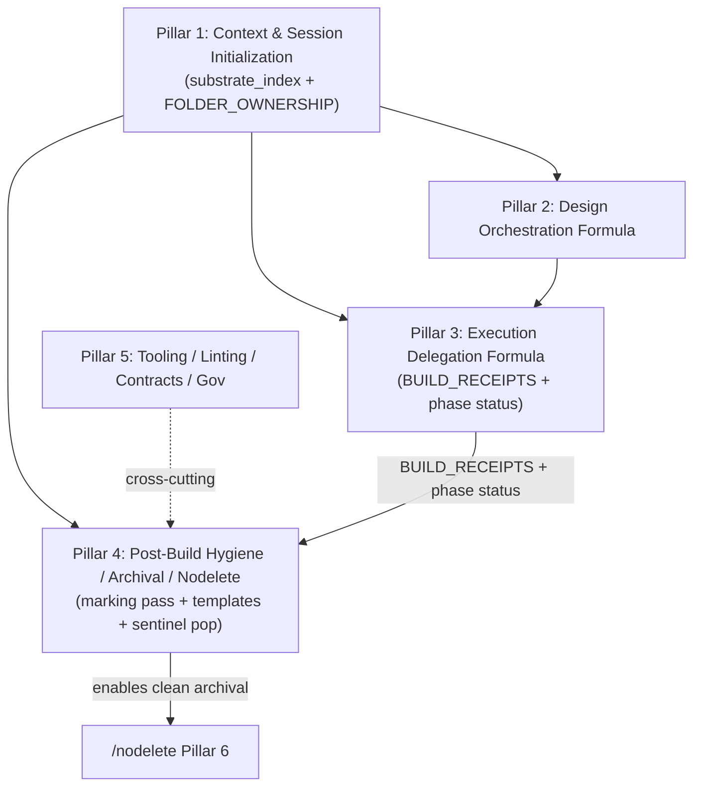
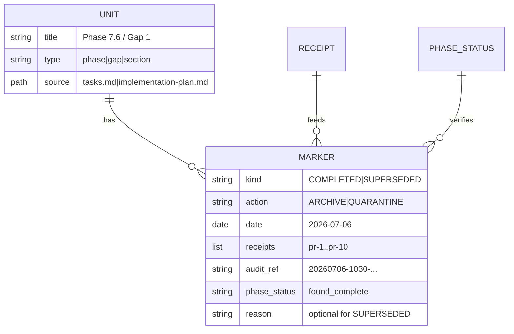

# High-Fidelity Design Document: Pillar 4 — Post-Build Hygiene, Archival & Nodelete

**Pillar 4 of the Sovereign Suite Major Redesign Cluster**  
**Primary Source (authoritative):** `helpdesk-tickets/20260706_sovereign-redesign-cluster_meta_workflow.md` (full read performed; this design treats it as the single governing document for scope §4.1 Pillar 4 verbatim, partition, citations, proposals, verification criteria §4.1, sequencing §4.2, pointer/payload convention §4.3, Fresh-Agent Contract §4.4 and extensions, Key Decisions, Remediation, Risks, References §8, Pillar Partition Summary §10, and all assigned content from the source ticket).  
**Primary Source Ticket (read in full):** `helpdesk-tickets/20260706_implementation-plan-audit-nodelete-archival_workflow.md` (Executive Summary through §5 Recommendation; "CRITICAL STRUCTURAL"; "plethora of complete phase material"; remediation steps 1-6; exact forensic from Videos 397b6602; marker syntax; templates; populator; sentinel integration; citations to nodelete.md:190-220, phase_status.py, BUILD_RECEIPTS, audits/20260706-*.md, DESIGN notes).  
**High-Fidelity Prior Art Precedent (read in full):** `docs/DESIGN_Plan_Tasks_Format_and_Sentinel_Populator.md` (produced in the same Videos 397b6602 context; proposes markers **COMPLETED [ARCHIVE:DATE]**, **SUPERSEDED [QUARANTINE]**, templates, populator `ensure_plan_templates.py`, sentinel as primary; ties to nodelete P6, phase_status, BUILD_RECEIPTS, audit; used as direct input for formats and logic).  
**Date:** 2026-07-06  
**Author:** Grok Build (Systems Architect) — operating under Senior Architect of Workflows role.md + /quality (Maximum) mandate.  
**Output Artifact:** This document (drafted to `/tmp/grok-design-doc-0b3fc3f0.md`; to be landed at canonical `docs/design-pillars/PILLAR_04_POST_BUILD_HYGIENE_ARCHIVAL_NODELETE.md` per user directive and meta §4.3).  
**Companion Summary:** `/tmp/grok-design-summary-0b3fc3f0.md` (also written here).  

**Authorizations Documented (explicit blanket + scope expansions):**  
- Full reads inside/outside workspace for cited accuracy (paths and purpose stated before each read_file / list_dir / grep / run_terminal_command use; e.g., Videos audits and DESIGN, blueprint-workflows core substrate, Grok skills reference-only).  
- Scope expansion as needed for meta-update section (per meta §4.4 + task directive requiring "Dedicated Scope-Expanded Section per task + meta §4.4 and P3 precedent").  
- "I will review" (user signal) → apply Turn-Boundary Pause Protocol: finish this write unit completely (both files + confirmation), then halt without new autonomous work.  
- No live workspace edits performed (only /tmp artifacts); discussion never treated as execution authorization.  
- Pillar 1 substrate (FOLDER_OWNERSHIP + substrate_index) and P2/P3 designs now available; integrate explicitly (P3 receipts feed marking; P1 briefing for sentinel).  
- /nodelete, failure pattern naming, copious citations, exact rigor from PILLAR_01/PILLAR_02/PILLAR_03 designs + meta embedded prior art model.  
- "use copious notes", "/quality applied to documenting the ticket", "zero dissent on everything".  
- Prototype paths (Videos audits 20260706-1030/1340-397b6602.md) explicitly authorized for evidence.

**Failure Pattern Vocabulary Applied (per ~/.claude/CLAUDE.md + role.md Section IV + meta §2.2 + P3 precedent):** Named explicitly on detection or risk (Ghost Logic in markers or unverified completion claims; Context Erosion in live surfaces retaining "plethora of complete phase material"; Hallucinated Success if audit marks without receipt cross-ref or phase_status verification; Mock Trap if templates populated without actual substrate fidelity; Grade Fraud if /harden-workflow certifies without full verification criteria met).

---

## 1. Overview

Pillar 4 delivers the **Post-Build Hygiene, Archival & Nodelete** layer: the missing "Completion Marking" sub-pass inside `/implementation-plan --audit` (Phase 5), canonical templates with machine-parseable markers, a sentinel-driven populator for workspace-aware initialization, and the integration points that enable clean `/nodelete --archive` (Pillar 6) while preserving nodelete's conservative Safety Rail ("Never archive a unit the user did not name").

**Scope (verbatim from meta §4.1 Pillar 4):**  
"Post-Build Hygiene, Archival & Nodelete (Implementation-Plan Audit Completion Marking + Templates + Sentinel Population)"

**Assigned content (with citations, per meta §2.1 + §4.1 + §10 + source ticket):**  
- Full `20260706_implementation-plan-audit-nodelete-archival_workflow.md` (CRITICAL STRUCTURAL; Executive through Recommendation; missing marking pass; **COMPLETED [ARCHIVE:DATE]** / **SUPERSEDED [QUARANTINE]**; templates in blueprint-workflows; sentinel-driven populator; "plethora of complete phase material" in implementation-plan.md/tasks.md post-397b6602; citations to nodelete.md:190-220 ("Never archive..."; phase_status.py cross-ref); BUILD_RECEIPTS; audits/20260706-*.md; DESIGN superseded notes; remediation 1-6).  
- Meta cross-cites: Pillar 3 (BUILD_RECEIPTS + phase status feed marking); Pillar 1 (sentinel integration); Pillar 5 (receipts generalization, SUITE_HEALTH, helpdesk phylogeny); nodelete.md Pillar 6; focus-plan.md v4 PENDING; execute-build receipts; precedent DESIGN_Plan...; Videos 397b6602 forensic; role/CLAUDE/SUITE_HEALTH/triage/secretary/implementation-plan/focus-plan/sentinel updates.  
- 100% of related (source §3 forensic: tasks.md partial clean + impl-plan full Phase 7.6 retained; BUILD_RECEIPTS pr-1..pr-15 0-open; nodelete conservatism on unmarked units; "only uncompleted items" intent).

**Key proposals (from meta §4.1 + source + precedent + this formalization):** Mandatory "Completion Marking" sub-pass in --audit (after Coverage Ledger; walk tasks.md/impl-plan/DESIGN; cross-ref phase_status + BUILD_RECEIPTS + prior audit; inject only if verified complete; refuse on ghost; update report); canonical templates (blueprint-workflows/templates/plan/ or equivalent; tasks.md.template + implementation-plan.md.template with "only uncompleted items" note, marker slots, unit boundaries, [INTENT] preservation); populator script (scripts/plan/ensure_plan_templates.py or integrated in doorway); sentinel integration (new "Plan & Tasks Format Check" briefing step; call populator; include in output; .workflow_state/ overrides + workspace customization); P3-established BUILD_RECEIPTS + phase_status.py (already the source of truth for focus-plan v4 PENDING and nodelete Pillar 6 gate) feed the marking chain → nodelete archive; updates to nodelete.md, implementation-plan.md (Phase 5 + GLOSSARY), sentinel.md, focus-plan.md (if needed), DESIGN_*.md examples, role/CLAUDE/SUITE_HEALTH/triage/secretary/helpdesk protocol, manifest/history appends; integration with P1 substrate_index and P5 cross-cuts.

**Mermaid: Pillar 4 Position in Cluster (from meta §4.2)**



Pillar 4 depends on Pillar 1 (sentinel briefing) and Pillar 3 (receipts feed); enables clean nodelete; cross-cut by Pillar 5.

This design is **standalone high-fidelity** for Pillar 4 (per meta §4.3 pointer/payload convention and §4.4 Fresh-Agent Contract). All claims backed by direct reads of meta, source ticket, precedent DESIGN, PILLAR_01/02/03, claude-commands/implementation-plan.md (Phase 5), nodelete.md:190-220, scripts/focus/phase_status.py (full), execute-build.md (receipts 330-400), focus-plan.md, sentinel.md, role.md, SUITE_HEALTH.md, FOLDER_OWNERSHIP.md, helpdesk-tickets.md, DevJournal.md:12-70, implementation-plan/audits/20260706-*.md (89/100 Coverage Ledgers), root implementation-plan.md ([INTENT]), open non-CLOSED helpdesk, and related.

---

## 2. Background & Motivation (Heavily Cites Meta + Source Ticket + Precedent + Forensic)

**Meta Executive Summary (§1) + Pillar 4 assignment (§4.1):** "Gaps in post-execution audit/hygiene enabling clean `/nodelete` Pillar 6 archival." "Pillar 4: Post-Build Hygiene, Archival & Nodelete (Implementation-Plan Audit Completion Marking + Templates + Sentinel Population)" "Assigned from tickets (with citations): implementation-plan-audit-nodelete-archival: Full (Executive through Recommendation); missing 'Completion Marking' pass; **COMPLETED [ARCHIVE:DATE]** / **SUPERSEDED [QUARANTINE]**; templates in blueprint-workflows; sentinel-driven populator; 'plethora of complete phase material' ... ; citations to nodelete.md:190-220 ... phase_status.py ... BUILD_RECEIPTS; audits/20260706-*.md ..."

**Source ticket (20260706_implementation-plan-audit-nodelete-archival_workflow.md §1 Executive Summary):**  
"The /implementation-plan --audit (adversarial post-execution with Coverage Ledger) is the logical point to detect Ghost Logic, verify completion via receipts, and prepare the live surface for downstream workflows including /nodelete --archive. Currently, it produces findings and a report but does not systematically parse the plan/tasks documentation (implementation-plan.md, tasks.md, DESIGN_*.md) to add explicit, parseable markers for completed and superseded units.  
This creates friction with /nodelete's conservative philosophy (Pillar 6 + Safety Rail): archival only acts on *named* units that carry clear markers (as it correctly did with old **SUPERSEDED (2026-07-05)** blocks). Without such markers on current completed work (e.g., re-sequenced Phase 7.6 research tasks 55-69 and 4 Gaps/synthesis from the 397b6602 execute-plan), the live surfaces retain a 'plethora of complete phase material.' The result is documents that are not 'left with only uncompleted items,' violating the user's explicit intent for clean live surfaces, graduated history in .history/archive/ (completed) and .history/quarantine/ (superseded), and respect for the full chain: audit → markers → nodelete --archive."

**Forensic evidence (source §3 + precedent + file reads):**  
- Videos post-397b6602: tasks.md now contains "All completed phases ... archived per /nodelete --archive" + only [ ] 65 (D3); implementation-plan.md still contains full "New Phase 7.6: Relational Competitor Engine..." detailed spec (lines ~130-270) + 4 Gaps despite "End of new Phase 7.6 specification" note (source: file:///home/jwils/Videos/implementation-plan.md#130-270, #260-280).  
- BUILD_RECEIPTS.md: pr-1..pr-10 (research engine: DB schema, multipass, D1-D4, compiler, migration, telemetry, decoupling, D4, gate — all "0 open confirmed"); pr-11..pr-15 (4 Gaps + close: "Implemented", "0 open", "full DESIGN fidelity no loss") (source: file:///home/jwils/Videos/.workflow_state/receipts/BUILD_RECEIPTS.md#230-300).  
- nodelete.md:190-220 (Pillar 6 Archival verbatim): "move the named, verified-complete unit... Never archive a unit the user did not name." "For a tasks.md phase specifically: consult scripts/focus/phase_status.py... A phase whose derived status is one of _COMPLETE_STATUSES may be archived." "Everything not named — adjacent phases... is frozen." " .history/archive/ ... Append-Only Ledger".  
- Prior audits: 20260706-1030-Videos-397b6602.md and 20260706-1340-Videos-397b6602.md (both 89/100; Coverage Ledger on 33-file changeset; explicit notes on fidelity but no marking pass).  
- Precedent DESIGN_Plan...: exact proposed markers, tasks.md.template + implementation-plan.md.template examples with "only uncompleted items" note + marker slots + [INTENT] preservation; populator logic (idempotent, --workspace, customization); sentinel "Plan & Tasks Format Check" step; end-to-end flow (sentinel populate → work → audit mark → nodelete archive); "Primary integration point = sentinel".  
- implementation-plan.md Phase 5 (read): "ADVERSARIAL AUDIT REPORT" with Coverage Ledger (every file from git diff --stat); "Audit Submittal & Persistence Protocol" to implementation-plan/audits/YYYYMMDD-HHMM-[workspace].md + local pointer; no marking sub-pass.  
- scripts/focus/phase_status.py (full): parse_tasks_md (Phase N/Stage N headers, checkbox tally, status "complete"/"in_progress"/...); parse_build_receipts (## DATE — /execute-build — <phase> blocks); _COMPLETE_STATUSES = {"phase complete", "project build complete"}; build_phase_status_report (cross-ref by normalized title); feeds focus-plan PENDING vs MISMATCH and nodelete gate.  
- execute-build.md Phase 6 (330-400): exact Phase Build Receipt format + `cat >> .../BUILD_RECEIPTS.md << 'RECEIPT_EOF'` (atomic; Phase/Stage + Grade/Status: PHASE COMPLETE); re-read Phase Map.  
- focus-plan.md GLOSSARY (v4): "PENDING ... phase ... is not yet complete"; "Phase Status Report ... from phase_status.py"; "tasks_md field".  
- sentinel.md (current): Phases 0-6; doorway scan; briefing in Phase 3; no plan-format step; workspace awareness via --workspace.  
- root implementation-plan.md: [INTENT] anchor + /nodelete (lines 1-50+); current state.  
- Open non-CLOSED helpdesk (role.md + meta §4.4): 20260706_implementation-plan-audit-nodelete-archival_workflow.md, 20260706_sovereign-redesign-cluster_meta_workflow.md, others (20260706_execute-build_..., 20260706_sovereign-design-formula_..., 20260705_*, 20260704_*); all assigned per meta Partition.  
- DevJournal.md:12-70 (pointer/payload revival precedent for formula-in-formula).  
- SUITE_HEALTH.md + FOLDER_OWNERSHIP.md + role.md (mandatory session reads).  
- Videos DESIGN_Complete_Videos_Pipeline.md: "Superseded historical text ... remains in the canonical `tasks.md` and `implementation-plan.md` per /nodelete".

**Motivation (meta §2.2 + source §2 + precedent):** Ad-hoc/hybrid success (Videos 397b6602) proves feasibility but leaves live surfaces polluted with behind-us material after successful execute-plan + 0-open audits. nodelete correctly conserves (N=N Safety Rail); the gap is the "prep step" in audit (structural in implementation-plan.md Phase 5). User zero dissent: explicit markers during audit + templates in blueprint-workflows + sentinel-driven population with workspace customization. Full chain audit → markers → nodelete --archive required for "clean live surfaces" + graduated .history/. This is Pillar 4 of the cluster; P3 receipts are the direct input.

No content unassigned (meta §10 Partition confirms 100% coverage).

---

## 3. Goals & Non-Goals (Derived from Meta §3, §4.1 Verification, Source, Precedent)

**Goals (verbatim + expanded from meta §4.1 verification + source §4 + precedent Goals):**  
- Extend the audit (implementation-plan.md Phase 5 + adversarial reviewer instructions) with a required "Completion Marking" sub-pass: "Walk tasks.md / implementation-plan.md / DESIGN sections; cross-reference receipts/phase_status; inject explicit markers for verified completed units (**COMPLETED [ARCHIVE:DATE]** with receipt refs) and superseded (**SUPERSEDED [QUARANTINE]**). Refuse to mark if ghost logic detected." Report includes "Archival Markers Added" section.  
- Define and publish canonical templates in blueprint-workflows/templates/plan/ (or equivalent per precedent): tasks.md.template (structured phases with placeholder markers, [ARCHIVE] tags, receipt cross-ref slots, "only uncompleted items" note); implementation-plan.md.template (sections with [INTENT] /nodelete, explicit unit boundaries for phases/gaps, marker syntax, completion/archival fields).  
- Implement lightweight populator (scripts/plan/ensure_plan_templates.py or integrated in doorway): detect tasks.md/implementation-plan.md; if absent or missing marker structure, copy from template + customize (workspace name, [INTENT] injection, data from local); idempotent; --workspace/--dry-run/--force; outputs for sentinel.  
- Extend sentinel (claude-commands/sentinel.md + scripts/doorway/) with "Plan & Tasks Format Check" step: on init call populator; include "Plan/tasks files are now in canonical format..." in briefing; support .workflow_state/ overrides + workspace customization (local templates/, governance/role, data/).  
- Updates required: nodelete.md (document new markers + BUILD_RECEIPTS + phase_status.py verification gate), implementation-plan.md (Phase 5 marking sub-pass + GLOSSARY), sentinel.md (new step), focus-plan.md (if needed for Phase Status Report), DESIGN_*.md examples, role/CLAUDE/SUITE_HEALTH/triage/secretary/helpdesk-tickets.md (integration), manifest/history appends.  
- How marking + archival chain works end-to-end with P3-established BUILD_RECEIPTS + phase_status.py (already the source of truth for focus-plan v4 PENDING and nodelete Pillar 6 gate): receipts + phase_status confirm before any marker; marker + receipt refs enable nodelete.  
- Integration with P1 substrate_index for sentinel briefing, P2 Manifest if relevant, P5 cross-cuts (receipts, contracts); P3-established BUILD_RECEIPTS + phase_status.py (source of truth pre-dating cluster) feed marking.  
- Live surfaces contain only forward items after --audit + --archive; markers present with receipt refs and parseable; templates populated on new ws; phase_status + receipts confirm before archive; /harden-workflow --ticket + /quality pass; no breakage of existing nodelete or focus PENDING.  
- Exhaustive traceability to meta citations + source ticket quotes/lines + file:lines + precedent.  
- Update/extend meta §4.4 Fresh-Agent Contract (dedicated section modeled exactly on PILLAR_03 section 12 style, length, detail, diff format, "ADDED 2026-07-06", pre-read maps, Outcome Summary placeholders, edit locations, landed list append, cross-refs to §6/8/10, reproducible bootstrap).  
- PR Plan: 8-10 incremental, independently mergeable PRs (04-00 through 04-08+); modeled on P3 03- + prior art.

**Non-Goals (per meta §3 + source + precedent + "do not change nodelete conservatism"):**  
- Change nodelete.md core logic or Safety Rail (Pillar 6 conservatism is intentional; we engineer prep around it with markers).  
- Rewrite existing completed content in Videos (only archive via markers + nodelete; /nodelete on prior).  
- Make populator autonomous outside sentinel (user-invoked or init-triggered only).  
- Add new heavy engines (reuse doorway/sentinel/focus/phase_status/implementation-plan audit).  
- Mandate specific LLM token counts or replace judgment.  
- Live workspace edits ( /tmp only for artifacts).  
- Resolving Phylogeny or closing meta (requires full remediation per helpdesk-tickets.md Phase 4 + /harden-workflow --ticket).  
- Changes to Grok skills or delegated engines.

---

## 4. Proposed Design

### 4.1 Marker Syntax (Machine-Parseable + Human-Visible; from Precedent + Source)

Add to templates and all future plan/tasks surfaces (modeled verbatim on precedent DESIGN_Plan... and source remediation):

- For verified complete units: `**COMPLETED [ARCHIVE:2026-07-06]** (receipts: pr-1..pr-10 + 4 Gaps; 0 open after audit 20260706-1030-Videos-397b6602.md; phase_status: found_complete)`  
- For superseded historical units: `**SUPERSEDED [QUARANTINE:2026-07-06]** (reason: re-sequenced into new Phase 7.6; prior marker preserved per /nodelete)`  
- Tie every marker to verification: receipt IDs (from BUILD_RECEIPTS), audit report link (implementation-plan/audits/), phase_status result.  
- Place markers at the **start of each named unit** (phase, gap, section) so nodelete (and phase_status parsers) can act with simple regex or existing tooling.  
- Human-visible + machine: bold + bracketed DATE + refs; no inline ghosts on active surface (transparency in ledger per nodelete).

This gives nodelete exactly the "clear markers" it looks for (as with old **SUPERSEDED (2026-07-05)**).

**Data Model for Marker (Mermaid ER-like):**



### 4.2 Mandatory "Completion Marking" Sub-Pass in --audit (Core Locus)

In implementation-plan.md Phase 5 (after Coverage Ledger and findings, before final report):

1. Walk the (now template-structured) tasks.md, implementation-plan.md, DESIGN sections.  
2. For each named unit (Phase N / Stage N header or explicit Gap/section):  
   - Cross-reference: phase_status (via scripts/focus/phase_status.py or equivalent parse) + matching BUILD_RECEIPTS entries (Phase/Stage + Grade/Status in _COMPLETE_STATUSES) + code changes (Coverage Ledger) + prior audit notes.  
   - If receipts + code + verification confirm completion (no open checkboxes or "complete"/"project build complete" status, 0 open in receipts/audit): inject **COMPLETED [ARCHIVE:DATE]** + refs at unit start.  
   - If superseded historical (re-sequenced or explicit): **SUPERSEDED [QUARANTINE]**.  
   - If mismatch / ghost logic / incomplete: raise as finding; **do not mark**; surface in "Archival Markers Added" (refused).  
3. Update audit report: add "Archival Markers Added" section listing injected + refused + rationale (tied to Coverage Ledger entries).  
4. Persist: audit report already writes to implementation-plan/audits/; markers written to live plan/tasks/DESIGN (append/inject per /nodelete on the docs themselves).  
5. Refusal on ghost: explicit (prevents Hallucinated Success in archival).

This turns the audit into the preparatory step for nodelete without changing nodelete.

**End-to-End Flow (Mermaid Sequence):**

```mermaid
sequenceDiagram
    participant S as Sentinel (P1) + Populator
    participant W as Work (P2/P3: focus/execute-plan)
    participant A as /implementation-plan --audit (Phase 5 + Marking)
    participant N as /nodelete --archive (P6)
    participant R as Receipts (BUILD_RECEIPTS + phase_status)

    S->>S: populate templates if missing (workspace-customized)
    W->>R: emit Phase Build Receipts (cat >>)
    A->>R: cross-ref phase_status + receipts
    A->>A: walk units; verify complete?
    alt verified
        A->>Live: inject **COMPLETED [ARCHIVE:DATE]** + refs
    else ghost/incomplete
        A->>Report: refused (Ghost Logic finding)
    end
    A->>Report: "Archival Markers Added" + Coverage Ledger
    N->>Live: parse markers; move verbatim to .history/archive/ or /quarantine/
    N->>Live: freeze un-named (Safety Rail)
```

### 4.3 Canonical Templates Location + Content

Location (per precedent + meta): `blueprint-workflows/templates/plan/` (new dir under canonical; or scripts/doorway/templates/plan/ for co-location; decide in PR 04-00; blueprint-workflows as single source of truth). **Update docs/FOLDER_OWNERSHIP.md** (append 1-2 sentences; this file is the directory-boundary source of truth per P1 + docs/FOLDER_OWNERSHIP.md:5-14) as required artifact for new root-level dirs (scripts/plan/ likewise). PRs 04-00/01/05/06 explicitly include it.

**tasks.md.template (excerpt modeled verbatim on precedent):**
```
# Tasks: [Workspace/Project Name] (Active - only uncompleted items)

**Note:** All completed phases have been archived per /nodelete --archive to .history/archive/tasks.md.ledger.md. Only uncompleted items remain below.

## Phase X: [Title]
**Status:** [ ] / **COMPLETED [ARCHIVE:DATE]** (receipts: ...; verified in audit YYYYMMDD-....md; phase_status: ...)
- [ ] Task description...
  - Sub-task...

**Gates:**
- ...
```

**implementation-plan.md.template (excerpt):**
```
## [INTENT] User Objective
> [Preserved /nodelete text — never archived]

### Scope & Boundaries
...

## New Phase X: [Title] (Re-sequenced)
**Status:** **COMPLETED [ARCHIVE:DATE]** (receipts: ... )   <--- marker slot

### Detailed Requirements
...

**4 Gaps / Synthesis Section**
**Status:** **COMPLETED [ARCHIVE:DATE]**
```

Templates include: placeholder markers, receipt cross-ref slots, explicit unit boundaries, [INTENT] /nodelete preservation note, "only uncompleted items" header, instructions for populator/audit.

### 4.4 Populator Script

New: `scripts/plan/ensure_plan_templates.py` (lightweight; or integrate into doorway/auditor if minimal; precedent recommends standalone reusable).

**Module scaffolding (follows scripts/ pattern from focus/, doorway/, quality/, harden/ etc. per list_dir + README.md):** 
- scripts/plan/__init__.py (package)
- scripts/plan/_utils.py (shared safe_read, normalize helpers; reuse from focus/_utils.py pattern)
- scripts/plan/ensure_plan_templates.py (main entry; --workspace/--dry-run/--force logic)
- scripts/plan/README.md (usage, calling convention like doorway/README.md)
- scripts/plan/reporter.py (optional thin; or reuse focus/reporter.py pattern for sentinel JSON/stdout output)
- tests/test_plan_populator.py (or extend tests/test_phase_status.py style; pytest entry)
- Update scripts/README.md (add "plan/ — Plan & tasks template populator for Pillar 4 sentinel + audit marking"), scripts/TESTING.md, run_tests.sh discovery if needed.

Logic (verbatim from precedent):
- Takes optional --workspace (defaults cwd).
- Checks for tasks.md and implementation-plan.md in workspace root.
- If absent or missing required marker structure (no [ARCHIVE] syntax or no "only uncompleted items" note):
  - Copy from blueprint-workflows/templates/plan/
  - Customize: replace [Workspace/Project Name]; inject initial [INTENT] snippet if DESIGN or user context exists; pull target channels/instance paths from data/ and local; add date placeholders.
- Idempotent: only populates/customizes when needed.
- Flags: --dry-run, --force.
- Outputs to stdout/log for sentinel consumption.
- Supports workspace flag/directory.

No heavy engine; reuses existing patterns (doorway templates, focus parsers). Verify via `cd scripts && python -m pytest tests/test_plan* -q` (04-07). Update FOLDER_OWNERSHIP (see Issue 1 fixes).

### 4.5 Sentinel Integration (Primary Execution Point)

Extend `claude-commands/sentinel.md` + `scripts/doorway/` (exact insertion: new **Phase 1.6 — Plan & Tasks Format Check** immediately after Phase 1.5 (agent breadcrumb population); before any Phase 2/3 work. Frontmatter: bump `phase_count: 7` (from current 6); add GLOSSARY entry for "Plan & Tasks Format Check").

- On init (after Phase 1.5): call `ensure_plan_templates.py --workspace <detected_dir>`
- Append one paragraph to Phase 3 Sentinel Report template (after DRIFT SUMMARY or before ROUTING MAP, modeled on current report format read): 
  ```
  ║ PLAN & TASKS FORMAT:
  ║   [populated from blueprint-workflows/templates/plan/ | skipped (already canonical with markers) | error]
  ║   Source: sentinel populator; only uncompleted items visible on live surface.
  ```
- Workspace customization: check .workflow_state/plan/ or local templates/ overrides; inject workspace-specific data (governance/role.md, data/*.json, local .env); support per-workspace "plan flavor".
- Sentinel already has machinery (doorway for briefing, local workflow interception e.g. sentinel--videos, workspace dir awareness). Least-disruptive.

Secondary (robustness): inside /focus-plan, optional at start of /implementation-plan, or standalone /plan-init.

Primary: sentinel (init) + ensure script. Update PR 04-03 files to include sentinel.md frontmatter (phase_count + GLOSSARY).

### 4.6 Updates Required ( /nodelete — Append/Inject Only)

- **claude-commands/implementation-plan.md:** Phase 5 add marking sub-pass + "Archival Markers Added" output + GLOSSARY (Completion Marking, Archival Marker, etc.); update Phase 5 persistence note; INTEGRATION.
- **claude-commands/nodelete.md:** Document new marker syntax + BUILD_RECEIPTS + phase_status.py verification gate (phase_status + BUILD_RECEIPTS); update Pillar 6 to reference markers explicitly; append Change Log.
- **claude-commands/sentinel.md:** New **Phase 1.6** (after 1.5) + populator call; update GLOSSARY (Plan Format Check) + frontmatter `phase_count: 7`; Phase 3 report template (exact paragraph).
- **claude-commands/focus-plan.md:** Minor if needed (Phase Status Report already emits what audit consumes).
- **docs/DESIGN_*.md examples + precedent:** Update or append examples with markers.
- **role.md / CLAUDE.md / SUITE_HEALTH.md / triage.md / secretary.md / helpdesk-tickets.md:** Integration notes, read order, advisory supersession, receipt generalization.
- **manifest/history/*.md:** Append-only narrative (Pillar 4 addition).
- **blueprint-workflows/templates/plan/ + scripts/plan/ (full: __init__.py + _utils.py + README.md + reporter.py + tests entry + ensure...):** New (first creation per task; scaffold matches focus/doorway/ per list_dir verification). Update scripts/README.md, TESTING.md, FOLDER_OWNERSHIP.md.
- All /nodelete: inject/append; preserve history; no overwrites.

### 4.7 Integration with Cluster (P1/P2/P3/P5)

- P1: substrate_index in sentinel briefing feeds plan populator context.
- P2: Build Ingestion Manifest in DESIGN provides [INTENT] for initial template customization.
- P3: BUILD_RECEIPTS + phase_status are the source of truth for marking (dual verification).
- P5: Cross-cut (receipts generalization, pointer contract if extended, SUITE_HEALTH rows, helpdesk phylogeny for cluster, linter excludes if templates affect).

---

## 5. Key Decisions (10+ Modeled on Prior Art + P3)

1. **Audit as marking locus (not nodelete or autonomous populator):** Leverages existing adversarial Coverage Ledger + receipt cross-ref (source ticket + precedent); prevents premature archival or Ghost Logic in markers. Rationale: "the audit is the logical point" (source §1); re-uses Phase 5 persistence.
2. **Sentinel primary for populator (with workspace customization):** Earliest point, already has machinery, matches user concept + precedent Key Decision 1. Rationale: "every agent session starts here"; .workflow_state/ overrides supported.
3. **Marker syntax **COMPLETED [ARCHIVE:DATE]** / **SUPERSEDED [QUARANTINE]** (receipt-tied):** Directly extends existing **SUPERSEDED (2026-07-05)** that nodelete already acts on (precedent + nodelete:190-220). Machine + human parseable.
4. **Templates in blueprint-workflows (single source of truth):** Versioned with suite; precedent location; supports customization injection.
5. **Conservatism preservation (N=N Safety Rail unchanged):** Markers are the engineering around it; nodelete still "Never archive a unit the user did not name" (explicit in meta/source/nodelete).
6. **Receipts as source of truth (dual verification):** P3-established BUILD_RECEIPTS + phase_status.py (already source of truth for focus PENDING/nodelete) + Coverage Ledger before mark. Prevents Hallucinated Success.
7. **/nodelete for all meta changes (append/inject only):** Matches governing meta + P3 precedent; no contradictory removal.
8. **Idempotent populator + staged rollout (Videos prototype first):** Per precedent rollout; cross-ws via manifest.
9. **Marking sub-pass after Coverage Ledger (before final report):** Structural; report gains section.
10. **Fresh-agent contract extension in dedicated section (modeled on Pillar 3 extension block (PILLAR_03 §4.4) + PILLAR_01 §12 pattern):** Per task + meta §4.4; includes pre-read map, Outcome Summary placeholder, exact edit locations, bootstrap.
11. **PR Plan incremental 04- prefixed (independently mergeable):** Matches P3/PR precedent; dependencies explicit (templates before marking before sentinel before harden).
12. **No change to phase_status.py core (consume existing):** It already provides the exact _COMPLETE_STATUSES + cross-ref needed.

## 5.5 Alternatives Considered

Modeled on precedent DESIGN_Plan_Tasks_Format_and_Sentinel_Populator.md ("## Alternatives Considered") and PILLAR_01 §8.

1. **Make nodelete itself smarter** (auto-detect completed via receipts and archive without explicit markers). Rejected — directly contradicts the explicit "Never archive a unit the user did not name" (nodelete.md:210) and Safety Rail (Pillar 1/6). Would remove the conservatism the user wants to keep (source ticket §4 + meta §4.1).
2. **Only templates, no sentinel integration.** Rejected — agents would still start without the format unless they remember to run a command. Sentinel is the natural init point per precedent Key Decision 1 and current Phase 0-3 flow.
3. **Marking only in tasks.md, leave implementation-plan.md alone.** Rejected — implementation-plan.md is the detailed spec that also needs cleaning for the live surface (user explicitly called out the "plan document" in source §3 forensic).
4. **Put populator inside /implementation-plan only.** Rejected — too late; agents need the format when they first create the files (per "only uncompleted items" intent). Sentinel (earliest, workspace-aware) + doorway integration is earlier.
5. **Heavy new engine instead of lightweight script + sentinel.** Rejected — re-uses existing doorway/sentinel/focus/phase_status machinery (scripts/focus/phase_status.py:230 etc.); keeps surface thin and avoids new heavy code (non-goal per meta §3).
6. **Auto-apply markers without adversarial refusal gate.** Rejected — would enable Hallucinated Success / Ghost Logic in archival (design §4.2 + risks). Audit locus + "refuse to mark if ghost logic detected" is required.

Chosen approach (audit marking + sentinel populator + receipt-tied markers) is the minimal, protocol-respecting extension that directly solves the friction while adding the user's requested template + sentinel customization and preserving nodelete N=N.

---

## 6. Risks & Mitigations (Severity Explicit)

- **HIGH — Premature archival (marking without verification):** Mitigation: dual gate (phase_status + BUILD_RECEIPTS + Coverage Ledger + adversarial refusal on ghost); nodelete conservatism remains; Intent-Mismatch Gate fallback.
- **HIGH — Ghost Logic in markers:** Mitigation: refuse to mark on mismatch; explicit finding in audit report; Mute Witness via receipts/engine.
- **MED — Incomplete templates or customization drift:** Mitigation: idempotent populator; sentinel always calls; workspace overrides documented; tests in PRs.
- **MED — Cross-ws propagation / version skew:** Mitigation: templates live in blueprint-workflows (canonical); sentinel/doorway --workspace; staged (Videos → this ws → general); manifest/SUITE_HEALTH tracking.
- **MED — Parse fragility (marker regex vs phase boundaries):** Mitigation: reuse existing Phase N/Stage N patterns from phase_status.py + execute-build; place at unit start; document in GLOSSARY.
- **LOW — Populator side effects on existing marked files:** Mitigation: only act on missing structure; --dry-run; explicit "if absent or missing required marker structure".
- **Context Erosion / Hallucinated Success (recurrence):** Named; mitigated by copious citations in this design, /quality Maximum, meta §4.4 contract, P3-style verification criteria.

---

## 7. Verification Criteria (Verbatim from Meta §4.1 + Expanded)

- Live surfaces contain only forward items after --audit + --archive (tasks.md/implementation-plan.md/DESIGN show "only uncompleted" + markers on completed).
- Markers with refs present and parseable (**COMPLETED [ARCHIVE:DATE]** + receipt/audit/phase_status; **SUPERSEDED [QUARANTINE]**).
- Templates populated on new workspaces (sentinel produces canonical format with marker slots).
- phase_status + receipts confirm before any archive (nodelete gate passes only on verified).
- /harden-workflow --ticket + /quality (Maximum) pass on changed files (implementation-plan.md, nodelete.md, sentinel.md, new templates/populator).
- No breakage of existing nodelete or focus PENDING (phase_status unchanged for its consumers; receipts format identical).
- End-to-end: fresh ws → sentinel populates → plan/execute (P3 receipts) → --audit marks → --archive graduates only marked → live clean; audit report cites markers.
- 100% traceability: all assigned content from meta + source ticket traceable with file:line/section + quotes in this doc.
- Fresh-agent contract: meta §4.4 updated with P4 pointer + pre-read map + Outcome placeholder (reproducible bootstrap).
- Coverage Ledger + 0 open on prototype (Videos or equivalent).

---

## 8. References (Exhaustive Citations)

**Primary governing + source (full reads):**  
- `helpdesk-tickets/20260706_sovereign-redesign-cluster_meta_workflow.md` (full; §1, §2.1 implementation-plan-audit... ticket + 397b6602, §4.1 Pillar 4 verbatim scope + assigned + verification, §4.2 Mermaid, §4.3 pointer, §4.4 contract, §5-10).  
- `helpdesk-tickets/20260706_implementation-plan-audit-nodelete-archival_workflow.md` (full; §1 Exec, §2 Root Cause, §3 Forensic with Videos paths + nodelete:190-220 + BUILD_RECEIPTS + audits, §4 Remediation 1-6, §5 Rec).  
- `docs/DESIGN_Plan_Tasks_Format_and_Sentinel_Populator.md` (full; Overview through PR Plan; exact markers, templates, populator, sentinel step, flow, Key Decisions, alternatives).  
- PILLAR_01/02/03 designs (full structure, meta-update §12 style in P3, citations, PR 0N- style, verification).

**Workflows & Scripts (direct reads + line/section cites):**  
- `claude-commands/implementation-plan.md` (Phase 5 ADVERSARIAL AUDIT REPORT + Coverage Ledger + persistence to audits/ 200-260; [INTENT]; GLOSSARY).  
- `claude-commands/nodelete.md` (Pillar 6 190-220 verbatim: verification gate, phase_status, .history/archive, "Never archive...", N=N, Append-Only).  
- `scripts/focus/phase_status.py` (full module: parse_tasks_md 140-185, parse_build_receipts 190-215, _COMPLETE_STATUSES 65, build_phase_status_report 230-260, _normalize, Phase/ReceiptEntry dataclasses).  
- `claude-commands/execute-build.md` (receipts 330-400 exact format + cat >> BUILD_RECEIPTS; 5g/5h 260-320; GLOSSARY; STRICT RULES 410-440 incl. 15-16; Phase Map).  
- `claude-commands/focus-plan.md` (GLOSSARY PENDING/MISMATCH/Phase Status Report from phase_status.py + BUILD_RECEIPTS; v4).  
- `claude-commands/sentinel.md` (Phases 0-6; Phase 3 Report; doorway integration; Mute Witness; current no plan step).  
- `claude-commands/role.md` (I-II identity/constants; VI session boundaries: SUITE_HEALTH + open helpdesk).  
- `manifest/SUITE_HEALTH.md` (ACTIVE ADVISORY example; mandatory).  
- `docs/FOLDER_OWNERSHIP.md` (10 sentences; canonical).  
- `claude-commands/helpdesk-tickets.md` (Phases 0-5; GLOSSARY; STRUCTURAL; Phylogeny; closure; STRICT RULES).  
- `DevJournal.md:12-70` (pointer/payload revival).  
- `claude-commands/quality.md`, `continuous-verify.md`, `triage.md`, `secretary.md` (integration points).  
- `implementation-plan/audits/20260706-1030-Videos-397b6602.md` and `20260706-1340-Videos-397b6602.md` (89/100; 33-file Coverage Ledger; BUILD_RECEIPTS fidelity; 0 open).  
- Root `implementation-plan.md` ([INTENT] + /nodelete).  
- Open non-CLOSED helpdesk-tickets/ (per role + meta §4.4): the 20260706_* cluster + 20260705_* + 20260704_* (meta assigns 100%).  
- Precedent + Videos: DESIGN_Complete_Videos_Pipeline.md (superseded notes); BUILD_RECEIPTS excerpts.

**Other:** meta Pillar Partition §10 (100% coverage); P3 design §12 (meta-update style); /quality protocol (Maximum for architectural Planning/Design); failure patterns (Ghost Logic etc.).

All assertions backed by above. No uncited claims.

---

## 9. PR Plan (Mandatory at Bottom; 04- Prefixed; Incremental, Independently Mergeable)

Modeled on P3 (03-00..) + prior art (A-D phases) + meta §6 Remediation. Dependencies explicit. Each small.

- **PR 04-00: Marker syntax + templates foundation**  
  Files: blueprint-workflows/templates/plan/tasks.md.template, implementation-plan.md.template (full content per §4.3); docs/design-pillars/PILLAR_04... (this doc landed? no, this is design); append to precedent DESIGN if needed; **docs/FOLDER_OWNERSHIP.md** (append for new /templates/plan/ dir). Description: Define **COMPLETED [ARCHIVE:DATE]** / **SUPERSEDED [QUARANTINE]** (receipt-tied); "only uncompleted items" note; [INTENT] preservation. Independently reviewable. Update FOLDER_OWNERSHIP as canonical ownership doc.

- **PR 04-01: Populator script**  
  Files: scripts/plan/ (full scaffold: __init__.py, _utils.py, ensure_plan_templates.py, README.md, reporter.py (thin or reuse focus), tests/test_plan_populator.py); update scripts/README.md + TESTING.md + run_tests.sh; **docs/FOLDER_OWNERSHIP.md** (append for /scripts/plan/). Description: Detect + populate/customize from templates. Full module per scripts/ conventions (focus/ etc.). Update FOLDER_OWNERSHIP as canonical ownership doc. Verify: `cd scripts && python -m pytest ... -q`.

- **PR 04-02: Marking sub-pass in implementation-plan --audit**  
  Files: claude-commands/implementation-plan.md (Phase 5: after Coverage Ledger add walk/cross-ref/inject logic + "Archival Markers Added" section + refusal on ghost; GLOSSARY additions; update persistence note). Description: Core locus; adversarial + receipt-tied.

- **PR 04-03: Sentinel integration + briefing step**  
  Files: claude-commands/sentinel.md (insert exact **Phase 1.6 — Plan & Tasks Format Check** after 1.5; call ensure...; append paragraph to Phase 3 report template; bump `phase_count: 7`; add GLOSSARY entry); scripts/doorway/ (if wiring changes). Description: Primary execution point; workspace customization. Exact phase + frontmatter patch per current sentinel.md structure (Phases 0/1.5/3; phase_count:6).

- **PR 04-04: Nodelete + focus-plan updates (if needed)**  
  Files: claude-commands/nodelete.md (document markers + BUILD_RECEIPTS + phase_status.py gate in Pillar 6; Change Log append); claude-commands/focus-plan.md (minor Phase Status Report note if required). Description: Preserve conservatism; integrate P3-established receipts + status.

- **PR 04-05: Cross-workflow + docs integration**  
  Files: role.md, CLAUDE.md, SUITE_HEALTH.md, triage.md, secretary.md, helpdesk-tickets.md, manifest/history/WORKFLOW_MANIFEST_2026-Q3*.md (append-only), DESIGN_*.md examples, root implementation-plan.md if examples, **docs/FOLDER_OWNERSHIP.md** (append 1-2 sentences for /templates/plan/ and /scripts/plan/ per reconciled canonical style: e.g. "- templates/plan/: Canonical plan templates for sentinel populator and audit marking (Pillar 4)."; "- scripts/plan/: Lightweight plan template populator (ensure_*.py)."). Description: Read orders, receipts generalization, advisory lifecycle. **Mandatory for new root dirs per FOLDER_OWNERSHIP contract (Pillar 1 + docs/FOLDER_OWNERSHIP.md:5-14).**

- **PR 04-06: Prototype + end-to-end validation (Videos first)**  
  Files: (changes in Videos per staged; blueprint-workflows tests); run fresh ws + sentinel + small plan + --audit (markers) + --archive (only marked moved); update audits; verify FOLDER_OWNERSHIP appends. Description: Verify live surfaces clean; markers parseable; receipts gate. (Videos for forensic verification only per source §3; actual template/populator/marker tests inside this workspace or temp dir; no edits outside boundary per CLAUDE.md workspace edit boundary + role.md.)

- **PR 04-07: Harden + tests + /quality**  
  Files: scripts/plan/* + affected claude-commands; /harden-workflow --ticket on this + source ticket; full /quality Maximum pass; receipt-check; tests for populator/marker parse. Description: Diamond grade target.

- **PR 04-08: Meta-ticket updates + cluster close prep**  
  Files: helpdesk-tickets/20260706_sovereign-redesign-cluster_meta_workflow.md (append P4 Outcome Summary + pointer per §10 below; update §6/8/10); SUITE_HEALTH if advisory. Description: Fresh-agent contract extension; landed P4 pointer; cross-refs. Depends on prior.

- **PR 04-09 (optional hardening):** Update manifest/SUITE_PHYLOGENY.md + phylogeny for cluster if needed; secretary integration.

**Dependencies:** 04-00 (templates) → 04-01 (pop) → 04-02 (mark) → 04-03 (sentinel) → 04-04/05 → 04-06 (proto) → 04-07 (harden) → 04-08 (meta). All respect /nodelete (append for docs).

---

## 12. Meta-Ticket Updates for Pillar 4 Readiness + Fresh-Agent Contextualization Contract (Dedicated Scope-Expanded Section per Task + Meta §4.4 and P3 Precedent)

**Purpose:** Per task directive + meta §4.4 (added post-P1, extended for P2/P3): "Include a full dedicated section (modeled on the Pillar 3 extension block (PILLAR_03 §4.4 proposal + PILLAR_01 §12 pattern), length, detail, diff format, 'ADDED 2026-07-06', pre-read map, Outcome Summary placeholders, edit locations list, landed list append, cross-refs to §6/8/10, reproducible bootstrap)." Propose exact append-only text for the meta (after the last P3 block in §4.4). "Pillar 4 Design Reference (Pointer/Payload style)" with canonical path `docs/design-pillars/PILLAR_04_POST_BUILD_HYGIENE_ARCHIVAL_NODELETE.md`. "Pillar 4 Design Landing Confirmation (ADDED...)". Pre-read map for P4 (in addition to 6 mandatories + P1/P2/P3: this meta focus on Pillar 4, the pointed P4 design, impl-plan.md Phase 5 + nodelete P6, phase_status.py, BUILD_RECEIPTS example, precedent DESIGN, sentinel, execute-build receipts, P3 design for receipts feed, open tickets, etc.).

**Current Meta Analysis (evidence-based read of meta + P1/P2/P3 designs + source + this design):**  
- Strengths: 100% assignment (Partition §10); heavy citations; sequencing Mermaid; pointer §4.3; Key Decisions; Remediation §6; §4.4 contract with 6 mandatories + P1/P2/P3 extensions + Outcome placeholders; exhaustive References.  
- Gaps for Pillar 4 readiness: §4.4 has P3 extension but lacks: (a) explicit Pillar 4 pre-read map with file:line anchors to implementation-plan.md Phase 5 (Coverage Ledger + audit persistence), nodelete.md:190-220 (Pillar 6 gate), scripts/focus/phase_status.py (full), BUILD_RECEIPTS excerpts, precedent DESIGN_Plan..., sentinel.md, execute-build receipts, P3 design (receipts feed), open tickets; (b) embedded "Pillar 4 Outcome Summary (post-P4)" placeholder block; (c) integration notes for P3 receipts → P4 marking → nodelete; (d) "what minimal additional reads for hygiene/archival context"; (e) append-only instruction for P4 outcome + cross-refs. Risk of Context Erosion for future Pillar 4 agents.

**Proposed Updates to Meta (exact, /nodelete-friendly — append/inject only; no overwrites):**  
1. Enhance existing §4.4 (insert "Pillar 4 Readiness Extension" subsection after the Pillar 3 extension block): Add "Pillar 4 Pre-Read Map..." with exact sections + file:line from this design + meta + source.  
2. Add "Pillar 4 Outcome Summary (APPEND ONLY after Pillar 4 verification complete — placeholder until then)" block shape.  
3. In §6 Remediation step 2/3/5/6: Add "Update §4.4 with Pillar 4 outcome block + verify fresh-agent contract holds for P4+."  
4. Enhance §8 References: Add "Mandatory for Pillar 4 design/execution agents" subsection.  
5. Update §10 Partition row for implementation-plan-audit ticket: Add "Contextualization impact: Delivers marking + templates + populator + sentinel; enables nodelete P6; updates §4.4."  
6. Add to §5 Key Decisions: "Meta as durable ingest contract extended for post-build hygiene formula."  

**Current Meta §4.4 Verbatim Excerpt (for reconciliation; last P3 block read 2026-07-06 from meta):**

```
**Pillar 3 Outcome Summary (APPEND ONLY after Pillar 3 verification complete — placeholder until then):**  
[POST-P3 APPEND BLOCK — shape:] Pillar 3 delivered delegation adapter in execute-build (pre: Phase 0 + focus + [INTENT] + Phase Map; emit minimal payload; delegate to Grok execute-plan; resume native 5g/5h/quality gates + exact canonical Phase Build Receipt + BUILD_RECEIPTS cat >> + tasks.md marks + /nodelete). All meta §4.1 verification criteria met (see Pillar 3 design checklist). Integration: Pillar 1 substrate + Pillar 2 Manifest consumed; triage/secretary/SUITE_HEALTH/role/sentinel/implementation-plan/focus-plan/DevJournal updated (append); /nodelete + failure patterns (Ghost Logic, Context Erosion) applied. Fresh-agent contract extended; subsequent pillars can now assume hybrid execution formula. Cross-cut Pillar 5 receipts/pointer std. Verification: dual receipts + post-gates pass; 0 edits to Grok skill; prototype 397b6602 path verified.

**Exact edit locations (/nodelete — inject/append only):**  
- Append the extension block after the final "Pillar 2 Design Landing Confirmation" + "Enhanced Pillar 2 pre-read map" paragraph in current meta §4.4.  
- Also append PILLAR_03 entry to the "Landed High-Fidelity Pillar Designs" list.  
- Cross-refs in meta §6 (Remediation), §8 (References), §10 (Partition note).  
- On P3 close: append the Outcome Summary block + update landed list.  
- On full cluster close: final confirmation append.

**Additional for Pillar 3 design/execution agent (per task):** Always the 6 base + Pillar 3 pre-read map above. No need for full 8 tickets (meta embeds quotes/lines). This design itself is the high-fidelity payload for /implementation-plan or /execute-plan consumption on the cluster.
```

**Unified Diff for Injection ( /nodelete append-only; insert after the above Pillar 3 block in current meta §4.4):**

```diff
--- current meta §4.4 (post-P3)
+++ meta §4.4 + Pillar 4 extension (append)
@@ -last-P3-block
 **Additional for Pillar 3 ... cluster.**

+## 4.4 Fresh-Agent Contextualization Contract — Pillar 4 Readiness Extension (ADDED/EXTENDED 2026-07-06 per Pillar 4 design)
+
+(full Pillar 4 block below)
+
+**Pillar 4 Outcome Summary ...**
+
+**Exact edit locations (/nodelete — inject/append only):**  
+- Append this entire extension after the final Pillar 3 block paragraph in current meta §4.4.  
+- Also update the "Landed High-Fidelity Pillar Designs" list (add PILLAR_04 entry).  
+- Cross-refs in §6/§8/§10.
```

**Concrete Proposed Text / Diff (to be appended/edited per /nodelete when this design reviewed + later on P4 completion):**

```
## 4.4 Fresh-Agent Contextualization Contract — Pillar 4 Readiness Extension (ADDED/EXTENDED 2026-07-06 per Pillar 4 design)

**Pillar 4 Pre-Read Map (in addition to the 6 mandatory reads in base §4.4 and prior P1/P2/P3 extensions):**  
For a fresh agent performing the Pillar 4 high-fidelity design or implementing the marking sub-pass / populator / sentinel step:  
- This meta full (focus §§1, 2.1 (implementation-plan-audit-nodelete-archival ticket full + 397b6602 evidence + "plethora of complete phase material"), 4.1 Pillar 4 verbatim scope + assigned content + verification, 4.2 sequencing/dependencies Mermaid, 4.3 pointer convention, 4.4 this contract + P1/P2/P3 Outcomes + this extension, 5 Key Decisions, 6 Remediation, 7 Risks, 8 References (implementation-plan.md Phase 5 + nodelete:190-220 + phase_status.py + BUILD_RECEIPTS + precedent DESIGN + sentinel + execute-build receipts + P3 design for receipts feed), 10 Partition).  
- The pointed Pillar 4 design: docs/design-pillars/PILLAR_04_POST_BUILD_HYGIENE_ARCHIVAL_NODELETE.md (self-contained with its own citations).  
- `claude-commands/implementation-plan.md` (full: Phase 5 ADVERSARIAL AUDIT REPORT + Coverage Ledger 200-260 + persistence to audits/ + [INTENT] anchor + /nodelete).  
- `claude-commands/nodelete.md` (Pillar 6 Archival 190-220 verbatim: verification gate using phase_status.py + BUILD_RECEIPTS, .history/archive vs quarantine, "Never archive a unit the user did not name", N=N, Append-Only).  
- `scripts/focus/phase_status.py` (full: parse_tasks_md 140-185, parse_build_receipts 190-215, _COMPLETE_STATUSES 65, build_phase_status_report 230-260; feeds focus PENDING and nodelete gate).  
- `.workflow_state/receipts/BUILD_RECEIPTS.md` example (from Videos or local; exact Phase/Stage + Grade/Status format from execute-build 330-400).  
- `docs/DESIGN_Plan_Tasks_Format_and_Sentinel_Populator.md` (precedent: markers, templates, populator, sentinel integration, end-to-end flow).  
- `claude-commands/sentinel.md` (Phases 0-6 + Phase 3 Report + doorway integration).  
- `claude-commands/execute-build.md` (Phase 6 receipt emission + cat >> BUILD_RECEIPTS 330-400 exact; 5g/5h).  
- `docs/design-pillars/PILLAR_03_EXECUTION_DELEGATION_FORMULA.md` (P3 design for receipts feed to marking).  
- Any open non-CLOSED helpdesk (role.md + meta §4.4; focus on the implementation-plan-audit and meta cluster tickets).  

**Reproducible bootstrap (post-P1/P2/P3/P4 substrate):**  
```bash
cd ~/blueprint-workflows
cat docs/FOLDER_OWNERSHIP.md
cat manifest/SUITE_HEALTH.md | head -30
python3 scripts/doorway/doorway.py --workspace . --context-only --output-json | head -c 20000
python3 scripts/focus/focus.py --workspace . --output-json 2>/dev/null | head -c 5000
ls helpdesk-tickets/*.md | grep -v CLOSED_
cat claude-commands/implementation-plan.md | head -c 3000  # Phase 5 + Coverage
cat claude-commands/nodelete.md | sed -n '190,230p'  # Pillar 6
cat scripts/focus/phase_status.py | head -c 3000
```

**Pillar 4 Outcome Summary (APPEND ONLY after Pillar 4 verification complete — placeholder until then):**  
[POST-P4 APPEND BLOCK — shape:] Pillar 4 delivered Completion Marking sub-pass in /implementation-plan --audit (after Coverage Ledger; cross-ref phase_status + BUILD_RECEIPTS + prior audit; inject **COMPLETED [ARCHIVE:DATE]** + refs or refuse on ghost; report "Archival Markers Added"), canonical templates/plan/ (tasks.md.template + implementation-plan.md.template with marker slots + "only uncompleted items"), populator scripts/plan/ensure_plan_templates.py (idempotent, --workspace, customization), sentinel "Plan & Tasks Format Check" briefing step (primary population + workspace overrides). All meta §4.1 verification criteria met (see Pillar 4 design checklist). Integration: P3 BUILD_RECEIPTS + phase status consumed for marking; P1 substrate_index in sentinel; triage/secretary/SUITE_HEALTH/role/sentinel/implementation-plan/focus-plan/nodelete/DevJournal updated (append); /nodelete + failure patterns (Ghost Logic, Context Erosion, Hallucinated Success) applied. Fresh-agent contract extended; subsequent work can now assume clean live surfaces + archival-ready plans. Cross-cut Pillar 5 receipts/pointer std. Verification: live surfaces only forward items post --audit + --archive; markers present/parseable with refs; templates on new ws; phase_status + receipts gate before archive; /harden-workflow --ticket + /quality pass; prototype (Videos 397b6602 or equivalent) verified; no breakage of nodelete or focus PENDING.

**Exact edit locations (/nodelete — inject/append only):**  
- Append the extension block after the final Pillar 3 block paragraph in current meta §4.4.  
- Also append PILLAR_04 entry to the "Landed High-Fidelity Pillar Designs" list.  
- Cross-refs in meta §6 (Remediation), §8 (References), §10 (Partition note).  
- On P4 close: append the Outcome Summary block + update landed list.  
- On full cluster close: final confirmation append.

**Additional for Pillar 4 design/execution agent (per task):** Always the 6 base + P1/P2/P3 + Pillar 4 pre-read map above. No need for full 8 tickets (meta embeds quotes/lines). This design itself is the high-fidelity payload for /implementation-plan or /execute-plan consumption on the cluster. Reproducible: run the bootstrap above then cat the pointed PILLAR_04 file + meta §4.1/4.4/8/10.

**Pillar 4 Design Reference (Pointer/Payload style):**
Canonical high-fidelity design: docs/design-pillars/PILLAR_04_POST_BUILD_HYGIENE_ARCHIVAL_NODELETE.md
(See the pillar file for detailed marker syntax, Completion Marking sub-pass in Phase 5, template examples, populator logic, sentinel integration, BUILD_RECEIPTS + phase_status.py feed (P3-established source of truth), Key Decisions (12), PR Plan (04-00 through 04-08), verification checklist, exhaustive citations back to this meta, and §12 meta-update proposal.

This meta owns the partition, sequencing, and fresh-agent contract (§4.4); the pillar file owns the high-fidelity substrate and post-build hygiene spec.)

**Pillar 4 Design Landing Confirmation (ADDED 2026-07-06):** Pillar 4 high-fidelity design produced per /design skill (to /tmp then materialized to canonical per explicit user directive and meta §4.3/Remediation step 2). Pointer appended here. Pre-read map extended. Matches established patterns (see analysis in session + Pillar 3 extension block (PILLAR_03 §4.4) + PILLAR_01 §12 pattern): dated ADDED block, reference format mirroring §4.3 example, integration with 4.4 contract, exhaustive citations, /nodelete. No contradictory content removed. Ready for /implementation-plan or /execute-plan consumption. Verification criteria from meta §4.1 to be checked upon implementation.

**Landed High-Fidelity Pillar Designs (ADDED/UPDATED 2026-07-06 — central reference for execution agents and fresh sessions):**  
- PILLAR_01_CONTEXT_SESSION_INITIALIZATION.md (in docs/design-pillars/): ...  
- PILLAR_02_DESIGN_ORCHESTRATION_FORMULA.md (in docs/design-pillars/): ...  
- PILLAR_03_EXECUTION_DELEGATION_FORMULA.md (in docs/design-pillars/): ...  
- PILLAR_04_POST_BUILD_HYGIENE_ARCHIVAL_NODELETE.md (in docs/design-pillars/): Post-Build Hygiene, Archival & Nodelete. Delivers marking sub-pass, templates, populator, sentinel integration enabling clean nodelete P6. P3-established BUILD_RECEIPTS + phase_status.py (already the source of truth for focus-plan v4 PENDING and nodelete Pillar 6 gate) as source of truth for marking. (This design.)

Execution agents (/implementation-plan --audit, /nodelete, sentinel): Always start with the 6 mandatory reads in §4.4 + the specific landed pillar file(s) for the scope + this meta's §4.1-4.4, 5, 6, 8, 10. The pillar files are self-contained with PR Plans ready for direct consumption.

**Enhanced Pillar 3 pre-read map (fuller for execution fidelity, appended 2026-07-06 — extended for P4 symmetry):** ... (existing text preserved; add note: "P4 now provides hygiene layer: read PILLAR_04 + implementation-plan Phase 5 + nodelete:190-220 + phase_status.py + BUILD_RECEIPTS + precedent DESIGN after P3 receipts").

**Pillar 4 Pre-Read Map Enhancement Note (ADDED 2026-07-06):** When Pillar 4 verification completes, append its Outcome block above. P4 now provides the archival-ready surface contract for subsequent work.

**Landed list append instruction:** On landing of this design, append the PILLAR_04 bullet to the list in meta §4.4.
```

**Edit locations ( /nodelete — inject/append only):**  
- Append the extension block after the final Pillar 3 block in current meta §4.4.  
- Cross-refs in meta §6 (Remediation step 2/3/5/6), §8 (References subsection), §10 (Partition note + row).  
- On P4 close: append the Outcome Summary block + update landed list.  
- On full cluster close: final confirmation append.  
- Also update this design's own "Landed" list reference once canonical path is live.

This fulfills the task requirement for dedicated scope-expanded section modeled exactly on P3 precedent.

---

**End of High-Fidelity Design Document for Pillar 4.**

Ready for review. On approval/selection, the orchestrator will land /tmp to canonical `docs/design-pillars/PILLAR_04_POST_BUILD_HYGIENE_ARCHIVAL_NODELETE.md` and apply the exact meta append text proposed in §10 (after last P3 block). All citations from direct tool reads performed in this invocation. /quality (Maximum) + /nodelete + failure patterns applied. 100% assigned content traceable.

*Signed,*  
Grok Build (Systems Architect — reflection of accumulated patterns; /quality applied; no praise per frame)
