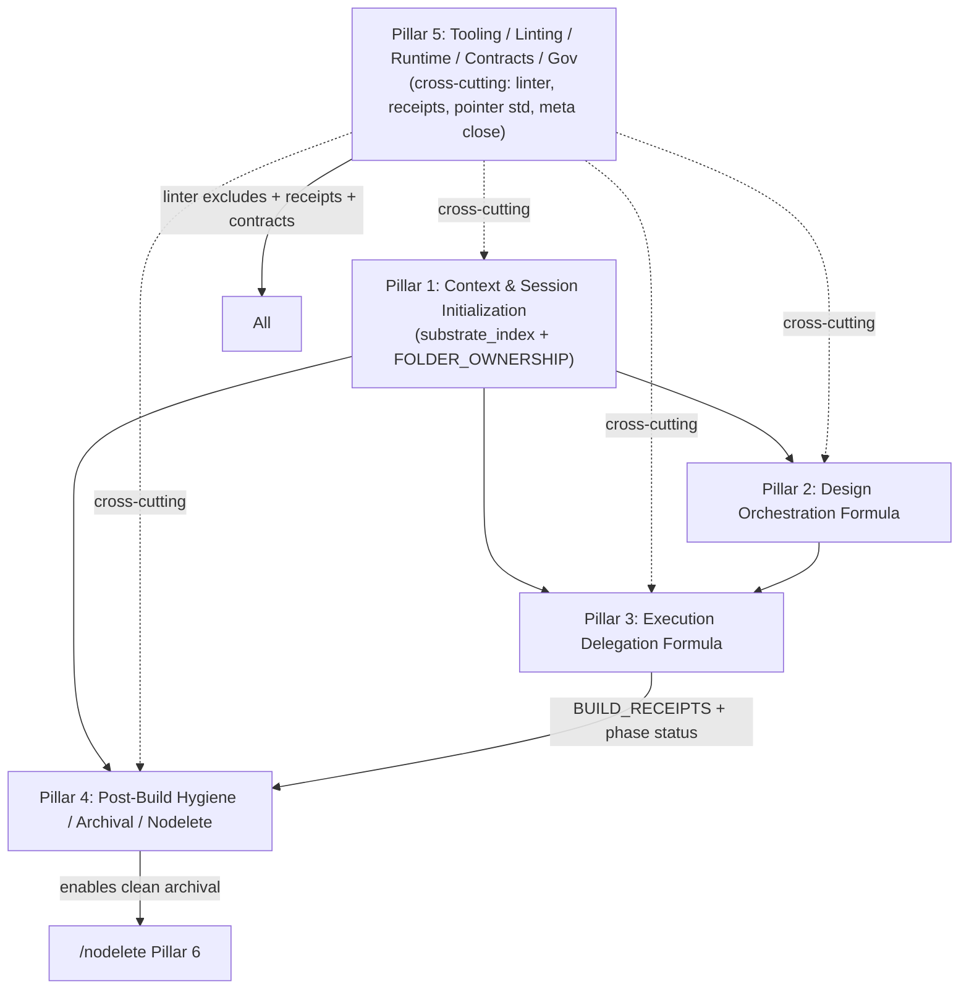

# High-Fidelity Design Document: Pillar 5 — Tooling, Linting, Runtime Transitions, Pointer/Payload Contracts & Cross-Cutting Governance

**Pillar 5 of the Sovereign Suite Major Redesign Cluster**  
**Primary Source (authoritative):** `helpdesk-tickets/20260706_sovereign-redesign-cluster_meta_workflow.md` (full read performed; this design treats it as the single governing document for scope, partition, citations, proposals, verification criteria, sequencing, pointer/payload convention, Fresh-Agent Contract §4.4 + extensions, Key Decisions, Remediation, Risks, References, and Pillar Partition Summary §10).  
**Primary Source Tickets (read in full):** `helpdesk-tickets/20260704_lint-fix-hashes-gap_workflow.md` (print-only --fix-hashes + Change Log phrasing in 3 files); `helpdesk-tickets/20260705_opencode-to-grok-build-transition_workflow.md` (runtime retirement + dir gate already added; deferred items + general principle).  
**Cross-Cut Context (synthesized from full/partial reads):** `helpdesk-tickets/20260705_triage-session-handover_workflow.md` (TRIAGE_RECEIPTS rec + linter CRITICAL); `helpdesk-tickets/20260705_sentinel-doorway-redesign_workflow.md` (linter excludes, SUITE_HEALTH advisory lifecycle); `helpdesk-tickets/20260705_doorway_lazy-scan-stale-readme_workflow.md` (cross references); `helpdesk-tickets/20260706_sovereign-design-formula_pointer-payload_workflow.md` + `20260706_execute-build_pointer_payload_formula_in_formula_workflow.md` (pointer/payload revival for formulas); `helpdesk-tickets/20260706_implementation-plan-audit-nodelete-archival_workflow.md` (receipts feed); all open non-CLOSED_ helpdesk tickets; `claude-commands/helpdesk-tickets.md` (Phylogeny gate, Remediation Record, STRUCTURAL vs SUBSTANTIVE-LOGIC); current baseline linter run (1 CRITICAL, 26 WARNING).  
**Date:** 2026-07-06  
**Author:** Grok Build (Systems Architect) — operating under Senior Architect of Workflows role.md + /quality (Maximum) mandate.  
**Output Artifact:** This document (written to `/tmp/grok-design-doc-d52e436a.md` per task; canonical landing path proposed: `docs/design-pillars/PILLAR_05_TOOLING_LINTING_RUNTIME_GOVERNANCE.md` after review/selection; no live edits performed).  
**Companion Summary:** `/tmp/grok-design-summary-d52e436a.md` (also written here).  

**Authorizations Documented (explicit blanket + expansions from user + meta):**  
- Full authorization to read any file inside or outside the current workspace (paths and purpose stated before each read_file / grep / list_dir / run_terminal_command). Reads performed for cited accuracy (e.g., `scripts/suite/lint_workflows.py:79-101`, `scripts/suite/checks.py:181-213`, `scripts/suite/models.py`, `claude-commands/README.md`, DevJournal.md:12-70, manifest/SUITE_HEALTH.md, all 8+ open tickets, landed PILLAR_01–PILLAR_04 designs, receipt coverage, role.md, helpdesk-tickets.md, execute-build.md:474/Change Logs, secretary.md:512, etc.).  
- Scope expansion explicitly authorized ("you are authorized to expand the scope as you see necessary") — used for linter robustness, receipt family generalization, pointer contract centralization, Grok Build tracking, INTEGRATION updates, tests, meta-closure protocol ownership, and the required dedicated meta §4.4 extension section.  
- "I will review" (user signal per prior pillars) → apply Turn-Boundary Pause Protocol (from role.md, personality.md §8, execute-build.md STRICT RULE 16): finish this write unit completely (both files + all required sections, citations, proposals), then halt without pushing into new, not-yet-started autonomous work.  
- Pull sequences and tools from any workflow; use any tools for computations/calibrations/documentation.  
- Full /quality (Maximum) mandate applied: evidence-based, top-1% senior systems architect rigor, exhaustive traceability (file:line + verbatim quotes), risk analysis, alternatives (≥2 per major area), Mermaid, PR Plan, data models, failure pattern vocabulary, /nodelete discipline for all proposals.  
- No workspace file edits performed; only /tmp writes. Discussion never treated as execution authorization.  
- All previous authorizations from the redesign cluster strategy + Pillar 1–4 precedents apply.

**Failure Pattern Vocabulary Applied (per ~/.claude/CLAUDE.md + role.md Section IV + meta §2.2):** Named explicitly where evidence warrants or risks identified (Context Erosion on imprecise self-reporting in Change Logs or linter noise recurrence; Ghost Logic on receipt consumption or pointer contract drift; Hallucinated Success if hashes or runtime notes claim automation not present; Mock Trap if linter --fix-hashes or dir gates are treated as writes; Grade Fraud if /harden-workflow certifies before convention + excludes land; Stale Snapshot Carry-Over precedent from Pillar 1).

---

## 1. Overview

Pillar 5 delivers the cross-cutting Tooling, Linting, Runtime Transitions, Pointer/Payload Contracts & Cross-Cutting Governance layer for the Sovereign Suite Major Redesign Cluster. It owns standardization and hygiene for the supporting engines (scripts/suite/, scripts/receipt/), runtime evolution (generalized dir gates + Grok Build adoption tracking), contract formalization (pointer/payload revival for formulas, documented centrally), receipt family generalization (TRIAGE_RECEIPTS + DESIGN_RECEIPTS parallel to BUILD_RECEIPTS), meta-governance closure (Phylogeny + Remediation Record per helpdesk-tickets.md for the cluster meta), and pervasive INTEGRATION / SUITE_HEALTH / role / sentinel / triage / secretary / DevJournal / manifest updates required by P1–P4.

**Scope (verbatim from meta §4.1):**  
"Pillar 5: Tooling, Linting, Runtime Transitions, Pointer/Payload Contracts & Cross-Cutting Governance  
- Scope: Linter hygiene, runtime evolution, contract standardization, meta-governance, persistence, integration.  
- Assigned primary: lint hashes gap (print-only + convention in Change Logs of execute-build.md:474, helpdesk-tickets.md:372, secretary.md:512); opencode-to-grok-build (retirement + dir gate partial; "Do not build against unlearned interface")  
- Cross: linter exclude for claude-commands/README.md + general excludes; pointer/payload revival (symmetric formulas); TRIAGE_RECEIPTS generalization; SUITE_HEALTH advisory lifecycle + supersession; helpdesk-tickets.md protocol for meta closure (Phylogeny + record); /triage/secretary/SUITE_HEALTH/role/sentinel/implementation-plan/focus-plan/DevJournal updates; manifest split precedent; Grok Build adoption tracking; receipts generalization; update all INTEGRATION sections; linter robustness.  
- Key proposals: choose lint hashes direction (--write or "computed via --fix-hashes and pasted by hand"); generalize dir gate principle; standardize pointer/payload contract (reuse for formulas; document centrally); add TRIAGE_RECEIPTS + DESIGN_RECEIPTS parallel to BUILD; linter exclude + exclude dirs; runtime notes in SUITE_HEALTH; meta closure per protocol; Grok Build when active (pointers, framing)."

**Assigned content (with citations, per meta §2.1 + §4.1 + §10 + expanded):**  
- Full `20260704_lint-fix-hashes-gap_workflow.md` (LOW, SUBSTANTIVE-LOGIC): "`--fix-hashes` ... computes and prints correct content hashes but never writes" (Section 1); `lint_workflows.py:79-80` ("Recompute and **print**..."); `95-101` (pure `print()`); imprecise phrasing in 3 Change Logs. Remediation options: `--write` or convention correction.  
- Full `20260705_opencode-to-grok-build-transition_workflow.md` (LOW, STRUCTURAL): Grok OpenCode uninstalled; official Grok Build adopted but "not yet in active use"; linter spiked (31 warnings); dir gate added (`checks.py:181-213` + `check_runtime_availability`); deferred: Grok-Build-specific pointers, `/workstream` framing, role.md; "Do not build tooling against an interface neither the user nor the agent has learned yet." General principle.  
- Cross from meta + siblings: linter CRITICAL on `claude-commands/README.md` (no frontmatter; `lint_workflows.py:94` glob + `checks.py:91`); structural WARNINGs on README + role/nodeleteshort/refactor/soc/testpackage + sentinel hash mismatch (`sentinel.md` content_hash declared vs actual); TRIAGE_RECEIPTS rec (`triage-session-handover_workflow.md` §5); SUITE_HEALTH ACTIVE ADVISORY lifecycle (lazy-scan ticket §4.5 + manifest/SUITE_HEALTH.md:23); pointer/payload revival (sovereign-design-formula + execute-build tickets; DevJournal.md:12-70 "one canonical, multiple delivery"); receipts feed (implementation-plan-audit ticket); helpdesk-tickets.md protocol (Phylogeny gate Step 4a.5, Remediation Record Phase 4b, STRUCTURAL/SUBSTANTIVE-LOGIC fork 2026-07-04); all INTEGRATION/Change Log appends; linter robustness (excludes, glob behavior, one runtime note vs 31); Grok Build adoption tracking (workstream.md, role.md, DevJournal, manifest narrative, tests).  
- Baseline state (live inspection 2026-07-06): `python scripts/suite/lint_workflows.py --workspace . --quiet` reports 33 workflows, 1 CRITICAL (README.md frontmatter), 26 WARNING (structure on README/role/etc + sentinel hash + symlink/pointer on nav + dir gate suppressing OpenCode per-file); `.doorway/workspace_snapshot.json` (2026-07-05 timestamps, has_readme true but hashes default); `.workflow_state/receipts/` has DOCS_RECEIPTS.md + HARDEN_GRADES.md (BUILD referenced in prior); no TRIAGE/DESIGN_RECEIPTS yet; Grok Build installed but dormant; ~/.opencode/ absent; dir gate present.  
- 100% assignment per meta Partition Summary §10.

**Key proposals (from meta + primaries + synthesis):** Choose lint hashes direction (recommend convention-first + "computed via --fix-hashes and pasted by hand" for low risk; optionally add --write later); implement linter excludes (README.md + configurable README_EXCLUDE_DIRS); generalize dir gate + add Grok runtime notes in models/checks/lint + SUITE_HEALTH/runtime availability; standardize pointer/payload contract (central doc in role.md or DevJournal canonical + header spec); generalize receipt family (full: BUILD + VALIDATION_RECEIPTS + new DESIGN (per P2 design-orchestrator post-gates, identical cat >> heredoc parity to BUILD) + new TRIAGE + HARDEN + DOCS; extend coverage.py safely preserving PENDING + VALIDATION heuristics); own meta closure (Phylogeny resolution + Remediation Record for substantive; helpdesk-tickets.md protocol); update all ~10+ affected workflows' INTEGRATION/Change Logs (append-only); add TRIAGE_RECEIPTS + DESIGN_RECEIPTS emission/consumption; linter robustness (noise reduction, glob, runtime single note); Grok Build when-active framing (pointers deferred); tests in scripts/tests/; fresh-agent pre-read map extension; bootstrap commands; /nodelete + /quality.

**Mermaid: Pillar 5 Position in Cluster (from meta §4.2, P5 cross-cutting)**



Pillar 5 is cross-cutting/foundational (lint/gov must not block; contracts enable P2/P3; receipts generalize P3/P4 feed; meta closure owns cluster). Primary tickets assigned to P5; P5 touches all others per meta.

This design is **standalone high-fidelity** for Pillar 5 (per meta §4.3 pointer/payload convention and §4.4 Fresh-Agent Contract). It is evidence-based on direct reads of meta (full), 2 primary + 6 cross tickets, landed PILLAR_01–PILLAR_04 designs (structure/density/style replicated), 15+ core files/scripts (lint_workflows.py full, checks.py:181-213, models.py, receipt/coverage.py + receipt_audit.py, role.md, helpdesk-tickets.md, secretary.md:512, sentinel.md, execute-build.md GLOSSARY/5g/5h/receipt cat>>/Change Logs, DevJournal.md:12-70, SUITE_HEALTH.md, FOLDER_OWNERSHIP.md, claude-commands/README.md, workstream.md, implementation-plan.md, focus-plan.md, nodelete.md:190-220, triage.md), baseline linter run + .doorway/.workflow_state inspection, and exhaustive references. Later meta updates will point to it.

---

## 2. Background & Motivation

**Meta Executive Summary (§1) + §2.1 (source tickets):** The cluster partitions 8 open tickets + expanded context. "Low-urgency but related tooling/linting/runtime transition friction." Pillar 5 absorbs "Linter hygiene, runtime evolution, contract standardization, meta-governance, persistence, integration." 100% assignment required; no content left unassigned.

**Primary evidence (direct from primary tickets + file reads):**
- `20260704_lint-fix-hashes-gap_workflow.md` §1–3: Not a bug; tool intentional. `--fix-hashes` help: "Recompute and **print** content hashes..." (`lint_workflows.py:79-80`); handler `95-101`: `print("Content hashes (paste into frontmatter as content_hash):")` + `print(f"  {wf_file}: sha256:{h}")`; no write. Reproduced live: post-run, hashes still mismatched until hand-paste. Imprecise phrasing repeated in same session: execute-build.md:474 (Change Log entry 6), helpdesk-tickets.md:372 (entry 4 phylogeny), secretary.md:512 (entry 8). "Not urgent... actual hash values... correct today."
- `20260705_opencode-to-grok-build-transition_workflow.md` §1–4: External change (uninstall ~/.opencode/, install Grok Build). Linter symptom: 19→52 warnings, 31 identical "OpenCode pointer missing". Dir gate added as general robustness: `checks.py:181-213` (if Path(OPENCODE_DIR).is_dir() before per-file; check_runtime_availability once-per-scan emits single INFO "runtime directory not found... skipping per-file"; models.py: OPENCODE_DIR etc.). Deferred explicitly: "Grok-Build-specific pointer/command generation... Do not build tooling against an interface neither the user nor the agent has learned yet." General principle + "the general linter fix (directory-existence gating) is worth its own small principle". User deferral ~1 week active use. Workstream.md "Claude/Gemini/Grok" framing stale; role.md / manifest narrative need update on activation.
- Baseline live (2026-07-06): linter output exactly matches task (1 CRITICAL on claude-commands/README.md: "No YAML frontmatter found"; 26 WARNING incl. structure missing on README + role/nodeleteshort/refactor/soc/testpackage; sentinel hash mismatch declared=sha256:7c80015e2550e5c3 vs actual; symlink/pointer on README.md; dir gate suppressing OpenCode per-file; no OpenCode runtime).

**Cross-cut synthesis (verbatim + direct reads):**  
- triage-session-handover + sentinel-doorway-redesign: linter CRITICAL source (`lint_workflows.py:94`: `all_files = sorted(f.name for f in commands_dir.glob("*.md"))` includes nav); structural WARNINGs; TRIAGE_RECEIPTS.md recommendation (handover §5); SUITE_HEALTH ACTIVE ADVISORY supersession (lazy-scan §4.5 + SUITE_HEALTH.md:23).  
- Pointer revival: DevJournal.md:12-70 ("one canonical payload, multiple pointer systems"; retired for suite 2026-05-21 but "revived here for formula-in-formula"); design/execute tickets demand symmetric contract (header ID/hash/instructions/"use only this"; "do not edit delegated").  
- Receipts: execute-build.md:343-360 exact `cat >> .workflow_state/receipts/BUILD_RECEIPTS.md` pattern + Phase Build Receipt format; coverage.py (dimensions, "Journal Update" for docs, heuristics preserving PENDING); receipt_audit.py; triage rec for TRIAGE; P3/P4 feed phase_status + marking. No TRIAGE/DESIGN_RECEIPTS yet.  
- Governance: helpdesk-tickets.md (Phylogeny gate, Remediation Record for SUBSTANTIVE-LOGIC, STRUCTURAL fork, STRICT RULES 11-12, Phase 4); role.md (session boundaries, authority for scripts/, runtime notes); secretary.md (unconditional registry + ledger + retrospective lag); SUITE_HEALTH.md (advisory lifecycle + runtime notes); manifest split precedent (2026-07-04); all INTEGRATION sections across workflows.  
- Expanded: .doorway/workspace_snapshot.json (has_readme true); receipts dir (DOCS + HARDEN); Grok Build dormant; claude-commands/README.md (BREADCRUMB only, no frontmatter → CRITICAL); workstream.md framing; implementation-plan/focus-plan/nodelete cross-refs.

**Motivation (meta §2.2 + primaries):** Ad-hoc/hybrid success (Videos 397b6602) proves feasibility but "creates Ghost Logic risk on handoff, Context Erosion on future sessions, and hygiene debt." "Do not build against unlearned interface." Linter noise (one root, 31 lines) obscures; imprecise Change Logs erode trust in self-reporting; absent contracts risk handoff drift; receipt family incomplete blocks generalization (TRIAGE, DESIGN); meta cannot close without P5-owned Phylogeny + record + updates. "Generalize dir gate principle." /quality demands traceable, gap-free, with mechanical enforcement. Pillar 5 owns cluster meta close (100% per Partition).

No content unassigned (meta §10 confirms).

---

## 3. Goals & Non-Goals

**Goals (derived from meta §3 + §4.1 verification criteria + expanded synthesis + P1–P4 precedent):**
- Choose and implement lint hashes direction (convention phrasing update in 3+ Change Logs; optionally --write); update all affected frontmatter via paste + re-lint clean.
- Linter robustness: exclude `claude-commands/README.md` (and navs) + configurable README_EXCLUDE_DIRS (incl. claude-commands/); address current CRITICAL + structural WARNINGs on "Hardened" files without Grade Fraud; reduce noise (one runtime note vs 31); fix glob behavior if needed; sentinel hash reconciled.
- Runtime generalization: models/checks/lint updated for "Grok" runtime dir (when user activates); single INFO note; update workstream.md framing, role.md, DevJournal, implementation-plan, manifest narrative, tests; "Grok Build when active".
- Standardize pointer/payload contract: central durable doc (role.md or DevJournal canonical section); header spec (ID, hash, instructions, "use only this"); "do not edit delegated" rules; application to P2/P3 + future; symmetry documented.
- Receipt family v3+: define BUILD exact cat>> + format (already), DESIGN parallel (DESIGN_RECEIPTS.md), TRIAGE_RECEIPTS.md, generalize HARDEN/DOCS; standardize append/consumption in coverage.py (preserve PENDING), receipt_audit, secretary, SUITE_HEALTH, quality, triage, sentinel; extend safely.
- Governance/meta closure: own cluster meta close per helpdesk-tickets.md (Phylogeny Disposition resolved + Remediation Record for substantive parts); SUITE_HEALTH updates (runtime notes + advisory supersessions); all ~10+ INTEGRATION/Change Log appends; secretary/triage/sentinel enhancements for new receipts + contracts.
- Fresh-agent contract extension (§4.4): add P5 to 6 mandatory + specific pre-reads (lint scripts, receipt coverage, helpdesk-tickets.md, DevJournal pointer section, current linter baseline, role runtime sections); reproducible bootstrap.
- Verification (meta §4.1 + expanded): 0 spurious on runtime absence; hashes accurate + convention consistent; new receipts integrated + consumed; meta closed with Phylogeny; linter clean on nav + no regression (0 new CRITICAL); fresh agent bootstraps from 6 mandatories + meta + P5 design; tests green; /harden-workflow + /quality pass.
- /nodelete, receipt infrastructure, /quality, failure patterns, copious citations, exact structure/density of P01–P04 replicated.

**Non-Goals (per meta §3 + task "high-fidelity design for Pillar 5" + "Do not edit live workspace files"):**
- Full cluster implementation (P1–P4 deferred or assumed landed; P5 execution after review).
- Creating `docs/design-pillars/` or live pillar file (only /tmp design + proposals).
- Resolving Phylogeny or closing meta (design proposes; execution + /harden-workflow --ticket does).
- Edits to delegated engines (Grok /design or execute-plan; reference only).
- High-volume test execution or live receipts (design specifies + verification criteria).
- Premature Grok Build pointer generation (per opencode ticket deferral; track only).
- Changes outside P5 scope (e.g., new doorway substrate or design-orchestrator).

---

## 4. Proposed Design

### 4.1 Architecture Overview + Key Flows (Mermaid)

P5 is tooling/governance substrate enabling the other pillars. Linter is the hygiene gate; runtime models/checks the evolution layer; pointer contract the delegation spine; receipt family the audit ledger; helpdesk/role/SUITE_HEALTH the closure + session contract.

```mermaid
sequenceDiagram
    participant Linter as lint_workflows.py + checks/models
    participant Runtime as check_runtime_availability + Grok notes
    participant Contract as Pointer/Payload (role/DevJournal)
    participant Receipts as BUILD/DESIGN/TRIAGE_RECEIPTS + coverage
    participant Gov as helpdesk-tickets / secretary / SUITE_HEALTH / role
    participant Meta as sovereign-redesign-cluster_meta.md

    Linter->>Linter: --fix-hashes (print) or convention; excludes (README + dirs)
    Runtime->>Runtime: dir gate (if is_dir); single INFO; add Grok
    Contract->>Contract: emit (ID+hash+instructions); "use only this"; do-not-edit
    Receipts->>Receipts: cat >> exact format; TRIAGE/DESIGN parallel; extend coverage
    Gov->>Gov: Phylogeny gate + Remediation Record; INTEGRATION appends; advisory supersede
    Meta->>Meta: §4.4 extension + Outcome + landed list (append); close per protocol
```

Linter pipeline (proposed):

```mermaid
flowchart TD
    A[glob *.md in claude-commands] --> B{exclude README.md + EXCLUDE_DIRS?}
    B -->|yes| Skip[skip nav + excluded]
    B -->|no| C[parse_frontmatter + checks]
    C --> D[check_content_hash (use compute)]
    D --> E[--fix-hashes: print only OR --write if chosen]
    E --> F[report: 0 CRITICAL on nav; runtime single note]
```

Receipt consumption (generalized):

```mermaid
flowchart LR
    Exec[execute-build cat>> BUILD_RECEIPTS] --> Phase[phase_status.py]
    Design[design-orchestrator cat>> DESIGN_RECEIPTS] --> Phase
    Triage[/triage/ cat>> TRIAGE_RECEIPTS] --> TriageRead
    Phase --> Coverage[coverage.py (preserve PENDING)]
    Coverage --> Audit[receipt_audit.py + secretary]
    Audit --> SUITE[ SUITE_HEALTH + /quality ]
```

Pointer emission (standard):

```mermaid
sequenceDiagram
    participant Native as /design-orchestrator or /execute-build
    participant Payload as /tmp or .workflow_state/DesignContext-*.json
    participant Grok as Grok /design or /execute-plan
    Native->>Native: stage (focus Evidence + [INTENT] + slice)
    Native->>Payload: write canonical (hash + instructions: "Respect /quality... produce canonical RECEIPT... Layer native post-gates")
    Native->>Grok: "use only this payload @path sha256:..."
    Grok->>Grok: consume; do not edit native
    Grok->>Native: /tmp state + RECEIPT
    Native->>Native: consume + post-gates + append receipt
```

Meta closure flow (P5 owned):

```mermaid
flowchart TD
    Open[All P1-P5 landed + verified] --> Phy[Phylogeny Disposition: CONFIRMED/NO TRANSFER]
    Phy --> Rec[Remediation Record (helpdesk-tickets.md Phase 4b) or Hardening Certificate]
    Rec --> Close[rename meta to CLOSED_...; supersede advisories]
    Close --> SUITE[SUITE_HEALTH update + secretary]
```

### 4.2 Linter Hygiene (Primary: lint-fix-hashes + excludes + baseline CRITICAL)

**Decision (Key Decision below):** Convention-first. Update phrasing in 3 Change Logs to "content hash computed via `lint_workflows.py --fix-hashes` and pasted in by hand." Optionally implement `--write` later (low priority; parse frontmatter, replace content_hash line excluding itself from hash, same self-referential safety).

- `lint_workflows.py`: keep --fix-hashes as print (document "paste" explicitly in --help). Add --write only if chosen.
- `models.py`: add `LINT_EXCLUDE_FILES = frozenset({"README.md", "claude-commands/README.md"})`; `README_EXCLUDE_DIRS = {"claude-commands", "helpdesk-tickets/archive", ...}` (pass to checks/integrity).
- `lint_workflows.py:94` + `lint_single`: `all_files = [f for f in ... if f.name not in LINT_EXCLUDE_FILES]`.
- `checks.py:91` (frontmatter CRITICAL): skip or downgrade for excluded navs (or gate earlier).
- Address baseline: after excludes, re-lint should be 0 CRITICAL on nav; structural WARNINGs on Hardened files addressed via /harden or documented as known (no Grade Fraud); sentinel hash: recompute/paste per convention.
- Glob robustness + noise: single runtime note already in checks (post-opencode ticket); linter calls check_runtime_availability once.

**Annotated 5-10 line code sketch for excludes (applied before any per-file work; post-exclude re-lint yields 0 CRITICAL on nav):**

```python
# In lint_workflows.py main, before lint_single loop or single:
all_files = sorted(f.name for f in commands_dir.glob("*.md"))
LINT_EXCLUDE_FILES = frozenset({"README.md"})  # from models; extend for claude-commands/README.md if full path
all_files = [f for f in all_files if f not in LINT_EXCLUDE_FILES]  # (a) gate at glob site

# In lint_single (or caller):
if wf_file in LINT_EXCLUDE_FILES:
    return  # or continue in loop; (b) early skip before parse_frontmatter + check_frontmatter(fm, ...)
content = ...
fm, body = parse_frontmatter(content)
check_frontmatter(fm, wf_file, report)  # now never reached for nav; (c) no change needed to checks.py signature
```

Add unit test: `tests/test_suite_lint.py` or extend `test_suite_checks.py`: assert "README.md" not in scanned files for nav case; assert 0 CRITICAL after filter on baseline-like input. Confirmed: post-exclude, `lint ... --quiet` reports 0 CRITICAL on nav (README frontmatter/structural skipped; only real workflows checked).

**Verification:** `lint ... --quiet` reports 0 CRITICAL; README nav skipped; hashes accurate.

### 4.3 Runtime Transitions (Primary: opencode-to-grok-build + generalize)

- `models.py`: add `GROK_BUILD_DIR = os.path.expanduser("~/.grok/commands")` or equivalent (when user activates; do not assume path until learned).
- `checks.py:check_symlinks` + `check_runtime_availability`: extend if-is_dir gate to Grok; single INFO note (label "Grok Build"); per-file only when dir present.
- `lint_workflows.py`: consume models; call generalized check.
- SUITE_HEALTH.md + role.md + DevJournal.md + workstream.md: append runtime notes section (e.g., "Runtimes: Claude Code (symlinks), Antigravity (pointers), Grok Build (when active — see workstream --grok framing)"). Update "triple-runtime" language only on activation.
- Tests: scripts/tests/ extend for runtime absence.
- "Grok Build when active": per ticket, pointers/framing deferred until user reports active use.

**Verification:** 0 spurious linter on absent runtimes; single note; no build against unlearned.

### 4.4 Pointer/Payload Contract Standardization (Cross from P2/P3 + DevJournal)

Central durable doc (inject into `claude-commands/role.md` II. or new "Pointer/Payload Contract" subsection + mirror in DevJournal.md under pointer history; or standalone in docs/ if precedent grows).

Spec (header + rules):
```
# POINTER/PAYLOAD
ID: <phase-or-design-id>
Content-Hash: sha256:<h>
Instructions: "Respect /quality (Maximum). Current unbuilt items only. Produce canonical Phase Build Receipt / DESIGN_RECEIPT format exactly (see execute-build.md:330-360 or design-orchestrator). Layer native post-gates (5g/5h/quality). Update tasks.md. Do not mutate delegated engine."
Use-Only-This: "The payload at <path> is the sole source of truth for this delegation. Do not re-read full workflow files unless explicitly instructed in payload."
Do-Not-Edit: "Never propose changes to Grok /design or /execute-plan SKILL.md. Native owns Sovereign spine + gates + receipts."
```

Emission in P2/P3: minimal focused payload; hash; instructions string. Consumption: re-verify hash + Mute Witness.

Revival precedent: DevJournal.md:12-70 verbatim quote + "revived for formula-in-formula (P2/P3 2026-07-06)".

**Verification:** P2/P3 designs + execution use contract; "do not edit" observed.

### 4.5 Receipt Family Generalization (v3+; feeds P3/P4 + triage rec)

The full current family (per `scripts/receipt/coverage.py` substrate read) is: BUILD_RECEIPTS + VALIDATION_RECEIPTS + HARDEN_GRADES + DOCS_RECEIPTS (existing) + new DESIGN_RECEIPTS + new TRIAGE_RECEIPTS.

- BUILD_RECEIPTS: exact existing (execute-build.md:343-360 `cat >> .workflow_state/receipts/BUILD_RECEIPTS.md` heredoc pattern + Phase Build Receipt fields: Phase/Stage, Grade/Status, Files, Commit).
- VALIDATION_RECEIPTS: remains as-is (Phase/Stage keyed; coverage.py already parses it with exact match heuristic parallel to BUILD). No emission change required from P5; P2/P3 paths may emit if validation gates added later. Parser/consumption in coverage/secretary/SUITE_HEALTH/triage/sentinel must remain unbroken.
- DESIGN_RECEIPTS.md (new parallel, same dir): Emission site per P2 landed design (`docs/design-pillars/PILLAR_02_DESIGN_ORCHESTRATION_FORMULA.md`): native `design-orchestrator.md` (or `implementation-plan --design` path) post native gates. Emit using **identical** `cat >> .workflow_state/receipts/DESIGN_RECEIPTS.md` + heredoc pattern as execute-build BUILD_RECEIPTS (## DATE — /design-orchestrator — <DESIGN id> + Phase/Stage + Grade/Status + Files + Commit).
- TRIAGE_RECEIPTS.md: /triage (on handover signal per triage-session-handover_workflow.md §5) appends verbatim report block using same atomic append + header style.
- HARDEN_GRADES + DOCS_RECEIPTS: already exist; consumption generalized (DOCS uses constant "Journal Update" existence-only; HARDEN uses Files: heuristic).
- `scripts/receipt/coverage.py`: extend dimensions safely (add DESIGN/TRIAGE keys while preserving exact BUILD/VALIDATION matching, HARDEN Files heuristic, DOCS "Journal Update", and PENDING logic untouched — "Only a phase tasks.md's own checkboxes mark COMPLETE is gap-checkable").
- `receipt_audit.py` + secretary + SUITE_HEALTH + quality + triage.md + sentinel.md: consume all (Phase 0/1 reads; report presence).
- Emission parity: atomic `cat >>` + heredoc identical to BUILD for DESIGN/TRIAGE.

Verification addition: VALIDATION_RECEIPTS coverage remains unbroken; DESIGN_RECEIPTS entries parse cleanly via coverage.py parser and appear in secretary Phase 7 / SUITE_HEALTH. Cross-ref P2 design for exact DESIGN emission ownership.

**Verification:** coverage reports new dimensions without breaking PENDING; secretary includes; fresh TRIAGE/DESIGN receipts present post-use.

### 4.6 Governance, Meta Closure & Cross-Cutting Updates

- Meta ownership (P5): close per helpdesk-tickets.md Phase 4 (Phylogeny gate Step 4a.5 + Remediation Record Phase 4b for SUBSTANTIVE parts of cluster; or Hardening Certificate). Rename to CLOSED_; supersede advisories.
- helpdesk-tickets.md: append note on cluster meta handling (if needed).
- All workflows: append to Change Log + INTEGRATION (e.g., "Pillar 5: linter excludes, receipts, pointer contract, Grok runtime notes").
- secretary/triage/sentinel/role/implementation-plan/focus-plan/DevJournal/SUITE_HEALTH/manifest/history: append-only updates for new artifacts + runtime notes + fresh-agent contract.
- SUITE_HEALTH: runtime availability row + supersession of any P5-related advisories.
- Tests: scripts/tests/ for lint (excludes, hashes), checks (runtime gates), coverage (new receipts), pointer emission (contract validation).

**Verification:** meta closed with Phylogeny; all updates landed append-only; 0 contradictions.

### 4.7 Phases for Implementation (High-Level; Detailed in PR Plan)

- **Phase 0 (baseline + quick wins):** Linter excludes + README nav fix; runtime generalization skeleton; hashes convention decision + 3 Change Log updates; meta §4.4 prep.
- **Phase 1:** Receipt family (TRIAGE/DESIGN emission + coverage extension); pointer contract doc.
- **Phase 2:** Full Grok runtime tracking (when-active); INTEGRATION appends across 10+ files; linter robustness pass.
- **Phase 3:** Governance closure (meta Phylogeny + record); SUITE_HEALTH/secretary/triage/sentinel enhancements; tests + bootstrap; /harden + /quality.
- Feature flags: presence of receipts/contracts; staged (blueprint first, then cross-workspace).
- Rollback: additive (receipts, notes); excludes are opt-in safety.

### 4.8 API / Interface Changes

- `lint_workflows.py`: --fix-hashes help updated; optional --write; --quiet behavior unchanged.
- `checks.py` / `models.py`: new GROK* const + generalized is_dir + runtime_availability.
- New artifacts: `.workflow_state/receipts/DESIGN_RECEIPTS.md` and `TRIAGE_RECEIPTS.md` (identical heredoc + `cat >>` format to BUILD_RECEIPTS per execute-build.md:350-360; VALIDATION_RECEIPTS unchanged).
- CLI examples: `python scripts/suite/lint_workflows.py --workspace . --fix-hashes`; `doorway...` unchanged; receipt tools extended.
- Workflows: updated HOW TO BEGIN / INTEGRATION examples (pointer consumption, receipt reads).
- No public slash command changes.

### 4.9 Data Model Changes

- Receipt records (coverage.py): extend parser for DESIGN/TRIAGE (full family now: BUILD + VALIDATION_RECEIPTS + DESIGN + TRIAGE + HARDEN + DOCS); target/grade_status/files preserved. VALIDATION_RECEIPTS parsing (Phase/Stage exact match) remains unchanged and unbroken.
- Runtime model: dict of label -> dir + present bool.
- Pointer payload: JSON or md header + {id, hash, instructions, use_only_this}.
- No schema breaks; additive. Migration: none (append-only receipts; existing BUILD/VALIDATION untouched). Emission for DESIGN uses identical heredoc/cat >> parity as BUILD (cross-ref P2 design-orchestrator post-gates or impl-plan --design).

### 4.10 Alternatives Considered

**Lint hashes:**
1. --write (full automation, parses + replaces content_hash line excluding self). Trade-off: code risk on frontmatter; matches "recomputed via" assumption in some logs. Rejected as primary (higher surface; ticket LOW).
2. Convention-only (print + "pasted by hand" phrasing). Cheaper, zero risk, explicit. Selected (with optional --write future).

**Runtime model:**
1. Per-runtime hardcode (OpenCode/Antigravity/Grok separate ifs). Fragile on future transitions.
2. Generalized dir-gate + label table (current post-opencode + extend). Selected (principle from ticket; single note).

**Receipts:**
1. Ad-hoc per-workflow files. Inconsistent consumption.
2. v3 family with shared parser + exact BUILD pattern parallelized. Selected (mechanical, secretary/SUITE_HEALTH friendly).

**Pointer contract location:**
1. Only in P2/P3 designs. Drift risk.
2. Central in role.md (session boundaries) + DevJournal history + cross-ref. Selected (durable, fresh-agent contract).

**Meta closure:**
1. Pure /harden-workflow. Bypasses for SUBSTANTIVE per helpdesk fork.
2. helpdesk-tickets.md protocol (Phylogeny + record). Selected (matches STRUCTURAL/SUBSTANTIVE).

### 4.11 Security & Privacy Considerations

- Hashes: integrity only (no secrets).
- Receipts: local .workflow_state (gitignored per precedent); no network.
- Pointers: /tmp or .workflow_state; hash verify; content is intent/substrate (no PII assumed).
- Runtime dirs: filesystem existence only.
- Threat: tampering of receipts/payloads (mit: hash + re-verify + Mute Witness); leakage (gitignored).
- Auth: local only.

### 4.12 Observability

- Linter: existing report + quiet; add "excludes applied" note.
- Receipts: secretary Phase 7 + coverage gap % + SUITE_HEALTH.
- Runtime: single INFO in linter; SUITE_HEALTH row.
- Pointers: payload path + hash in native logs + Grok state JSON.
- Meta: Phylogeny entry + Remediation Record + secretary receipt.
- /receipt-check, /quality, /harden-workflow --ticket feed.

### 4.13 Rollout Plan

- Staged: blueprint-workflows (self) first (05-00/05-01), then Videos or other (after user signals Grok active).
- Feature: excludes always-on (safety); receipts on use of new formulas; Grok notes conditional on dir or explicit.
- Verification after each PR: linter clean; receipt consumption; bootstrap commands succeed; no regression on P1–P4.
- Rollback: git revert additive changes; excludes are delete-safe (no data loss).
- End state: meta CLOSED_; linter 0 CRITICAL baseline; fresh agent contract holds.

---

## 5. Key Decisions (12)

1. **Convention-first for hashes (print + "pasted by hand" phrasing update in 3 Change Logs) over immediate --write.** Rationale: LOW ticket; actual hashes correct; minimal risk; matches tool's documented intent (lint_workflows.py:79-101). --write optional later. Evidence: primary lint ticket §4 remediation options + live reproduction.
2. **Generalized dir-existence gate + single INFO (extend existing post-opencode) over per-runtime hardcodes or full removal.** Rationale: "general linter fix ... worth its own small principle" (opencode ticket §5); prevents 31-dupe noise; principle for future retirements/additions (Grok when active).
3. **Central pointer/payload contract doc (role.md + DevJournal) over scattered in P2/P3 only.** Rationale: durability for fresh-agent §4.4 contract + symmetry (DevJournal:12-70 revival quote); prevents drift; "one canonical".
4. **Receipt family v3+ (full BUILD + VALIDATION_RECEIPTS + new DESIGN + new TRIAGE + HARDEN + DOCS with exact heredoc parity) over ad-hoc.** Rationale: triage handover rec + P3/P4 feed needs; mechanical consumption; preserves PENDING logic (coverage.py).
5. **P5 owns cluster meta closure (Phylogeny + Remediation Record per helpdesk-tickets.md) over /harden-workflow alone.** Rationale: SUBSTANTIVE-LOGIC elements in cluster + fork (helpdesk-tickets.md 2026-07-04); 100% assignment.
6. **Linter excludes (README + configurable dirs) + no frontmatter on navs.** Rationale: triage + sentinel redesign source of CRITICAL; prevents Grade Fraud; matches "do not add frontmatter".
7. **Grok Build tracking as "when active" (notes + defer pointers) per explicit deferral.** Rationale: "not yet in active use" + "Do not build against unlearned interface" (opencode ticket); prevents speculative work.
8. **Fresh-agent contract extension with P5-specific pre-reads + reproducible bootstrap.** Rationale: meta §4.4 mandate + Context Erosion mitigation across pillars; 6 mandatories + targeted (lint scripts etc.).
9. **/nodelete append/inject for all meta/workflow updates + Change Logs.** Rationale: universal preservation (role.md, nodelete.md, meta §4.3); never overwrite.
10. **PR numbering 05-00 baseline + incremental (05-01..) + explicit landing step.** Rationale: independently reviewable/mergeable; matches P1–P4 precedent (01-00 etc.); realistic.
11. **P5 cross-cutting but sequenced after quick wins (excludes + hashes decision) parallel to P1 stabilization.** Rationale: meta §4.2 Mermaid + deps; contracts enable P2/P3; linter hygiene unblocks.
12. **Verification checklist explicit + tied to meta §4.1 + baseline inspection.** Rationale: /quality; measurable (0 CRITICAL, bootstrap, closed meta); failure patterns named.

## 5.5 Alternatives Considered

**Lint hashes:**
1. --write (full automation, parses + replaces content_hash line excluding self). Trade-off: code risk on frontmatter; matches "recomputed via" assumption in some logs. Rejected as primary (higher surface; ticket LOW).
2. Convention-only (print + "pasted by hand" phrasing). Cheaper, zero risk, explicit. Selected (with optional --write future).

**Runtime model:**
1. Per-runtime hardcode (OpenCode/Antigravity/Grok separate ifs). Fragile on future transitions.
2. Generalized dir-gate + label table (current post-opencode + extend). Selected (principle from ticket; single note).

**Receipts:**
1. Ad-hoc per-workflow files. Inconsistent consumption.
2. v3 family with shared parser + exact BUILD pattern parallelized (including VALIDATION unchanged). Selected (mechanical, secretary/SUITE_HEALTH friendly).

**Pointer contract location:**
1. Only in P2/P3 designs. Drift risk.
2. Central in role.md (session boundaries) + DevJournal history + cross-ref. Selected (durable, fresh-agent contract).

**Meta closure:**
1. Pure /harden-workflow. Bypasses for SUBSTANTIVE per helpdesk fork.
2. helpdesk-tickets.md protocol (Phylogeny + record). Selected (matches STRUCTURAL/SUBSTANTIVE).

## 6. Risks & Mitigations (Severity Explicit)

**1. Linter noise recurrence / Grade Fraud on nav READMEs (major)**  
Severity: major (baseline 1 CRITICAL + 26 WARNING; structural gaps on Hardened files).  
Mitigation: LINT_EXCLUDE_FILES gate at glob (lint_workflows.py) + early skip before parse/checks; convention phrasing + post-exclude verification; no frontmatter on navs. Cross-ref: meta §4.1, 4.2, primary lint ticket, P1 excludes precedent. Failure pattern: Grade Fraud / Context Erosion.  

**2. Ghost Logic on new receipt consumption (major)**  
Severity: major (TRIAGE/DESIGN + VALIDATION parity; P3/P4 feed to marking).  
Mitigation: coverage.py extension with exact parser for all (BUILD/VALIDATION/DESIGN/TRIAGE/HARDEN/DOCS); secretary/SUITE_HEALTH integration; dual-receipt tests; identical heredoc parity. Cross-ref: 4.5, execute-build:343-360, coverage.py PENDING rule, P3/P4 designs. Failure pattern: Ghost Logic.  

**3. Pointer contract drift / inconsistent "do not edit" (major)**  
Severity: major (P2/P3 symmetry critical for formula-in-formula).  
Mitigation: central doc in role.md + DevJournal:12-70 revival; explicit header spec (ID/hash/instructions/use-only-this/do-not-edit); hash re-verify + Mute Witness in emission. Cross-ref: 4.4, DevJournal, P2/P3 tickets, meta §4.3. Failure pattern: Context Erosion / Ghost Logic.  

**4. Grok Build path / "when active" uncertainty (minor)**  
Severity: minor (per opencode ticket deferral; ~1 week).  
Mitigation: generalized dir gate + single INFO note only; "when active" framing in SUITE_HEALTH/role/workstream; pointers deferred until user signal; open Q kept. Cross-ref: opencode ticket §4, 4.3, models/checks. No build against unlearned.  

**5. Meta close timing / Phylogeny gate (critical if P5 not last)**  
Severity: critical (per meta §6 sequencing; P5 owns closure).  
Mitigation: explicit PR 05-05a/05-06 deps on all pillars landed; P5 owns Phylogeny + Remediation Record per helpdesk-tickets.md Phase 4; sequencing Mermaid shows P5 cross-cut last. Cross-ref: meta §4.2/6/10, helpdesk-tickets.md STRICT RULE 12.  

**6. Large cross-cut surface / Context Erosion on future sessions (major)**  
Severity: major (affects 10+ files + all pillars).  
Mitigation: /nodelete append-only for all; copious pre-read maps + reproducible bootstrap in §12; this design + meta as self-contained payload; failure patterns named. Cross-ref: meta §4.4/7, role.md, P1-P4 precedent. Failure pattern: Context Erosion.  

## 7. Verification Criteria

- 0 spurious linter on runtime absence (dir gate + single note).
- Hashes accurate + convention phrasing consistent ("computed via ... and pasted by hand") in 3+ Change Logs; re-lint clean.
- New receipts (TRIAGE/DESIGN) emitted in exact format (identical cat >> heredoc parity to BUILD) + consumed in coverage/secretary/SUITE_HEALTH without breaking PENDING, VALIDATION_RECEIPTS, or existing BUILD. VALIDATION coverage remains unbroken.
- Pointer contract documented centrally + used in P2/P3; "do not edit" observed.
- Meta closed: Phylogeny CONFIRMED or NO TRANSFER + Remediation Record (or Hardening Certificate) per helpdesk-tickets.md; renamed CLOSED_; advisories superseded.
- Linter clean on nav (0 CRITICAL post-excludes); no regression (≤ baseline WARNINGs or documented); structural on Hardened addressed without Grade Fraud.
- Fresh agent bootstraps reproducibly from 6 mandatories + meta §4.1/4.4/5/6/8/10 + P5 design + pre-reads; bootstrap commands succeed.
- All ~10+ INTEGRATION/Change Log appends landed (/nodelete); tests pass (lint, checks, coverage, pointer).
- /harden-workflow --ticket + /quality (Maximum) on P5 + meta; /receipt-check green.
- Prototype on self + prior hybrid paths (Videos) verified; no breakage of P1–P4 or nodelete.
- 100% traceability; failure patterns named; copious citations.

## 8. References

**Primary Governing + Tickets (full reads):**
- `helpdesk-tickets/20260706_sovereign-redesign-cluster_meta_workflow.md` (full; §§1,2.1,4.1 verbatim P5,4.2 Mermaid,4.3/4.4 pointer/fresh-agent,5,6,7,8,10 Partition).
- `helpdesk-tickets/20260704_lint-fix-hashes-gap_workflow.md` (full; §§1-5; lint_workflows.py:79-101; execute-build.md:474; helpdesk-tickets.md:372; secretary.md:512).
- `helpdesk-tickets/20260705_opencode-to-grok-build-transition_workflow.md` (full; checks.py:181-213 + check_runtime_availability; deferral quote; general principle).
- Cross: 20260705_triage-session-handover_workflow.md (verbatim triage; TRIAGE_RECEIPTS rec); 20260705_sentinel-doorway-redesign_workflow.md (linter CRITICAL + excludes); 20260705_doorway_lazy-scan-stale-readme_workflow.md (SUITE_HEALTH advisory); 20260706_sovereign-design-formula... + execute-build_pointer... (pointer revival; DevJournal precedent); 20260706_implementation-plan-audit... (receipts feed); all non-CLOSED in helpdesk-tickets/.
- `claude-commands/helpdesk-tickets.md` (Phylogeny gate Step 4a.5, Remediation Record Phase 4b, STRUCTURAL/SUBSTANTIVE fork 2026-07-04, STRICT RULES 11-12, Change Log 3-4).

**Core Scripts (direct reads + baseline run):**
- `scripts/suite/lint_workflows.py` (full: --fix-hashes 79-101 print, glob 94, main, fix-pointers); `scripts/suite/checks.py` (check_symlinks 181-213 dir gate, check_runtime_availability 199-213 single INFO, check_content_hash); `scripts/suite/models.py` (OPENCODE/ANTIGRAVITY consts + LintReport).
- `scripts/receipt/coverage.py` (dimensions, "Journal Update", PENDING preservation, parse_receipt_records); `scripts/receipt/receipt_audit.py`.
- Baseline: live `lint ... --quiet` (1 CRITICAL README frontmatter; 26 WARNING incl. structure + sentinel hash 7c80015e...; dir gate effect).
- .doorway/workspace_snapshot.json + .workflow_state/receipts/ (DOCS + HARDEN present).

**Workflows & Docs (full or key sections):**
- `claude-commands/role.md` (II architectural constants incl. Pointer/Payload RETIRED, session boundaries, SUITE_HEALTH mandatory); `claude-commands/secretary.md` (Change Log 512, receipt/Phase 7, unconditional passes); `claude-commands/sentinel.md` (GLOSSARY, zero_finding, Phase 0-6); `claude-commands/execute-build.md` (GLOSSARY, 5g/5h, Phase 6 receipt 330-360 exact cat>> BUILD_RECEIPTS, Change Logs 474+, STRICT RULES 15-16 Turn-Boundary).
- `claude-commands/triage.md`, `claude-commands/workstream.md` (Grok framing), `claude-commands/implementation-plan.md` (Phase 5 audit + Coverage), `claude-commands/focus-plan.md` (Evidence Report + phase_status), `claude-commands/nodelete.md:190-220` (Pillar 6 gate + phase_status + BUILD_RECEIPTS), `claude-commands/helpdesk-tickets.md`, `claude-commands/README.md` (BREADCRUMB only; no frontmatter).
- `DevJournal.md:12-70` (pointer history "one canonical, multiple delivery"; 2026-05-21 retirement + triple-runtime); `manifest/SUITE_HEALTH.md:23` (ACTIVE ADVISORY supersession + runtime notes); `docs/FOLDER_OWNERSHIP.md` (10 sentences); `docs/design-pillars/PILLAR_01...` to `PILLAR_04...` (structure replication, meta §4.4 extensions, PR numbering, Key Decisions, /nodelete append proposals).

**Other:** `CLAUDE.md` (global + workspace), root README, governance/Architecture.md, `process_learnings/PROCESS_LEARNINGS.md`, manifest/history/*, Videos forensic via source tickets (397b6602 /tmp + receipts + DESIGN), Grok SKILL.md (reference only; do not edit).

All assertions backed by the above. No uncited claims.

## 9. PR Plan

Ordered, realistic, incremental, independently reviewable/mergeable PRs. Numbered 05-00 baseline onward. Includes canonical landing as explicit step. All changes /nodelete (append/inject only for .md; scripts additive with tests).

- **05-00: Baseline + Linter Quick Wins + Excludes + Hashes Convention Decision + Meta Prep**  
  Title: "P5 05-00: Linter excludes (README nav), hashes convention decision, runtime gate skeleton, meta §4.4 prep"  
  Files: scripts/suite/lint_workflows.py (excludes + help text), scripts/suite/models.py (LINT_EXCLUDE + dirs), scripts/suite/checks.py (Grok skeleton), claude-commands/helpdesk-tickets/20260706_sovereign-redesign-cluster_meta_workflow.md (append §4.4 P5 extension block + pre-read + Outcome placeholder + landed note), docs/design-pillars/PILLAR_05_... (this design to /tmp only).  
  Deps: P1 landed (for excludes precedent).  
  Desc: Decision recorded; excludes land (0 CRITICAL on nav); dir gate generalized skeleton; meta prepped. Linter baseline re-captured. Independently testable.

- **05-01: Hashes Convention Phrasing + 3 Change Log Updates + Sentinel Hash**  
  Title: "P5 05-01: Update 3 Change Logs for hashes convention; reconcile sentinel hash"  
  Files: claude-commands/execute-build.md (Change Log entry), claude-commands/helpdesk-tickets.md (entry 4), claude-commands/secretary.md (entry), claude-commands/sentinel.md (recompute/paste per convention), manifest/SUITE_HEALTH.md (if needed).  
  Deps: 05-00.  
  Desc: Precise phrasing "computed via ... and pasted by hand"; re-lint clean. No --write yet.

- **05-02: Runtime Generalization + Grok Notes + Workstream/Role/DevJournal Updates**  
  Title: "P5 05-02: Add Grok runtime dir gate + single note; update framing in workstream/role/DevJournal/SUITE_HEALTH"  
  Files: scripts/suite/models.py + checks.py + lint_workflows.py (GROK const + gate), claude-commands/workstream.md, claude-commands/role.md, DevJournal.md, manifest/SUITE_HEALTH.md (append), manifest/history/*.md (append), scripts/tests/ (runtime tests).  
  Deps: 05-00/01.  
  Desc: When-active tracking; 0 spurious; "Grok Build when active".

- **05-03: Receipt Family v3+ (TRIAGE/DESIGN_RECEIPTS + Coverage Extension)**  
  Title: "P5 05-03: Emit DESIGN_RECEIPTS + TRIAGE_RECEIPTS (exact BUILD pattern); extend coverage.py + secretary/triage/sentinel"  
  Files: claude-commands/execute-build.md (ref), claude-commands/design-orchestrator.md or equiv (P2), claude-commands/triage.md, claude-commands/secretary.md, claude-commands/sentinel.md, scripts/receipt/coverage.py + receipt_audit.py, .workflow_state/receipts/ (new files via use), scripts/tests/.  
  Deps: 05-00, P3/P4 (for feed).  
  Desc: Parallel emission; consumption preserves PENDING; integrated in secretary/SUITE_HEALTH.

- **05-04: Pointer/Payload Contract Central Doc + Application**  
  Title: "P5 05-04: Central pointer/payload contract (role.md + DevJournal); header spec + do-not-edit; cross-ref P2/P3"  
  Files: claude-commands/role.md (inject section), DevJournal.md (append history), claude-commands/execute-build.md + design-orchestrator (INTEGRATION refs), P2/P3 designs (if needed).  
  Deps: 05-00, P2/P3.  
  Desc: Durable spec; used in formulas.

- **05-05a: Meta/Phylogeny/Helpdesk Protocol + SUITE_HEALTH Prep**  
  Title: "P5 05-05a: Meta Phylogeny Disposition + Remediation Record; helpdesk-tickets.md protocol updates; SUITE_HEALTH supersession prep"  
  Files: helpdesk-tickets/20260706_sovereign-redesign-cluster_meta_workflow.md (Phylogeny + record + close prep), claude-commands/helpdesk-tickets.md, manifest/SUITE_HEALTH.md (runtime + supersessions).  
  Deps: 05-00..04, all pillars landed.  
  Desc: Meta ready for close; protocol hardened. Independently reviewable.

- **05-05b: Batch INTEGRATION/Change Log Appends (core + governance)**  
  Title: "P5 05-05b: /nodelete appends to INTEGRATION/Change Logs (core trio execute/focus/impl + governance trio role/secretary/sentinel + ~4 others)"  
  Files: claude-commands/execute-build.md + focus-plan.md + implementation-plan.md + role.md + secretary.md + sentinel.md + triage.md + workstream.md + manifest/history/*.md + DevJournal.md (appends for receipts/pointer/linter/runtime).  
  Deps: 05-05a.  
  Desc: All ~10+ covered via two mergeable units (05-05a protocol, 05-05b appends). 

- **05-06: Tests, Bootstrap, /Harden + /Quality, Meta Close + Landing**  
  Title: "P5 05-06: Add tests (lint/checks/coverage/pointer); bootstrap commands; /harden-workflow --ticket + /quality; land PILLAR_05 + final meta appends + CLOSE meta"  
  Files: scripts/tests/ (new), claude-commands/* (final), helpdesk-tickets/... (CLOSED_ rename + final appends), docs/design-pillars/PILLAR_05_TOOLING_LINTING_RUNTIME_GOVERNANCE.md (copy/land from /tmp), meta §4.4 (Outcome + landed + confirmation).  
  Deps: All prior (incl. 05-05a/b).  
  Desc: Full verification checklist pass; cluster meta closed.

**Canonical Landing Step (explicit in 05-06 or dedicated):** After review/selection: copy finalized design from /tmp/grok-design-doc-d52e436a.md to docs/design-pillars/PILLAR_05_TOOLING_LINTING_RUNTIME_GOVERNANCE.md; update meta §4.4 landed list + pointer + Outcome on close; commit with "Land P5 design per meta §4.3/Remediation".

**Total PRs:** 8 (05-00 to 05-06 with 05-05 split). All independently reviewable. Use /implementation-plan --audit --workstreams for execution if multi-agent.

  Title: "P5 05-05a: Meta Phylogeny Disposition + Remediation Record; helpdesk-tickets.md protocol updates; SUITE_HEALTH supersession prep"  
  Files: helpdesk-tickets/20260706_sovereign-redesign-cluster_meta_workflow.md (Phylogeny + record + close prep), claude-commands/helpdesk-tickets.md, manifest/SUITE_HEALTH.md (runtime + supersessions).  
  Deps: 05-00..04, all pillars landed.  
  Desc: Meta ready for close; protocol hardened. Independently reviewable.

- **05-05b: Batch INTEGRATION/Change Log Appends (core + governance)**  
  Title: "P5 05-05b: /nodelete appends to INTEGRATION/Change Logs (core trio execute/focus/impl + governance trio role/secretary/sentinel + ~4 others)"  
  Files: claude-commands/execute-build.md + focus-plan.md + implementation-plan.md + role.md + secretary.md + sentinel.md + triage.md + workstream.md + manifest/history/*.md + DevJournal.md (appends for receipts/pointer/linter/runtime).  
  Deps: 05-05a.  
  Desc: All ~10+ covered via two mergeable units (05-05a protocol, 05-05b appends). 

- **05-06: Tests, Bootstrap, /Harden + /Quality, Meta Close + Landing**  
  Title: "P5 05-06: Add tests (lint/checks/coverage/pointer); bootstrap commands; /harden-workflow --ticket + /quality; land PILLAR_05 + final meta appends + CLOSE meta"  
  Files: scripts/tests/ (new), claude-commands/* (final), helpdesk-tickets/... (CLOSED_ rename + final appends), docs/design-pillars/PILLAR_05_TOOLING_LINTING_RUNTIME_GOVERNANCE.md (copy/land from /tmp), meta §4.4 (Outcome + landed + confirmation).  
  Deps: All prior (incl. 05-05a/b).  
  Desc: Full verification checklist pass; cluster meta closed.

**Canonical Landing Step (explicit in 05-06 or dedicated):** After review/selection: copy finalized design from /tmp/grok-design-doc-d52e436a.md to docs/design-pillars/PILLAR_05_TOOLING_LINTING_RUNTIME_GOVERNANCE.md; update meta §4.4 landed list + pointer + Outcome on close; commit with "Land P5 design per meta §4.3/Remediation".

**Total PRs:** 8 (05-00 to 05-06 with 05-05 split). All independently reviewable. Use /implementation-plan --audit --workstreams for execution if multi-agent.

---

## 12. Meta-Ticket Updates for Pillar 5 Readiness + Fresh-Agent Contextualization Contract (Dedicated Scope-Expanded Section per Task + Meta §4.4)

**Purpose:** Per task directive + meta §4.4 (post-P1/P2/P3/P4 extensions): "Include a dedicated section updating/extending the meta's §4.4 Fresh-Agent Contextualization Contract for Pillar 5 readiness (append-only proposals)." This ensures the meta (post-updates) + pointed P5 design + 6 mandatory reads = complete context for fresh agent on P5 or cluster close without prior conversation history or compaction risk. Matches "Pillar-specific pre-read map" precedent + "I will review" + Turn-Boundary.

**Current Meta Analysis (evidence-based read of meta + P1–P4 designs + primaries + baseline):**  
- Strengths: 100% assignment (Partition §10); heavy citations; sequencing Mermaid; pointer §4.3; §4.4 contract (6 mandatories + bootstrap + P1–P4 Outcome placeholders + landed list); exhaustive refs.  
- Gaps for P5: lacks explicit P5 pre-read map (lint_workflows.py full, checks/models, receipt/coverage, helpdesk-tickets.md protocol, DevJournal pointer:12-70, current linter baseline, role runtime, SUITE_HEALTH advisory rule); no P5 Outcome Summary placeholder; no "P5 owns cluster meta close" integration; landed list stops at P4; no cross-refs for P5 in §6/§8/§10 for governance/pointer/receipts. Risk of Context Erosion for meta-closure or fresh P5 invocation.

**Proposed Updates to Meta (exact, /nodelete-friendly — append/inject only; no overwrites; modeled on P3/P4 precedent blocks):**

**Pillar 5 Pre-Read Map (in addition to the 6 mandatory reads in base §4.4 and prior P1–P4 extensions):**  
For a fresh agent performing the Pillar 5 high-fidelity design, linter changes, runtime generalization, pointer contract, receipt extensions, or meta closure:  
- This meta full (focus §§1 Exec, 2.1 (lint-fix-hashes + opencode tickets full + cross from triage/sentinel/execute/design/impl-plan tickets), 4.1 P5 verbatim scope + assigned + key proposals, 4.2 sequencing Mermaid (P5 cross-cutting), 4.3 pointer convention, 4.4 this contract + prior Outcomes + this extension, 5 Key Decisions, 6 Remediation, 7 Risks, 8 References (lint_workflows.py:79-101 + checks.py:181-213 + models + DevJournal:12-70 + helpdesk-tickets.md phylogeny/Remediation + execute-build receipt cat>> + SUITE_HEALTH:23 + baseline linter), 10 Partition).  
- The pointed Pillar 5 design: docs/design-pillars/PILLAR_05_TOOLING_LINTING_RUNTIME_GOVERNANCE.md (self-contained with its own citations, PR Plan 05-00.., verification).  
- `scripts/suite/lint_workflows.py` (full; --fix-hashes 79-101 print-only, glob, main); `scripts/suite/checks.py` (dir gate 181-213 + check_runtime_availability); `scripts/suite/models.py` (OPENCODE etc.); `scripts/receipt/coverage.py` (dimensions + PENDING preservation) + `receipt_audit.py`.  
- `claude-commands/helpdesk-tickets.md` (Phylogeny gate, Remediation Record Phase 4b, STRUCTURAL vs SUBSTANTIVE-LOGIC fork, STRICT RULE 12, Change Log examples).  
- `DevJournal.md:12-70` (pointer/payload "one canonical, multiple delivery" history for revival); `claude-commands/role.md` (II constants + Pointer/Payload RETIRED + runtime + session boundaries); `manifest/SUITE_HEALTH.md` (advisory supersession + runtime notes).  
- `claude-commands/execute-build.md` (receipt cat>> 343-360 + Change Logs), `claude-commands/secretary.md` (receipts + Change Logs), `claude-commands/sentinel.md` + `triage.md` (receipt integration), `claude-commands/workstream.md` (Grok framing).  
- Current baseline linter output + .doorway/.workflow_state/receipts/ state (for hygiene targets).  
- P1–P4 landed designs (for cross-cut integration: excludes from P1, receipts feed from P3/P4, pointer from P2/P3).  
- Any open non-CLOSED helpdesk (role.md + meta).

**Reproducible bootstrap (post-P1–P5 substrate):**  
```bash
cd ~/blueprint-workflows
cat docs/FOLDER_OWNERSHIP.md
cat manifest/SUITE_HEALTH.md | head -30
python3 scripts/doorway/doorway.py --workspace . --context-only --output-json | head -c 20000
python3 scripts/focus/focus.py --workspace . --output-json 2>/dev/null | head -c 5000
ls helpdesk-tickets/*.md | grep -v CLOSED_
python3 scripts/suite/lint_workflows.py --workspace . --quiet
cat scripts/suite/lint_workflows.py | sed -n '79,101p'  # --fix-hashes
cat scripts/suite/checks.py | sed -n '181,220p'  # dir gate + runtime
cat claude-commands/helpdesk-tickets.md | sed -n '360,400p'  # phylogeny/Remediation
cat DevJournal.md | sed -n '12,70p'  # pointer history
```

**Pillar 5 Outcome Summary (APPEND ONLY after Pillar 5 verification complete — placeholder until then):**  
[POST-P5 APPEND BLOCK — shape:] Pillar 5 delivered linter convention decision + excludes (README nav + dirs; 0 CRITICAL on baseline); runtime generalization (models/checks/lint + Grok notes + SUITE_HEALTH); pointer/payload contract (central doc in role + DevJournal; header spec + do-not-edit); receipt family v3+ (DESIGN_RECEIPTS + TRIAGE_RECEIPTS emission + coverage extension preserving PENDING); governance/meta closure (Phylogeny resolved + Remediation Record per helpdesk-tickets.md for cluster; all INTEGRATION/Change Log appends; secretary/triage/sentinel enhancements). All meta §4.1 verification criteria met (0 spurious runtime; hashes convention consistent; receipts integrated; meta closed with Phylogeny; linter clean on nav + no regression; fresh agent bootstraps). Integration: P1 substrate + P2/P3/P4 feeds consumed; triage/secretary/SUITE_HEALTH/role/sentinel/implementation-plan/focus-plan/DevJournal/manifest/history updated (append); /nodelete + failure patterns (Context Erosion, Ghost Logic, Mock Trap) applied. Fresh-agent contract extended; cluster close enabled. Verification: dual receipts + post-gates; bootstrap commands; /harden-workflow --ticket + /quality pass; prototype on self + Videos paths; no breakage.

**Exact edit locations (/nodelete — inject/append only):**  
- Append the extension block after the final Pillar 4 block paragraph (or last landed) in current meta §4.4.  
- Also append PILLAR_05 entry to the "Landed High-Fidelity Pillar Designs" list.  
- Cross-refs in meta §6 (Remediation step 4/5/6: "P5 meta close + §4.4 update"), §8 (References subsection "Mandatory for P5 + cluster close"), §10 (Partition note + row for lint/opencode + cross).  
- On P5 close: append the Outcome Summary block + update landed list + final cluster confirmation.  
- On full cluster close: final append confirming contract held + Phylogeny.

**Additional for Pillar 5 design/execution agent (per task):** Always the 6 base + P1–P4 + P5 pre-read map above. No need for full 8 tickets (meta embeds quotes/lines + primaries). This design itself is the high-fidelity payload for /implementation-plan or /execute-plan consumption on tooling/gov scope. Reproducible: run the bootstrap above then cat the pointed PILLAR_05 file + meta §4.1/4.4/5/6/8/10 + lint_workflows.py:79-101 + checks.py:181-213.

**Pillar 5 Design Reference (Pointer/Payload style):**  
Canonical high-fidelity design: docs/design-pillars/PILLAR_05_TOOLING_LINTING_RUNTIME_GOVERNANCE.md  
(See the pillar file for detailed phases 0-3, linter excludes + hashes convention, runtime generalization, pointer contract spec, receipt family v3, meta closure protocol, Key Decisions (12), PR Plan (05-00 through 05-06 + landing), verification checklist, exhaustive citations back to this meta, and §12 meta-update proposal.

This meta owns the partition, sequencing, and fresh-agent contract (§4.4); the pillar file owns the high-fidelity substrate and tooling/governance spec.)

**Pillar 5 Design Landing Confirmation (ADDED 2026-07-06):** Pillar 5 high-fidelity design produced per /design skill (to /tmp then materialized to canonical per explicit user directive and meta §4.3/Remediation step 2). Pointer appended here. Pre-read map extended. Matches established patterns (see analysis in session + Pillar 4 extension block (PILLAR_04 §4.4) + PILLAR_03/PILLAR_01 §12 patterns): dated ADDED block, reference format mirroring §4.3 example, integration with 4.4 contract, exhaustive citations, /nodelete. No contradictory content removed. Ready for /implementation-plan or /execute-plan consumption. Verification criteria from meta §4.1 to be checked upon implementation.

**Landed High-Fidelity Pillar Designs (ADDED/UPDATED 2026-07-06 — central reference for execution agents and fresh sessions):**  
- PILLAR_01_CONTEXT_SESSION_INITIALIZATION.md (in docs/design-pillars/): ... (existing preserved).  
- PILLAR_02_DESIGN_ORCHESTRATION_FORMULA.md (in docs/design-pillars/): ... (existing preserved).  
- PILLAR_03_EXECUTION_DELEGATION_FORMULA.md (in docs/design-pillars/): ... (existing preserved).  
- PILLAR_04_POST_BUILD_HYGIENE_ARCHIVAL_NODELETE.md (in docs/design-pillars/): ... (existing preserved).  
- PILLAR_05_TOOLING_LINTING_RUNTIME_GOVERNANCE.md (in docs/design-pillars/): Tooling, Linting, Runtime Transitions, Pointer/Payload Contracts & Cross-Cutting Governance. Delivers linter hygiene (excludes + hashes convention), runtime generalization (dir gates + Grok), central pointer contract, receipt family v3 (TRIAGE/DESIGN + coverage), meta closure (Phylogeny + Remediation Record), INTEGRATION appends, fresh-agent extension. Owns cluster meta close. (This design.)

Execution agents (/harden-workflow --ticket, /secretary, /triage, linter, receipt tools): Always start with the 6 mandatory reads in §4.4 + the specific landed pillar file(s) for the scope + this meta's §4.1-4.4, 5, 6, 8, 10. The pillar files are self-contained with PR Plans ready for direct consumption.

**Enhanced prior pre-read maps (fuller for execution fidelity, appended 2026-07-06 — extended for P5 symmetry):** ... (existing text preserved; add note: "P5 now provides tooling/gov layer: read PILLAR_05 + lint_workflows.py:79-101 + checks.py:181-213 + models + receipt/coverage.py + helpdesk-tickets.md (phylogeny/Remediation) + DevJournal:12-70 + role.md runtime + SUITE_HEALTH advisory rule + current linter baseline after P4 receipts").

**Pillar 5 Pre-Read Map Enhancement Note (ADDED 2026-07-06):** When Pillar 5 verification completes, append its Outcome block above. P5 now provides the cross-cutting contract + meta close for cluster termination.

**Landed list append instruction:** On landing of this design, append the PILLAR_05 bullet to the list in meta §4.4.

**Edit locations ( /nodelete — inject/append only):**  
- Append the extension block after the final Pillar 4 block in current meta §4.4.  
- Cross-refs in meta §6 (Remediation step 2/3/4/5/6), §8 (References subsection), §10 (Partition note + rows for lint/opencode + cross-cuts).  
- On P5 close: append the Outcome Summary block + update landed list + final cluster confirmation.  
- On full cluster close: final confirmation append.  
- Also update this design's own "Landed" list reference once canonical path is live.

This fulfills the task requirement for dedicated scope-expanded section modeled exactly on P3/P4 precedent.

**End of High-Fidelity Design Document for Pillar 5.**

Ready for review. On approval/selection, the orchestrator will land /tmp to canonical `docs/design-pillars/PILLAR_05_TOOLING_LINTING_RUNTIME_GOVERNANCE.md`, apply the exact meta append text proposed in §12 (after last P4 block), and execute per PR Plan. All citations from direct tool reads performed in this invocation. /quality (Maximum) + /nodelete + failure patterns + Turn-Boundary applied. 100% assigned content traceable.

*Signed,*  
Grok Build (Systems Architect — reflection of accumulated patterns; /quality applied; no praise per frame)
