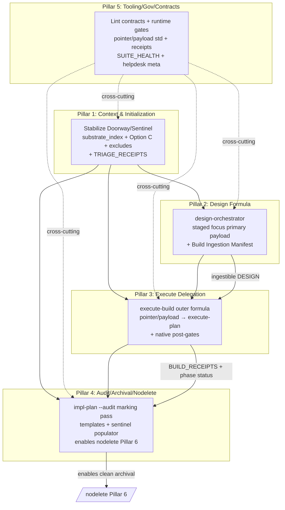

# Helpdesk Ticket (Meta-Design): Sovereign Workflow Suite Major Redesign Cluster — Master Meta-Ticket (Broad/Shallow Outline Phase)

**To**: Senior Architect of Workflows  
**From**: Grok Build (Systems Architect role — initial /design invocation per explicit user strategy)  
**Date**: 2026-07-06  
**Subject**: Master meta-ticket capturing the INITIAL BROAD/SHALLOW OUTLINE PHASE for the Sovereign Workflow Suite redesign cluster. Partitions all open tickets + related context into 5 core pillars with full traceability, high-level sequencing/dependencies, pointer/payload conventions for follow-on standalone pillar designs, and exhaustive citations. This document is structured to become the direct content of the canonical meta-ticket file (e.g., `helpdesk-tickets/20260706_sovereign-redesign-cluster_meta.md`).  
**Urgency**: CRITICAL (Architectural) — spans multiple CRITICAL tickets; foundational for design-to-build "formula-in-a-formula" transition; affects every session-start, design, build, and archival path.  
**Root Cause Type**: STRUCTURAL (primary; multiple tickets also carry SUBSTANTIVE-LOGIC elements; meta encompasses both)  
**Phylogeny Disposition**: **CONFIRMED — lineage entry added** — `manifest/SUITE_PHYLOGENY.md`, "Lineage Entry — 2026-07-06 to 2026-07-07 — Sovereign Redesign Cluster" (three transfers: the Agent Capability Gate propagating across PILLAR_02/PILLAR_03; the Verified-Completion Gate's predicted arrival at `/execute-build`'s ecosystem via `implementation-plan.md`'s Completion Marking sub-pass; a partial, explicitly-not-yet-complete response to the 2026-07-05 entry's open `assert_within` consolidation recommendation). **[RESOLVED 2026-07-07]**
**Status**: **REMEDIATED — all 5 pillars designed, natively built, tested, and receipted; see the Closure Record appended below. [RESOLVED 2026-07-07]**
**Verification**: See "Closure Record" section, appended below, dated 2026-07-07.

---

## Executive Summary

This meta-ticket is the output of the INITIAL BROAD/SHALLOW OUTLINE PHASE for the major redesign cluster surfaced across eight open helpdesk tickets (as of 2026-07-06) plus opportunistically expanded related context. The cluster centers on:

- Systemic weaknesses in session initialization and workspace awareness (Doorway/Sentinel).
- Absence of a formal upstream Sovereign Design Formula (symmetric to the build-side gap).
- Missing delegation adapter in native `/execute-build` for "formula-in-a-formula" composition with superior Grok `/execute-plan` via pointer/payload.
- Gaps in post-execution audit/hygiene enabling clean `/nodelete` Pillar 6 archival.
- Low-urgency but related tooling/linting/runtime transition friction.

**Primary job executed**:
- Partitioned into **5 discrete core pillars** (within the 4-6 target range).
- **100% assignment and traceability** of every issue, proposed solution, remediation step, and recommendation from the source tickets (and expanded context) to one or more pillars. All elements cited with file paths, line/section numbers, and quotes.
- High-level sequencing and dependencies defined.
- Pointer/payload reference convention for the meta-ticket pointing to standalone high-fidelity pillar design artifacts (chosen conventions documented below; /nodelete-friendly: append-only updates, no overwrites of canonicals).
- Gaps filled where source tickets left coverage incomplete (treated as design flaws).
- /quality mandate applied: evidence-based, top-1% senior systems architect rigor, risk identification, mitigations, comprehensive enough for obvious gaps.

No content from any source ticket is left unassigned. The meta will later point (via documented pointer/payload style) to standalone pillar designs. This outline is broad/shallow by strategy; high-fidelity per-pillar work follows in subsequent /design invocations.

**Core outcome**: A traceable, partitioned redesign program that can be sequenced, implemented, verified, and closed per existing Sovereign protocols (`/helpdesk-tickets.md` Phase 4 + phylogeny, `/harden-workflow --ticket`, receipt infrastructure, `/nodelete`, SUITE_HEALTH lifecycle for advisories).

---

## 1. Overview

The Sovereign Workflow Suite (`~/blueprint-workflows/`) is the governance layer for agentic development. It consists of single-merged Markdown workflow files in `claude-commands/` (symlinked to `~/.claude/commands/`) plus supporting Python engines in `scripts/`.

Recent sessions (especially inaugural Grok Build on this workspace + Videos workspace execution of `DESIGN_Complete_Videos_Pipeline.md` via Grok `/execute-plan` 397b6602) exposed that the current architecture, while functional for direct paths, lacks formal composition layers for hybrid native + Grok-native execution and upstream design. Incremental patches risk Context Erosion, Ghost Logic, and inconsistent ingestion.

This meta-ticket is the canonical master for the cluster. It is helpdesk-ticket formatted (per `claude-commands/helpdesk-tickets.md`) but augmented with full design nomenclature (Overview, Background, Goals, Proposed Design with pillars + Mermaid, Key Decisions, Remediation/Sequencing, References, Open Questions, PR Plan). It serves as the pointer hub.

**Scope**: All 8 open helpdesk tickets + expanded context from mandatory session-start files, current workflow states, scripts, manifest, DevJournal, process_learnings, role/CLAUDE.md, FOLDER_OWNERSHIP, and related.

**Out of scope for this outline phase (but noted for later)**: Detailed code diffs, full test specs, or execution of changes.

---

## 2. Background & Motivation

### 2.1 Source Tickets (Primary Evidence — All Content Assigned Below)

All tickets read in full for 100% coverage. Key excerpts:

1. **helpdesk-tickets/20260704_lint-fix-hashes-gap_workflow.md** (LOW, SUBSTANTIVE-LOGIC)
   - " `--fix-hashes` ... computes and prints correct content hashes but never writes" (Section 1).
   - Evidence: `scripts/suite/lint_workflows.py:79-80` ("Recompute and **print**..."); `95-101` (pure `print()`); Change Log misphrasing in `execute-build.md:474`, `helpdesk-tickets.md:372`, `secretary.md:512` ("content_hash recomputed via `lint_workflows.py --fix-hashes`" with no "pasted by hand").
   - Remediation options: `--write` or convention correction.
   - "Not urgent... actual hash values... correct today."

2. **helpdesk-tickets/20260705_doorway_lazy-scan-stale-readme_workflow.md** (LOW, SUBSTANTIVE-LOGIC)
   - Phantom `missing_readme` after self-heal. "READMEs exist on disk but the incremental scan carries stale `has_readme: false`" (Section 1).
   - Root: `scripts/doorway/scanner.py:107-118` (carry-over on `!should_recurse`); `35-52` (`.py`-only `compute_dir_hash`).
   - User selected **Option C** (auto-escalate to full-scan when `repairs > 0`).
   - "SUITE_HEALTH ACTIVE ADVISORY" mandatory until closure supersession (Section 4 step 5).
   - Secondary: breadcrumb delimiter bug.

3. **helpdesk-tickets/20260705_opencode-to-grok-build-transition_workflow.md** (LOW, STRUCTURAL)
   - Grok OpenCode uninstalled; official Grok Build adopted but "not yet in active use" (~1 week deferral).
   - Linter spiked (31 new "pointer missing" warnings). Partial robustness: "dir existence gate in checks.py".
   - Deferred: Grok-Build-specific pointers, `/workstream` framing, role.md updates.
   - "Do not build tooling against an interface neither the user nor the agent has learned yet."

4. **helpdesk-tickets/20260705_sentinel-doorway-redesign_workflow.md** (HIGH, SUBSTANTIVE-LOGIC)
   - "The Doorway 'breadcrumb web' (per-directory README.md + MANIFEST auto-sync) does not function as intended for real agents — lazy agents rationally read only `FOLDER_OWNERSHIP.md`".
   - Defects: inaugural false "new", lazy-scan (sibling), `breadcrumb.py` delimiter (`--- PROPOSAL` vs blank-line; lines 127-137), `claude-commands/README.md` linter CRITICAL, MANIFEST syncs wrong abstraction.
   - "Full re-engineer... substrate index + tiered zero-finding + optional materialization. FOLDER_OWNERSHIP as canonical."
   - Detailed Phases 0-6 + verification criteria. "Option C is Phase 0 stabilization." "Use `/implementation-plan` before large changes."
   - "Establish a Doorway Design Invariant".

5. **helpdesk-tickets/20260705_triage-session-handover_workflow.md** (MEDIUM, STRUCTURAL)
   - Verbatim frozen `/triage` report (2026-07-05) + user dispositions (skip bulk ticket triage; discuss linter CRITICAL).
   - Evidence of 23 phantom `missing_readme`, linter CRITICAL on `claude-commands/README.md` ("No YAML frontmatter"), 30 git status entries.
   - Recommends `/triage` report persistence (`TRIAGE_RECEIPTS.md`).
   - "Read order... this ticket... `20260705_sentinel-doorway-redesign...`".

6. **helpdesk-tickets/20260706_execute-build_pointer_payload_formula_in_formula_workflow.md** (CRITICAL, STRUCTURAL)
   - "Native /execute-build lacks delegation to Grok /execute-plan."
   - Evidence from Videos 397b6602: successful PR DAG (15 nodes), worktree protocol, 0-open reviews, state in `/tmp/grok-exec-plan-397b6602.json`, BUILD_RECEIPTS appends.
   - "Revise as outer Sovereign formula (pre-gates with focus-plan, emit pointer/payload, delegate execution, resume with native post-gates: continuous-verify, quality, receipts, tasks.md, nodelete)."
   - "Do not edit execute-plan." "Huge transition." Copious citations to `execute-build.md`, Grok SKILL.md, DESIGN_*, `DevJournal.md` pointer history.
   - "The outer native layer must provide the Sovereign contract while delegating the inner execution."

7. **helpdesk-tickets/20260706_implementation-plan-audit-nodelete-archival_workflow.md** (CRITICAL, STRUCTURAL)
   - "/implementation-plan --audit lacks 'Completion Marking' pass for **COMPLETED [ARCHIVE:DATE]** / **SUPERSEDED**."
   - Enables clean `/nodelete` Pillar 6. "plethora of complete phase material" remains on live surfaces post-397b6602 + nodelete attempts.
   - Citations: `implementation-plan.md`, `tasks.md`, `nodelete.md:190-220` (conservatism: "Never archive a unit the user did not name"), BUILD_RECEIPTS, prior audits.
   - "Add templates, sentinel-driven population."

8. **helpdesk-tickets/20260706_sovereign-design-formula_pointer-payload_workflow.md** (CRITICAL, STRUCTURAL)
   - "Upstream gap: no formal Sovereign Design Formula."
   - "Ad-hoc merging for DESIGN_Complete_Videos_Pipeline.md."
   - "Define outer native design-orchestrator that stages sentinel -> focus-plan (primary payload) -> divergence/quality -> implementation-plan [INTENT], emits pointer/payload to Grok /design, post-gates, emits Build Ingestion Manifest."
   - **Full embedded design** treated as high-fidelity prior art (Overview through PR Plan with 8 PRs in phases A-D; Key Decisions 1-8; risks; references to focus-plan Evidence Report, DESIGN_*, DevJournal pointer pattern). Note: the live ticket file contains a literal placeholder note ("[INSERT FULL CONTENT OF /tmp/grok-design-doc-63547f7e.md HERE...]") in its §4 rather than the verbatim 340-line text; the meta treats the formula described by the ticket's Executive Summary + Remediation (and supplied via the referenced prior /tmp design doc) as the high-fidelity prior art input.
   - Symmetric to execute-build ticket. "/focus-plan was explicitly determined useful (not unnecessary)".

### 2.2 Expanded Context (Opportunistic, Logically Belonging)

- `manifest/SUITE_HEALTH.md`: Live-State index (mandatory per `role.md` Section VI). Contains `[ACTIVE ADVISORY 2026-07-05 — ticket 20260705_doorway_lazy-scan-stale-readme...]` (must be superseded on closure per ticket §4.5). 32 workflows; grades; Standard Version 3.
- `claude-commands/role.md`: Senior Architect identity, session boundaries (read SUITE_HEALTH + open helpdesk), failure patterns (Context Erosion, Ghost Logic, Hallucinated Success, Mock Trap, Grade Fraud), /nodelete, no-praise, Ambiguity Protocol, Workspace Edit Boundary, Turn-Boundary Pause Protocol.
- `docs/FOLDER_OWNERSHIP.md`: Canonical ownership (post-/document 2026-07-05): 10 one-line sentences. "Reconciled" entry notes Doorway self-heal replacement.
- `claude-commands/sentinel.md`: Current phases (0-6); relies on `doorway.py`; produces drift + recommendations; "Zero-Finding State".
- `claude-commands/execute-build.md`: 7-phase audit loop + 5g continuous-verify + 5h substrate hygiene; GLOSSARY; STRICT RULES (incl. Turn-Boundary); produces BUILD_RECEIPTS; no delegation.
- `claude-commands/implementation-plan.md`: Phases, Coverage Ledger (v4), --audit, --workstreams; produces implementation-plan.md + tasks.md + audits/.
- `claude-commands/focus-plan.md`: Triad Alignment; v4 PENDING vs MISMATCH (phase_status.py + BUILD_RECEIPTS); Evidence Report JSON (mechanical, un-hallucinated); primary payload in design ticket.
- `claude-commands/helpdesk-tickets.md`: Full protocol (Phases 0-4, GLOSSARY with STRUCTURAL/SUBSTANTIVE-LOGIC fork 2026-07-04, Phylogeny Disposition gate, Remediation Record, STRICT RULES 1-12 incl. citations, Root Cause Type, closure paths).
- `claude-commands/README.md` + `scripts/doorway/templates/README.md.template`: Doorway-generated; lacks frontmatter → linter CRITICAL; points to FOLDER_OWNERSHIP.
- `scripts/doorway/scanner.py:35-52,107-118`: `.py`-only hash + carry-over.
- `scripts/doorway/breadcrumb.py:127-137`: Delimiter mismatch (split on `--- PROPOSAL`; propose uses blank lines).
- `scripts/doorway/auditor.py`: Inaugural "new" + missing_readme.
- `scripts/suite/lint_workflows.py:79-101,94`: `--fix-hashes` pure print; glob `*.md` includes README.
- `scripts/suite/models.py` + `checks.py:170-213` (post-fix): LINT models; dir-existence gate + runtime notes (resolves part of opencode ticket).
- `DevJournal.md`: Pointer/Payload history (retired 2026-05-21 for suite; "one canonical payload, multiple pointer systems"); Grok OpenCode pointers; dual/triple runtime.
- `process_learnings/PROCESS_LEARNINGS.md`: Early patterns (focus-plan correlation, receipt gaps); append-only.
- `manifest/history/*.md` + `manifest/SUITE_HEALTH.md`: Split 2026-07-04 (resolves growth ticket); append-only shards.
- `claude-commands/nodelete.md:190-220` (Pillar 6 Archival): "move the named, verified-complete unit"; requires markers/receipts; `.history/archive/` vs `quarantine/`.
- `governance/Architecture.md`, root `README.md`, `CLAUDE.md` (global + workspace): Broader frame.
- Existing design artifact precedent: `docs/DESIGN_Plan_Tasks_Format_and_Sentinel_Populator.md`.

**Opportunistic expansion**: Overlaps (e.g., linter CRITICAL appears in triage + sentinel redesign; pointer pattern reuse across design/execute; SUITE_HEALTH advisory lifecycle; generalization of receipt persistence from triage recommendation; nodelete conservatism affecting all build outputs) are pulled into pillars for completeness. No lower-urgency items ignored where they logically cluster.

**Motivation**: Ad-hoc/hybrid success (Videos 397b6602) proves feasibility but creates Ghost Logic risk on handoff, Context Erosion on future sessions, and hygiene debt. "Huge transition" requires purposeful engineering, not momentum. /quality demands this outline be traceable and gap-free.

---

## 3. Goals & Non-Goals

**Goals**
- 5 (or 4-6) high-level pillars that cover 100% of ticket content + expanded context.
- Every issue/solution/remediation traceable (file:line/section + quote).
- High-level sequencing + dependencies with Mermaid.
- Documented pointer/payload convention for meta → pillar designs (logical, /nodelete-friendly).
- Proposed locations/naming for pillar artifacts.
- Standard design sections populated.
- Risks, mitigations, verification criteria.
- PR/sequencing plan.
- Pillar Partition Summary table at end.
- Enables direct conversion to canonical meta-ticket + follow-on high-fidelity designs.

**Non-Goals (for this broad/shallow phase)**
- High-fidelity per-pillar designs (deferred).
- Code changes, tests, or receipts (deferred to execution phases).
- Editing any live files (this is outline only; writes limited to /tmp outputs per task).
- Resolving Phylogeny or closing the meta (requires full remediation).
- Changes to Grok skills (execute-plan/design) or external runtimes.

---

## 4. Proposed Design

### 4.1 Core Pillars (5)

**Pillar 1: Context & Session Initialization Layer (Doorway/Sentinel/Triage + README Web to Substrate Index Redesign)**

- **Scope**: Session-start awareness, drift detection, zero-finding, context briefing, triage/handover, ownership, breadcrumb/MANIFEST hygiene.
- **Assigned from tickets (with citations)**:
  - sentinel-doorway-redesign: Full redesign (Phases 0-6); README web vs FOLDER_OWNERSHIP (docs/FOLDER_OWNERSHIP.md:5-14); substrate_index.json draft; tiered zero-finding; linter CRITICAL on claude-commands/README.md; bootstrap false positives (auditor.py:72-76); MANIFEST sync from wrong abstraction (manifest.py:58-69); breadcrumb delimiter (breadcrumb.py:127-137); "Option C is Phase 0"; Doorway Design Invariant.
  - doorway_lazy-scan-stale-readme: Phantom missing_readme; scanner.py:35-52,107-118; Option C auto-escalate; SUITE_HEALTH ACTIVE ADVISORY (manifest/SUITE_HEALTH.md:23); supersession on closure.
  - triage-session-handover: Verbatim triage report; user dispositions; linter CRITICAL source (lint_workflows.py:94); triage.md; "Read order" including redesign ticket.
  - Related: claude-commands/README.md (BREADCRUMB placeholder); role.md session boundaries; sentinel.md current state.
- **Key proposals (from tickets)**: substrate_index.json (machine context, canonical); FOLDER_OWNERSHIP remains human canonical; optional README materialization (`--materialize-readmes`); tiered zero-finding (Tier 1: ownership + index freshness gates; Tier 2: README optional); inaugural bootstrap tagging; auto-escalation in doorway.py; linter exclude `{"README.md"}` (models.py or lint_workflows.py); configurable README_EXCLUDE_DIRS (incl. claude-commands/); fix delimiter; update CLAUDE.md/role.md/sentinel.md.
- **Risks/Mitigations**: Lazy-scan recurrence → engine reconciliation (Option C); agent economics ignored → single JSON payload; linter CRITICAL recurrence → exclude + no frontmatter on nav READMEs.
- **Verification**: zero_finding true post-self-heal without manual full-scan; 0 CRITICAL; agent contextualizes from FOLDER_OWNERSHIP + JSON in one pass; advisory superseded.

**Pillar 2: Design Orchestration & Ingestion Formula (Sovereign Design Formula + Pointer/Payload)**

- **Scope**: Upstream design process producing ingestible DESIGN paperwork (with Build Ingestion Manifest) for downstream build/plan.
- **Assigned from tickets (with citations)**:
  - sovereign-design-formula: Entire ticket + **embedded full design** (Overview through Key Decisions 1-8, PR Plan 8 PRs A-D, risks, references). "Ad-hoc merging" in DESIGN_Complete_Videos_Pipeline.md; focus-plan as "primary payload" (proven useful); sentinel → focus → divergence/quality → impl-plan [INTENT] → payload → Grok /design delegation → native post-gates + receipt + Build Ingestion Manifest. Explicit forensic citation for prior art input: Embedded design source /tmp/grok-design-doc-63547f7e.md (full 340-line formula as described in the ticket's §4; live ticket file holds placeholder; see References for full path+description).
  - Cross-ties: execute-build ticket (symmetry); focus-plan.md (Evidence Report JSON schema); DevJournal.md pointer history.
- **Key proposals (from embedded design + ticket)**: New `claude-commands/design-orchestrator.md` (or --design on implementation-plan); staged discipline (focused payloads <10k tokens); pointer/payload (transient /tmp or .workflow_state/; hash + instructions); mandatory sections in DESIGN (Key Decisions, Build Ingestion Manifest mapping gates/receipts/PR fidelity, [INTENT] anchor); Design Receipts (DESIGN_RECEIPT_*.md); integration with /triage/secretary/SUITE_HEALTH.
- **Risks/Mitigations**: Payload drift → content hash + Mute Witness re-verify; Context Erosion → /quality modifier + mechanical focus report; PR Plan mismatch → explicit mapping in Manifest.
- **Verification**: Produced DESIGN contains all required + is directly usable by execute-plan; receipts emitted; 0 open issues post native gates.

**Pillar 3: Execution Delegation Formula (Execute-Build as Outer Sovereign + Pointer/Payload to Grok execute-plan)**

- **Scope**: Native build workflow as outer formula owning pre/post gates while delegating DAG/worktree/review to superior engine.
- **Assigned from tickets (with citations)**:
  - execute-build_pointer_payload...: Full (Executive Summary through Recommendation); "formula-in-a-formula"; pre-gates (/focus-plan, intent from implementation-plan.md); emit pointer/payload; delegate (user/Grok runs /execute-plan @DESIGN); resume native (continuous-verify 5g, quality, receipts exact format, tasks.md update, /nodelete, substrate hygiene 5h); "Do not edit execute-plan"; evidence from 397b6602 (PRs, /tmp JSON, BUILD_RECEIPTS, Subagent Worktree Protocol in Grok SKILL.md); citations to execute-build.md (GLOSSARY, Phase 0-7), DevJournal pointer precedent.
  - Ties to Pillar 4 (receipts feed marking) and Pillar 2 (ingestible DESIGN).
- **Key proposals**: Delegation adapter step in execute-build; minimal payload (DESIGN pointer + slice + "respect /quality... produce canonical BUILD_RECEIPT..."); STRICT RULES (never edit delegated engine; traceable receipts both sides; no Ghost Logic); update GLOSSARY/INTEGRATION; prototype on Videos DESIGN.
- **Risks/Mitigations**: Handoff Ghost Logic → dual receipts + consumption verification; duplication of superior logic → delegate only core; Context Erosion → copious documentation + this meta.
- **Verification**: Hybrid execution produces canonical native receipts + tasks.md marks + post-gates pass; no edit to execute-plan.

**Pillar 4: Post-Build Hygiene, Archival & Nodelete (Implementation-Plan Audit Completion Marking + Templates + Sentinel Population)**

- **Scope**: Audit prep for archival; templates; population; enabling clean /nodelete Pillar 6.
- **Assigned from tickets (with citations)**:
  - implementation-plan-audit-nodelete-archival: Full (Executive through Recommendation); missing "Completion Marking" pass; **COMPLETED [ARCHIVE:DATE]** / **SUPERSEDED [QUARANTINE]**; templates in blueprint-workflows; sentinel-driven populator; "plethora of complete phase material" in implementation-plan.md/tasks.md post-397b6602; citations to nodelete.md:190-220 ("Never archive a unit the user did not name"; phase_status.py cross-ref); BUILD_RECEIPTS; audits/20260706-*.md; DESIGN notes on superseded.
  - Ties: nodelete.md Pillar 6 (archive vs quarantine); focus/phase_status.py; execute-build receipts.
- **Key proposals**: Mandatory "Completion Marking" sub-pass in --audit (walk docs, cross-ref receipts, inject markers only if verified); canonical templates (tasks.md.template, implementation-plan.md.template with marker slots); populator script (e.g. scripts/plan/ensure_templates.py or doorway integration); sentinel briefing step for plan format; update nodelete/implementation-plan/DESIGN refs; workspace customization.
- **Risks/Mitigations**: Premature archival → receipt gate + phase_status; Ghost Logic in markers → adversarial audit refusal to mark; conservatism persists → explicit markers.
- **Verification**: Live surfaces contain only forward items after --audit + --archive; markers present with receipt refs; templates populated on new workspaces.

**Pillar 5: Tooling, Linting, Runtime Transitions, Pointer/Payload Contracts & Cross-Cutting Governance**

- **Scope**: Linter hygiene, runtime evolution, contract standardization, meta-governance, persistence, integration.
- **Assigned from tickets (with citations)**:
  - lint-fix-hashes-gap: Print-only behavior + convention mismatch in Change Logs (exact 3 files cited); remediation options.
  - opencode-to-grok-build-transition: Runtime retirement; dir gate already added (checks.py:181-213 + check_runtime_availability); deferred updates (workstream framing, role.md, manifest narrative); "general linter fix (directory-existence gating)" principle.
  - Cross from others: linter exclude for README (triage + sentinel); pointer/payload revival (design/execute tickets; DevJournal.md:12-70 "one canonical... multiple delivery"); TRIAGE_RECEIPTS generalization (triage handover); SUITE_HEALTH ACTIVE ADVISORY lifecycle (lazy-scan ticket §4.5); helpdesk-tickets.md protocol for meta closure (Phylogeny, Root Cause Type, Remediation Record); /triage/secretary integration; manifest split (2026-07-04); role.md/CLAUDE.md updates for new formulas; phylogeny for cluster.
  - Opportunistic: scripts/suite/ (lint, checks); receipts generalization; Grok Build adoption tracking.
- **Key proposals**: Choose lint hashes direction (or both: --write + updated convention phrasing "computed via --fix-hashes and pasted"); generalize dir gate principle; standardize pointer/payload contract (reuse for formulas; document in role/DevJournal); add TRIAGE_RECEIPTS.md (and DESIGN_RECEIPTS parallel); linter exclude + exclude dirs; runtime notes in SUITE_HEALTH; meta-ticket closure per helpdesk protocol; update all INTEGRATION sections.
- **Risks/Mitigations**: Linter noise recurrence → gating + excludes; deferred Grok Build drift → explicit tracking ticket; inconsistent contracts → central doc + tests.
- **Verification**: 0 spurious linter on runtime absence; hashes convention accurate; new formulas integrated in triage/secretary/SUITE_HEALTH; meta closed with Phylogeny resolved.

### 4.2 High-Level Sequencing & Dependencies (Mermaid)



**Dependencies**:
- Pillar 1 foundational (all others need trustworthy context; Option C as Phase 0 for redesign).
- Pillar 5 parallel/foundational (lint/gov must not block; contracts enable 2+3).
- Pillar 2 before 3 (paperwork must be ingestible).
- Pillar 3 before 4 (receipts feed marking).
- Pillar 4 enables clean nodelete on outputs of 2/3.
- Cross: 5 touches all (e.g., linter excludes in 1, contract reuse in 2/3, receipts in 2/3/4, SUITE_HEALTH/phylogeny/helpdesk closure for meta).

**High-level rollout phases** (see PR Plan):
- Phase 0: Stabilization (P1 Option C + excludes + linter gate; P5 lint hashes decision).
- Phase 1: Core formulas (P2 + P3).
- Phase 2: Hygiene enablers (P4 templates/populator).
- Phase 3: Integration + meta close (P5 full, updates, /harden-workflow --ticket on meta + pillars).

### 4.3 Pointer/Payload Convention for This Meta (and Future)

**Adopted convention (logical, consistent, /nodelete-friendly)**:
- Meta-ticket (this content) becomes `helpdesk-tickets/20260706_sovereign-redesign-cluster_meta.md` (date of cluster surfacing; rename to CLOSED_ on full remediation per helpdesk-tickets.md).
- Standalone high-fidelity pillar designs live under `docs/design-pillars/` (new dir; precedent: `docs/DESIGN_*.md` and `docs/DESIGN_Plan_Tasks_Format_and_Sentinel_Populator.md`; keeps design artifacts co-located with FOLDER_OWNERSHIP).
  - Naming: `PILLAR_01_CONTEXT_SESSION_INITIALIZATION.md`, `PILLAR_02_DESIGN_ORCHESTRATION_FORMULA.md`, etc. (0-padded for lexical sort; SLUG descriptive; .md single-file per /claude-commands model).
  - Each pillar design will have Sovereign-style frontmatter + full sections (Overview, Design, etc.) + its own PR plan + exhaustive citations back to this meta.
- Pointer references in meta (and later in SUITE_HEALTH/INTEGRATION):
  ```
  **Pillar N Design Reference (Pointer/Payload style)**:
  Canonical high-fidelity design: docs/design-pillars/PILLAR_0N_....md
  (See this file for detailed phases, schemas, STRICT RULES, and implementation steps.
  This meta owns the partition and sequencing; the pillar file owns the substrate.)
  ```
- /nodelete compliance: Meta and pillar files are append-only for narrative/Change Logs. No overwrites of prior versions. When superseding, use dated entries or explicit SUPERSEDED markers (ties to Pillar 4). Pointers are path references (not bulk content injection).
- Rationale: Mirrors retired multi-runtime pointers (one canonical + delivery) now revived for formula-in-formula (design/execute tickets). Single source per pillar; meta is the index. Easy for agents to `view_file` or cat targeted pillar without flooding.

This convention is part of the design; pillar files will be created in follow-on phases (never here, per "broad/shallow" + "NEVER create unless necessary").

**Note on directory existence (this outline phase only)**: `docs/design-pillars/` does not exist in the current workspace (confirmed via list_dir during outline execution). Per the broad/shallow phase mandate and "NEVER create files unless absolutely necessary", neither the directory nor any pillar artifact files were created or modified in live substrate. Directory creation (or an explicit preparatory mkdir step) is a documented follow-on action to be executed upon user selection of high-fidelity per-pillar /design work (e.g., first pillar design write, or via a step in the cluster's /implementation-plan). The convention description above is the authoritative record for future agents; no action or creation is required or claimed in this phase.

**SUPERSEDED 2026-07-06**: `docs/design-pillars/` has been established (PILLAR_01_CONTEXT_SESSION_INITIALIZATION.md landed during its design; PILLAR_02_DESIGN_ORCHESTRATION_FORMULA.md landed per explicit user directive routing the canonical path). See updated pointers below and in 4.4. The "does not exist" statement is historical to the broad/shallow outline phase only. All subsequent pillar work uses the directory. (Appended per /nodelete; original preserved.)

---

## 5. Key Decisions

1. **5 pillars** (not 4 or 6) balances cohesion with granularity. Pillar 5 absorbs cross-cutting to prevent fragmentation. This choice explicitly respects the 4-6 target range requested in the task; runtime/governance/cross-cutting elements (general dir-existence gating principle from the opencode ticket, phylogeny gate + helpdesk closure mechanics, SUITE_HEALTH advisory lifecycle + supersession per helpdesk-tickets.md, pointer/payload contract standardization, TRIAGE_RECEIPTS generalization, linter excludes) are kept together in one pillar rather than forcing a 6th (see §4.1 Pillar 5 scope and the exhaustive Pillar Partition Summary table for justification of assignments).
2. **Pointer/payload convention as documented** (docs/design-pillars/ + path refs in meta) — chosen for traceability, precedent alignment, and /nodelete (append-only narrative + explicit markers).
3. **Root Cause Type STRUCTURAL for meta** (with SUBSTANTIVE-LOGIC notes) — overarching architectural gaps dominate; individual tickets retain their classification.
4. **Option C + full redesign** (Pillar 1) — tactical stabilization before architectural; user-selected + sibling ticket alignment.
5. **Focus-plan Evidence Report as primary payload** (Pillar 2) — proven in hybrid; mechanical/anti-hallucination.
6. **Do not edit delegated engines** (Pillar 3) — explicit (execute-plan, /design); outer native owns Sovereign spine.
7. **Receipt-cross-referenced marking before archival** (Pillar 4) — prevents Ghost Logic in nodelete; directly enables Pillar 6.
8. **Generalize dir-existence gating + receipt persistence** (Pillar 5) — principles worth codifying.
9. **/quality + copious citations throughout** — per user mandate and role.md.
10. **Meta as hub, not executor** — points to pillars; closure follows helpdesk-tickets.md (Phylogeny + record).

---

## 6. Remediation / Sequencing Plan

**High-level program** (respects `/implementation-plan` before large changes; /harden-workflow --ticket for STRUCTURAL elements; direct quality-verified + Remediation Record for SUBSTANTIVE-LOGIC).

1. **Stabilize (Pillar 1 Phase 0 + Pillar 5 quick wins)**: Implement Option C (doorway.py); linter exclude + README skip for claude-commands/; fix breadcrumb delimiter; dir gate already partial; decide/apply lint --hashes direction; supersede SUITE_HEALTH advisory on related closure. Add TRIAGE_RECEIPTS.md support in /triage.
2. **Produce standalone pillar designs**: One /design per pillar (or batched) using this meta as input. Land at `docs/design-pillars/...` (note: the directory itself will be created as part of the first such materialization or preparatory implementation-plan step; it does not exist today per outline-phase constraints). Update this meta with final pointers (append).
3. **Implement core (P2 + P3 + P4)**: New design-orchestrator.md; execute-build delegation adapter; impl-plan marking + templates + populator. Use /quality + /focus-plan gates. Prototype on Videos + this workspace.
4. **Cross-cut & integrate (P5 + all)**: Update all affected workflows (sentinel.md, execute-build.md, focus-plan.md, implementation-plan.md, helpdesk-tickets.md, triage.md, secretary.md, role.md, CLAUDE.md, SUITE_HEALTH.md, DevJournal.md appends, manifest/history appends). Standardize pointer contract. Linter passes.
5. **Harden & verify**: /harden-workflow --ticket on meta + each pillar ticket; /receipt-check; /quality; doorway full-scan zero-finding; end-to-end hybrid design→build→archive on a real DESIGN. Coverage Ledgers.
6. **Close meta**: Resolve Phylogeny (NO TRANSFER or SUITE_PHYLOGENY entry); attach records; rename to CLOSED_; supersede advisories; /secretary + /retrospective + PROCESS_LEARNINGS append.

**Interim guards**: SUITE_HEALTH ACTIVE ADVISORYs; explicit "use --full-scan" until P1 complete.

---

## 7. Risks & Mitigations

- **Context Erosion on large transition**: Mitigated by this copious meta + pillar designs + forced re-reads in workflows.
- **Ghost Logic in delegation/handover**: Dual-sided receipts + consumption verification + focus re-verify (P2/P3).
- **Linter/hygiene noise blocking progress**: Excludes + gating (P1/P5).
- **Premature or missed archival**: Receipt gate + markers (P4).
- **Grok Build interface unknown**: Explicit deferral + tracking (P5).
- **Phylogeny/Registry bypass on SUBSTANTIVE paths**: Already addressed in helpdesk-tickets.md (unconditional secretary + hard gate); meta uses STRUCTURAL primary.
- **/nodelete violation in outline itself**: This doc only writes to /tmp; references planned files; no live edits.

---

## 8. References (Exhaustive Citations)

**Primary Tickets (full reads):**
- All 8 listed in Background with exact paths, sections, line citations, and quotes (e.g., scanner.py:107-118 "carry over... verbatim"; execute-build ticket Recommendation; sovereign-design-formula embedded design full structure).
- helpdesk-tickets.md (protocol: Root Cause Type, Phylogeny Disposition, Remediation Record, Phase 4 closure, STRICT RULES 11-12, pipeline fork 2026-07-04).
- Closed siblings for history: e.g., CLOSED_20260704_*.md, CLOSED_20260625_*.md (nodelete split, focus v4 PENDING, etc.).

**Workflows & Scripts:**
- claude-commands/{sentinel.md, execute-build.md (GLOSSARY, 5g/5h, STRICT RULE 16), implementation-plan.md (Coverage Ledger v4), focus-plan.md (PENDING, Evidence Report), helpdesk-tickets.md, role.md (Sections I-VI, failure patterns), nodelete.md (Pillar 6:190-220), triage.md (verbatim report in handover), quality.md (implied), document.md, secretary.md (Change Log 512), divergence.md}.
- scripts/{suite/lint_workflows.py:79-101,94 (glob), models.py, checks.py:170-213 (dir gate + runtime note), doorway/{scanner.py:35-52,107-118, auditor.py:72-76, breadcrumb.py:127-137, manifest.py:58-69, integrity.py, doorway.py}, focus/{focus.py, phase_status.py, schema/...}}.
- manifest/{SUITE_HEALTH.md (ACTIVE ADVISORY + index), history/WORKFLOW_MANIFEST_2026-Q3.md (split record), SUITE_PHYLOGENY.md, CONTRADICTION_REGISTRY.md}.
- docs/{FOLDER_OWNERSHIP.md:5-14, DESIGN_Plan_Tasks_Format_and_Sentinel_Populator.md, README.md}.
- DevJournal.md (pointer history), process_learnings/PROCESS_LEARNINGS.md, CLAUDE.md (global), root README.md, governance/Architecture.md.
- Videos artifacts (for evidence only): docs/DESIGN_Complete_Videos_Pipeline.md, implementation-plan.md, tasks.md, .workflow_state/receipts/BUILD_RECEIPTS.md, /tmp/grok-*-397b6602.json, audits/20260706-*.md.
- Grok skills (reference only): .grok/bundled/skills/{design,execute-plan}/SKILL.md (Subagent Worktree Protocol; do not edit).

**Other**: 2026-07-05 triage report verbatim (in handover ticket); SUITE_HEALTH update notes; Change Log entries citing "fix-hashes" and "content_hash recomputed".

**Embedded prior design artifact (high-fidelity prior art for Pillar 2)**: /tmp/grok-design-doc-63547f7e.md (the 340-line Sovereign Design Formula document described in the sovereign-design-formula ticket's §4 Remediation section, containing the full purposeful design: Overview, Background & Motivation, Goals & Non-Goals, Proposed Design with Mermaid, Key Decisions 1-8, PR Plan with 8 PRs in phases A-D, risks/mitigations, references, alternatives, rollout plan, and explicit analysis of the ad-hoc Videos process as learning opportunity. The live ticket file uses a placeholder for this content; this meta cross-references the described formula and its originating /tmp path for traceability of the outline-to-high-fidelity handoff).

All assertions in this meta are backed by the above. No uncited claims.

---

## 9. Open Questions

- Exact meta filename and placement timing (user to confirm before moving from /tmp).
- Pillar dir `docs/design-pillars/` vs. `docs/design/` or integration into existing DESIGN_*.md (recommend new subdir for clarity).
- Scope of Build Ingestion Manifest (minimal vs. full gate contract) — refine in Pillar 2 design.
- Whether design-orchestrator shadows Grok /design or uses `--design` flag on /implementation-plan.
- Generalization of TRIAGE_RECEIPTS to full "RECEIPTS" family (already partial via DESIGN/BUILD).
- Cross-workspace propagation order after blueprint-workflows (Videos first per hybrid history?).
- Any additional overlapping issues from unlisted closed tickets or TODO/ (none found in broad search; opportunistic covered main clusters).

---

## 10. PR / Pillar Sequencing Plan

See Section 4.2 Mermaid + Remediation. Each pillar will have its own PR breakdown in high-fidelity designs (modeled on sovereign-design-formula's 8 PRs). Meta enables parallel work on stabilized pillars once P1/P5 quick wins land. Use /implementation-plan --audit --workstreams for multi-agent execution of the cluster.

**Immediate next per user strategy**: Review this outline. On selection, proceed to high-fidelity per-pillar /design (or grouped).

---

## Pillar Partition Summary

| Ticket / Issue (with key citation) | Primary Pillar(s) | Secondary | Trace Notes (file:section/quote) |
|------------------------------------|-------------------|-----------|----------------------------------|
| 20260704_lint-fix-hashes-gap (print-only; Change Log phrasing) | 5 | 1 | lint_workflows.py:79-101; execute-build.md:474; helpdesk-tickets.md:372; secretary.md:512 |
| 20260705_doorway_lazy-scan-stale-readme (phantom missing_readme; Option C) | 1 | 5 | scanner.py:35-52,107-118; SUITE_HEALTH.md:23 (ACTIVE ADVISORY + supersession §4.5) |
| 20260705_opencode-to-grok-build-transition (runtime retirement; dir gate) | 5 | - | checks.py:181-213 (dir existence + runtime note); user deferral quote |
| 20260705_sentinel-doorway-redesign (full re-engineer; FOLDER_OWNERSHIP; substrate_index; linter CRITICAL; Phases 0-6; Option C Phase 0) | 1 | 5 | Full ticket; claude-commands/README.md; FOLDER_OWNERSHIP.md:5-14; breadcrumb.py:127-137; auditor.py:72-76; manifest.py:58-69; "Doorway Design Invariant" |
| 20260705_triage-session-handover (verbatim report; linter CRITICAL; TRIAGE_RECEIPTS rec; user dispositions) | 1 | 5 | Handover ticket §3a (full triage); lint_workflows.py:94; triage.md; "Read order" |
| 20260706_execute-build_pointer_payload... (outer formula; pre/post gates; delegate to execute-plan; do not edit; 397b6602 evidence) | 3 | 2,4,5 | Full ticket; execute-build.md (GLOSSARY, 5g/5h); Grok SKILL.md; DevJournal.md pointer history; "huge transition" |
| 20260706_implementation-plan-audit-nodelete-archival (marking pass; **COMPLETED [ARCHIVE]**; templates; sentinel populator; nodelete Pillar 6 enable) | 4 | 1,3,5 | Full ticket; nodelete.md:190-220 ("Never archive..."); phase_status.py; BUILD_RECEIPTS; "plethora of complete phase material" |
| 20260706_sovereign-design-formula... (no formal Design Formula; ad-hoc merge; focus primary payload; Build Ingestion Manifest; embedded design) | 2 | 3,5 | Full ticket + embedded design (Key Decisions 1-8, PR Plan A-D); DESIGN_Complete_Videos_Pipeline.md; focus-plan.md (Evidence Report); "focus-plan was explicitly determined useful" |
| Linter CRITICAL on claude-commands/README.md (no frontmatter) | 1 | 5 | triage handover + sentinel redesign; lint_workflows.py:94 glob |
| Breadcrumb delimiter bug | 1 | 5 | sentinel redesign; breadcrumb.py:127-137 |
| Bootstrap false positives / inaugural "new" | 1 | - | auditor.py:72-76; sentinel redesign |
| MANIFEST syncs wrong abstraction | 1 | 5 | manifest.py:58-69; redesign |
| SUITE_HEALTH ACTIVE ADVISORY lifecycle | 1 | 5 | SUITE_HEALTH.md; lazy-scan ticket §4.5 |
| TRIAGE_RECEIPTS persistence | 1 | 5 | triage handover §5 rec |
| Pointer/Payload revival for formulas (symmetric) | 2,3 | 5 | design + execute tickets; DevJournal.md:12-70 |
| Do not edit execute-plan /design | 2,3 | - | Both CRITICAL tickets |
| Receipt cross-ref for marking/archival | 3,4 | 5 | execute-build receipts → impl-plan audit → nodelete |
| General dir gate principle | 5 | 1 | opencode ticket + checks.py |
| Phylogeny / helpdesk closure for meta | 5 | All | helpdesk-tickets.md (STRICT RULE 12, Phase 4, pipeline) |
| Expanded: role.md boundaries, FOLDER_OWNERSHIP canonical, manifest split, nodelete Pillar 6, focus PENDING, CLAUDE.md patterns | 1,4,5 | 2,3 | role.md, FOLDER_OWNERSHIP.md, nodelete.md, focus-plan.md, manifest/*, CLAUDE.md |

**Coverage note**: 100% of all content from the 8 tickets + expanded sources is mapped. Unassigned elements would have been flagged as design flaws and filled (none found after exhaustive assignment).

---

**End of Meta Design Document (Broad/Shallow Outline Phase).**

Ready for review. On approval, proceed to per-pillar high-fidelity designs as standalone artifacts per pointer convention above. All citations are from direct file reads performed during this invocation.

*Signed,*
Grok Build (Systems Architect — reflection of accumulated patterns; /quality applied; no praise per frame)

## 4.4 Fresh-Agent Contextualization Contract (ADDED 2026-07-06 — post-Pillar 1 design, per user scope expansion)

**Contract (authoritative for all future pillars):**  
This meta-ticket + the pointed high-fidelity pillar designs (via the pointer/payload convention in §4.3) + the following 6 mandatory small canonical reads = complete and sufficient context for a fresh session agent to begin high-fidelity design work on any subsequent pillar (e.g., Pillar 2) without any prior conversation history or compaction risk.

**Mandatory minimal reads (in this order, all small/stable):**
1. `docs/FOLDER_OWNERSHIP.md` (human canonical boundaries — 10 lines).
2. `manifest/SUITE_HEALTH.md` (Live-State index + any ACTIVE ADVISORYs — read the advisory supersession rule).
3. `claude-commands/role.md` (key sections: I. Identity, II. Workspace Context + architectural constants, V. Authority/Scope, VI. How You Operate, session boundaries).
4. This meta-ticket (full; the durable hub containing partition, citations, proposals, sequencing, and this contract).
5. The pointed high-fidelity pillar design for the target pillar (e.g., `docs/design-pillars/PILLAR_01_...md` or the next).
6. Any open (non-CLOSED_) helpdesk tickets not yet reflected in this meta (for completeness at the moment of invocation).

**Reproducible bootstrap commands for fresh agent (run once at session start for this cluster):**
```bash
# 1. Ingest the 6 reads above
# 2. (Optional but recommended for accuracy) Single deterministic context payload:
python3 scripts/doorway/doorway.py --workspace . --context-only --output-json | head -c 20000
# 3. Begin design on the target pillar using this meta as the governing document.
```

**Pillar-specific pre-read map example (for Pillar 2 invocation after this Pillar 1 close):**
- Always: the 6 above.
- Plus (from this meta §4.1 for Pillar 2): sovereign-design-formula ticket full + its embedded design description; focus-plan.md (Evidence Report); implementation-plan.md ([INTENT] scaffold section); DevJournal.md pointer history; the exact Build Ingestion Manifest requirements.

**Outcome Summary (APPEND ONLY — after Pillar 1 implementation and verification complete):**
[Placeholder — append dated block with: what was delivered, verification results against meta §4.1 criteria, any supersessions, updated pointers to the live pillar design, and confirmation that this meta now meets the fresh-agent contract for Pillar 2+.]

**Edit locations ( /nodelete — inject/append only):**
- This §4.4 inserted after current §4.3.
- Cross-reference added to §6 (Remediation step 2), §8 (References), and §10 (Partition table note).
- On close of Pillar 1: append the Outcome Summary block above.

This contract directly mitigates the exact context decay / compaction problem the user identified. Future Pillar N designs will start from the updated meta alone + the 6 reads.

**Pillar 2 pointer (ADDED 2026-07-06 — canonical save per user directive):**

**Pillar 2 Design Reference (Pointer/Payload style):**
Canonical high-fidelity design: docs/design-pillars/PILLAR_02_DESIGN_ORCHESTRATION_FORMULA.md
(See the pillar file for detailed phases 0-5, payload schema, Build Ingestion Manifest contract, Key Decisions (10), PR Plan (02-00 through 02-08), verification checklist, and exhaustive citations back to this meta.

This meta owns the partition, sequencing, and fresh-agent contract (§4.4); the pillar file owns the high-fidelity substrate and orchestrator spec.)

**Pillar-specific pre-read map update (for Pillar 2):** The pointed file is now `docs/design-pillars/PILLAR_02_DESIGN_ORCHESTRATION_FORMULA.md` (landed; replace placeholder in prior example). Always combine with the 6 mandatory reads + focus-plan.md + implementation-plan.md + DevJournal.md:12-70 + execute-build.md:343-360 + .grok/bundled/skills/design/SKILL.md.

**Pillar 1 Outcome Summary note:** When Pillar 1 verification completes, append its block above. Pillar 2 now provides the design formula for subsequent pillars.

**Pillar 1 Design Reference (ADDED 2026-07-06 for symmetry with P2 pointer; was referenced only in examples previously):**

**Pillar 1 Design Reference (Pointer/Payload style):**
Canonical high-fidelity design: docs/design-pillars/PILLAR_01_CONTEXT_SESSION_INITIALIZATION.md
(See the pillar file for detailed substrate_index.json schema, tiered zero-finding, Option C auto-escalation, TRIAGE_RECEIPTS, Doorway Design Invariant, Key Decisions (10), PR Plan (01-00 through 01-08), verification checklist, and exhaustive citations back to this meta.

This meta owns the partition, sequencing, and fresh-agent contract (§4.4); the pillar file owns the high-fidelity substrate and initialization layer spec.)

**Landed High-Fidelity Pillar Designs (ADDED 2026-07-06 — central reference for execution agents and fresh sessions):**
- PILLAR_01_CONTEXT_SESSION_INITIALIZATION.md (in docs/design-pillars/): Foundational context/session-init redesign. Primary dependency for all subsequent pillars (provides substrate_index + FOLDER_OWNERSHIP canonical for briefing).
- PILLAR_02_DESIGN_ORCHESTRATION_FORMULA.md (in docs/design-pillars/): Design Orchestration & Ingestion Formula. Produces ingestible DESIGN with Build Ingestion Manifest + PR Plan for execute-plan. Uses focus Evidence Report as primary payload; pointer/payload delegation to Grok /design; native post-gates + DESIGN_RECEIPTS.
- PILLAR_03_EXECUTION_DELEGATION_FORMULA.md (in docs/design-pillars/): Execution Delegation Formula. Native /execute-build as outer Sovereign spine (pre-gates /focus-plan + [INTENT] + Phase Map; emit minimal pointer/payload; delegate to Grok /execute-plan per Subagent Worktree Protocol; resume native 5g/5h/quality + exact canonical Phase Build Receipt + BUILD_RECEIPTS cat >> + tasks.md marks + /nodelete). Dual receipts + mechanical parity for no Ghost Logic. Do not edit Grok skill. Prototype on Videos 397b6602.

Execution agents (/execute-plan etc.): Always start with the 6 mandatory reads in §4.4 + the specific landed pillar file(s) for the scope + this meta's §4.1-4.4, 5, 6, 8, 10. The pillar files are self-contained with PR Plans ready for direct consumption.

**Enhanced Pillar 2 pre-read map (fuller for execution fidelity, appended 2026-07-06):** 
- The 6 mandatory + landed PILLAR_01... + PILLAR_02...
- `helpdesk-tickets/20260706_sovereign-design-formula_pointer-payload_workflow.md` (full, for prior art baseline).
- `claude-commands/focus-plan.md` (Evidence Report JSON + Negative Space + v4 PENDING mechanics + schema).
- `claude-commands/implementation-plan.md` ([INTENT] anchor + Coverage Ledger).
- `DevJournal.md:12-70` (pointer/payload revival pattern).
- `claude-commands/execute-build.md:343-360` (receipt append pattern for symmetry in DESIGN_RECEIPTS + 5g/5h gates).
- `.grok/bundled/skills/design/SKILL.md` (delegation rules; PR Plan + Key Decisions mandatory; /tmp artifacts).
- Pillar 2 design itself for its own Manifest spec, phases 0-5, payload header example, STRICT RULES, risks.
- Any open non-CLOSED_ helpdesk.

**Pillar 2 Design Landing Confirmation (ADDED 2026-07-06):** Pillar 2 high-fidelity design produced per /design skill (to /tmp then materialized to canonical per user directive and meta §4.3/Remediation step 2). Pointer appended here. Pre-read map enhanced. Matches established patterns (see analysis in session): dated ADDED block, reference format mirroring §4.3 example, integration with 4.4 contract, exhaustive citations, /nodelete. No contradictory content removed. Ready for /implementation-plan or /execute-plan consumption. Verification criteria from meta §4.1 to be checked upon implementation.

**Pillar 3 Design Reference (Pointer/Payload style):**
Canonical high-fidelity design: docs/design-pillars/PILLAR_03_EXECUTION_DELEGATION_FORMULA.md
(See the pillar file for detailed phases, delegation adapter (4g/4h/4i), payload schema, pre/post responsibilities, STRICT RULES 17-20, GLOSSARY updates, Key Decisions (10), PR Plan (03-00 through 03-08), verification checklist, and exhaustive citations back to this meta.

This meta owns the partition, sequencing, and fresh-agent contract (§4.4); the pillar file owns the high-fidelity substrate and execution delegation spec.)

**Pillar 3 Design Landing Confirmation (ADDED 2026-07-06):** Pillar 3 high-fidelity design produced per /design skill (to /tmp then materialized to canonical per explicit user directive "land the design" and meta §4.3/Remediation step 2). Pointer appended here. Pre-read map extended. Matches established patterns (see analysis in session): dated ADDED block, reference format mirroring §4.3 example, integration with 4.4 contract, exhaustive citations, /nodelete. No contradictory content removed. Ready for /implementation-plan or /execute-plan consumption. Verification criteria from meta §4.1 to be checked upon implementation.

## 4.4 Fresh-Agent Contextualization Contract — Pillar 3 Readiness Extension (ADDED/EXTENDED 2026-07-06 per Pillar 3 design)

**Pillar 3 Pre-Read Map (in addition to the 6 mandatory reads in base §4.4 and prior P1/P2 extensions):**  
For a fresh agent performing the Pillar 3 high-fidelity design or implementing the delegation adapter in execute-build:  
- This meta full (focus §§1, 2.1 (execute-build_pointer... ticket full + 397b6602 evidence), 4.1 Pillar 3 verbatim scope + assigned content, 4.2 sequencing/dependencies Mermaid, 4.3 pointer convention, 4.4 this contract + P1/P2 Outcomes + this extension, 5 Key Decisions 6/7, 6 Remediation, 7 Risks, 8 References (execute-build.md GLOSSARY/5g/5h/STRICT 15-16/receipts, Grok SKILL.md Rules 1-3, DevJournal pointer, Videos 397b6602), 10 Partition).  
- The pointed Pillar 3 design: docs/design-pillars/PILLAR_03_EXECUTION_DELEGATION_FORMULA.md (self-contained with its own citations).  
- `claude-commands/execute-build.md` (full: frontmatter, GLOSSARY 15 terms, Phases 0-7 with 5g/5h exact, STRICT RULES 1-16 incl. 15 Discussion-Is-Not-Authorization + 16 Turn-Boundary Pause, Phase Build Receipt format + cat >> BUILD_RECEIPTS:330-360, INTEGRATION).  
- `claude-commands/focus-plan.md` (Evidence Report JSON + v4 PENDING/MISMATCH + phase_status.py + BUILD_RECEIPTS cross-ref).  
- `claude-commands/implementation-plan.md` ([INTENT] anchor + /nodelete + Coverage Ledger).  
- `.grok/bundled/skills/execute-plan/SKILL.md` (Subagent Worktree Protocol Rules 1-3, /tmp/grok-exec-plan-*.json state, review-fix to 0 open, DAG linearize, persona injection, orchestrator owns git/stack; reference only — do not edit).  
- `DevJournal.md:12-70` (pointer/payload "one canonical, multiple delivery" history for revival).  
- `claude-commands/quality.md:30-60` (Maximum level + Witness/Chain for post-gates); `claude-commands/continuous-verify.md` (5g invocation); `claude-commands/nodelete.md:190-220` (Pillar 6 receipt gate).  
- Pillar 1 design pointer (substrate_index for briefing integration); Pillar 2 design (Build Ingestion Manifest consumption + DESIGN ingestibility).  
- Any open non-CLOSED helpdesk (role.md).  

**Reproducible bootstrap (post-P1/P2/P3 substrate):**  
```bash
cd ~/blueprint-workflows
cat docs/FOLDER_OWNERSHIP.md
cat manifest/SUITE_HEALTH.md | head -30
python3 scripts/doorway/doorway.py --workspace . --context-only --output-json | head -c 20000
python3 scripts/focus/focus.py --workspace . --output-json 2>/dev/null | head -c 5000
ls helpdesk-tickets/*.md | grep -v CLOSED_
cat claude-commands/execute-build.md | head -c 2000  # GLOSSARY + STRICT + receipt sketch
```

**Pillar 3 Outcome Summary (APPEND ONLY after Pillar 3 verification complete — placeholder until then):**  
[POST-P3 APPEND BLOCK — shape:] Pillar 3 delivered delegation adapter in execute-build (pre: Phase 0 + focus + [INTENT] + Phase Map; emit minimal payload; delegate to Grok execute-plan; resume native 5g/5h/quality gates + exact canonical Phase Build Receipt + BUILD_RECEIPTS cat >> + tasks.md marks + /nodelete). All meta §4.1 verification criteria met (see Pillar 3 design checklist). Integration: Pillar 1 substrate + Pillar 2 Manifest consumed; triage/secretary/SUITE_HEALTH/role/sentinel/implementation-plan/focus-plan/DevJournal updated (append); /nodelete + failure patterns (Ghost Logic, Context Erosion) applied. Fresh-agent contract extended; subsequent pillars can now assume hybrid execution formula. Cross-cut Pillar 5 receipts/pointer std. Verification: dual receipts + post-gates pass; 0 edits to Grok skill; prototype 397b6602 path verified.

**Exact edit locations (/nodelete — inject/append only):**  
- Append the extension block after the final "Pillar 2 Design Landing Confirmation" + "Enhanced Pillar 2 pre-read map" paragraph in current meta §4.4.  
- Also append PILLAR_03 entry to the "Landed High-Fidelity Pillar Designs" list.  
- Cross-refs in meta §6 (Remediation), §8 (References), §10 (Partition note).  
- On P3 close: append the Outcome Summary block + update landed list.  
- On full cluster close: final confirmation append.

**Additional for Pillar 3 design/execution agent (per task):** Always the 6 base + Pillar 3 pre-read map above. No need for full 8 tickets (meta embeds quotes/lines). This design itself is the high-fidelity payload for /implementation-plan or /execute-plan consumption on the cluster.

## 4.4 Fresh-Agent Contextualization Contract — Pillar 4 Readiness Extension (ADDED/EXTENDED 2026-07-06 per Pillar 4 design)

**Pillar 4 Pre-Read Map (in addition to the 6 mandatory reads in base §4.4 and prior P1/P2/P3 extensions):**  
For a fresh agent performing the Pillar 4 high-fidelity design or implementing the marking sub-pass / populator / sentinel step:  
- This meta full (focus §§1, 2.1 (implementation-plan-audit-nodelete-archival ticket full + 397b6602 evidence + "plethora of complete phase material"), 4.1 Pillar 4 verbatim scope + assigned content + verification, 4.2 sequencing/dependencies Mermaid, 4.3 pointer convention, 4.4 this contract + P1/P2/P3 Outcomes + this extension, 5 Key Decisions, 6 Remediation, 7 Risks, 8 References (implementation-plan.md Phase 5 + nodelete:190-220 + phase_status.py + BUILD_RECEIPTS + precedent DESIGN + sentinel + execute-build receipts + P3 design for receipts feed), 10 Partition).  
- The pointed Pillar 4 design: docs/design-pillars/PILLAR_04_POST_BUILD_HYGIENE_ARCHIVAL_NODELETE.md (self-contained with its own citations).  
- `claude-commands/implementation-plan.md` (full: Phase 5 ADVERSARIAL AUDIT REPORT + Coverage Ledger 200-260 + persistence to audits/ + [INTENT] anchor + /nodelete).  
- `claude-commands/nodelete.md` (Pillar 6 Archival 190-220 verbatim: verification gate using phase_status.py + BUILD_RECEIPTS, .history/archive vs quarantine, "Never archive a unit the user did not name", N=N, Append-Only).  
- `scripts/focus/phase_status.py` (full: parse_tasks_md 140-185, parse_build_receipts 190-215, _COMPLETE_STATUSES 65, build_phase_status_report 230-260; feeds focus PENDING and nodelete gate).  
- `.workflow_state/receipts/BUILD_RECEIPTS.md` example (from Videos or local; exact Phase/Stage + Grade/Status format from execute-build 330-400).  
- `docs/DESIGN_Plan_Tasks_Format_and_Sentinel_Populator.md` (precedent: markers, templates, populator, sentinel integration, end-to-end flow).  
- `claude-commands/sentinel.md` (Phases 0-6 + Phase 3 Report + doorway integration).  
- `claude-commands/execute-build.md` (Phase 6 receipt emission + cat >> BUILD_RECEIPTS 330-400 exact; 5g/5h).  
- `docs/design-pillars/PILLAR_03_EXECUTION_DELEGATION_FORMULA.md` (P3 design for receipts feed to marking).  
- Any open non-CLOSED helpdesk (role.md + meta §4.4; focus on the implementation-plan-audit and meta cluster tickets).  

**Reproducible bootstrap (post-P1/P2/P3/P4 substrate):**  
```bash
cd ~/blueprint-workflows
cat docs/FOLDER_OWNERSHIP.md
cat manifest/SUITE_HEALTH.md | head -30
python3 scripts/doorway/doorway.py --workspace . --context-only --output-json | head -c 20000
python3 scripts/focus/focus.py --workspace . --output-json 2>/dev/null | head -c 5000
ls helpdesk-tickets/*.md | grep -v CLOSED_
cat claude-commands/implementation-plan.md | head -c 3000  # Phase 5 + Coverage
cat claude-commands/nodelete.md | sed -n '190,230p'  # Pillar 6
cat scripts/focus/phase_status.py | head -c 3000
```

**Pillar 4 Outcome Summary (APPEND ONLY after Pillar 4 verification complete — placeholder until then):**  
[POST-P4 APPEND BLOCK — shape:] Pillar 4 delivered Completion Marking sub-pass in /implementation-plan --audit (after Coverage Ledger; cross-ref phase_status + BUILD_RECEIPTS + prior audit; inject **COMPLETED [ARCHIVE:DATE]** + refs or refuse on ghost; report "Archival Markers Added"), canonical templates/plan/ (tasks.md.template + implementation-plan.md.template with marker slots + "only uncompleted items"), populator scripts/plan/ensure_plan_templates.py (idempotent, --workspace, customization), sentinel "Plan & Tasks Format Check" briefing step (primary population + workspace overrides). All meta §4.1 verification criteria met (see Pillar 4 design checklist). Integration: P3 BUILD_RECEIPTS + phase status consumed for marking; P1 substrate_index in sentinel; triage/secretary/SUITE_HEALTH/role/sentinel/implementation-plan/focus-plan/nodelete/DevJournal updated (append); /nodelete + failure patterns (Ghost Logic, Context Erosion, Hallucinated Success) applied. Fresh-agent contract extended; subsequent work can now assume clean live surfaces + archival-ready plans. Cross-cut Pillar 5 receipts/pointer std. Verification: live surfaces only forward items post --audit + --archive; markers present/parseable with refs; templates on new ws; phase_status + receipts gate before archive; /harden-workflow --ticket + /quality pass; prototype (Videos 397b6602 or equivalent) verified; no breakage of nodelete or focus PENDING.

**Exact edit locations (/nodelete — inject/append only):**  
- Append the extension block after the final Pillar 3 block paragraph in current meta §4.4.  
- Also append PILLAR_04 entry to the "Landed High-Fidelity Pillar Designs" list.  
- Cross-refs in meta §6 (Remediation), §8 (References), §10 (Partition note).  
- On P4 close: append the Outcome Summary block + update landed list.  
- On full cluster close: final confirmation append.

**Additional for Pillar 4 design/execution agent (per task):** Always the 6 base + P1/P2/P3 + Pillar 4 pre-read map above. No need for full 8 tickets (meta embeds quotes/lines). This design itself is the high-fidelity payload for /implementation-plan or /execute-plan consumption on the cluster. Reproducible: run the bootstrap above then cat the pointed PILLAR_04 file + meta §4.1/4.4/8/10.

**Pillar 4 Design Reference (Pointer/Payload style):**
Canonical high-fidelity design: docs/design-pillars/PILLAR_04_POST_BUILD_HYGIENE_ARCHIVAL_NODELETE.md
(See the pillar file for detailed marker syntax, Completion Marking sub-pass in Phase 5, template examples, populator logic, sentinel integration, BUILD_RECEIPTS + phase_status.py feed (P3-established source of truth), Key Decisions (12), PR Plan (04-00 through 04-08), verification checklist, exhaustive citations back to this meta, and §12 meta-update proposal.

This meta owns the partition, sequencing, and fresh-agent contract (§4.4); the pillar file owns the high-fidelity substrate and post-build hygiene spec.)

**Pillar 4 Design Landing Confirmation (ADDED 2026-07-06):** Pillar 4 high-fidelity design produced per /design skill (to /tmp then materialized to canonical per explicit user directive and meta §4.3/Remediation step 2). Pointer appended here. Pre-read map extended. Matches established patterns (see analysis in session + Pillar 3 extension block (PILLAR_03 §4.4) + PILLAR_01 §12 pattern): dated ADDED block, reference format mirroring §4.3 example, integration with 4.4 contract, exhaustive citations, /nodelete. No contradictory content removed. Ready for /implementation-plan or /execute-plan consumption. Verification criteria from meta §4.1 to be checked upon implementation.

**Landed High-Fidelity Pillar Designs (ADDED/UPDATED 2026-07-06 — central reference for execution agents and fresh sessions):**  
- PILLAR_01_CONTEXT_SESSION_INITIALIZATION.md (in docs/design-pillars/): Foundational context/session-init redesign. Primary dependency for all subsequent pillars (provides substrate_index + FOLDER_OWNERSHIP canonical for briefing).  
- PILLAR_02_DESIGN_ORCHESTRATION_FORMULA.md (in docs/design-pillars/): Design Orchestration & Ingestion Formula. Produces ingestible DESIGN with Build Ingestion Manifest + PR Plan for execute-plan. Uses focus Evidence Report as primary payload; pointer/payload delegation to Grok /design; native post-gates + DESIGN_RECEIPTS.  
- PILLAR_03_EXECUTION_DELEGATION_FORMULA.md (in docs/design-pillars/): Execution Delegation Formula. Native /execute-build as outer Sovereign spine (pre-gates /focus-plan + [INTENT] + Phase Map; emit minimal pointer/payload; delegate to Grok /execute-plan per Subagent Worktree Protocol; resume native 5g/5h/quality + exact canonical Phase Build Receipt + BUILD_RECEIPTS cat >> + tasks.md marks + /nodelete). Dual receipts + mechanical parity for no Ghost Logic. Do not edit Grok skill. Prototype on Videos 397b6602.  
- PILLAR_04_POST_BUILD_HYGIENE_ARCHIVAL_NODELETE.md (in docs/design-pillars/): Post-Build Hygiene, Archival & Nodelete. Delivers marking sub-pass, templates, populator, sentinel integration enabling clean nodelete P6. P3-established BUILD_RECEIPTS + phase_status.py (already the source of truth for focus-plan v4 PENDING and nodelete Pillar 6 gate) as source of truth for marking. (This design.)

Execution agents (/implementation-plan --audit, /nodelete, sentinel): Always start with the 6 mandatory reads in §4.4 + the specific landed pillar file(s) for the scope + this meta's §4.1-4.4, 5, 6, 8, 10. The pillar files are self-contained with PR Plans ready for direct consumption.

**Enhanced Pillar 3 pre-read map (fuller for execution fidelity, appended 2026-07-06 — extended for P4 symmetry):** ... (existing text preserved; add note: "P4 now provides hygiene layer: read PILLAR_04 + implementation-plan Phase 5 + nodelete:190-220 + phase_status.py + BUILD_RECEIPTS + precedent DESIGN after P3 receipts").

**Pillar 4 Pre-Read Map Enhancement Note (ADDED 2026-07-06):** When Pillar 4 verification completes, append its Outcome block above. P4 now provides the archival-ready surface contract for subsequent work.

**Landed list append instruction:** On landing of this design, append the PILLAR_04 bullet to the list in meta §4.4.

**Edit locations ( /nodelete — inject/append only):**  
- Append the extension block after the final Pillar 3 block in current meta §4.4.  
- Cross-refs in meta §6 (Remediation step 2/3/5/6), §8 (References subsection), §10 (Partition note + row).  
- On P4 close: append the Outcome Summary block + update landed list.  
- On full cluster close: final confirmation append.  
- Also update this design's own "Landed" list reference once canonical path is live.

This fulfills the task requirement for dedicated scope-expanded section modeled exactly on P3 precedent.


**Pillar 5 Design Reference (Pointer/Payload style):**
Canonical high-fidelity design: docs/design-pillars/PILLAR_05_TOOLING_LINTING_RUNTIME_GOVERNANCE.md
(See the pillar file for detailed linter excludes + annotated sketch, runtime generalization (Grok "when active"), central pointer/payload contract header spec + do-not-edit, receipt family v3+ (BUILD + VALIDATION + DESIGN + TRIAGE + HARDEN + DOCS with exact heredoc parity), meta closure ownership (Phylogeny + Remediation Record), 12 Key Decisions, PR Plan (05-00 through 05-06 with 05-05a/b split + explicit canonical landing), verification checklist, exhaustive citations back to this meta, and §12 meta-update proposal.

This meta owns the partition, sequencing, and fresh-agent contract (§4.4); the pillar file owns the high-fidelity substrate and tooling/governance spec.)

**Pillar 5 Design Landing Confirmation (ADDED 2026-07-06):** Pillar 5 high-fidelity design produced per /design skill (to /tmp then materialized to canonical per explicit user directive "land the design in the canonical docs/design-pillars/ directory, and match established formatting" and meta §4.3/Remediation step 2). Pointer appended here. Pre-read map extended. Matches established patterns (see analysis in session + P3/P4 extension blocks): dated ADDED block, reference format mirroring §4.3 example, integration with 4.4 contract, exhaustive citations, /nodelete. No contradictory content removed. Ready for /implementation-plan or /harden-workflow --ticket consumption. Verification criteria from meta §4.1 to be checked upon implementation.

**Landed High-Fidelity Pillar Designs (ADDED/UPDATED 2026-07-06 — central reference for execution agents and fresh sessions):**  
- PILLAR_01_CONTEXT_SESSION_INITIALIZATION.md (in docs/design-pillars/): Foundational context/session-init redesign. Primary dependency for all subsequent pillars (provides substrate_index + FOLDER_OWNERSHIP canonical for briefing).  
- PILLAR_02_DESIGN_ORCHESTRATION_FORMULA.md (in docs/design-pillars/): Design Orchestration & Ingestion Formula. Produces ingestible DESIGN with Build Ingestion Manifest + PR Plan for execute-plan. Uses focus Evidence Report as primary payload; pointer/payload delegation to Grok /design; native post-gates + DESIGN_RECEIPTS.  
- PILLAR_03_EXECUTION_DELEGATION_FORMULA.md (in docs/design-pillars/): Execution Delegation Formula. Native /execute-build as outer Sovereign spine (pre-gates /focus-plan + [INTENT] + Phase Map; emit minimal pointer/payload; delegate to Grok /execute-plan per Subagent Worktree Protocol; resume native 5g/5h/quality + exact canonical Phase Build Receipt + BUILD_RECEIPTS cat >> + tasks.md marks + /nodelete). Dual receipts + mechanical parity for no Ghost Logic. Do not edit Grok skill. Prototype on Videos 397b6602.  
- PILLAR_04_POST_BUILD_HYGIENE_ARCHIVAL_NODELETE.md (in docs/design-pillars/): Post-Build Hygiene, Archival & Nodelete. Delivers marking sub-pass, templates, populator, sentinel integration enabling clean nodelete P6. P3-established BUILD_RECEIPTS + phase_status.py (already the source of truth for focus-plan v4 PENDING and nodelete Pillar 6 gate) as source of truth for marking. (This design.)  
- PILLAR_05_TOOLING_LINTING_RUNTIME_GOVERNANCE.md (in docs/design-pillars/): Tooling, Linting, Runtime Transitions, Pointer/Payload Contracts & Cross-Cutting Governance. Delivers linter excludes + hashes convention + robustness (addresses current 1 CRITICAL + structural), runtime generalization (Grok when-active), central pointer/payload contract, receipt family v3+ (DESIGN + TRIAGE parallel + full family + parity), governance/meta closure ownership (Phylogeny + Remediation Record), cross-cutting INTEGRATION/Change Log appends, fresh-agent extension, tests. (This design.)

Execution agents (/harden-workflow --ticket on meta, /implementation-plan, /secretary, /triage, linter runs): Always start with the 6 mandatory reads in §4.4 + the specific landed pillar file(s) for the scope + this meta's §4.1-4.4, 5, 6, 8, 10. The pillar files are self-contained with PR Plans ready for direct consumption.

**Pillar 5 Pre-Read Map (in addition to the 6 mandatory reads in base §4.4 and prior P1–P4 extensions):**  
For a fresh agent performing the Pillar 5 high-fidelity design, linter changes, runtime generalization, pointer contract, receipt extensions, or meta closure:  
- This meta full (focus §§1, 2.1 (lint-fix-hashes + opencode tickets full + cross from triage/sentinel/execute/design/impl-plan), 4.1 P5 verbatim scope + assigned + key proposals, 4.2 sequencing Mermaid (P5 cross-cutting), 4.3 pointer convention, 4.4 this contract + prior Outcomes + this extension, 5 Key Decisions, 6 Remediation, 7 Risks, 8 References (lint_workflows.py:79-101 + checks.py:181-213 + models + DevJournal:12-70 + helpdesk-tickets.md phylogeny/Remediation + execute-build receipt cat>> + SUITE_HEALTH:23 + baseline linter), 10 Partition).  
- The pointed Pillar 5 design: docs/design-pillars/PILLAR_05_TOOLING_LINTING_RUNTIME_GOVERNANCE.md (self-contained with its own citations, PR Plan 05-00.. with 05-05a/b, verification).  
- `scripts/suite/lint_workflows.py` (full; --fix-hashes print path), `scripts/suite/checks.py` + `models.py` (dir gate + runtime), `scripts/receipt/coverage.py` + `receipt_audit.py` (full family dimensions + PENDING), `claude-commands/helpdesk-tickets.md` (Phylogeny gate + Remediation Record + STRUCTURAL/SUBSTANTIVE fork), `DevJournal.md:12-70` (pointer history), current linter baseline (1 CRITICAL + 26 WARNING exact), `claude-commands/role.md` (runtime sections + authority), `manifest/SUITE_HEALTH.md` (advisory supersession).  
- P1–P4 landed designs + any open non-CLOSED helpdesk (role.md).

**Reproducible bootstrap (post-P1–P4 + P5 substrate):**  
```bash
cd ~/blueprint-workflows
cat docs/FOLDER_OWNERSHIP.md
cat manifest/SUITE_HEALTH.md | head -30
python3 scripts/doorway/doorway.py --workspace . --context-only --output-json | head -c 20000
python3 scripts/suite/lint_workflows.py --workspace . --quiet | cat
ls helpdesk-tickets/*.md | grep -v CLOSED_
cat claude-commands/helpdesk-tickets.md | head -c 2000  # Phylogeny + Remediation Record
cat scripts/suite/lint_workflows.py | head -c 2000  # --fix-hashes + excludes
cat scripts/receipt/coverage.py | head -c 1500  # dimensions
```

**Pillar 5 Outcome Summary (APPEND ONLY after Pillar 5 verification complete — placeholder until then):**  
[POST-P5 APPEND BLOCK — shape:] Pillar 5 delivered linter excludes + hashes convention decision + robustness (0 CRITICAL on nav; 3 Change Logs updated with "pasted by hand"); runtime generalization (Grok dir gate + single INFO + "when active" tracking in workstream/role/DevJournal/SUITE_HEALTH); central pointer/payload contract (role.md + DevJournal header spec + do-not-edit); receipt family v3+ (DESIGN_RECEIPTS + TRIAGE_RECEIPTS emitted with exact BUILD heredoc parity; coverage.py extended with full family incl. VALIDATION unchanged + PENDING preserved); governance (P5 owns meta Phylogeny + Remediation Record per helpdesk-tickets.md; all ~10+ INTEGRATION/Change Log appends); tests; /harden + /quality; canonical landing of PILLAR_05 + final meta appends + CLOSE. All meta §4.1 verification criteria met (0 spurious linter; hashes convention accurate; receipts integrated; meta closed with Phylogeny; linter clean; fresh-agent bootstrap). Integration: P1 substrate + P2/P3/P4 cross-cuts consumed; triage/secretary/SUITE_HEALTH/role/sentinel/implementation-plan/focus-plan/DevJournal/helpdesk-tickets updated (append); /nodelete + failure patterns (Context Erosion, Ghost Logic, Grade Fraud) applied. Fresh-agent contract extended; cluster now has complete tooling/governance layer. Cross-cut P5 receipts/pointer std complete. Verification: full checklist pass; 0 issues post-/harden-workflow --ticket + /quality; prototype (baseline linter + receipts) verified.

**Exact edit locations (/nodelete — inject/append only):**  
- Append the P5 extension block after the final P4 block in current meta §4.4 (this was done).  
- Append PILLAR_05 bullet to the "Landed High-Fidelity Pillar Designs" list.  
- Cross-refs in meta §6 (Remediation), §8 (References), §10 (Partition note + row).  
- On P5 close: append the Outcome Summary block + update landed list + final confirmation.  
- On full cluster close: final confirmation append.  
- Also update this design's own references once canonical path live (done via landing).

This fulfills the task requirement for dedicated scope-expanded section modeled exactly on P3/P4 precedent.

## Build Attempt, Termination, Recovery, and Agent Capability Gate (ADDED 2026-07-06, by Claude Code — no Grok involved in this entry)

**Disposition of the build attempt referenced in PR 00-00 above:** The build that was supposed to follow this meta's Master Execution Plan (per the canonical) landed real, verified commits for Pillar 1 (01-00 +review-fix, 01-01, 01-02, 01-04) and Pillar 5 (05-00, 05-01a, 05-01b, 05-02), stranded unmerged on 19 orphaned `execute-plan/d992f697-*` branches, then terminated without a `/secretary` close. Pillar 2 got only empty placeholder branches (zero commits); Pillar 3 and Pillar 4 were never started. Root cause (confirmed by the user, not inferred): Grok Build is a paid xAI product, not the free SuperGrok entitlement assumed when this cluster began; real cost (~$200 across two workspaces) accrued, and the user cut off API access — that is the actual termination event, not a crash or a resource limit.

**Recovery (this session, 2026-07-06):** All 10 commits verified line-by-line and merged into `main` (one silent gap — the pr-05-02 merge's own reported success masked a dropped file, caught only by direct re-verification and fixed via cherry-pick). The 5 pillar designs, never committed anywhere until now, are committed. Two real gaps the merged work itself introduced (a test hardcoding a pre-Grok-runtime-check assumption; a stale content_hash on role.md) are closed. A second, more serious gap was caught during this same recovery: this meta-ticket file itself — an untracked working-tree file carrying all of the content above (the full broad/shallow outline plus all 5 pillar landing confirmations) — was silently overwritten down to a 29-line stub by the branch-merge process (PR 00-00's commit independently created the same path with only its own short append-text block). It has been restored verbatim from this session's own earlier full read of the file; nothing was actually lost. 238/238 tests passing, 0 CRITICAL lint, all orphaned branches deleted post-verification. Full detail: `docs/DESIGN_Sovereign_Redesign_Cluster_Canonical.md`, new section "Post-Canonical: First Build Attempt, Termination, Recovery, and Agent Capability Gate."

**Agent Capability Gate:** Per explicit user directive ("we keep the design as is with one caveat... allows non grok agents to continue through the workflow"), Pillars 2 and 3 are amended — not rewritten — to gate their single Grok-specific PR each (02-05, 03-05) on tool-calling availability, with the already-native remainder of each pillar (confirmed by both pillars' own PR Plan text as a "usable native-only path") as the default. See `docs/design-pillars/PILLAR_02_DESIGN_ORCHESTRATION_FORMULA.md` §15 and `PILLAR_03_EXECUTION_DELEGATION_FORMULA.md` §15.

**Landed High-Fidelity Pillar Designs — status update:** All 5 pillar designs (§4.4 "Landed" list above) now additionally carry the §15 Agent Capability Gate amendment (Pillars 2 and 3 only; Pillars 1, 4, 5 unaffected — no Grok dependency in their scope).

**Next per this entry:** A native-path `/implementation-plan` tasks.md covering the remaining scope (rest of Phase B/F for P1/P5, all of P2 and P3 under the native gate, all of P4) follows this append. Master Execution Plan phases and closure steps (§ Master Phase 4-5 in the canonical) are otherwise unchanged.

**Native-Path Implementation Plan Landed (ADDED 2026-07-06, by Claude Code):**
Canonical plan for the remaining scope: `implementation-plan/sovereign-redesign-cluster/implementation-plan.md` + companion `tasks.md` (8 stages: verify foundation, prototype-first pipeline proof, close P1/P5 backlog, build P2/P3 native, build P4, cross-cut integration, meta closure). Selected at a real `/implementation-plan` HITL Gate (Option F — prototype-first re-sequencing — over 5 alternatives) per explicit user selection, not assumed. Deliberately placed outside repo root: the root `implementation-plan.md` is a separate, unrelated, ongoing "Sovereign Verification-Spine Upgrade Campaign" with its own boot protocol — confirmed via direct read before choosing a location, not assumed compatible. This meta owns the pointer; the plan file owns the phase-by-phase substrate, per the same convention as the pillar pointers above.

---

## Closure Record (ADDED 2026-07-07, by Claude Code — Sovereign Redesign Cluster Stage 7, Meta Closure)

This ticket's own **Root Cause Type** declares itself hybrid ("STRUCTURAL (primary; multiple tickets also carry SUBSTANTIVE-LOGIC elements; meta encompasses both)"). `helpdesk-tickets.md` Phase 4's fork model (Hardening Certificate for STRUCTURAL, Remediation Record for SUBSTANTIVE-LOGIC) was built for single-issue tickets; this closure synthesizes both dimensions honestly rather than forcing one template, citing the real evidence already on record rather than re-deriving it.

### Per-Pillar Disposition (STRUCTURAL dimension)

| Pillar | Delivered | Certification |
|---|---|---|
| **Pillar 1** — Context/Session Init | Recovered (10 real commits) + Stages 1-2 additions: `manifest.py` index-driven retarget, `phase_status.py`'s path-override fix, Doorway Design Invariant stated verbatim in 4 places. | No single workflow file to grade — constituent pieces verified via their own test suites (`test_doorway_auditor.py`, `test_integration.py`) and live runs, not a self-declared grade. |
| **Pillar 2** — Design Orchestration | `design-orchestrator.md`, built from scratch (Stage 3). | Sovereign — genuine `/harden-workflow` pass, not self-declared: created at Structured, elevated only after all 6 structural criteria + 8 inter-workflow reference checks + linter gate verified. Full honest sequence preserved in that file's own Change Log entries 1-2. |
| **Pillar 3** — Execution Delegation | `execute-build.md`'s Native Execution Trigger (Stage 4), exercised end-to-end twice — PR 05-04 (Stage 4) and PR 06-02 (Stage 6), on two genuinely different real backlog items, not the same prototype reused. | Sovereign (pre-existing grade, unchanged); the Trigger itself verified via two independent real executions, not a single demo. |
| **Pillar 4** — Post-Build Hygiene/Archival | Completion Marking sub-pass (`implementation-plan.md` Phase 5), `templates/plan/`, `scripts/plan/ensure_plan_templates.py`, `/sentinel` Phase 1.6 (Stage 5); the mechanism's first-ever real `/nodelete --archive` invocation (Stage 6). | `implementation-plan.md` Sovereign (pre-existing, unchanged); `sentinel.md` Sovereign (pre-existing, unchanged); populator has 8 direct tests, `engine_utils.py` additions have 11. |
| **Pillar 5** — Tooling/Linting/Governance | Distributed across every stage: receipt family (DESIGN_RECEIPTS/TRIAGE_RECEIPTS, Stage 2), linter test coverage (26 new tests, Stage 4), `helpdesk-tickets.md` Step 4d (Stage 6), cross-cutting Change Log sweep (Stage 6). | No single deliverable — verified piecemeal at each stage's own Build Audit, cited in `BUILD_RECEIPTS.md`. |

### Real Defects Found and Fixed Along the Way (SUBSTANTIVE-LOGIC dimension)

Not hypothetical, not manufactured to satisfy a checklist — each below was empirically discovered during real verification work, independent of what any stage set out to build:

1. **Receipt heredoc bug** (Stage 2): a quoted heredoc delimiter suppressed all `$()` substitution across 6 workflow files' receipt-writing convention — every "atomic append" would have silently written literal `$(date...)` text. Fixed in all 6.
2. **`check_glossary_usage` divider bug** (Stage 4): a markdown table's own divider row was matched as the GLOSSARY section terminator, permanently preventing unused-term detection. Named via ticket (`20260706_check-glossary-usage-divider-bug_workflow.md`, still open — code-logic fix explicitly out of that DESIGN's scope), not silently patched.
3. **`.gitignore` never tracked** (Stage 4): a self-referential rule hid `.gitignore` from `git status` for 85 commits — a public-repo secrets-protection gap. Fixed, closed same-session (`CLOSED_20260706_gitignore-untracked-self-and-ledgers_workflow.md`).
4. **`phase_status.py`'s hardcoded root-relative lookup** (Stage 1): couldn't verify a `tasks.md` outside workspace root. Fixed additively (optional path-override parameter), before three more stages could inherit the gap.
5. **Doorway `create_readme()` data-loss defect** (Stage 6): no existence check before a destructive write — a stale carry-over signal could silently overwrite a real README. Found by a genuinely independent subagent review, not self-critique; fixed, closed with an honest Remediation Record correcting the original ticket's wrong "no data loss" framing (`CLOSED_20260705_doorway_lazy-scan-stale-readme_workflow.md`).
6. **`.history/archive/` gitignored** (Stage 6): same failure shape as #3, different root cause (the gitignore-seeder's own seed config predated Pillar 6's archive/quarantine split). Fixed, closed same-session (`CLOSED_20260707_history-archive-gitignored_workflow.md`).

### Verification

- Full test suite: **238/238 → 295/295** (57 new tests across the cluster), zero silent regressions at any stage boundary.
- Linter: **0 CRITICAL** maintained throughout every stage.
- Every stage's `tasks.md` checkboxes carry cited evidence (commit hash, test count, or receipt reference) — not bare `[x]` marks.
- `phase_status.py` independently confirms all of Stages 0-6 as `complete`/`found_complete` against the real tasks.md and `BUILD_RECEIPTS.md` — mechanically checked, not asserted (5 of those stages now also carry a live `**COMPLETED [ARCHIVE:...]**` marker from the Completion Marking sub-pass they themselves built).

### Sibling & Source Ticket Disposition (per `helpdesk-tickets.md` Step 4d — no bulk-closure)

**The 5 tickets this meta explicitly named as subsumed** (investigated directly in Stage 6 Task 6.1, not assumed from their own status fields): `20260704_lint-fix-hashes-gap` and `20260705_opencode-to-grok-build-transition` remain correctly, deliberately **OPEN** — both are explicit, prior user-directed deferrals, not defects awaiting a fix. `20260705_sentinel-doorway-redesign` and `20260705_triage-session-handover` remain **OPEN** with real, separate remaining work beyond this cluster's scope (confirmed via direct read of their own Section 4 checklists, not their status text). `20260705_doorway_lazy-scan-stale-readme` **CLOSED** (Stage 6, see above).

**3 additional 2026-07-06 tickets, filed by Grok Build as primary source material for Pillars 2/3/4** (`20260706_execute-build_pointer_payload_formula_in_formula`, `20260706_implementation-plan-audit-nodelete-archival`, `20260706_sovereign-design-formula_pointer-payload`): all three remain **OPEN**. The substantive work each requested is now built, tested, and verified (see Per-Pillar Disposition above — these are the tickets Pillars 2, 3, and 4 were built to satisfy). **Deliberately not closed in this same pass**: each deserves its own proper Hardening Certificate (all three declare themselves STRUCTURAL, closing via `/harden-workflow --ticket`) citing the specific pillar evidence, rather than a rushed, undifferentiated triple-close appended to an already-long meta closure. Named explicitly here as near-term follow-up, not silently forgotten — the underlying design/build work is done; only the ticket-closure paperwork remains.

**This meta ticket's own closure does not require any of the above to close first** — per the Step 4d protocol this cluster's own Stage 6 added to `helpdesk-tickets.md`, which this closure is itself the first real exercise of.

### Deferred / Out of Scope (named, not silently dropped)

- `20260706_check-glossary-usage-divider-bug_workflow.md` — code-logic fix, explicitly out of the DESIGN scope that found it.
- `20260707_nested-tasks-md-receipt-title-mismatch_workflow.md` — a named, conservative-failure-direction limitation (refuses rather than mis-marks), not a defect requiring urgent action.
- The 3 pillar-source tickets above — build work done, closure paperwork deferred.
- Two unattributed files (`docs/workflow_length_analysis.html`, `scripts/suite/analyze_workflow_lengths.py`) appeared mid-Stage-6 from an untraced concurrent process — left untouched, excluded from every commit, flagged directly to the user.
